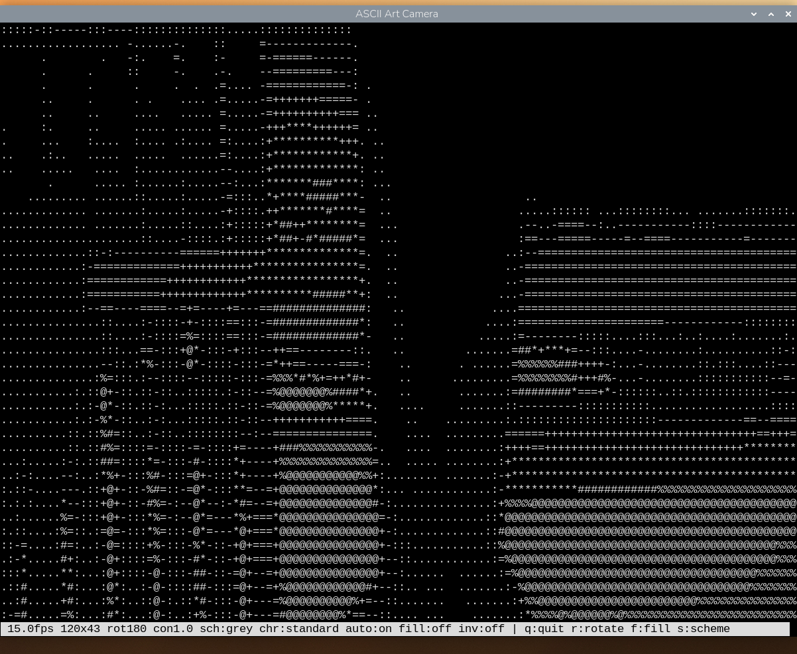
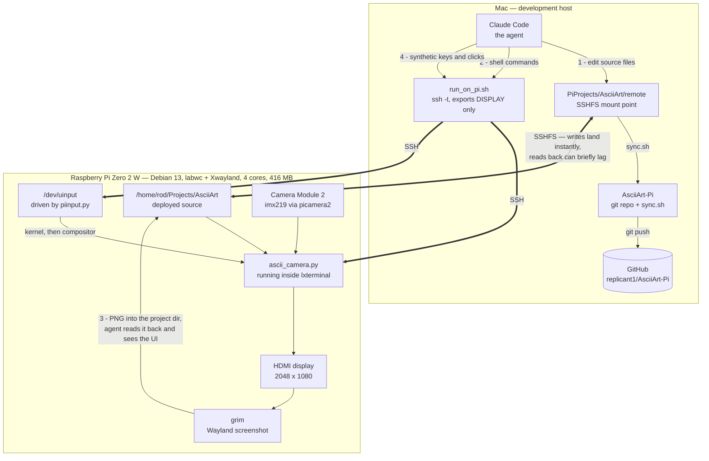
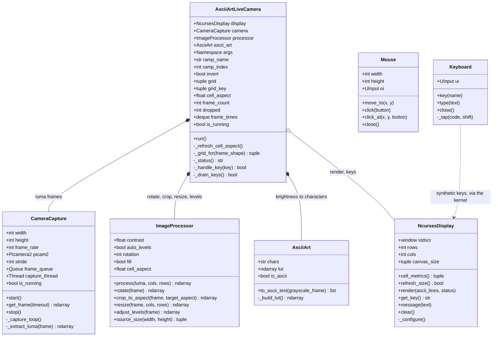
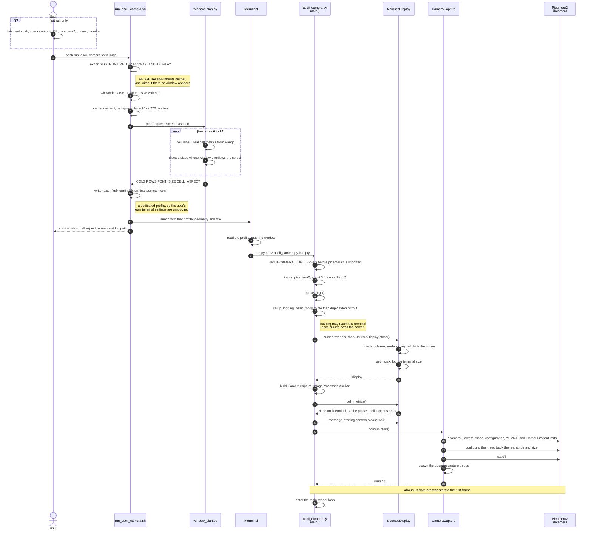
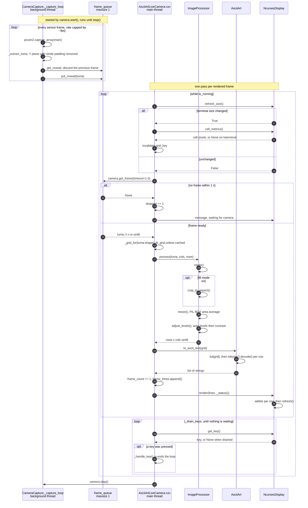

# ASCII Art Live Camera for Raspberry Pi Zero 2

Live view from the Pi Camera Module 2, rendered as ASCII art in a terminal on
the HDMI screen. This is the Python counterpart of the Live Camera pipeline in
the Android ASCII Art app.



*Running on the Pi at 14.9 fps. The status bar along the bottom reports the
frame rate, ASCII grid size, and the current state of every toggle — rotation,
contrast, character ramp, auto-levels, fill and invert.*

## Running it

```bash
bash run_ascii_camera.sh fit            # biggest window the picture fills exactly
bash run_ascii_camera.sh 120            # 120 columns, rows chosen to match
bash run_ascii_camera.sh 80x80          # exactly 80x80 (picture is letterboxed)
bash run_ascii_camera.sh 80x80 --fill   # 80x80, cropped to fill the window
bash run_ascii_camera.sh 120 --fps 10 --rotation 0
python3 ascii_camera.py                 # in the terminal you are already in
python3 ascii_camera.py --help          # all options
```

`run_ascii_camera.sh` exists because launching over SSH needs the desktop's
Wayland environment, because lxterminal takes its font size from a config file
rather than the command line, and because the window shape that avoids
letterboxing depends on the font — see "Window sizing" below.

### Live controls

Click the window first so it has keyboard focus.

| Key   | Effect | Shown in status bar as |
|-------|--------|------------------------|
| `q`   | Quit | — |
| `r`   | Rotate 90 degrees | `rot180` |
| `f`   | Toggle fill (crop to fill the window) vs fit (whole field of view) | `fill:on` / `fill:off` |
| `i`   | Invert the character ramp | `inv:on` / `inv:off` |
| `c`   | Cycle character ramp: standard / fine / blocks | `chr:standard` |
| `+` `-` | Contrast | `con1.0` |
| `a`   | Toggle per-frame auto-levels | `auto:on` / `auto:off` |

Every toggle reads out its current state on the left of the status bar, so
nothing is hidden:

```
 15.0fps 267x100 rot180 con1.0 chr:standard auto:on fill:off inv:off | q:quit r:rotate ...
```

The key hints on the right are dropped in whole groups when the window is too
narrow to hold them; the readouts on the left always stay.

A literal `--ramp` string (rather than one of the three names) reads out as
`chr:custom`.

## How this project is built: agent on the Mac, app on the Pi

This code was written by an AI agent (Claude Code) that never ran on the
target. A Pi Zero 2 W has four slow cores and about 416 MB of usable RAM —
enough to run the ASCII camera comfortably, nowhere near enough to host the
agent. So the agent runs on a Mac and treats the Pi as a device it can
**write to, execute on, look at, and type into**, over four separate channels.



| # | Channel | Mechanism | Used for |
|---|---------|-----------|----------|
| 1 | **Deploy** | SSHFS mount | Editing a file on the Mac changes it on the Pi immediately — no copy step |
| 2 | **Execute** | `run_on_pi.sh` (`ssh -t`) | Launching the app, benchmarking, installing packages |
| 3 | **Observe** | `grim` → PNG → read back through the mount | The agent actually *sees* the rendered UI |
| 4 | **Interact** | `piinput.py` → `/dev/uinput` | Driving the running app with synthetic keys and clicks |

Channels 3 and 4 are what make GUI work possible rather than guesswork. `grim`
writes a screenshot into the mounted project directory, so the agent can read
it back and inspect the actual picture; `piinput` creates a virtual input
device in the kernel, so its events are indistinguishable from real hardware
and reach Wayland-native and Xwayland clients alike. Together they close the
loop: change the code, relaunch, photograph the screen, look, adjust.

Several decisions in this repo came out of that loop rather than from
reasoning. The character cell aspect of 1.833 was *measured* off a screenshot
and confirmed against Pango. The finding that lxterminal's Zoom In does nothing
came from comparing cell widths in two screenshots. The live controls were
verified by synthesising the keypresses and reading the status bar back.

### Asymmetries worth knowing

The convenience of the mount hides some sharp edges, and most of them cost time
before they were understood:

- **The mount is fast one way and cached the other.** Mac → Pi writes appear
  immediately. Pi → Mac reads can briefly return a stale cached copy when the
  Pi has written a file out of band — so a screenshot read the instant `grim`
  finishes may be the *previous* one. This is also why the git repo is kept
  outside the mount: git reads back what it writes constantly.
- **An SSH session does not inherit the desktop.** `run_on_pi.sh` exports only
  `DISPLAY`, which is X11. `grim` and any GUI launch also need
  `XDG_RUNTIME_DIR` and `WAYLAND_DISPLAY`, which is why `run_ascii_camera.sh`
  sets them explicitly.
- **Command output over SSH never reaches the Pi's screen.** It comes back to
  the agent instead, so a screenshot taken afterwards shows nothing of it. To
  photograph a program's output, the program has to run in a terminal on the
  Pi's own desktop.
- **`pkill -f <pattern>` over SSH can kill the SSH session.** The remote shell's
  own command line contains the pattern, so it matches itself. Use a bracketed
  pattern such as `'[a]scii_camera.py'`, in a call that mentions the name
  nowhere else.
- **Passwordless SSH is mandatory.** The agent cannot answer an interactive
  password prompt, so key authentication has to be set up first.

## Repo layout and syncing to the Pi

The code runs on the Pi, which is mounted over SSHFS at `../remote`. This git
repo lives on local disk beside that mount rather than inside it: git does a
lot of read-after-write against its own object store, and reads back through
the mount can return stale cached data when the Pi has written out of band
(see `CLAUDE.md`). `sync.sh` bridges the two.

```bash
bash sync.sh            # or "pull": Pi -> repo, ready to commit
bash sync.sh push       # repo -> Pi, e.g. after a git pull on another machine
bash sync.sh status     # report differences, copy nothing
```

It copies an explicit file list, so nothing stray gets picked up, and reports
only files that actually differ. Two things it does that are worth knowing:

- **It refuses to run if the mount is not live.** Were the mount to drop,
  `../remote` would be an ordinary empty directory, and a `push` would write to
  local disk while appearing to succeed — the code would never reach the Pi.
- **It regenerates `CLAUDE.md` with the Pi's address masked on every sync**,
  rather than relying on a one-off edit, so a later change to the original
  cannot quietly reintroduce the full address into a public commit. The mask
  matches any dotted quad rather than one specific address, since this script
  is published too.

## Architecture

```
Camera thread                     Main thread
     |                                 |
capture_array()                        |
     |                                 |
  Y plane  --- 1-slot queue --->  rotate / crop
 (greyscale)   (drops stale)           |
                                  resize to grid  (PIL BOX)
                                       |
                                  auto-levels
                                       |
                                  256-entry LUT  -> ASCII rows
                                       |
                                  curses render
```

The camera thread keeps a **one-frame queue and drops the previous frame** on
every capture, so a slow render never accumulates a backlog of stale frames —
the picture stays current rather than falling progressively further behind.

### Classes



Five classes make up the app itself. `AsciiArtLiveCamera` constructs the
camera, processor and renderer, hence composition; `NcursesDisplay` is
aggregation instead, because `curses.wrapper()` owns the screen and hands the
window in.

`Mouse` and `Keyboard` (`piinput.py`) are **test tooling, not part of the
app** — they create a virtual input device under `/dev/uinput` so the running
application can be driven with synthetic events. The dashed line is deliberate:
nothing imports them. Events travel out to the kernel, through the compositor,
and arrive at `NcursesDisplay.get_key()` indistinguishable from a real
keypress, which is what makes them useful for testing the live controls.

Two parts of the codebase hold no classes and so do not appear above:
`fit_grid()` in `image_processor.py`, and all of `window_plan.py`
(`cell_size()`, `plan()`), which is called by `run_ascii_camera.sh` when
sizing the window and is never imported by the app at runtime.

### Startup

Most of the work before the first frame is done by the supplementary scripts,
not the app: sizing the window, choosing a font, and handing the desktop
session's environment to a process launched over SSH.



Three ordering constraints in there are not free choices:

- **`LIBCAMERA_LOG_LEVELS` is set at module level**, above the import of
  `camera`. libcamera reads it when its C++ layer loads, so setting it inside
  `main()` would be too late.
- **`setup_logging()` runs before `curses.wrapper()`**, and redirects file
  descriptor 2 rather than just Python's logging. libcamera writes to stderr
  directly, never through `logging`, and a single stray line garbles the
  picture once curses owns the screen.
- **The stride is read back after `configure()`, not assumed.** The ISP may pad
  rows out to a hardware-friendly width, and slicing that padding off is what
  keeps the image from shearing.

The two scripts exist because neither problem can be solved from inside the
app: a process launched over SSH does not inherit the Wayland session, and
lxterminal takes its font size from a config file rather than the command line.
`setup.sh` is a one-time dependency and camera check, not part of startup.

### Main render loop



The two loops are independent, which is the point of the one-slot queue. The
capture thread never waits for the renderer: it overwrites the pending frame
on every capture, so `get_frame()` always yields the newest image rather than
the head of a growing backlog. A slow render therefore drops frames instead of
falling progressively further behind real time.

Three details the diagram makes explicit:

- **The terminal size is checked every pass**, not just at startup, which is
  what lets the picture refit when the window is resized under it.
- **`get_frame()` blocks for up to a second.** The camera caps its own rate, so
  the main loop needs no pacing of its own — it runs exactly as often as frames
  arrive. A timeout means the camera is still warming up or has stalled, not
  that the loop is spinning too fast.
- **Keys are drained, not sampled.** A single `getch()` per frame would lag
  behind a keypress burst at 15 fps, so `_drain_keys()` consumes everything
  buffered before the next frame is fetched.

```
pi/
├── ascii_camera.py            # entry point, main loop, CLI, live controls
├── run_ascii_camera.sh        # launches it in a sized window on the HDMI screen
├── setup.sh                   # dependency / camera check
├── src/
│   ├── camera.py              # picamera2 capture thread, YUV420 luma extraction
│   ├── image_processor.py     # rotate, crop, resize, levels, grid fitting
│   ├── ascii_art.py           # brightness -> character lookup table
│   ├── display.py             # curses rendering
│   └── window_plan.py         # window/font sizing from real Pango cell metrics
└── tests/
    ├── bench_pipeline.py      # sustained frame rate at various targets
    └── capture_reference.py   # ordinary photo, to compare against the ASCII
```

## Performance

Measured on this Pi Zero 2 (`python3 tests/bench_pipeline.py`):

| Capture size | Target | Actual |
|--------------|--------|--------|
| 320x240 | 12 | 12.0 fps |
| 320x240 | 20 | 20.0 fps |
| 320x240 | 30 | 29.9 fps |
| 640x480 | 30 | 29.9 fps |

It hits whatever rate is asked for, up to the sensor's 30 fps, with load
average below 1.0. The processing stage costs about **8 ms per frame**, so the
Zero 2 is not the bottleneck. The default of 15 fps is a deliberate compromise
that leaves the desktop responsive; raise it with `--fps` if you want.

This is well above the 8–12 fps originally predicted, for three reasons:

1. **The Y plane is used directly as greyscale.** YUV420's Y plane *is*
   luminance — it is by definition what `0.299R + 0.587G + 0.114B` computes.
   Converting YUV → RGB and then back to grey costs six full-resolution float
   array operations per frame to recover a number the camera already handed us.
2. **Brightness → character is a vectorised lookup table.** A nested Python
   loop over pixels costs one interpreter round trip per character; a 256-entry
   LUT plus one numpy fancy-index does the whole grid at C speed.
3. **The ISP does the downscaling.** Capturing at 320x240 rather than 640x480
   and scaling on the CPU moves the work to hardware that is already in the
   path. Set `--width/--height` higher if you want more detail.

Resizing uses PIL's `BOX` filter (area averaging) rather than `LANCZOS`: each
ASCII cell should hold the *mean* brightness of the region it covers, which is
exactly what area averaging computes, and it is faster besides.

### The character ramp costs frame rate

At the full 267x100 grid, `c` (cycle ramp) is not free:

| Ramp | Chars | Observed |
|------|-------|----------|
| `standard` | 10 | 15.1 fps |
| `fine` | 70 | 6.5 fps |

This is **terminal I/O, not the pipeline** — generating the text costs 1.3 ms
either way. With a 10-character ramp, large areas of the picture map to the
same character between frames and ncurses only redraws what changed; with 70
characters, nearly every cell differs every frame and the whole screen is
rewritten. Use a smaller grid or the standard ramp if you want the frame rate.

The `blocks` ramp contains non-ASCII glyphs. Mapping those with the obvious
`"".join(chr(c) for c in row)` costs 40 ms per frame at this grid size — more
than the entire rest of the pipeline. It instead uses a numpy `U1` table whose
buffer decodes directly as UTF-32-LE, which brings it to 4.3 ms.

## Window sizing and aspect ratio

A terminal character cell is roughly twice as tall as it is wide, so the ASCII
grid must be about **half as tall in cells as the picture is in pixels** or the
scene comes out stretched.

An 80x80 *character* window is therefore a tall portrait shape on screen —
about 80 wide by 160 tall in pixel terms. A 4:3 camera image fitted into it
occupies only ~80x30 cells, which is why most of an 80x80 window is blank.

There are three ways to get rid of the letterboxing:

| | Field of view | Fills window |
|---|---|---|
| `bash run_ascii_camera.sh fit` | whole | yes |
| `bash run_ascii_camera.sh 120` | whole | yes |
| `--fill`, or the `f` key | cropped | yes |

`fit` and a bare column count both **shape the window to the picture** rather
than the picture to the window, so nothing is cropped and nothing is blank.
On this Pi's 2048x1080 screen, `fit` gives 267x101 characters at Monospace 6.

### Why the window planner exists

The picture fills the window exactly when

```
cols / canvas_rows == camera_aspect * cell_aspect
```

Assuming `cell_aspect` is 2.0 is close but wrong, and it is not even constant —
font hinting changes it with size:

| Font | Cell | cell_aspect |
|------|------|-------------|
| Monospace 6 | 5x10 px | 2.000 |
| Monospace 7 | 6x11 px | 1.833 |
| Monospace 8 | 6x13 px | 2.167 |
| Monospace 10 | 8x17 px | 2.125 |

So `src/window_plan.py` reads the real cell metrics from **Pango** — the same
font machinery VTE uses to lay out lxterminal — and sizes the window and font
to match. Checked against a screenshot: predicted 6.000x11.000 px, measured
6.025x11.165. The launcher passes the matching `--cell-aspect` to the app, so
the picture is correctly proportioned as well as unletterboxed.

At runtime the app also asks the terminal directly, via the pixel fields of
`TIOCGWINSZ` (`display.cell_metrics()`). When a terminal fills those in, the
cell aspect is derived exactly rather than assumed, and it is re-read on every
resize — so it stays correct even if the font size changes underneath.
lxterminal/VTE reports `0x0` there (measured), so on this Pi it falls back to
`--cell-aspect`; foot, kitty and xterm do report real values.

### Note on scaling the characters live

There is currently no way to change glyph size from inside lxterminal:

- VTE ignores `OSC 50` and `OSC 710`, the two "set font" escape sequences —
  they are echoed back as literal text, so an app cannot resize its own glyphs.
- lxterminal 0.4.1's own Edit > Zoom In/Out does nothing on this build.
  Measured cell width was 4.836 px both before and after, with the grid and
  window unchanged. `Shift+Ctrl+plus` likewise. (Not a testing artifact:
  Ctrl-modified keys do reach applications in that terminal.)

True glyph scaling therefore needs a different terminal (`foot` supports live
font-size changes and has `resize-by-cells=no`, which keeps the window size and
re-flows the grid) or a relaunch. A relaunch costs ~10-13 s, dominated by
picamera2: 5.4 s to import, 8.1 s from camera open to first frame.

### The lxterminal profile

`run_ascii_camera.sh` writes its own profile to
`~/.config/lxterminal/lxterminal-asciicam.conf`, so your normal terminal
settings are untouched. Two traps are worth recording:

- lxterminal 0.4.1 looks for `lxterminal-<NAME>.conf`, **not** `<NAME>.conf`,
  and silently falls back to the default profile when the name is wrong.
- Without a small enough font, lxterminal quietly clamps the window instead of
  honouring `--geometry`: an 80-row request became 57 rows at "Monospace 10"
  on a 1080px screen. Check the `Terminal size:` line in the log for what the
  app actually got.

## Rotation

`libcamera` reports this module's mounted rotation as 180 degrees, so that is
the default. If the picture is upside down for how your camera is physically
mounted, press `r` to cycle, then make it permanent with `--rotation`.

## Logging

**Nothing is ever written to the terminal while the app is running.** curses
owns the screen, and a single stray line garbles the picture. All Python
logging goes to `ascii_camera.log`, and file descriptor 2 is redirected there
as well, which also captures libcamera's C++ layer — it logs straight to stderr
and never passes through Python's logging at all.

If the app appears to do nothing, read `ascii_camera.log`.

## Requirements

Everything needed is already present in Raspberry Pi OS Bookworm:
`python3-picamera2`, `python3-numpy`, `python3-pil`, and `curses` from the
standard library. `bash setup.sh` verifies this and installs anything missing.

Prefer the apt packages over pip — building numpy or Pillow from source on a
Zero 2 exhausts its ~416 MB of RAM.

## Troubleshooting

**No camera detected** — `python3 tests/capture_reference.py` will say so;
check the CSI ribbon cable.

**Camera busy** — only one process can open it. Stop any other instance:
`pkill -f '[a]scii_camera.py'` (the bracket stops the pattern matching the
`pkill` command itself, which over SSH would kill the session).

**Picture is flat or washed out** — `a` toggles auto-levels, `+`/`-` adjust
contrast. Auto-levels stretches each frame's own 2nd–98th percentile range to
full black-to-white, which matters indoors where raw camera luma often spans
only a fraction of the range.

**Window is the wrong size** — check the `Terminal size:` line in
`ascii_camera.log` for what the app actually got, and override the font with
`ASCII_FONT=6 bash run_ascii_camera.sh 100x100`.

## Differences from the Android implementation

| Aspect | Android | Raspberry Pi |
|--------|---------|--------------|
| Language | Kotlin | Python |
| Camera API | CameraX | picamera2 |
| Concurrency | Coroutines | Threads, one-frame queue |
| Display | Jetpack Compose | curses |
| Frame rate | 30 fps | 15 fps default, 30 fps achievable |
| Input | Touch, live camera + video file | Keyboard, live camera |
