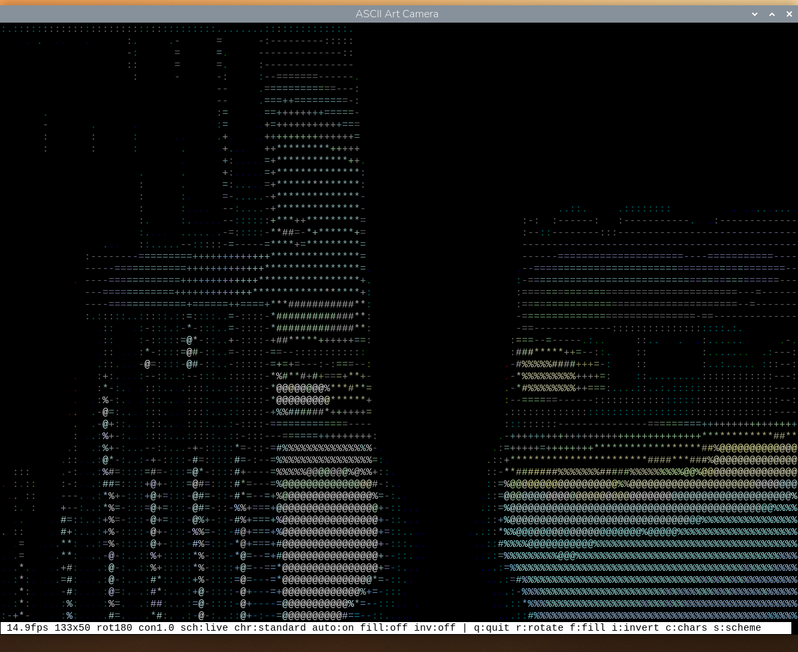
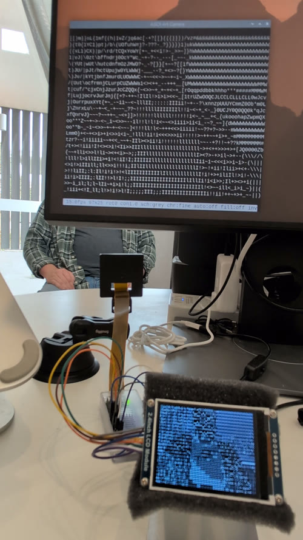
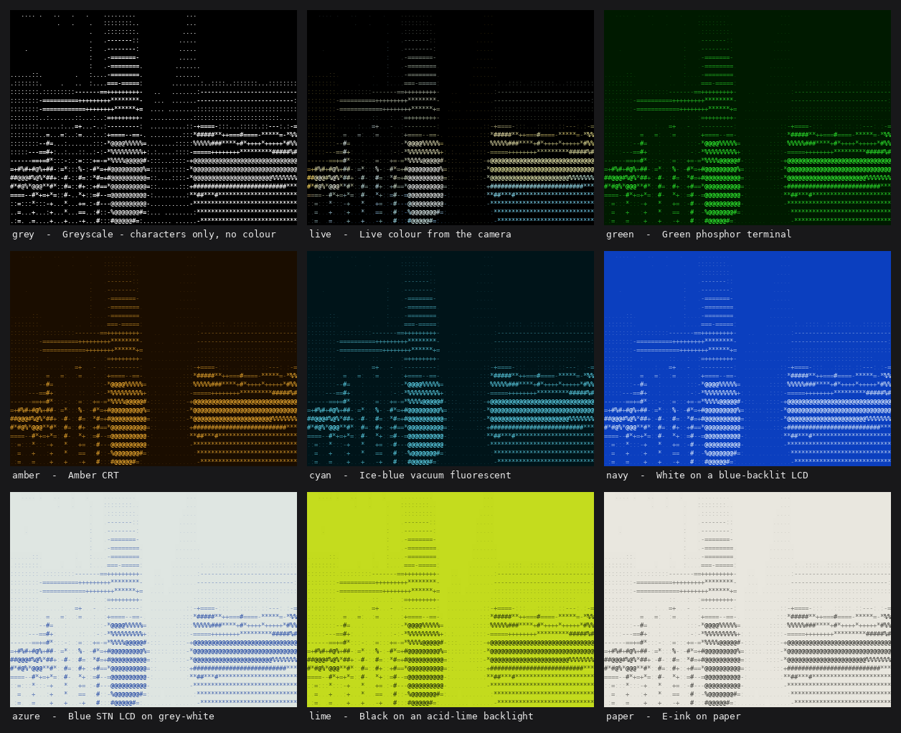
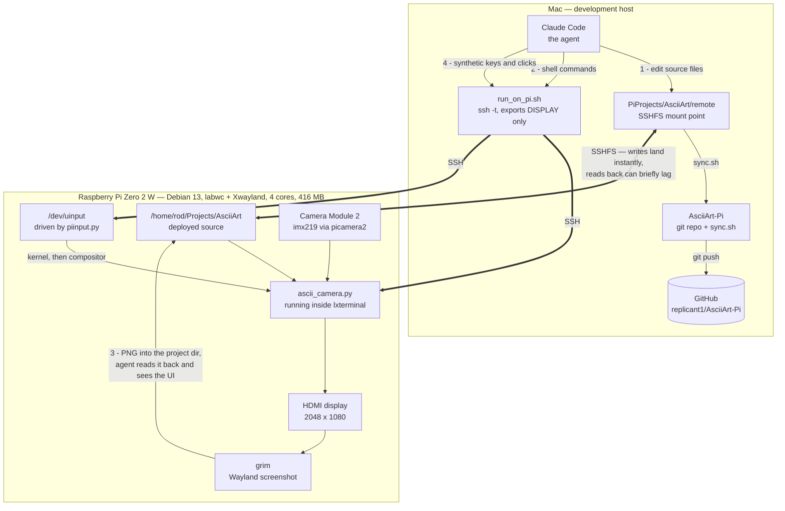
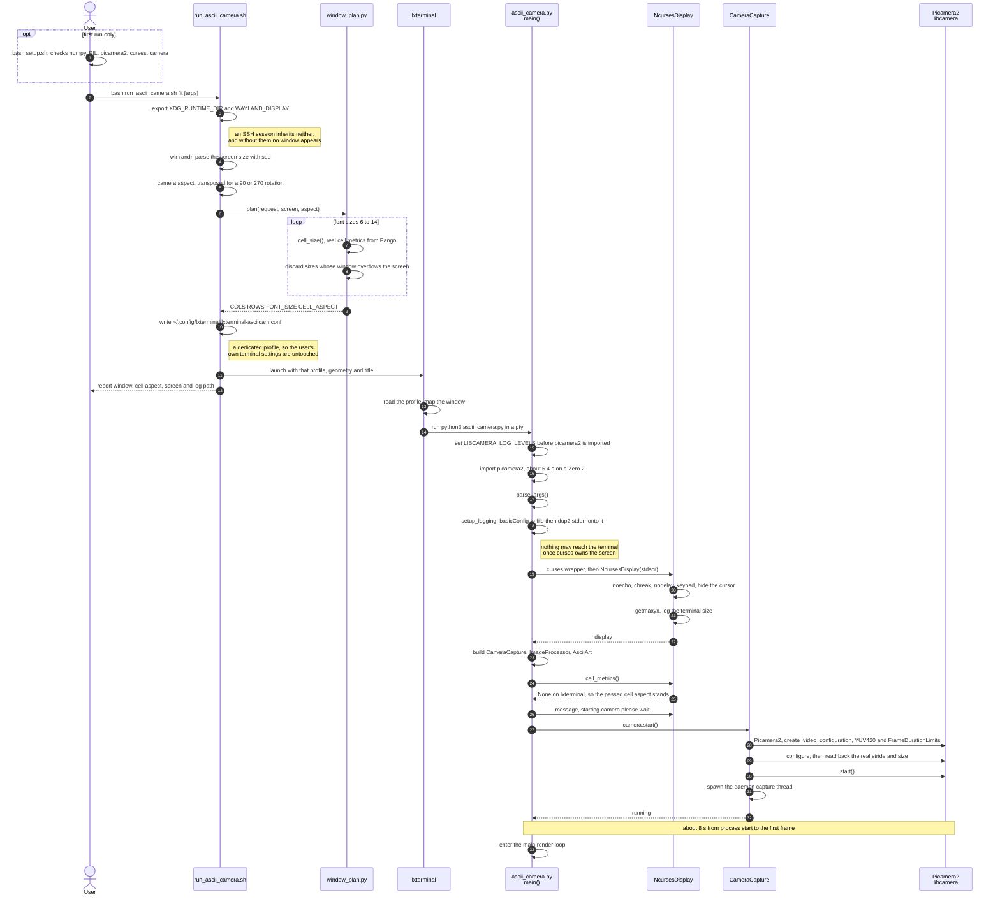
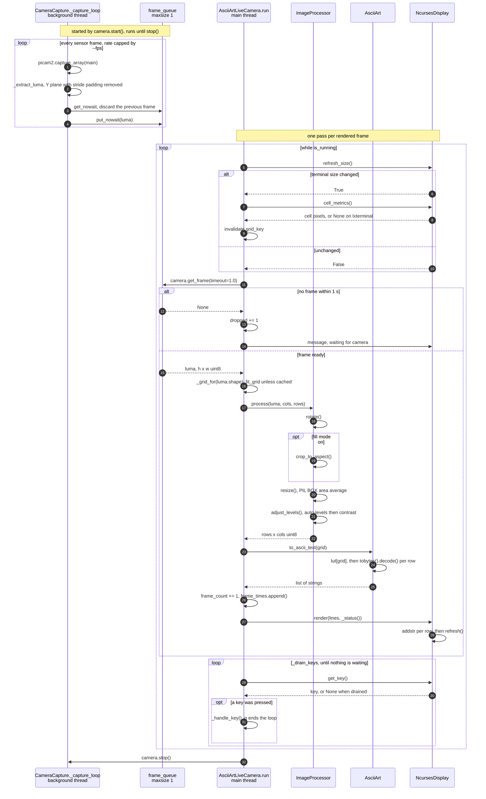

# ASCII Art Live Camera for Raspberry Pi Zero 2

Live view from the Pi Camera Module 2, rendered as ASCII art in a terminal on
the HDMI screen. This is the Python counterpart of the Live Camera pipeline in
the Android ASCII Art app.


*Greyscale, running on the Pi at 15.0 fps in a 120 by 43 window. The status bar
along the bottom reports the frame rate, ASCII grid size, and the current state
of every toggle — rotation, contrast, colour scheme, character ramp,
auto-levels, fill and invert.*



*Colour, in a 133x50 window at the full 15 fps. Press `s` to switch, or pass
`--colour` at launch. The character still comes from the brightness, so the two
modes draw the same shapes; the colour comes from the camera's chroma, which
greyscale mode discards. Colour costs roughly three times the redraw, and the
grid is no longer shrunk to hide that — at a full-screen 267x100 the same scene
runs closer to 4 fps.*



*Both displays at once, with `--lcd`. This is a photograph rather than a screen
capture because it has to be: `grim` records the Wayland/HDMI output, and the
ILI9341 is driven from userspace over SPI with no kernel framebuffer, so nothing
on that panel can be screenshotted. On the monitor is a 67 by 25 grid with the
fine ramp — `sch:grey chr:fine` on the status bar — and the 2.4 inch panel at
bottom right is rendering the same camera frames on its own 64 by 24 grid. The
camera module is on the stand in the middle, wired back to the Pi through the
breadboard.*

Choosing hardware to run this on? **[`docs/display-selection-guide.html`](docs/display-selection-guide.html)**
is a ranked guide to vintage terminals, VFDs, graphic LCDs and OLED modules,
priced in AUD and sourced for a buyer in Sydney. Download it and open it in a
browser — GitHub shows HTML as source.

## Running it

```bash
bash run_ascii_camera.sh fit            # biggest window the picture fills exactly
bash run_ascii_camera.sh 120            # 120 columns, rows chosen to match
bash run_ascii_camera.sh 80x80          # exactly 80x80 (picture is letterboxed)
bash run_ascii_camera.sh 80x80 --fill   # 80x80, cropped to fill the window
bash run_ascii_camera.sh fit --colour   # start in colour (or press s)
bash run_ascii_camera.sh 120 --fps 10 --rotation 0
python3 ascii_camera.py                 # in the terminal you are already in
python3 ascii_camera.py --help          # all options
```

`run_ascii_camera.sh` exists because launching over SSH needs the desktop's
Wayland environment, because lxterminal takes its font size from a config file
rather than the command line, and because the window shape that avoids
letterboxing depends on the font — see "Window sizing" below.

### Live controls

Click the window first so it has keyboard focus.

| Key   | Effect | Shown in status bar as |
|-------|--------|------------------------|
| `q`   | Quit | — |
| `r`   | Rotate 90 degrees | `rot180` |
| `f`   | Toggle fill (crop to fill the window) vs fit (whole field of view) | `fill:on` / `fill:off` |
| `i`   | Invert the character ramp | `inv:on` / `inv:off` |
| `c`   | Cycle character ramp: coarse / fine | `chr:coarse` |
| `s`   | Cycle colour scheme: grey / live / green / amber / cyan / navy / azure / lime / paper | `sch:grey` / `sch:green` |
| `+` `-` | Contrast | `con1.0` |
| `a`   | Toggle per-frame auto-levels | `auto:on` / `auto:off` |

Every toggle reads out its current state on the left of the status bar, so
nothing is hidden:

```
 15.0fps 267x100 rot180 con1.0 sch:grey chr:coarse auto:on fill:off inv:off | q:quit ...
```

The key hints on the right are dropped in whole groups when the window is too
narrow to hold them; the readouts on the left always stay.

`--ramp` takes a name and nothing else — there is no way to supply the ramp
characters yourself. It used to accept an arbitrary string, which meant a
mistyped name was silently taken as a literal ramp: `--ramp standard` drew the
picture out of the eight letters of the word rather than complaining. It is now
rejected, listing the names that do work.

### Command-line arguments

| Argument | Values | Default | Effect |
|---|---|---|---|
| `-h`, `--help` | — | — | Print usage and exit |
| `--width` | integer | `320` | Camera capture width. The ISP downscales in hardware, so smaller is much cheaper than resizing on the CPU |
| `--height` | integer | `240` | Camera capture height |
| `--fps` | integer | `15` | Target frame rate. The sensor is capped to this, which saves real CPU |
| `--scheme` | `grey`, `live`, `green`, `amber`, `cyan`, `navy`, `azure`, `lime`, `paper` | `grey` | Colour scheme to start in. Step through them live with `s`. See [Colour schemes](#colour-schemes) |
| `--colour`, `--color` | flag | off | Shorthand for `--scheme live`. Ignored if `--scheme` is given |
| `--colour-levels` | 2–6 | `6` | Palette steps per channel. Fewer gives longer runs of one colour and a cheaper redraw, at the cost of banding |
| `--fill` | flag | off | Crop the picture to fill the window rather than letterboxing it. Toggle with `f` |
| `--rotation` | 0, 90, 180, 270 | `0` | Camera rotation. Cycle with `r`. See [Rotation and handedness](#rotation-and-handedness) |
| `--mirror` | flag | off | Flip the picture left to right, after any rotation |
| `--contrast` | float | `1.0` | Contrast multiplier about mid-grey. Adjust with `+`/`-` |
| `--no-auto-levels` | flag | off | Disable per-frame brightness normalisation. Toggle with `a` |
| `--ramp` | `coarse`, `fine` | `coarse` | Character ramp, ordered light to dark. Cycle with `c` |
| `--invert` | flag | off | Invert the ramp, for light-background terminals and positive-mode LCDs. Toggle with `i` |
| `--cell-aspect` | float | `2.0` | Terminal character height/width ratio, which keeps the picture from looking squashed |
| `--no-terminal` | flag | off | Draw nothing on the HDMI screen: no curses, no window. Needs `--lcd`. Keys still work when stdin is a terminal, as it is over SSH |
| `--lcd` | flag | off | Also render to the ILI9341 SPI panel, alongside the terminal. See [The ILI9341 SPI panel](#the-ili9341-spi-panel) |
| `--lcd-font-size` | integer | `8` | Glyph size, which sets the panel's grid. `8` gives 64x24; `6` gives 80x30 and `9` gives 64x20. All three tile 320x240 exactly and match the camera's 4:3 |
| `--lcd-portrait` | flag | off | Run the panel as 240x320 instead of 320x240 |
| `--lcd-spi-hz` | integer | `40000000` | SPI clock. Lower it if the wiring is long or on a breadboard |
| `--lcd-brightness` | 0–100 | `100` | Backlight duty cycle, driven as PWM |
| `--log` | path | `ascii_camera.log` beside the app | Log file. stderr is redirected here too, since nothing may reach the terminal while curses owns the screen |
| `--verbose` | flag | off | Debug-level logging |

Two things the table does not show on its own.

**Eight of these arguments have live equivalents** — `--fill`, `--rotation`,
`--contrast`, `--no-auto-levels`, `--ramp`, `--invert`, `--scheme` and
`--colour`, reachable as `f`, `r`, `+`/`-`, `a`, `c`, `i` and `s` — so those
flags mostly just set a starting state. The arguments fixed at startup are
`--width`, `--height`, `--fps`, `--log`, `--verbose`, the five `--lcd*`
arguments, and `--colour-levels`, which is read as a setting rather than
toggled.

**`run_ascii_camera.sh` supplies one of these arguments for you.** The launcher
always passes `--cell-aspect`, computed from real Pango font metrics for the
font the launcher chose. Anything given to the launcher after the geometry is
forwarded through, so `bash run_ascii_camera.sh 120 --fps 10 --rotation 0` works
as expected. It does nothing special for `--colour` — the window is planned the
same way whatever scheme you start in.

## Colour schemes

`s` steps through nine looks, each imitating a real screen. There are no names
on screen — press `s` until you like what you see and stop. The active one
reads out in the status bar as `sch:amber`.

| # | Name | Ink | Screen | Imitates |
|---|------|-----|--------|----------|
| 1 | `grey` | `#FFFFFF` | `#000000` | Plain greyscale: characters only, no colour |
| 2 | `live` | from the camera | `#000000` | Live colour from the scene |
| 3 | `green` | `#33FF33` | `#001A00` | Green phosphor terminal |
| 4 | `amber` | `#FFB733` | `#1A0D00` | Amber CRT |
| 5 | `cyan` | `#66E6FF` | `#001419` | Ice-blue vacuum fluorescent |
| 6 | `navy` | `#EAF6FF` | `#0B3FBF` | White on a blue-backlit character LCD |
| 7 | `azure` | `#123A9E` | `#DFE6E2` | Blue STN LCD on grey-white |
| 8 | `lime` | `#14210A` | `#C4DC1E` | Black on an acid-lime backlight |
| 9 | `paper` | `#2B2B28` | `#E9E7DF` | E-ink on paper |

`grey` and `live` are the two original modes, kept unchanged and placed next to
each other at the head of the cycle. Schemes 3 to 6 have dark screens, 7 to 9
light ones, so cycling walks a deliberate arc rather than jumping about.



*All nine schemes, and the comparison is a fair one: every tile is the same
picture. One frame was captured, the character grid computed from it once, and
each tile then reuses that identical grid of ramp positions — only the colour
lookup differs. Nothing else can vary, because nothing else is recomputed.*

Regenerate it with `python3 tools/scheme_montage.py`, which renders through the
panel's own glyph atlas and blend, so the tiles show what the app really draws
rather than an impression of it. It asserts its own claim before writing the
file: each tile is reduced to which pixels a glyph covers, and those masks must
agree. Eight of the nine are checked that way. `live` is checked structurally
instead, because its ink comes from the scene — a cell the camera saw as nearly
black renders nearly black whether a glyph covers it or not, so "is a glyph
here" genuinely cannot be recovered from its pixels.

### Why these nine

They come from photographs of real displays, but not one scheme per photograph:
twelve reference images collapsed to fewer distinct *looks* than files. Three
were amber or yellow CRTs, two were green screens, two were black on a lime
backlight. A plain yellow-on-black was dropped outright for sitting only 25
degrees of hue from `amber` — near enough that nobody cycling past would be
sure which one they were looking at.

Being unmistakable matters more here than being numerous, and it is checked
rather than asserted. `tests/palette_test.py` compares every pair of schemes by
redmean perceptual distance and **fails the run** if any two are closer than
150. The closest surviving pair is `azure`/`paper` at 223. That is what stops
someone later adding a second amber that differs in the third hex digit.

### How a scheme is drawn

`grey` and `live` work as they always did. The other seven are *tinted*: each
cell blends from the scheme's screen colour to its ink, by how dense a character
the ramp chose for that cell. A bright part of the scene gets both a denser
glyph and fuller-strength ink, which is how a brighter patch of a real CRT
actually behaves.

The blend has to track how much ink the glyph lays down, **not** how bright the
scene was. Those are the same thing until `i` is pressed. `AsciiArt` reverses
its character string on invert but still indexes it from brightness, so a bright
cell keeps a high index while picking a *sparse* glyph. Tinting by that raw
index left bright cells at full-strength ink while drawing them nearly empty —
the characters went negative and the colour did not. The blend table is
reversed to match, so both halves of the picture invert together. This was
caught by the test, not by reading the code.

### Light-screen schemes and the terminal background

`azure`, `lime` and `paper` need one thing the others do not.

The LCD panel is straightforward: the app writes every one of its 76,800
pixels, so "the screen is lime" just means writing lime into the ones no glyph
covers. A terminal does not work that way. You place characters, and each
character carries only its *ink* colour — whatever lies behind the glyph stays
whatever the window already was, which is black.

Setting only the ink for `paper` would therefore give dark grey characters on
black, and the picture would all but vanish. So each scheme's screen colour is
attached to every colour pair as its **background**, and to the window itself,
which covers the padding around the picture and any cell not written that frame.

### Cost

Tinted schemes are cheaper than `live`, because neighbouring cells of equal
brightness get the *same* colour, so runs stay long and ncurses emits fewer
escape sequences. Only `live` needs the coarser grid; the tinted schemes keep
the full one. All nine hold 15.0 fps on the HDMI terminal at 120x43.

On the ILI9341 panel, measured on the Zero 2:

| LCD path | Frame time |
|----------|------------|
| `grey` | 35.7 ms (28 fps) |
| `live` | 46.8 ms (21 fps) |
| tinted, light screen | 54.0 ms (18 fps) |

Schemes with a black screen take a `uint16` fast path in the packer. Making
that code general enough for arbitrary screen colours had cost `live` about
7 ms a frame, so the special case earns its keep.

If a terminal cannot manage 256 colours, `s` skips every scheme but `grey` and
logs the fact.

## How this project is built: agent on the Mac, app on the Pi

This code was written by an AI agent (Claude Code) that never ran on the
target. A Pi Zero 2 W has four slow cores and about 416 MB of usable RAM —
enough to run the ASCII camera comfortably, nowhere near enough to host the
agent. So the agent runs on a Mac and treats the Pi as a device it can
**write to, execute on, look at, and type into**, over four separate channels.



| # | Channel | Mechanism | Used for |
|---|---------|-----------|----------|
| 1 | **Deploy** | SSHFS mount | Editing a file on the Mac changes it on the Pi immediately — no copy step |
| 2 | **Execute** | `run_on_pi.sh` (`ssh -t`) | Launching the app, benchmarking, installing packages |
| 3 | **Observe** | `grim` → PNG → read back through the mount | The agent actually *sees* the rendered UI |
| 4 | **Interact** | `piinput.py` → `/dev/uinput` | Driving the running app with synthetic keys and clicks |

Channels 3 and 4 are what make GUI work possible rather than guesswork. `grim`
writes a screenshot into the mounted project directory, so the agent can read
it back and inspect the actual picture; `piinput` creates a virtual input
device in the kernel, so its events are indistinguishable from real hardware
and reach Wayland-native and Xwayland clients alike. Together they close the
loop: change the code, relaunch, photograph the screen, look, adjust.

Several decisions in this repo came out of that loop rather than from
reasoning. The character cell aspect of 1.833 was *measured* off a screenshot
and confirmed against Pango. The finding that lxterminal's Zoom In does nothing
came from comparing cell widths in two screenshots. The live controls were
verified by synthesising the keypresses and reading the status bar back.

### Asymmetries worth knowing

The convenience of the mount hides some sharp edges, and most of them cost time
before they were understood:

- **The mount is fast one way and cached the other.** Mac → Pi writes appear
  immediately. Pi → Mac reads can briefly return a stale cached copy when the
  Pi has written a file out of band — so a screenshot read the instant `grim`
  finishes may be the *previous* one. This is also why the git repo is kept
  outside the mount: git reads back what it writes constantly.
- **An SSH session does not inherit the desktop.** `run_on_pi.sh` exports only
  `DISPLAY`, which is X11. `grim` and any GUI launch also need
  `XDG_RUNTIME_DIR` and `WAYLAND_DISPLAY`, which is why `run_ascii_camera.sh`
  sets them explicitly.
- **Command output over SSH never reaches the Pi's screen.** It comes back to
  the agent instead, so a screenshot taken afterwards shows nothing of it. To
  photograph a program's output, the program has to run in a terminal on the
  Pi's own desktop.
- **`pkill -f <pattern>` over SSH can kill the SSH session.** The remote shell's
  own command line contains the pattern, so it matches itself. Use a bracketed
  pattern such as `'[a]scii_camera.py'`, in a call that mentions the name
  nowhere else.
- **Passwordless SSH is mandatory.** The agent cannot answer an interactive
  password prompt, so key authentication has to be set up first.

## Repo layout and syncing to the Pi

The code runs on the Pi, which is mounted over SSHFS at `../remote`. This git
repo lives on local disk beside that mount rather than inside it: git does a
lot of read-after-write against its own object store, and reads back through
the mount can return stale cached data when the Pi has written out of band
(see `CLAUDE.md`). `sync.sh` bridges the two.

```bash
bash sync.sh            # or "pull": Pi -> repo, ready to commit
bash sync.sh push       # repo -> Pi, e.g. after a git pull on another machine
bash sync.sh status     # report differences, copy nothing
```

It copies an explicit file list, so nothing stray gets picked up, and reports
only files that actually differ. Two things it does that are worth knowing:

- **It refuses to run if the mount is not live.** Were the mount to drop,
  `../remote` would be an ordinary empty directory, and a `push` would write to
  local disk while appearing to succeed — the code would never reach the Pi.
- **It regenerates `CLAUDE.md` with the Pi's address masked on every sync**,
  rather than relying on a one-off edit, so a later change to the original
  cannot quietly reintroduce the full address into a public commit. The mask
  matches any dotted quad rather than one specific address, since this script
  is published too.

## Architecture

```
Camera thread                     Main thread
     |                                 |
capture_array()                        |
     |                                 |
  Y plane  --- 1-slot queue --->  rotate / crop
 (greyscale)   (drops stale)           |
                                  resize to grid  (PIL BOX)
                                       |
                                  auto-levels
                                       |
                                  256-entry LUT  -> ASCII rows
                                       |
                                  curses render
```

The camera thread keeps a **one-frame queue and drops the previous frame** on
every capture, so a slow render never accumulates a backlog of stale frames —
the picture stays current rather than falling progressively further behind.

### Classes


Five classes make up the app itself. `AsciiArtLiveCamera` constructs the
camera, processor and renderer, hence composition; `NcursesDisplay` is
aggregation instead, because `curses.wrapper()` owns the screen and hands the
window in.

`Mouse` and `Keyboard` (`piinput.py`) are **test tooling, not part of the
app** — they create a virtual input device under `/dev/uinput` so the running
application can be driven with synthetic events. The dashed line is deliberate:
nothing imports them. Events travel out to the kernel, through the compositor,
and arrive at `NcursesDisplay.get_key()` indistinguishable from a real
keypress, which is what makes them useful for testing the live controls.

Two parts of the codebase hold no classes and so do not appear above:
`fit_grid()` in `image_processor.py`, and all of `window_plan.py`
(`cell_size()`, `plan()`), which is called by `run_ascii_camera.sh` when
sizing the window and is never imported by the app at runtime.

### Startup

Most of the work before the first frame is done by the supplementary scripts,
not the app: sizing the window, choosing a font, and handing the desktop
session's environment to a process launched over SSH.



Three ordering constraints in there are not free choices:

- **`LIBCAMERA_LOG_LEVELS` is set at module level**, above the import of
  `camera`. libcamera reads it when its C++ layer loads, so setting it inside
  `main()` would be too late.
- **`setup_logging()` runs before `curses.wrapper()`**, and redirects file
  descriptor 2 rather than just Python's logging. libcamera writes to stderr
  directly, never through `logging`, and a single stray line garbles the
  picture once curses owns the screen.
- **The stride is read back after `configure()`, not assumed.** The ISP may pad
  rows out to a hardware-friendly width, and slicing that padding off is what
  keeps the image from shearing.

The two scripts exist because neither problem can be solved from inside the
app: a process launched over SSH does not inherit the Wayland session, and
lxterminal takes its font size from a config file rather than the command line.
`setup.sh` is a one-time dependency and camera check, not part of startup.

### Main render loop



The two loops are independent, which is the point of the one-slot queue. The
capture thread never waits for the renderer: it overwrites the pending frame
on every capture, so `get_frame()` always yields the newest image rather than
the head of a growing backlog. A slow render therefore drops frames instead of
falling progressively further behind real time.

Three details the diagram makes explicit:

- **The terminal size is checked every pass**, not just at startup, which is
  what lets the picture refit when the window is resized under it.
- **`get_frame()` blocks for up to a second.** The camera caps its own rate, so
  the main loop needs no pacing of its own — it runs exactly as often as frames
  arrive. A timeout means the camera is still warming up or has stalled, not
  that the loop is spinning too fast.
- **Keys are drained, not sampled.** A single `getch()` per frame would lag
  behind a keypress burst at 15 fps, so `_drain_keys()` consumes everything
  buffered before the next frame is fetched.

```
pi/
├── ascii_camera.py            # entry point, main loop, CLI, live controls
├── run_ascii_camera.sh        # launches it in a sized window on the HDMI screen
├── setup.sh                   # dependency / camera check
├── src/
│   ├── camera.py              # picamera2 capture thread, YUV420 luma extraction
│   ├── image_processor.py     # rotate, crop, resize, levels, grid fitting
│   ├── ascii_art.py           # brightness -> character lookup table
│   ├── display.py             # curses rendering
│   └── window_plan.py         # window/font sizing from real Pango cell metrics
└── tests/
    ├── bench_pipeline.py      # sustained frame rate at various targets
    └── capture_reference.py   # ordinary photo, to compare against the ASCII
```

## Performance

Measured on this Pi Zero 2 (`python3 tests/bench_pipeline.py`):

| Capture size | Target | Actual |
|--------------|--------|--------|
| 320x240 | 12 | 12.0 fps |
| 320x240 | 20 | 20.0 fps |
| 320x240 | 30 | 29.9 fps |
| 640x480 | 30 | 29.9 fps |

It hits whatever rate is asked for, up to the sensor's 30 fps, with load
average below 1.0. The processing stage costs about **8 ms per frame**, so the
Zero 2 is not the bottleneck. The default of 15 fps is a deliberate compromise
that leaves the desktop responsive; raise it with `--fps` if you want.

This is well above the 8–12 fps originally predicted, for three reasons:

1. **The Y plane is used directly as greyscale.** YUV420's Y plane *is*
   luminance — it is by definition what `0.299R + 0.587G + 0.114B` computes.
   Converting YUV → RGB and then back to grey costs six full-resolution float
   array operations per frame to recover a number the camera already handed us.
2. **Brightness → character is a vectorised lookup table.** A nested Python
   loop over pixels costs one interpreter round trip per character; a 256-entry
   LUT plus one numpy fancy-index does the whole grid at C speed.
3. **The ISP does the downscaling.** Capturing at 320x240 rather than 640x480
   and scaling on the CPU moves the work to hardware that is already in the
   path. Set `--width/--height` higher if you want more detail.

Resizing uses PIL's `BOX` filter (area averaging) rather than `LANCZOS`: each
ASCII cell should hold the *mean* brightness of the region it covers, which is
exactly what area averaging computes, and it is faster besides.

### The live colour scheme

`s` steps through the colour schemes; this section is about `live`, the one that
takes its colour from the camera's chroma, with the character still coming from
the luma so the two agree. The other schemes are described under
[Colour schemes](#colour-schemes); they cost less than `live` does, because
their colours repeat along a row.

Measured in lxterminal on this Pi, redrawing the same scene with and without
per-character colour:

| Grid | Greyscale | Colour | Cost |
|------|-----------|--------|------|
| 267x100 | 91 ms (11.0 fps) | 244 ms (4.1 fps) | 2.7x |
| 133x50 | 32 ms (31.6 fps) | 61 ms (16.3 fps) | 1.9x |
| 80x30 | 6 ms (169 fps) | 28 ms (35 fps) | 4.8x |

**That cost is now simply paid.** The grid follows the window and the camera,
and nothing else — switching scheme with `s` never resizes the picture, and
`--colour` gets no special window sizing at launch. Colour in a full-screen
267x100 window therefore runs at roughly 4 fps, and that is the intended
behaviour rather than a regression.

This used to work the other way. The app halved the grid on both axes whenever
the `live` scheme was on, and the launcher halved the planned window to match so
the smaller grid still filled it. It held 15 fps, but at the price of the
picture changing size underneath you when you pressed `s`, a resolution that
depended on which scheme you happened to be in, and two different notions of
"the grid" that had to be kept in step. A steady picture that slows down is
easier to reason about than a fast one that changes shape.

If you want colour *and* frame rate, ask for a smaller window rather than
relying on the app to shrink one for you — the grid is yours to choose:

```bash
bash run_ascii_camera.sh 133 --colour     # 133x51, colour, back to about 15 fps
bash run_ascii_camera.sh fit --colour     # full window, colour, about 4 fps
```

`--colour-levels` is the other lever, and it does not touch the grid: fewer
palette steps mean longer runs of one colour and a cheaper redraw, at the cost
of banding.

Two things make it affordable:

1. **The conversion happens after the downscale.** Chroma is resampled to the
   character grid first, then converted, so at 133x50 that is about 6,650 pixels
   of arithmetic per frame instead of 76,800 at full resolution. Doing it the
   other way round was the most expensive thing in the original pipeline, and is
   why greyscale mode takes the luma plane directly.
2. **Cells sharing a colour are drawn as one run.** One `addstr` per run rather
   than per character, so ncurses emits a single escape sequence for each. A
   real scene averages a dozen or so runs per row at this grid size.

`--colour-levels` (2 to 6, default 6) sets how many steps per channel are used
from the xterm-256 colour cube. Fewer steps means longer runs of one colour and
a cheaper redraw, at the cost of banding — the main lever if colour feels slow.

Terminal support was checked rather than assumed: inside lxterminal, curses
reports `TERM=xterm-256color`, 256 colours and 65,536 pairs, so the 240 pairs
this uses are nowhere near a limit. If a terminal cannot manage 256 colours,
`s` skips every scheme but `grey` and logs the fact.

Greyscale mode costs nothing for the feature — the chroma planes are sliced from
the buffer that already had to be copied, and no conversion runs.

### The character ramp costs frame rate

At the full 267x100 grid, `c` (cycle ramp) is not free:

| Ramp | Chars | Observed |
|------|-------|----------|
| `coarse` | 10 | 15.1 fps |
| `fine` | 70 | 6.5 fps |

This is **terminal I/O, not the pipeline** — generating the text costs 1.3 ms
either way. With a 10-character ramp, large areas of the picture map to the
same character between frames and ncurses only redraws what changed; with 70
characters, nearly every cell differs every frame and the whole screen is
rewritten. Use a smaller grid or the coarse ramp if you want the frame rate.

A ramp may contain non-ASCII glyphs. Neither of the two does today, but the
fast path for them is kept because adding one back would otherwise be
expensive: mapping such a ramp with the obvious
`"".join(chr(c) for c in row)` costs 40 ms per frame at this grid size, more
than the entire rest of the pipeline. It instead uses a numpy `U1` table whose
buffer decodes directly as UTF-32-LE, which brings it to 4.3 ms.

There used to be a third built-in ramp, `blocks` — `coarse` plus `▓` and `█`.
It was removed. Its appeal was contrast rather than detail: those two glyphs
were the only ones in the project that came near a filled cell, reaching an ink
coverage of 227 out of 255 where `coarse` tops out at 71.

## Window sizing and aspect ratio

A terminal character cell is roughly twice as tall as it is wide, so the ASCII
grid must be about **half as tall in cells as the picture is in pixels** or the
scene comes out stretched.

An 80x80 *character* window is therefore a tall portrait shape on screen —
about 80 wide by 160 tall in pixel terms. A 4:3 camera image fitted into it
occupies only ~80x30 cells, which is why most of an 80x80 window is blank.

There are three ways to get rid of the letterboxing:

| | Field of view | Fills window |
|---|---|---|
| `bash run_ascii_camera.sh fit` | whole | yes |
| `bash run_ascii_camera.sh 120` | whole | yes |
| `--fill`, or the `f` key | cropped | yes |

`fit` and a bare column count both **shape the window to the picture** rather
than the picture to the window, so nothing is cropped and nothing is blank.
On this Pi's 2048x1080 screen, `fit` gives 267x101 characters at Monospace 6.

### Why the window planner exists

The picture fills the window exactly when

```
cols / canvas_rows == camera_aspect * cell_aspect
```

Assuming `cell_aspect` is 2.0 is close but wrong, and it is not even constant —
font hinting changes it with size:

| Font | Cell | cell_aspect |
|------|------|-------------|
| Monospace 6 | 5x10 px | 2.000 |
| Monospace 7 | 6x11 px | 1.833 |
| Monospace 8 | 6x13 px | 2.167 |
| Monospace 10 | 8x17 px | 2.125 |

So `src/window_plan.py` reads the real cell metrics from **Pango** — the same
font machinery VTE uses to lay out lxterminal — and sizes the window and font
to match. Checked against a screenshot: predicted 6.000x11.000 px, measured
6.025x11.165. The launcher passes the matching `--cell-aspect` to the app, so
the picture is correctly proportioned as well as unletterboxed.

At runtime the app also asks the terminal directly, via the pixel fields of
`TIOCGWINSZ` (`display.cell_metrics()`). When a terminal fills those in, the
cell aspect is derived exactly rather than assumed, and it is re-read on every
resize — so it stays correct even if the font size changes underneath.
lxterminal/VTE reports `0x0` there (measured), so on this Pi it falls back to
`--cell-aspect`; foot, kitty and xterm do report real values.

### Note on scaling the characters live

There is currently no way to change glyph size from inside lxterminal:

- VTE ignores `OSC 50` and `OSC 710`, the two "set font" escape sequences —
  they are echoed back as literal text, so an app cannot resize its own glyphs.
- lxterminal 0.4.1's own Edit > Zoom In/Out does nothing on this build.
  Measured cell width was 4.836 px both before and after, with the grid and
  window unchanged. `Shift+Ctrl+plus` likewise. (Not a testing artifact:
  Ctrl-modified keys do reach applications in that terminal.)

True glyph scaling therefore needs a different terminal (`foot` supports live
font-size changes and has `resize-by-cells=no`, which keeps the window size and
re-flows the grid) or a relaunch. A relaunch costs ~10-13 s, dominated by
picamera2: 5.4 s to import, 8.1 s from camera open to first frame.

### The lxterminal profile

`run_ascii_camera.sh` writes its own profile to
`~/.config/lxterminal/lxterminal-asciicam.conf`, so your normal terminal
settings are untouched. Two traps are worth recording:

- lxterminal 0.4.1 looks for `lxterminal-<NAME>.conf`, **not** `<NAME>.conf`,
  and silently falls back to the default profile when the name is wrong.
- Without a small enough font, lxterminal quietly clamps the window instead of
  honouring `--geometry`: an 80-row request became 57 rows at "Monospace 10"
  on a 1080px screen. Check the `Terminal size:` line in the log for what the
  app actually got.

## The ILI9341 SPI panel

A 2.4 inch 240x320 ILI9341 LCD, 65K colours over SPI, runs **alongside** the
terminal on the HDMI screen rather than instead of it:

```bash
bash run_ascii_camera.sh fit --lcd
bash run_ascii_camera.sh fit --lcd --scheme amber
```

The panel shows only the picture — no status bar, no border, no window
furniture.

### Which displays to run

The two outputs are independent, so there are four combinations and three of
them are useful:

| Terminal | Panel | How | Notes |
|----------|-------|-----|-------|
| yes | no | `bash run_ascii_camera.sh fit` | The default |
| yes | yes | `bash run_ascii_camera.sh fit --lcd` | Both at once, independently sized |
| no | yes | `python3 ascii_camera.py --lcd --no-terminal` | Headless: no window, no curses |
| no | no | — | Refused, with exit code 2 |

The last row is refused rather than allowed, because it would open the camera,
render frames and show them to nobody — which is indistinguishable from a hang.
The check happens before the log file is even opened, so the complaint lands on
the terminal you are standing at.

Headless mode is the reason the app can run without a desktop session at all.
The launcher script is not used, since there is no window to size or profile to
write; run `ascii_camera.py` directly. A status line goes to stdout every five
seconds instead of being redrawn in place:

```
15.0fps headless rot180 con1.0 sch:amber chr:coarse auto:on fill:off inv:off lcd:64x24
```

`headless` stands where the terminal grid usually reads, and `lcd:64x24` is the
panel's own grid — the only one there is in this mode.

**The single-key controls still work over SSH.** stdin is put in cbreak mode
and polled without blocking, so `s`, `i`, `c` and the rest behave as they do in
the window. When stdin is *not* a terminal — a systemd unit, a cron job, output
piped elsewhere — key reading is disabled and the run uses whatever the command
line asked for. Which it is gets logged either way.

**Stopping it.** With no terminal on stdin there is no `q` to press, so a signal
is the normal way a headless run ends. `SIGTERM` and `SIGINT` are both handled:
the loop is asked to stop, and the camera and panel are released on the way out.
Without that, Python's default `SIGTERM` exits without unwinding, leaving the
panel lit with a frozen frame and its GPIO pins still claimed — which then
breaks the next run.

### Wiring

Taken from the manufacturer's own working example, and confirmed by running it.
`CS` is driven by the SPI peripheral itself, not by this code.

| Panel | Pi | Panel | Pi |
|-------|----|-------|----|
| VCC | 3.3V | SDI/MOSI | GPIO 10 |
| GND | GND | SCK | GPIO 11 |
| CS | GPIO 8 (CE0) | RESET | GPIO 27 |
| DC/RS | GPIO 25 | LED/BL | GPIO 18 (PWM) |

The panel is on `/dev/spidev0.0`. SPI is enabled with `dtparam=spi=on`, and
there is deliberately **no kernel driver bound to it** — no `fbtft`, no
`mipi-dbi-spi` overlay. It is driven from userspace with `spidev`, which is
what `src/lcd.py` does. `/dev/fb0` is the HDMI framebuffer and has nothing to
do with this panel.

### It is an independent display, not a mirror

The panel's grid is fixed by its font, so **resizing the terminal window leaves
it alone**. Observed while testing: the terminal went 267x100 to 133x50 while
the panel stayed 64x24. The status bar shows the panel's own grid as
`lcd:64x24`, which makes the independence visible.

| Setting | Follows the main display? |
|---------|---------------------------|
| Colour scheme (`s`) | Yes |
| Invert (`i`) | Yes |
| Character ramp (`c`) | Yes |
| Rotation (`r`), contrast (`+`/`-`), auto-levels (`a`) | Yes |
| Fill (`f`) | **No** — the panel is always fully occupied |
| Grid size | **No** — fixed by `--lcd-font-size` |

Font sizes 6, 8 and 9 each tile 320x240 exactly *and* give a character grid
whose on-screen aspect is exactly 4:3 — the same as the camera. So filling the
panel crops nothing at all. Other sizes leave a few pixels over, which are left
black with the picture centred in them.

### How it is drawn

Every glyph in the ramp is rendered once into an atlas, and a frame becomes a
single numpy gather: index the atlas with the whole grid at once, then transpose
the cell axes into place and reshape. The obvious alternative — one
`draw.text()` per cell — would be 1,536 PIL calls per frame at 64x24, far beyond
this hardware.

The SPI write is kept off the main render loop by a worker thread that takes the
latest frame and drops anything it falls behind on. That only pays off if
`spidev` releases the GIL during the transfer, which `tests/lcd_concurrency.py`
measures rather than assumes: **the main thread keeps 93% of its throughput**
while the panel renders at 27 fps.

| Stage | Cost per frame |
|-------|----------------|
| Blit glyphs from the atlas | 1.2 ms |
| Pack RGB565 | 2.5 ms |
| SPI transfer | ~32 ms |

The panel is transfer-bound, not CPU-bound. `/sys/module/spidev/parameters/bufsiz`
is 4096, so a full 153,600-byte frame is 38 writes, and that syscall count
dominates rather than the clock rate — `spidev.bufsiz=65536` on the kernel
command line would help if refresh rate ever mattered more than memory.

### You cannot verify this panel in software

Two facts combine, and they are worth knowing before trying:

- `grim` captures the Wayland/HDMI output. An SPI panel is not part of that
  output, so **no screenshot ever shows what is on the panel.**
- This module does not wire SDO usefully. Register read-back was tried — `0x04`
  RDDID, `0x09` RDDST, `0x0A` power mode, `0x0C` pixel format — and every one
  returns all `00`.

So nothing can confirm what is actually lit except looking at it. The tests are
built accordingly: they check everything up to the SPI boundary with assertions
that can genuinely fail — hand-computed RGB565 values, geometry, and whether the
panel path picks the same glyph the terminal would — and then say plainly that
the rest needs a human.

```bash
python3 tests/lcd_selftest.py       # colour bars and the RGB565 maths
python3 tests/lcd_render_bench.py   # render path correctness and timing
python3 tests/lcd_concurrency.py    # proves the SPI write does not stall the app
```

## Choosing a different display

[`docs/display-selection-guide.html`](docs/display-selection-guide.html) is a ranked guide to
running this app on something other than an HDMI monitor — vintage terminals, VFDs, graphic
LCDs and OLED modules — priced in AUD and sourced for a buyer in Sydney. It is a single
self-contained page: **download it and open it in a browser**, since GitHub shows HTML as
source rather than rendering it.

Each option carries a live sample of the same scene rendered at that display's real character
grid, so the difference between 80x24 and 42x8 is visible rather than asserted.

The finding that matters most is a single ratio:

```
frame kept = camera aspect (4:3) / panel aspect
```

The font decides how many characters you get; the panel's own shape decides how much of the
picture survives. A 256x64 panel is 4:1, so it throws away two thirds of the frame no matter
what font you choose, while a plain 4:3 panel keeps all of it. That one line reorders the
whole list, and it is why a 320x240 graphic LCD beats parts costing five times as much.

**None of these need code changes.** The app fits its grid to whatever the terminal reports,
and `--cell-aspect` handles the rest. The one thing to know is that positive-mode LCDs, which
put dark ink on a pale ground, need the ramp reversed — that is the `i` key.

The guide's own conclusion has since been acted on: the 320x240 graphic LCD it
ranks first is the ILI9341 now wired to this Pi and documented above. It bore
the prediction out — being a true 4:3 panel, it keeps the whole frame, and at
`--lcd-font-size 8` the grid comes out at exactly 4:3 as well, so nothing is
cropped or letterboxed. Driving it *did* need code, but only because it is a
second simultaneous display rather than a terminal the app could fit itself to.

## Rotation and handedness

Two settings between them reach any orientation: `--rotation` (0, 90, 180, 270)
and `--mirror`, a left-to-right flip applied after the rotation. Four rotations
times the flip covers all eight possible orientations, so no third control is
needed.

Both default to off — as currently mounted, this camera delivers the picture
the right way round and the correction is the identity. If yours is mounted
differently, press `r` to cycle rotation live, then make it permanent with
`--rotation`; add `--mirror` if the picture comes out as a mirror image.

That default was arrived at by looking, not by deriving, and it took three
goes. `libcamera` reports this module's mounted rotation as 180 degrees, which
was the original default — but a 180 degree rotation flips *both* axes, so the
picture came out correctly inverted and **silently mirrored**. Adding the
horizontal flip gave a net vertical flip, which was confirmed correct. The
camera was then remounted, and the identity became right.

The lesson worth keeping is that a mirrored picture is very hard to spot: it is
not upside down and not squashed, and on a roughly symmetrical scene it looks
perfectly fine. It shows only on something with a handedness — text, a face, a
hand. `tests/orientation_test.py` therefore checks orientation with a frame of
numbered quadrants, where left and right are distinguishable by construction
rather than by eye.

## Logging

**Nothing is ever written to the terminal while the app is running.** curses
owns the screen, and a single stray line garbles the picture. All Python
logging goes to `ascii_camera.log`, and file descriptor 2 is redirected there
as well, which also captures libcamera's C++ layer — it logs straight to stderr
and never passes through Python's logging at all.

If the app appears to do nothing, read `ascii_camera.log`.

## Requirements

Everything needed is already present in Raspberry Pi OS Bookworm:
`python3-picamera2`, `python3-numpy`, `python3-pil`, and `curses` from the
standard library. `bash setup.sh` verifies this and installs anything missing.

Prefer the apt packages over pip — building numpy or Pillow from source on a
Zero 2 exhausts its ~416 MB of RAM.

## Troubleshooting

**No camera detected** — `python3 tests/capture_reference.py` will say so;
check the CSI ribbon cable.

**Camera busy** — only one process can open it. Stop any other instance:
`pkill -f '[a]scii_camera.py'` (the bracket stops the pattern matching the
`pkill` command itself, which over SSH would kill the session).

**Picture is flat or washed out** — `a` toggles auto-levels, `+`/`-` adjust
contrast. Auto-levels stretches each frame's own 2nd–98th percentile range to
full black-to-white, which matters indoors where raw camera luma often spans
only a fraction of the range.

**Window is the wrong size** — check the `Terminal size:` line in
`ascii_camera.log` for what the app actually got, and override the font with
`ASCII_FONT=6 bash run_ascii_camera.sh 100x100`.

## Differences from the Android implementation

| Aspect | Android | Raspberry Pi |
|--------|---------|--------------|
| Language | Kotlin | Python |
| Camera API | CameraX | picamera2 |
| Concurrency | Coroutines | Threads, one-frame queue |
| Display | Jetpack Compose | curses |
| Frame rate | 30 fps | 15 fps default, 30 fps achievable |
| Input | Touch, live camera + video file | Keyboard, live camera |
