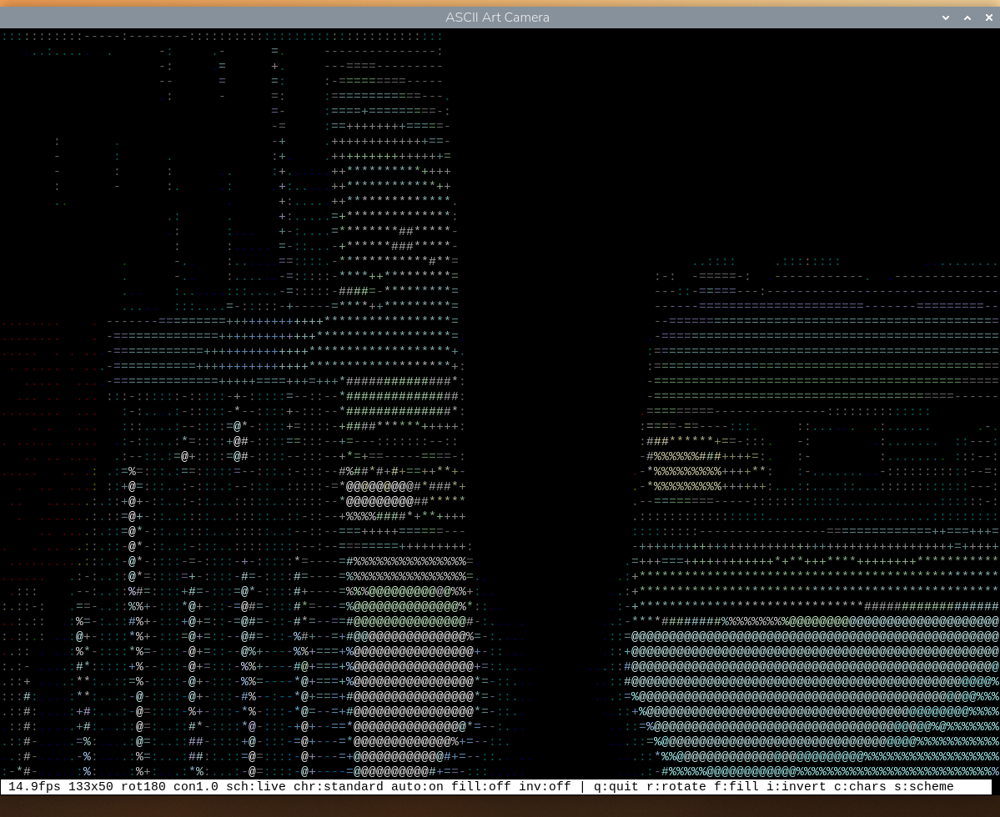
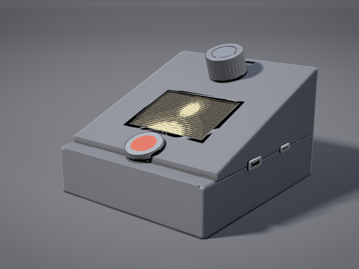

# ASCII Art Live Camera for Raspberry Pi Zero 2

Live view from the Pi Camera Module 2, rendered as ASCII art in a terminal on
the HDMI screen. This is the Python counterpart of the Live Camera pipeline in
the Android ASCII Art app.


*Greyscale, running on the Pi at 15.0 fps in a 120 by 43 window. The status bar
along the bottom reports the frame rate, ASCII grid size, and the current state
of every toggle — rotation, contrast, colour scheme, character ramp,
auto-levels, fill and invert.*



*Colour, in a 133x50 window at the full 15 fps. Press `s` to switch, or pass
`--colour` at launch. The character still comes from the brightness, so the two
modes draw the same shapes; the colour comes from the camera's chroma, which
greyscale mode discards. Colour costs roughly three times the redraw, and the
grid is no longer shrunk to hide that — at a full-screen 267x100 the same scene
runs at about 3 fps.*


*Both displays at once, with `--lcd`. This is a photograph rather than a screen
capture because it has to be: `grim` records the Wayland/HDMI output, and the
ILI9341 is driven from userspace over SPI with no kernel framebuffer, so nothing
on that panel can be screenshotted. On the monitor is a 67 by 25 grid with the
fine ramp — `sch:grey chr:fine` on the status bar — and the 2.4 inch panel at
bottom right is rendering the same camera frames on its own 64 by 24 grid. The
camera module is on the stand in the middle, wired back to the Pi through the
breadboard.*

Three hardware guides go with this code, published at
**[replicant1.github.io/AsciiArt-Pi](https://replicant1.github.io/AsciiArt-Pi/)**.
Read them there rather than in this repo: GitHub shows HTML as source, and its
raw view serves these as `text/plain`, so neither renders the drawings.

- **[Choosing a display](https://replicant1.github.io/AsciiArt-Pi/guides/display-selection-guide.html)**
  — a ranked guide to running this on something other than an HDMI monitor:
  vintage terminals, VFDs, graphic LCDs and OLED modules, priced in AUD and
  sourced for a buyer in Sydney.
- **[From breadboard to enclosure](https://replicant1.github.io/AsciiArt-Pi/guides/enclosure-build-guide.html)**
  — the rebuild into a self-contained, mains-powered box: a soldered perfboard
  HAT that replaces every friction-fit joint, a pin-by-pin cut list for the
  panel, encoder and shutdown-button harnesses, a measured power budget, and the
  enclosure cutouts.
- **[Panel connectors and controls](https://replicant1.github.io/AsciiArt-Pi/guides/panel-connectors-guide.html)**
  — section drawings and specs for the three things that have to cross the
  enclosure wall: video out, power in and the shutdown button.

Each is a single self-contained page with no scripts or external assets, so
saving one to disk works as well as reading it online.

Alongside them is a gallery, **[The enclosure,
rendered](https://replicant1.github.io/AsciiArt-Pi/guides/enclosure-renders.html)** —
four raytraced views of the sloped console those guides arrive at, built from
their stated dimensions rather than sketched to look right.

[](https://replicant1.github.io/AsciiArt-Pi/guides/enclosure-renders.html)

*Not yet built — this is a render of a design on paper, not a photograph. The
geometry comes from the connectors guide: 92 by 105 mm, 62 mm tall at the north
and 25 at the south, a 19° fascia, and a parting plane at z = 25 mm that halves
both connectors so a printed pocket can capture them. Encoder at the high north
end, panel in the middle, shutdown button nearest the hand.
[Three more views, and what is spec versus what is
invented](https://replicant1.github.io/AsciiArt-Pi/guides/enclosure-renders.html).*


## Where everything is

This page is the front door. Each subject below is one document, and each is
short enough to read in a sitting — which the 2,369-line README this replaced
was not.

**Start here, in this order.** Three documents explain the machine:

1. **[Module map](docs/module-map.md)** — every file in the app, what it is
   for, one line each. Generated from the code, so it cannot go stale. Its
   companion, the **[class overview](docs/class-overview.md)**, answers the question one
   level down: what the *things* are, and which of them run on their own thread.
2. **[Architecture](docs/architecture.md)** — how a frame becomes characters,
   how a setting reaches both displays, and why there is exactly one way in.
3. **[Telling it what to do](docs/subsystems/language.md)** — the control surface: typed
   settings, natural language, the phone page, and what happens when any of it
   fails.

**Or read one collaboration at a time.** `docs/scenarios/` describes the same
machine by what its parts do *together*: one document per mind-sized chunk of
behaviour, two to five classes each, with a sequence diagram, a table
explaining every message in it, and links into the source. They are grouped
into five categories following the shape of the machine, and each carries a
priority — fourteen written so far, and the
[index](docs/scenarios/SCENARIO_INDEX.md) ranks every one and shows where the
gaps are.

**The frame's own path** — capture, mapping, and the panel, each `HIGH`: every
one of these runs on every frame the app draws.

| Scenario | The collaboration |
|---|---|
| [A capture thread hands the render loop its newest frame through a one-slot queue](docs/scenarios/a-capture-thread-hands-the-render-loop-its-newest-frame-through-a-one-slot-queue.md) | Why the loop loses frames rather than currency when it falls behind, and why exactly one copy is made per frame |
| [One YUV420 capture carries greyscale and colour without converting either](docs/scenarios/one-yuv420-capture-carries-greyscale-and-colour-without-converting-either.md) | The Y plane already *is* the greyscale image, and 38 KB more buys the colour path with no conversion anywhere |
| [ImageProcessor rotates, crops and resizes a frame to the character grid](docs/scenarios/imageprocessor-rotates-crops-and-resizes-a-frame-to-the-character-grid.md) | The step that makes everything downstream grid-sized, and keeps the three planes in register |
| [Pixel brightness is mapped to ramp characters](docs/scenarios/pixel-brightness-is-mapped-to-ramp-characters.md) | A 256-entry table built once and applied to the whole grid at a stroke, feeding both displays from one calculation |
| [A frame reaches the SPI panel without stalling the render loop](docs/scenarios/a-frame-reaches-the-spi-panel-without-stalling-the-render-loop.md) | 153,600 bytes and 33 ms of SPI, on a thread the render loop never waits on |
| [The character grid is packed into RGB565 pixels for the ILI9341](docs/scenarios/the-character-grid-is-packed-into-rgb565-pixels-for-the-ili9341.md) | 3.7 ms of CPU against 33 ms of transfer, because glyphs are gathered from an atlas rather than drawn per cell |

**Getting a change in** — every route by which a setting changes, and the one
validator they all meet.

| Scenario | The collaboration |
|---|---|
| [A typed command updates the render configuration](docs/scenarios/a-typed-command-updates-the-render-configuration.md) | A line on the Unix socket crosses a thread boundary, is parsed into typed values, validated, and pushed to both displays |
| [A render configuration change is refused](docs/scenarios/a-render-configuration-change-is-refused.md) | Why `rotation 45` is refused in the same words whoever asked, and the one check `RenderConfig` is not in a position to make |
| [A spoken phrase is answered from the shortcut table, with no model call](docs/scenarios/a-spoken-phrase-is-answered-from-the-shortcut-table-with-no-model-call.md) | How `a bit more contrast` becomes a delta in microseconds, with no API key, no network and no model |
| [A spoken phrase is turned into a config delta by the language model](docs/scenarios/a-spoken-phrase-is-turned-into-a-config-delta-by-the-language-model.md) | What `something calmer` costs instead — a key, a network and two and a half seconds — for a delta nothing downstream can tell from a typed one |
| [A rotary encoder detent changes the colour scheme](docs/scenarios/a-rotary-encoder-detent-changes-the-colour-scheme.md) | The only control a sealed box has that needs no second device — bounce rejected by construction, a banked spin costing one repaint |
| [One configuration change is pushed to both displays](docs/scenarios/one-configuration-change-is-pushed-to-both-displays.md) | Where every route above ends. The terminal is pushed to; the panel reads the config handed to it with the next frame |

**Lifecycle** — the states the machine is in when it is not simply running.

| Scenario | The collaboration |
|---|---|
| [A camera that stopped delivering frames is detected and announced](docs/scenarios/a-camera-that-stopped-delivering-frames-is-detected-and-announced.md) | A frozen picture and a working camera look identical, so the only output a sealed box has must be able to admit it has nothing new to show |
| [The camera, panel, encoder and socket are released on shutdown](docs/scenarios/the-camera-panel-encoder-and-socket-are-released-on-shutdown.md) | Four claims given back in a fixed order, because a leak on the way out breaks the *next* start rather than this one |

The [index](docs/scenarios/SCENARIO_INDEX.md) ranks every scenario, written and
not, and lists what still belongs in each category.

**Then whatever you need:**

| Document | What is in it |
|---|---|
| [Using it](docs/using-it.md) | Running it, the live keys, every command-line argument, logging, troubleshooting |
| [Telling it what to do](docs/subsystems/language.md) | Typed settings, `ask`, the shortcut table, the phone page, honest failure |
| [Architecture](docs/architecture.md) | The pipeline, `RenderConfig`, the classes, start-up, the main loop |
| [Module map](docs/module-map.md) | Every module and what it is for — generated |
| [Class overview](docs/class-overview.md) | Every class, what it offers, and the one or two ideas worth carrying away about it |
| [Colour schemes](docs/subsystems/colour-schemes.md) | The nine schemes, how one is drawn, what it costs |
| [The SPI panel](docs/subsystems/panel.md) | The ILI9341, wiring, why it cannot be verified in software, rotation |
| [The rotary encoder](docs/subsystems/encoder.md) | The KY-040 knob, quadrature decoding, the button |
| [Threads and processes](docs/subsystems/threads.md) | The two services, every thread in them, what each owns, and the four ways anything crosses between them |
| [Performance](docs/project/performance.md) | Measured frame rates, where the time goes, window sizing |
| [Running it at boot](docs/project/deployment.md) | The systemd services, boot timing, the enclosure |
| [How this is built](docs/project/workflow.md) | Agent on the Mac, app on the Pi, and syncing between them |
| [What the model is told](docs/subsystems/what-the-model-is-told.md) | The system prompt and tool schema, and the eval cases |
| [How to write a scenario](docs/how-to-write-scenario-docs.md) | The format `docs/scenarios/` follows, and the ones still to write |

`docs/` is arranged the same way as the code:

```
docs/using-it.md          the documents the front page sends you to first
docs/architecture.md
docs/module-map.md        generated
docs/class-overview.md    what every class is for, partly generated
docs/scenarios/           one per collaboration between classes, with the
                          diagram and a table of its steps
docs/scenarios/SCENARIO_INDEX.md
                          those scenarios grouped into five categories
docs/how-to-write-scenario-docs.md
                          the format those follow
docs/subsystems/          one per part of the machine: panel, encoder,
                          language, colour schemes, what the model is told
docs/project/             performance, running it at boot, how this is built
docs/images/              every screenshot and render
docs/guides/              the published hardware guides
docs/index.html           the site root - GitHub Pages serves main:/docs, so
                          this file *is* replicant1.github.io/AsciiArt-Pi/
                          and cannot move
```

Three hardware guides are published separately as HTML — see the links above.

## The app in one screen

`src/` is six packages, one per subsystem, and `tests/` and `tools/` mirror
them — so "where does this live" and "where are its tests" are answered by
looking rather than by grepping.

```
ascii_camera.py          the process, the render loop, the wiring
src/capture/             camera.py            frames off the Pi Camera Module 2
                         image_processor.py   rotate, crop, resize, levels
src/art/                 ascii_art.py         brightness -> characters
                         palettes.py          the nine colour schemes
                         window_plan.py       a terminal geometry that fits
src/hdmi/                ncurses_display.py   ncurses on the HDMI monitor
                         headless_display.py  the stand-in when there is none
                         status_line.py       the bottom line, and what fits
src/lcd/               lcd.py               ILI9341 over SPI, RGB565
                         lcd_display.py       the character grid, as pixels
                         lcd_worker.py        its own thread, so SPI never stalls
                         lcd_splash.py        the start-up screen
src/control/             render_config.py     every live setting, one typed object
                         commands.py          typed lines -> settings deltas
                         command_server.py    the Unix socket the CLI talks to
                         web_server.py        the phone page, LAN only
                         args.py              the command line, from the same SPECS
                         encoder.py           the knob
                         scheme_cycle.py      the s key and the knob, one walk
src/language/            parser.py            words -> a validated delta, via a model
                         shortcuts.py         the words that need no model
                         resolver.py          "ask ..." in, a delta out, off the loop
                         asklog.py            every request written down
```

Each package's `__init__.py` says in one line what the subsystem is for, and
that is where the architecture is stated — the module map reads it rather than
keeping a second copy.

Line counts and the full summaries are in the **[module
map](docs/module-map.md)**, which is generated by `tools/docs/module_map.py` and
guarded by `tests/docs/module_map_test.py` — so it describes the code that is
actually there, not the code that was there when somebody last wrote it down.

## Requirements

Everything needed is already present in Raspberry Pi OS Bookworm:
`python3-picamera2`, `python3-numpy`, `python3-pil`, and `curses` from the
standard library. `bash deploy/setup.sh` verifies this and installs anything missing.

Prefer the apt packages over pip — building numpy or Pillow from source on a
Zero 2 exhausts its ~416 MB of RAM.


## Differences from the Android implementation

| Aspect | Android | Raspberry Pi |
|--------|---------|--------------|
| Language | Kotlin | Python |
| Camera API | CameraX | picamera2 |
| Concurrency | Coroutines | Threads, one-frame queue |
| Display | Jetpack Compose | curses |
| Frame rate | 30 fps | 15 fps default, 30 fps achievable |
| Input | Touch, live camera + video file | Keyboard, live camera |
