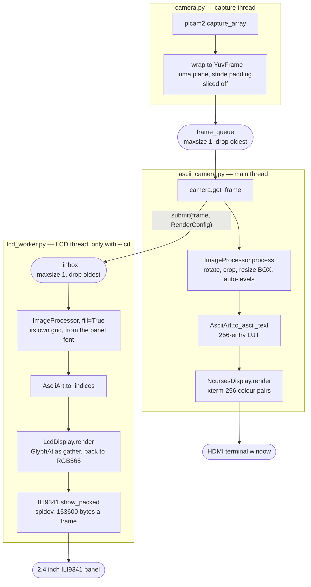
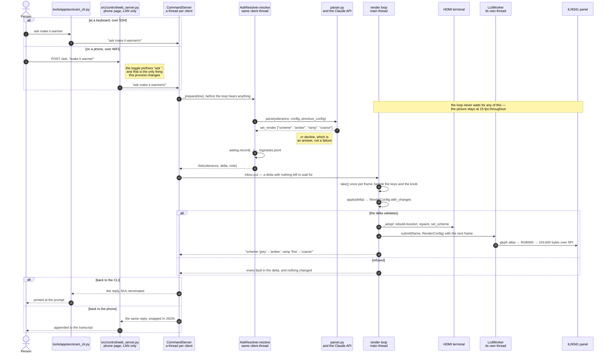
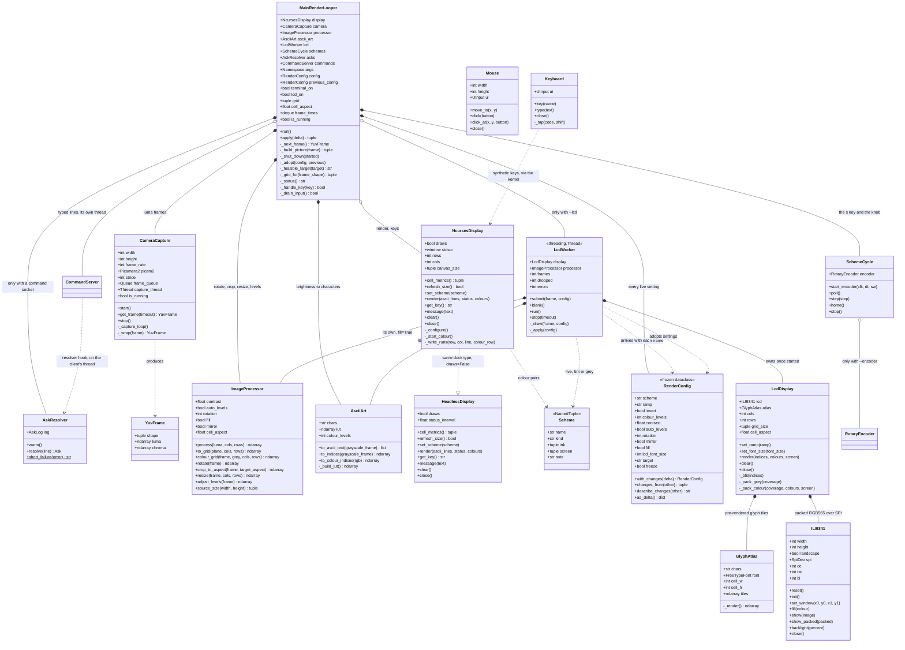
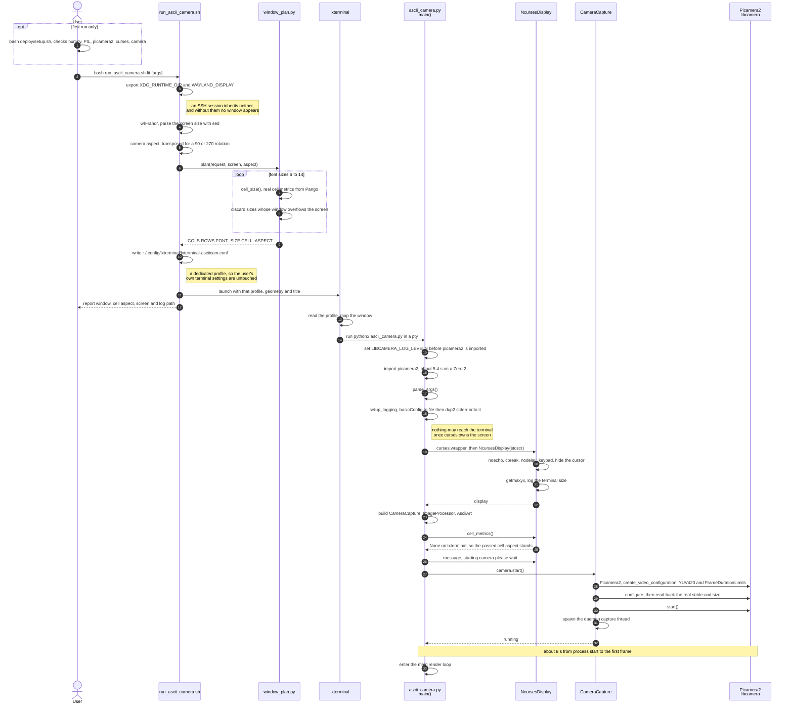
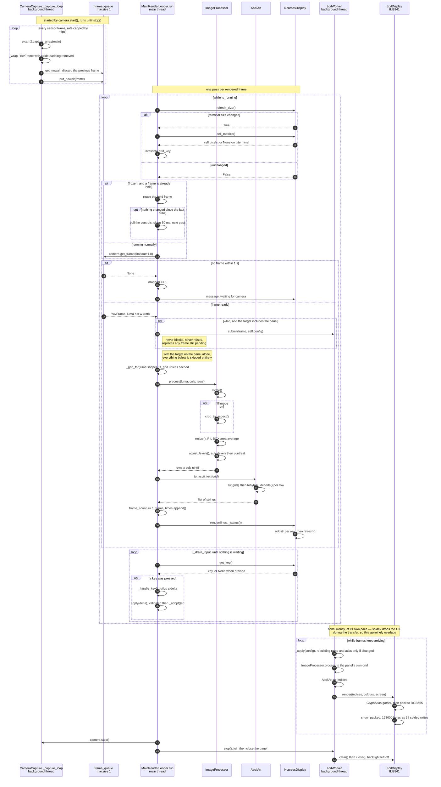

## Architecture



**Both queues hold one frame and drop the older one.** The camera thread
overwrites the pending frame on every capture, so a slow render never
accumulates a backlog — the picture stays current rather than falling
progressively further behind. `LcdWorker.submit()` does the same thing for the
panel, and neither blocks nor raises, so a slow SPI write can never stall the
main loop.

**The LCD is a second pipeline, not a copy of the first.** It takes the same
`YuvFrame` and redoes the work: its own `ImageProcessor` with `fill=True`, its
own `AsciiArt`, and a grid it derives from its own font rather than the
terminal's. It has to. The panel is 64x24 where the window might be 267x100, it
always fills rather than letterboxing, and it can use full RGB where curses is
limited to the xterm-256 palette. What it copies instead is the *settings*: the app's whole
`RenderConfig` rides along with every frame, so pressing `s` or `c` changes both
displays together. It ignores the two fields that are not its business — `fill`,
because the panel always fills, and `target`, because whether it should be
drawing at all is the main loop's decision and shows up as frames simply not
arriving. `lcd_font_size` is the one field that is the panel's alone.

With `--no-terminal` the `NcursesDisplay` branch is replaced by
`HeadlessDisplay`, which renders nothing and only logs — the panel then carries
the picture alone.

### One config, one way in

Every setting that can change while the camera is running lives in a single
frozen `RenderConfig` (`src/control/render_config.py`), and every change to one is a
*delta* — a dict of field names to values — applied through
`MainRenderLooper.apply()`. The keyboard produces deltas. The knob produces
deltas. Nothing anywhere assigns a setting directly.

The settings used to be scattered: some on the `ImageProcessor`, some as plain
attributes of the app, the colour scheme as an index into a tuple, and a
hand-maintained second copy of eight of them in an `LcdConfig` so the panel
could be told what the terminal was doing. Nothing named the full set, so
nothing could validate a change, log one, or hand one to anything else — and
each key binding had to remember its own consequences. `f` had to know to
invalidate the grid *and* repaint; `i` had to know to rebuild the ASCII
generator. Adding a setting meant finding all of those places.

Now `_adopt()` is the one place that knows what each change costs, and it works
off a set of changed field names:

| Changed | What it costs |
|---------|---------------|
| `contrast`, `auto_levels`, `rotation`, `fill`, `mirror` | assignments the processor reads next frame |
| `ramp`, `invert`, `colour_levels` | rebuild `AsciiArt` — the ramp string and its length both move |
| `rotation`, `fill` | invalidate the fitted grid |
| `fill` | repaint, or letterboxed cells keep the old frame's characters |
| `scheme` | `display.set_scheme()`, which repaints every cell |
| `target` | blank the panel, or repaint the window, depending which way |
| `lcd_font_size` | nothing here — the panel reads it off the next frame's config |

Validation splits two ways on purpose. A value outside a **range** is clamped:
contrast 9 is a coherent wish the renderer cannot go all the way to, so it
becomes 4.0, which is what the `+` key always did. A value outside an
**enumeration** is refused, along with an unknown field name or a wrong type —
there is no nearest sensible rotation to 45 degrees and no scheme next door to
"purple", so guessing would be worse than saying no. A refusal names *every*
fault in the delta rather than the first, and changes nothing at all.

One trap worth naming, because it is silent: `bool` is a subclass of `int`, so
`False == 0` and `False in (0, 90, 180, 270)` is `True`. Without an explicit
bool check, a delta meant for `freeze` but addressed to `rotation` would be
accepted as "no rotation" — a wrong field taking a wrong value and reporting
success. `tests/control/render_config_test.py` pins that case down.

`SPECS` in the same module carries the type, the permitted values and a
one-line description of every field, so the schema is derived rather than
restated. A field with no spec, or a spec with no field, fails at import rather
than showing up later as a setting nothing can change — the same shape of trap
`sync.sh` has, where a module missing from its file list is silently never
copied.

### From a phrase to the panel

Two front ends, one path. This is what happens between saying "make it warmer"
and the panel being warmer, whichever way it was said:



**Both front ends produce the same line.** `src/control/web_server.py` is a client of
the command socket exactly as `tools/app/asciicam_cli.py` is; it forwards what was
typed verbatim, and the app has no field anywhere recording which one sent it.
The single difference is the one the note calls out — the page's **say it in
your own words** toggle prefixes `ask `, which at the prompt you would type
yourself. Turn it off and
the two are byte-identical.

**The slow part runs on the client's thread, never the loop.** A parse crosses
a network and takes two to four seconds; on the render loop that would stop both
displays for the duration. So the resolver does its work before the loop hears
anything, and what reaches the inbox is a delta with nothing left to wait for.
That is why `CommandServer`'s own `REPLY_TIMEOUT` is five seconds while the
CLI's socket timeout is ninety: the loop is only ever asked to apply a dict, and
five seconds of not doing that means it has wedged.

**A parsed delta and a typed one are the same delta.** `commands.run_command`
unwraps the `Ask` and hands it to `apply()` — the same call `scheme amber`
makes, the same `RenderConfig.with_changes` validation, and literally the same
wording on refusal, since both answers come out of the same `_report`. The
model cannot reach anything a typed line could not, which is what makes
`tests/language/parser_eval.py` meaningful: it scores deltas against the validator that
will actually judge them.

**The panel is told last, and indirectly.** `_adopt` pushes the cheap changes
straight onto the processor and repaints the terminal, but nothing calls the
panel. The whole `RenderConfig` rides along with the next frame, so the panel
finds out when it next has something to draw — which is why a change made while
the picture is frozen sets `_redraw` rather than assuming a frame is coming.

**State lives on the app, not on the connection.** `previous_config` is what
`ask undo that` resolves against, and it belongs to the camera rather than to
whoever is connected. So an undo from a phone undoes a change typed at the CLI,
or made with the knob. One history, however many ways in.

### Classes



The app core is `MainRenderLooper`, which constructs the camera, processor and
renderer, hence composition; `NcursesDisplay` is aggregation instead, because
`curses.wrapper()` owns the screen and hands the window in. `LcdWorker` is
aggregation for a different reason — it only exists when `--lcd` is passed, so
`self.lcd` is `None` on an ordinary run and every use of it is guarded.

**The LCD half of the diagram is deliberately a parallel of the top half.**
`LcdWorker` owns its *own* `ImageProcessor` and `AsciiArt`, which is why those
two classes appear on both sides of the picture. Nothing is shared but the
`YuvFrame` itself and the immutable `RenderConfig`, and that is what makes
the thread safe: once `start()` is called the worker owns its `LcdDisplay`
outright and the main loop never touches it again. The one channel between them
is `submit()`, which drops rather than blocks.

Underneath, `LcdDisplay` is where the ASCII grid becomes pixels — `GlyphAtlas`
pre-renders every character in the ramp once, so a frame is a single numpy
gather rather than 1,536 `draw.text()` calls — and `ILI9341` is the bare panel
driver, speaking RGB565 over `spidev` with no kernel framebuffer involved.

`Mouse` and `Keyboard` (`tools/hardware/piinput.py`) are **test tooling, not part of the
app** — they create a virtual input device under `/dev/uinput` so the running
application can be driven with synthetic events. The dashed line is deliberate:
nothing imports them. Events travel out to the kernel, through the compositor,
and arrive at `NcursesDisplay.get_key()` indistinguishable from a real
keypress, which is what makes them useful for testing the live controls.

Three parts of the codebase are mostly or entirely functions, so they barely
appear above: `fit_grid()` in `image_processor.py`; all of `window_plan.py`
(`cell_size()`, `plan()`), which `run_ascii_camera.sh` calls when sizing the
window and which the app never imports at runtime; and `palettes.py`, which is
the `Scheme` tuple above plus the lookup tables built from it — `rgb_table()`
for the panel's full RGB and `index_table()` for the terminal's xterm-256
approximation, which is the one place the two displays genuinely diverge.

### Startup

Most of the work before the first frame is done by the supplementary scripts,
not the app: sizing the window, choosing a font, and handing the desktop
session's environment to a process launched over SSH.



Three ordering constraints in there are not free choices:

- **`LIBCAMERA_LOG_LEVELS` is set at module level**, above the import of
  `camera`. libcamera reads it when its C++ layer loads, so setting it inside
  `main()` would be too late.
- **`setup_logging()` runs before `curses.wrapper()`**, and redirects file
  descriptor 2 rather than just Python's logging. libcamera writes to stderr
  directly, never through `logging`, and a single stray line garbles the
  picture once curses owns the screen.
- **The stride is read back after `configure()`, not assumed.** The ISP may pad
  rows out to a hardware-friendly width, and slicing that padding off is what
  keeps the image from shearing.

The two scripts exist because neither problem can be solved from inside the
app: a process launched over SSH does not inherit the Wayland session, and
lxterminal takes its font size from a config file rather than the command line.
`deploy/setup.sh` is a one-time dependency and camera check, not part of startup.

### Main render loop



The two loops are independent, which is the point of the one-slot queue. The
capture thread never waits for the renderer: it overwrites the pending frame
on every capture, so `get_frame()` always yields the newest image rather than
the head of a growing backlog. A slow render therefore drops frames instead of
falling progressively further behind real time.

Four details the diagram makes explicit:

- **The terminal size is checked every pass**, not just at startup, which is
  what lets the picture refit when the window is resized under it.
- **`get_frame()` blocks for up to a second.** The camera caps its own rate, so
  the main loop needs no pacing of its own — it runs exactly as often as frames
  arrive. A timeout means the camera is still warming up or has stalled, not
  that the loop is spinning too fast.
- **Freezing is the one case that needs its own pacing.** Nothing is being
  waited for, so without a sleep the loop would spin a core redrawing an
  unchanging picture and pushing it down the SPI bus fifteen times a second.
  It draws when something has actually changed — a setting, a resize, a notice
  that has to appear or expire — and otherwise polls the controls every 50 ms.
  The camera is deliberately left running throughout, because stopping it would
  make unfreezing cost the 15–20 seconds libcamera takes to come back.
- **Keys are drained, not sampled.** A single `getch()` per frame would lag
  behind a keypress burst at 15 fps, so `_drain_input()` consumes everything
  buffered before the next frame is fetched.

```
AsciiArt-Pi/
├── ascii_camera.py        entry point, main loop, CLI, live controls
├── run_ascii_camera.sh    launches it in a sized window on the HDMI screen
├── src/                   six packages, one per subsystem
├── tests/                 mirrors src/, plus tests/docs/ for the documents
├── tools/                 app/ hardware/ docs/
├── deploy/                systemd units and the one-time setup scripts
└── docs/                  this, its neighbours, and the published guides
```

The files inside those directories are not listed here on purpose. That list
existed, drifted, and was still describing `src/camera.py` and a flat `tests/`
long after both had moved — a hand-copied inventory of something the code
already states. The **[module map](module-map.md)** and the **[class
overview](class-overview.md)** are generated from the source and guarded by tests that
fail when they go stale; they are where to look.

The three `lcd_*` modules are a deliberate stack rather than one file:
`lcd_worker.py` deals only in threading and settings, `lcd_display.py` only in
turning a character grid into pixels, and `lcd.py` only in what the ILI9341
wants to hear. Only the bottom one knows about SPI, which is what lets
`tests/lcd/lcd_render_bench.py` exercise the render path without a panel attached.
