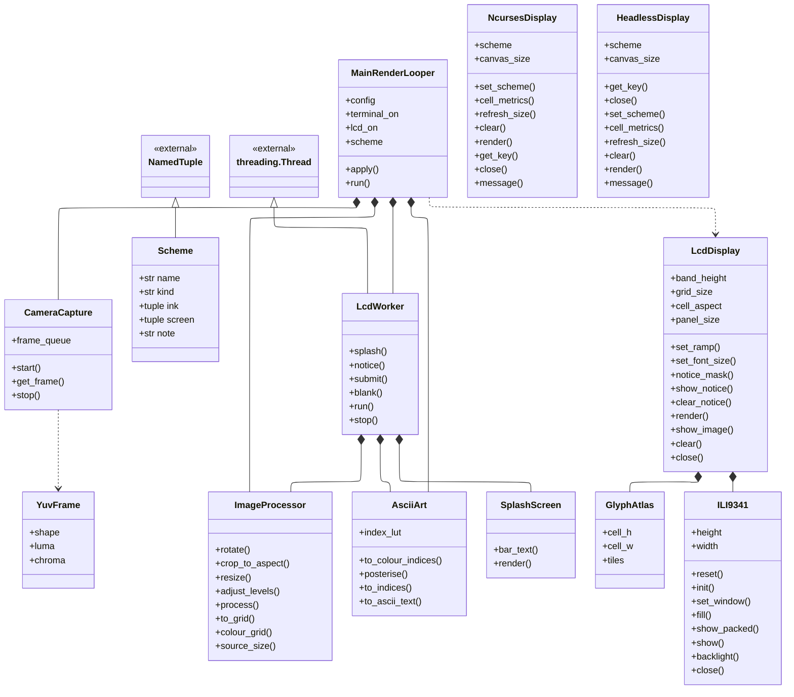
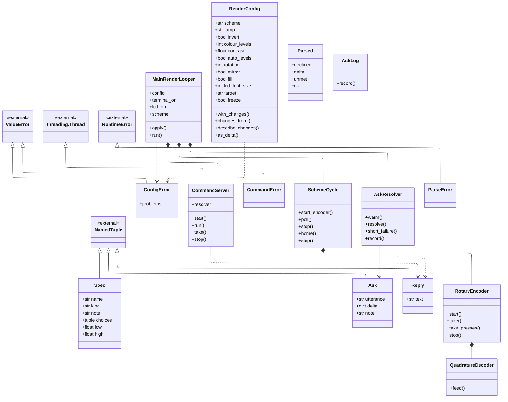
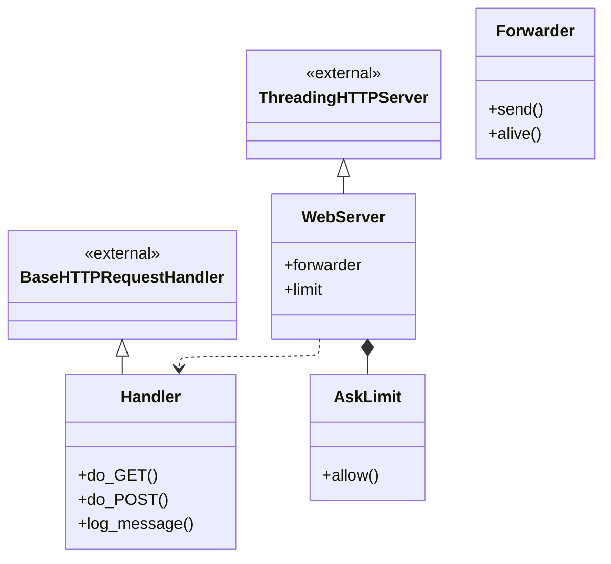

# Class overview

Every class in the running app: what it offers, and the one or two
ideas worth carrying away about it. The page is organised around three
diagrams, and each class is described beneath the one it appears in.

**Partly generated.** The diagrams, the headings and the public surface
are read from the source by `python3 tools/docs/class_map.py --write`,
so they cannot drift. The synopses are written by hand in
`tools/docs/class_synopses.py`, because what a class is *for* is a
judgement about the design rather than a fact recoverable from it.
`tests/docs/class_map_test.py` fails if the page is stale, if a class
has no synopsis, or if a synopsis outlives its class.

A synopsis is deliberately not an inventory of the members listed above
it. It is meant to be small enough to hold in mind while reading a
scenario or the architecture.

**A box carries a class's whole public surface** - its fields, its
properties and its methods - so the diagram is where to look for what a
class offers, and the paragraph beneath it is prose rather than a second
copy of the same list. Attributes are the exception: `MainRenderLooper`
assigns nineteen of them to `self`, so only the few that carry meaning
are drawn.

Three kinds of arrow, told apart by their shaft and their head:

| Arrow | Means |
|---|---|
| Solid shaft, hollow triangle | **Inheritance.** The triangle points at the base class, which is drawn above its subclasses. |
| Solid shaft, filled diamond | **Composition.** The class builds the part itself and holds it, so the part cannot outlive the whole. The diamond sits at the owner. |
| Solid shaft, hollow diamond | **Aggregation.** The class holds a part it did not build, which could outlive it. |
| Dotted shaft, open arrowhead | **Dependency.** The class mentions another without keeping it - raising it, returning it, or building it and handing it straight on. |

`MainRenderLooper` shows the contrast worth having. It **builds and**
**owns** the camera and the image processor, so those are diamonds; it
merely **names** `LcdWorker`, so that one is dotted.

No hollow diamonds appear on any of the three diagrams, and that is a
fact about the derivation rather than about the app. Aggregation here
means a part handed in as a constructor argument, and a class never
names the type of what it is given - so those relationships are
invisible to a parser and are left to the scenarios to draw.

All three are read from the source, so none of them can drift. A
collaborator that arrives as a constructor argument has no arrow at all,
because the class never names its type - `MainRenderLooper` is handed a
display and never says which kind. Those are the edges a scenario draws.

## The frame's path

Everything one camera frame passes through, from the sensor to the glass.
The densest part of the app, and the only part that runs on every frame.

**Fig 1: The frame's path**

### The classes in this diagram

#### `AsciiArt`

*ascii_art.py* — Generates ASCII art from a greyscale array.

Turns brightness into characters using a table built once, rather than a
calculation repeated for every cell. The same table answers two questions.
The terminal asks for a character, and the panel asks for a position in the
ramp, because it draws its glyphs from an atlas. Deriving both from one
table is what stops the two displays disagreeing about which character a
brightness deserves.

#### `CameraCapture`

*camera.py* — Captures greyscale frames from the Pi Camera Module 2.

Owns the camera and the thread that reads it, and keeps only the newest
frame in a queue one item deep. When the render loop falls behind it
therefore loses frames rather than falling behind reality. The camera's
timing also stays its own, and never comes to depend on how expensive the
current colour scheme is.

#### `GlyphAtlas`

*lcd_display.py* — Every character of a ramp, pre-rendered into a fixed-size cell.

Holds every character of a ramp, rasterised once into a tile of fixed size.
Drawing a frame is then a single array lookup. The alternative is 1,536
separate text-drawing calls per frame, which is the difference between the
panel keeping up and falling behind.

#### `HeadlessDisplay`

*headless_display.py* — Draws nothing, but still carries the settings and reads the keyboard.

Stands in for the terminal when a run has none, which in the enclosure is
every run. It draws nothing, but it still holds the settings and still reads
the keyboard. The app therefore has a single display interface, rather than
a scattering of checks for whether a screen exists.

#### `ILI9341`

*lcd.py* — Drives the panel over SPI, taking whole frames as PIL images.

The panel itself, at the level of pins and bytes. Everything above it works
in pixels. Only this class knows the initialisation sequence the controller
expects, and that a frame has to leave in 4,096-byte pieces, because that is
all the kernel's SPI buffer will accept.

#### `ImageProcessor`

*image_processor.py* — Turns a raw greyscale camera frame into an ASCII-grid-sized array.

Reduces a camera frame to exactly one pixel per character cell. Everything
downstream works on a few thousand values instead of tens of thousands,
because this runs first. The luma and chroma planes go through the same
reduction, which keeps them in register. If they drifted apart, colour would
fringe along every edge in the picture.

#### `LcdDisplay`

*lcd_display.py* — Draws an ASCII grid onto the ILI9341, filling the panel.

Turns a grid of ramp positions into a frame of RGB565 pixels. Glyph coverage
is treated as a fade from the scheme's unlit screen colour to each cell's
own colour, rather than as a stencil. Its frame buffer persists between
calls, which is what allows a message to be painted over a picture that is
not being redrawn.

#### `LcdWorker` — `threading.Thread`

*lcd_worker.py* — Renders camera frames to the LCD without blocking the main loop.

A thread that owns the panel, so the render loop never waits for the 33
milliseconds a frame costs over SPI. It is handed the app's whole live
configuration with each frame, rather than a private copy of the fields it
cares about. A setting added to the app therefore reaches the panel without
anyone having to remember to add it in a second place.

#### `MainRenderLooper`

*ascii_camera.py* — Capture -> process -> ASCII -> terminal, once per frame.

The whole process hangs off this one object. It owns the render loop, and it
is the only thread on which a setting may be changed. Every way of changing
one - a key, the knob, a line off the socket, a phrase a language model
turned into a delta - ends at its `apply` method. That is why there is a
single place that knows what each setting costs to change.

#### `NcursesDisplay`

*ncurses_display.py* — Renders ASCII art frames to the terminal.

Draws the picture on the HDMI terminal. While it is running, curses owns the
screen. That is the fact worth remembering: nothing anywhere else in the app
may write to standard output or standard error, or the picture is corrupted.

#### `Scheme` — `NamedTuple`

*palettes.py* — One display look.

One display's whole appearance, held as a value: the lit ink, the unlit
screen behind it, and which of the three kinds of colour scheme it is. It
has no behaviour of its own. That is deliberate, because it lets the nine
schemes be an ordinary list, which the `s` key and the knob step through.

#### `SplashScreen`

*lcd_splash.py* — Renders the start-up screen as a PIL image, ready for the panel.

Gives the panel something to show before there is a picture to show. The
camera takes about twenty seconds to produce its first frame. In a sealed
box, twenty seconds of blank glass is indistinguishable from broken
hardware.

#### `YuvFrame`

*camera.py* — One YUV420 frame, exposing its planes as views rather than copies.

One frame from the camera, before anything has been converted. Its planes
are views into the capture buffer rather than copies, so reading the
greyscale image costs nothing, and colour costs only the chroma a scheme
actually asks for. Keeping all three planes together also lets the render
loop and the panel's thread read the same frame at once, since neither of
them writes to it.

## Getting a change in

Every route by which a setting changes - a typed line, the knob, a phrase
for the model - and the one object that decides whether a value is allowed.
`MainRenderLooper` appears again because it is where all of them arrive.

**Fig 2: Getting a change in**

[`MainRenderLooper`](#mainrenderlooper) appears here too, and is described above.

### The classes in this diagram

#### `Ask` — `NamedTuple`

*command_server.py* — A delta already worked out, on its way to the render loop.

A delta that has already been worked out, on its way to the render loop. Its
value is that it is a distinct type. An answer that took four seconds to
obtain from a language model reaches the loop the same way a typed line
does, and by then nothing about it reveals which it was.

#### `AskLog`

*asklog.py* — Append-only record of asks, one JSON object per line.

Writes down every ask, with what it cost and how it was answered. The
load-bearing part is the source it records. That separates what the shortcut
table answered for nothing from what a language model was paid to answer,
which is what makes the hit rate and the cost countable rather than
estimated.

#### `AskResolver`

*resolver.py* — Turns "ask <words>" into a delta, on whatever thread called it.

The whole of the ask path, and the one part of the app allowed to be slow.
It tries the exact table before it even looks for an API key. That ordering
is why `green` and `freeze it` still work with the network down, and why
asking is never all or nothing.

#### `CommandError` — `ValueError`

*commands.py* — A line that could not be turned into a delta, with a reason to print.

Raised when a typed line cannot be turned into a delta, and it carries the
reason why. It exists so that the layer settling what type a word has can
refuse in a sentence rather than in a traceback. Whether a value is actually
allowed is a separate question, answered elsewhere.

#### `CommandServer` — `threading.Thread`

*command_server.py* — Accepts typed lines on a Unix socket and queues them for the app.

The Unix socket, and a thread for each client that connects. It does nothing
else, on purpose. It accepts a line, offers it to whoever resolves it, and
leaves the result where the render loop will collect it. A request that
takes several seconds therefore costs the picture nothing.

#### `ConfigError` — `ValueError`

*render_config.py* — A delta that could not be applied, carrying every reason rather than one.

Raised when a delta is refused, and it carries every reason rather than only
the first one found. A caller can then correct a whole change in a single
pass. That also matters to the eval that scores a language model's
proposals, which wants the entire list.

#### `ParseError` — `RuntimeError`

*parser.py* — The parse could not be completed - network, key, or a refusal.

Raised when a parse cannot be completed. A dead network, a refused key and a
model that declined all arrive as this one type. The caller's job is to put
something useful on a 240x320 panel, not to tell those three apart.

#### `Parsed`

*parser.py* — What one utterance came back as.

What one utterance came back as. Exactly one of the delta and the refusal is
ever set, so nothing downstream has a third shape to handle. The remaining
field is the honest one. It says what the request asked for that these
settings cannot express, which is not the same as being refused.

#### `QuadratureDecoder`

*encoder.py* — Pin levels in, detents out.  No GPIO, no threads, no clock.

Takes pin levels and returns detents. It has no GPIO, no thread and no clock
of its own. That purity is the point rather than tidiness. This is the part
that can be wrong in a way nobody notices until the knob feels bad, so it
has to be testable on a machine with no encoder attached.

#### `RenderConfig` — `@dataclass`

*render_config.py* — The complete live render state.

Holds the complete live render state. It is frozen, so a change replaces it
rather than editing it, and no reader can ever catch it half-applied. It is
also the only code that decides whether a value is allowed. It gives the
same answer whoever asked, which is what makes comparing a keypress, a knob
and a language model meaningful.

#### `Reply` — `NamedTuple`

*command_server.py* — A resolver's answer to send straight back, without troubling the loop.

An answer that never reaches the render loop. It carries a message straight
back to whoever asked for it. Refusals, help text and failures therefore
stay off the one thread that has to keep drawing.

#### `RotaryEncoder`

*encoder.py* — A KY-040 on two GPIO pins, read through lgpio's edge callbacks.

Claims the knob's three GPIO pins and accumulates what it did, under a lock,
because the edges arrive on a thread the render loop does not control. What
it hands over is a net count rather than a list of events. The loop
therefore learns how far the knob moved, and not how noisily it got there.

#### `SchemeCycle`

*scheme_cycle.py* — Steps the colour scheme, from a key or a knob.

Walks through the colour schemes, whichever input asked for the move. It
applies a whole banked move at once, rather than one detent at a time. Every
scheme change repaints every cell, so a spin applied step by step would
strobe through pictures nobody is on screen long enough to see.

#### `Spec` — `NamedTuple`

*render_config.py* — What one setting accepts, and what it is for.

Describes what one setting accepts and what it is for. The twelve of them
are the single source from which the validator, the `help` text, the
command-line arguments and the language model's tool schema are all built. A
setting therefore cannot exist in this app and be undocumented, and adding
one is a single edit.

## The phone page

A second process, sharing no memory with the app and reaching it only down a
Unix socket. Its own diagram because that separation is the most important
thing about it.

**Fig 3: The phone page**

### The classes in this diagram

#### `AskLimit`

*web_server.py* — A sliding window over the requests that cost money.

Counts the requests that cost money over a sliding window, and refuses them
past a ceiling. A phone left face up on a table can post the same form for
hours. This is the only thing standing between that and an unattended API
bill.

#### `Forwarder`

*web_server.py* — Sends one line to the app's command socket and returns its reply.

Sends one line to the app's command socket and returns the reply. It is the
only thing in the web process that knows the camera exists. That keeps the
phone page a client of the app, rather than a second copy of it.

#### `Handler` — `BaseHTTPRequestHandler`

*web_server.py* — One request. The server instance carries the forwarder and the limit.

Serves one HTTP request: the page itself, the form on it, and the forwarding
of whatever was typed. Each request runs on a thread of its own. One slow
ask therefore cannot make the page unreachable for anybody else.

#### `WebServer` — `ThreadingHTTPServer`

*web_server.py* — A LAN-bound listener, IPv4 only, holding the socket path it forwards to.

Listens on the LAN, over IPv4 only, and holds the socket path it forwards
to. The narrow binding is the security posture. There is no authentication
anywhere on this path, so what limits the damage is who can reach it at all.

---

31 classes.
