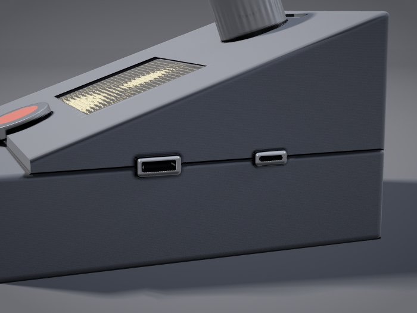

## Running it at boot

For a build with no keyboard and no monitor, `ascii-camera.service` starts the
app in enclosed mode — `--lcd --encoder --no-terminal` — as soon as the Pi comes
up:

```bash
sudo cp ascii-camera.service /etc/systemd/system/
sudo systemctl daemon-reload
sudo systemctl enable --now ascii-camera

journalctl -u ascii-camera -f      # watch it
sudo systemctl stop ascii-camera   # release the camera, blank the panel
```

It runs as `rod`, who is already in `spi`, `gpio`, `video`, `i2c` and `input`,
so no root and no added capabilities. Don't run it alongside a hand-launched
copy — two processes will fight over the camera and `/dev/spidev0.0`.

Three decisions in the unit file are worth knowing about, because the obvious
alternatives are all worse:

- **It is not ordered after `multi-user.target`.** On this Pi that is not
  reached until **19.3 s**, and `systemd-analyze blame` puts nearly all of it in
  `apt-daily-upgrade` and `cloud-init` — neither of which this needs.
  `basic.target` is done by about 3 s. In a sealed box every second before the
  start-up screen appears is a second of blank glass that looks like broken
  hardware, so it starts as early as its dependencies allow.
- **`StartLimitIntervalSec=0`.** systemd's default gives up after 5 starts in
  10 s. For an appliance that means one slow camera at boot leaves the panel
  dark until somebody SSHes in to find out why. Retrying for ever is the better
  failure: the panel comes up whenever the hardware is ready.
- **`KillSignal=SIGTERM` with a 15 s stop timeout**, because SIGTERM is what the
  app installs a handler for. `systemctl stop` therefore takes the clean path —
  camera stopped, panel blanked, backlight driven low. Killed any harder, the
  panel is left lit showing the last frame.

### The backlight during boot

The ILI9341 module fits **its own pull-up on the backlight pin**. GPIO 18 is an
input from power-on until the app claims it, so that pull-up lights the panel —
and it sits lit, showing undefined frame memory, for the whole time systemd and
Python take to reach the point of drawing anything. Measured on this Pi that is
about **27 seconds**:

| From power-on | |
| --- | --- |
| 0 – 11.1 s | systemd has not started the service yet |
| 11.1 – 13.1 s | Python starting and importing |
| 13.1 s | panel lights with the start-up screen |
| 20.1 s | the picture takes over |

A lit panel showing garbage reads as broken hardware, which is worse than a dark
one. One line in `/boot/firmware/config.txt` fixes it, and it has to be there
rather than in any script because firmware applies it before userspace exists.
See also [Why the panel lights at 13 s and not 27](deployment.md#why-the-panel-lights-at-13-s-and-not-27).

```
gpio=18=op,dl
```

Output, driven low. The pull-up never gets the chance, and `src/lcd.py` turns
the backlight on only after blanking — so the panel goes straight from dark to
the start-up screen with nothing ugly in between.

> **This lives on the boot partition, not in this repo, so a reimage loses it
> silently.** The same is true of `dtoverlay=gpio-shutdown` for the shutdown
> button. Both are one-line additions to `/boot/firmware/config.txt`; if you
> reflash, put them back.

### Why the panel lights at 13 s and not 27

`src/camera.py` imports `picamera2` **inside `CameraCapture.start()`**, not at
module scope, and that is worth leaving alone. Measured on this Pi:

| Fresh-process import | |
| --- | --- |
| `camera` — with `picamera2` at module scope | **7.12 s** |
| `camera` — with it deferred | **0.57 s** |
| `lcd_display` + `lcd_splash` (`numpy`, `PIL`) | 1.11 s |
| `spidev` + `RPi.GPIO` | 0.02 s |

Nothing above `start()` needs the camera, so paying for it at import time meant
the panel stayed dark through all six seconds of it. Deferred, the cost lands
*while the start-up screen is already up and the comet is sweeping* — the log's
gap between `starting camera` and `waiting for first frame` is exactly that
import. First light moved from 27.5 s to **18.4 s**, and the picture from 30.4 s
to 24.4 s. Disabling cloud-init took it further, to 13.1 s — see below.

### cloud-init was six seconds of nothing

The service could not start until `sysinit.target`, and `sysinit.target` was
waiting on cloud-init:

```
ascii-camera.service ─ basic.target ─ sysinit.target
  └─ cloud-init-network.service  +1.325 s
     └─ cloud-init-local.service +0.747 s
        └─ cloud-init-main.service +5.974 s
```

`cloud-init status` reported `DataSourceNone` — six seconds spent searching for
provisioning data that does not exist, then `degraded done`. There is no
`user-data` on the boot partition, and the WiFi profiles are NetworkManager
netplan files in `/etc/netplan/` that predate any of this, so nothing depends on
it. Disabled with a single empty file, which is the documented and trivially
reversible way:

```bash
sudo touch /etc/cloud/cloud-init.disabled     # sudo rm it to undo
```

`sysinit.target` went from 11.7 s to 6.3 s, and **first light from 18.4 s to
13.1 s**. Whole-boot time dropped 28.6 s → 22.9 s as a side effect.

> Like `gpio=18=op,dl`, this lives on the Pi and **not in this repo**, so a
> reimage loses it silently.

### How much further it can go: about three seconds

Measured, so nobody has to re-derive it:

| | |
| --- | --- |
| Kernel, including an initramfs | 4.67 s |
| Userspace → udev coldplug completes | 3.95 s |
| **`/dev/spidev0.0` exists — the floor for any approach** | **8.62 s** |
| Panel currently lights at | 13.1 s |

The service starts **25 ms** after `basic.target` completes, so there is nothing
to reclaim in its scheduling. The remaining gap is `sysinit.target` plus about a
second of `numpy`/`PIL`.

Capturing it needs a *second* program, not a change to this one. The minimal
path to a lit panel, timed end to end:

| | |
| --- | --- |
| `spidev` + `RPi.GPIO` import | 0.021 s |
| `lcd.py` import (`numpy`, used on two lines) | 0.814 s |
| panel init + blank | 0.331 s |
| blit one full frame | 0.056 s |

So a unit with `DefaultDependencies=no`, ordered after `systemd-udev-trigger`,
blitting a pre-rendered RGB565 buffer, could light the panel at roughly **9 s** —
and under 8.62 s is impossible without kernel surgery. That is the whole prize:
about three seconds, for a second thing driving the same panel and a handover.

**Booting to console does not help much.** `systemctl set-default
multi-user.target` was tried and measured: first light 13.1 s → 12.0 s, whole
boot 22.9 s → 21.5 s. Only 1.1 s, because the service already starts at
`basic.target`, well before the desktop stack — though it does free RAM on a
416 MB machine, which may matter for other reasons.

> Timings here are from the journal's **monotonic** clock, not wall clock. There
> is no RTC in this build, so the clock jumps when NTP corrects it partway
> through boot, and wall-clock arithmetic across a boot is off by several
> seconds. Note also that `systemd-analyze` reports times relative to *userspace
> start* while `journalctl -o short-monotonic` counts from *kernel start* — the
> two differ by the kernel time, which is 4.7 s here.

### Turning it on, with no power switch

There is no power switch on a Pi, so **applying power is the on-switch** — plug
in the USB-C panel lead and it boots. The shutdown button on GPIO 3 is the other
half:

| Action | Result |
| --- | --- |
| Plug in, or switch on at the wall | Boots |
| Press the button while running | Clean shutdown |
| Press it again, still plugged in | Boots |
| Unplug | Genuinely off |

After a clean shutdown the Pi is **halted, not off** — the 5 V rail is still
live and it still draws current. That is exactly why the button belongs on
GPIO 3 and nowhere else: wake-from-halt is a hardware property of that pin, not
a feature of the `gpio-shutdown` overlay. On any other pin the button becomes
shutdown-only, and a halted Pi in a sealed box can only be revived by unplugging
it. See
[Panel connectors and controls](https://replicant1.github.io/AsciiArt-Pi/panel-connectors-guide.html).

Note that boot itself takes about **25 seconds** here (4.5 s kernel + 20.4 s
userspace), and the SPI panel is dark for the early part of it. The start-up
screen covers the app's own start, not the boot.

## Putting it in an enclosure

[**From breadboard to enclosure**](https://replicant1.github.io/AsciiArt-Pi/enclosure-build-guide.html)
covers taking the Pi, camera, SPI panel and encoder off the breadboard and into a
self-contained, mains-powered box: connector choices, a pin-by-pin bench reference, power
budget, and the enclosure cutouts.

Two findings in it are measured on this Pi rather than estimated. The render loop costs **96% of
one core** with the HDMI terminal running and **29%** with `--no-terminal`, so the enclosed
configuration is not merely tidier — it is 3.3x cheaper, and in a sealed box with no fan that
is a thermal argument rather than an electrical one. And
the encoder module can be dropped for a bare EC11 with no code change at all, because
`src/encoder.py` already enables internal pull-ups on all three pins and the switch was verified
to run on nothing else.

[**Panel connectors and controls**](https://replicant1.github.io/AsciiArt-Pi/panel-connectors-guide.html)
is a set of section drawings and specs for the three things that have to cross the enclosure
wall: video out, power in, and an off switch.

Only the first is hard. A panel-mount socket in **Type C mini-HDMI is not a stocked part
anywhere**, so the answer is a short mini-HDMI extension held by the printed shell itself, and
the drawings show where the plug force ends up, the geometry of the lip and rear stop that catch
it, and why the shell has to split through the pocket. The two stops do opposite jobs, which is
the part that is easy to get backwards: pushing a plug in drives the socket *inward*, so it is
the stop *behind* the connector that resists insertion, while the lip at the aperture — just
whatever wall is left once the hole is cut smaller than the connector body — is what stops it
being pulled back out.

The other two are cheap. **Power comes out as USB-C even though the Pi's socket is micro-B**,
because micro-B is the build's least durable connector and the panel socket is the one that
gets handled; a voltage-budget graph shows that the whole modification costs about 90 mV at 1 A,
against a 4.63 V undervoltage floor, and that the charger cable you don't control costs twice
that. And with no battery module there is **no power button at all**, which `dtoverlay=gpio-shutdown`
fixes for the price of a $2 momentary switch on GPIO 3 — press to shut down cleanly, press again
to boot. Use GPIO 3 rather than any other pin: wake-from-halt is a property of that pin
specifically, not of the overlay, and it is the only way this box can be switched back on.

It closes with the enclosure those three decisions imply, drawn rather than described: an
isometric of the base with the lid lifted off, and a side section through the wedge. A **sloped
console, 92 × 105 mm, 25 mm at the front and 62 at the back**, camera out of the vertical front
face so the panel is a viewfinder.

The isometric carries a compass — north is right-and-up, east is right-and-down — because
"front" and "back" are useless words for an isometric. It also sits on a ground plane, casts a
shadow, and has its two near walls cut away rather than drawn see-through: without those cues an
open tray reads equally well as the underside of a closed one.

The layout is decided by the Pi's port edge, not by preference. Pinning that edge **east, with
PWR IN north and mini-HDMI south**, is a 90° rotation of the board, and a rotation carries
everything with it — header pin 1 lands south, and the CSI connector lands on the **north**
edge. Since the ribbon leaves the short edge travelling parallel to the long edge, the camera
has to go on the **north wall** for that run to stay straight. Each wall pocket sits directly
opposite the board port it serves, so the leads are short and cannot be crossed at assembly.

The other load-bearing idea is the parting plane at **z = 25 mm**: it is the front wall height,
it clears the Pi and HAT stack, it cuts both connectors exactly in half so they can be captured
at all, and it keeps every hand-crimped joint in the base. Ten millimetres under the Pi were
reserved for a battery that is no longer part of the design; the Pi stands on standoffs and the
space now takes the service loops the lid's two harnesses need.

### Seeing it in three dimensions

[**The enclosure, rendered**](https://replicant1.github.io/AsciiArt-Pi/enclosure-renders.html)
is that same box raytraced from four angles: the fascia from the reader's seat, the east wall
close up, the camera end, and the lid lifted 55 mm off the tray. **None of it has been printed
yet** — these are renders of a design on paper, and the parts inside the tray are stand-ins at
the right sizes rather than models of the real boards.

The geometry is built from the numbers above rather than sketched, so the pictures can be
measured. That is the point of the second one:

[](https://replicant1.github.io/AsciiArt-Pi/enclosure-renders.html)

*The parting plane doing its job. `z = 25 mm` passes through the centreline of both
connectors, which is the only thing that lets a printed pocket capture them at all — half the
pocket in the base, half in the lid, and closing the box clamps the connector between them.
Reading a plane through two section drawings takes a moment; seeing it cut both sockets in
half does not.*

The renders come from `tools/enclosure_render.py`, which marches a signed distance field in
numpy — no modelling package, no renderer, not even an image library, with the PNG written by
hand. The panel is showing real ASCII: a 5x7 bitmap font over the app's own `" .:-=+*#%@"`
ramp at the 64x24 grid `src/lcd_display.py` produces at its default font size. The gallery
page lists which dimensions came from the guide and which were invented to make a picture.
