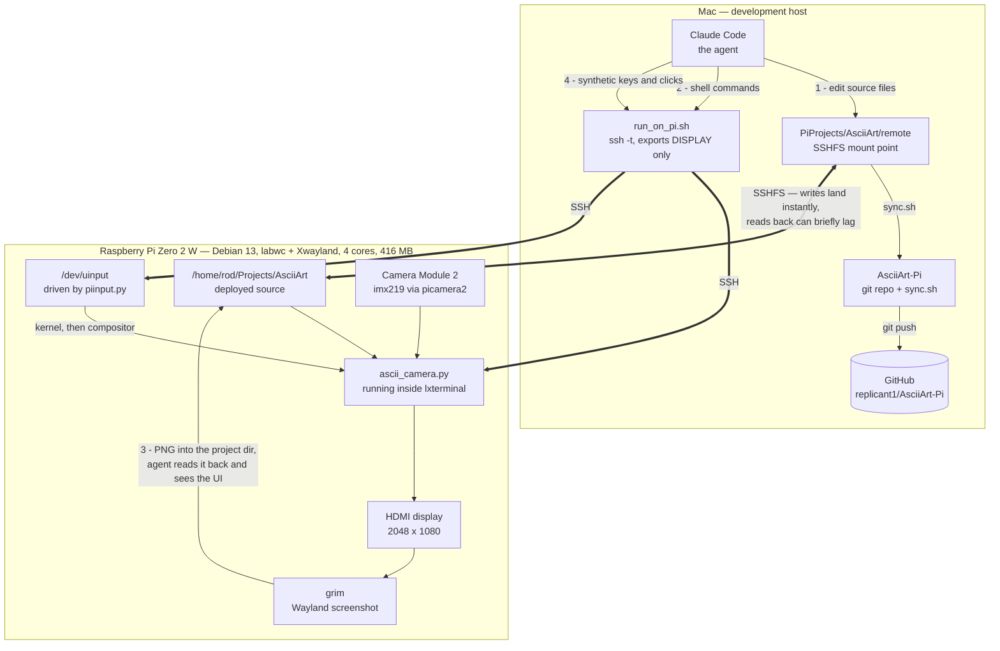

## How this project is built: agent on the Mac, app on the Pi

This code was written by an AI agent (Claude Code) that never ran on the
target. A Pi Zero 2 W has four slow cores and about 416 MB of usable RAM —
enough to run the ASCII camera comfortably, nowhere near enough to host the
agent. So the agent runs on a Mac and treats the Pi as a device it can
**write to, execute on, look at, and type into**, over four separate channels.



| # | Channel | Mechanism | Used for |
|---|---------|-----------|----------|
| 1 | **Deploy** | SSHFS mount | Editing a file on the Mac changes it on the Pi immediately — no copy step |
| 2 | **Execute** | `run_on_pi.sh` (`ssh -t`) | Launching the app, benchmarking, installing packages |
| 3 | **Observe** | `grim` → PNG → read back through the mount | The agent actually *sees* the rendered UI |
| 4 | **Interact** | `piinput.py` → `/dev/uinput` | Driving the running app with synthetic keys and clicks |

Channels 3 and 4 are what make GUI work possible rather than guesswork. `grim`
writes a screenshot into the mounted project directory, so the agent can read
it back and inspect the actual picture; `piinput` creates a virtual input
device in the kernel, so its events are indistinguishable from real hardware
and reach Wayland-native and Xwayland clients alike. Together they close the
loop: change the code, relaunch, photograph the screen, look, adjust.

Several decisions in this repo came out of that loop rather than from
reasoning. The character cell aspect of 1.833 was *measured* off a screenshot
and confirmed against Pango. The finding that lxterminal's Zoom In does nothing
came from comparing cell widths in two screenshots. The live controls were
verified by synthesising the keypresses and reading the status bar back.

### Asymmetries worth knowing

The convenience of the mount hides some sharp edges, and most of them cost time
before they were understood:

- **The mount is fast one way and cached the other.** Mac → Pi writes appear
  immediately. Pi → Mac reads can briefly return a stale cached copy when the
  Pi has written a file out of band — so a screenshot read the instant `grim`
  finishes may be the *previous* one. This is also why the git repo is kept
  outside the mount: git reads back what it writes constantly.
- **An SSH session does not inherit the desktop.** `run_on_pi.sh` exports only
  `DISPLAY`, which is X11. `grim` and any GUI launch also need
  `XDG_RUNTIME_DIR` and `WAYLAND_DISPLAY`, which is why `run_ascii_camera.sh`
  sets them explicitly.
- **Command output over SSH never reaches the Pi's screen.** It comes back to
  the agent instead, so a screenshot taken afterwards shows nothing of it. To
  photograph a program's output, the program has to run in a terminal on the
  Pi's own desktop.
- **`pkill -f <pattern>` over SSH can kill the SSH session.** The remote shell's
  own command line contains the pattern, so it matches itself. Use a bracketed
  pattern such as `'[a]scii_camera.py'`, in a call that mentions the name
  nowhere else.
- **Passwordless SSH is mandatory.** The agent cannot answer an interactive
  password prompt, so key authentication has to be set up first.

## Repo layout and syncing to the Pi

The code runs on the Pi, which is mounted over SSHFS at `../remote`. This git
repo lives on local disk beside that mount rather than inside it: git does a
lot of read-after-write against its own object store, and reads back through
the mount can return stale cached data when the Pi has written out of band
(see `CLAUDE.md`). `sync.sh` bridges the two.

```bash
bash sync.sh            # or "pull": Pi -> repo, ready to commit
bash sync.sh push       # repo -> Pi, e.g. after a git pull on another machine
bash sync.sh status     # report differences, copy nothing
```

It copies an explicit file list, so nothing stray gets picked up, and reports
only files that actually differ. Two things it does that are worth knowing:

- **It refuses to run if the mount is not live.** Were the mount to drop,
  `../remote` would be an ordinary empty directory, and a `push` would write to
  local disk while appearing to succeed — the code would never reach the Pi.
- **It regenerates `CLAUDE.md` with the Pi's address masked on every sync**,
  rather than relying on a one-off edit, so a later change to the original
  cannot quietly reintroduce the full address into a public commit. The mask
  matches any dotted quad rather than one specific address, since this script
  is published too.
