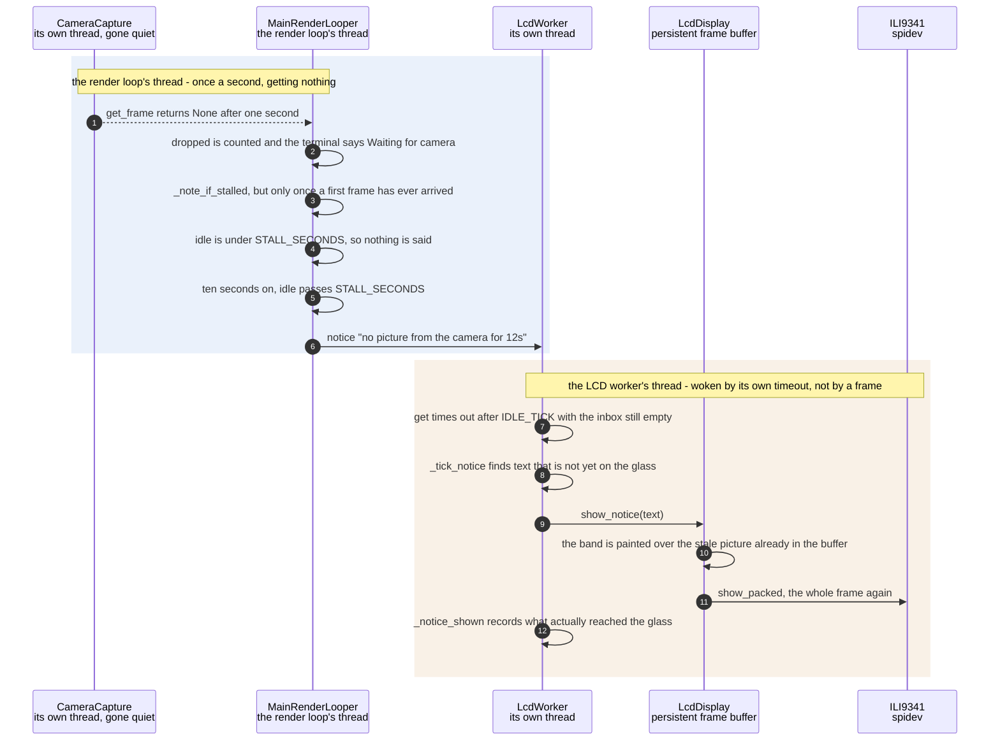

# A camera that stopped delivering frames is detected and announced

**Priority: `MEDIUM`** — it runs only when something has already gone wrong, but it is the difference between a fault a person can see and one they cannot. [What the priorities mean](../how-to-write-scenario-docs.md).

One morning an OOM[^oom] storm killed the desktop session, the camera stopped
delivering at 09:20, and the app carried on redrawing its last good frame for
**ninety-five minutes**. Every check said healthy: the render loop answered
the command socket[^socket] in 1.4 seconds, the process was up, the
panel[^panel] was showing a picture. It was showing the same picture it had
shown at 09:20.

That is what this collaboration exists to prevent, and the value is entirely in
the sealed box. A frozen picture and a working camera are indistinguishable by
eye — there is no clock in the corner and no frame counter — so the one output
the enclosure has must be able to admit that it has nothing new to show.
Anywhere else you could check a log. Here, the glass is the whole interface.

Two constants carry the judgement, and both are chosen against the *normal*
case rather than the broken one. [`STALL_SECONDS`](../../ascii_camera.py#L86)
is ten because the capture thread caps its own rate, so a second of silence is
ordinary and ten is not. [`STALL_REPEAT`](../../ascii_camera.py#L90) is thirty
because a notice[^notice] expires after four, and a fault lasting an hour must
not be announced once and then hidden by the very picture that is wrong. The
message is re-said while it stays true.

The awkward part is that this is precisely the case with **no frame to carry
the message**. Every other thing the panel says rides along with a picture; this
one cannot, because the absence of pictures is the news. So the panel's worker
has to be able to paint on its own clock, and that is what its idle timeout is
for.

| Class | What it represents, and its part in this scenario |
|---|---|
| [`MainRenderLooper`](../../ascii_camera.py#L98) | The one object the process is hung off. Here it is the **witness**: [`_next_frame`](../../ascii_camera.py#L690) is the only code that knows a frame did not arrive, and [`_note_if_stalled`](../../ascii_camera.py#L351) is the only code that decides the silence has gone on long enough to mean something |
| [`CameraCapture`](../../src/capture/camera.py#L61) | The camera and the thread that reads it. Here it is the **silence**, and it reports nothing at all: [`get_frame`](../../src/capture/camera.py#L175) returns `None` and cannot distinguish a camera that died from one that is slow. It is not asked to |
| [`LcdWorker`](../../src/lcd/lcd_worker.py#L61) | A thread with an inbox one frame deep. Here it is the **clock**: with the inbox empty its [`run`](../../src/lcd/lcd_worker.py#L217) loop wakes every [`IDLE_TICK`](../../src/lcd/lcd_worker.py#L43) anyway, and that tick is the only reason anything reaches the glass when no frames do |
| [`LcdDisplay`](../../src/lcd/lcd_display.py#L98) | An ASCII grid[^grid] turned into pixels. Here it is the **band**: [`show_notice`](../../src/lcd/lcd_display.py#L259) paints over whatever is already in the persistent frame buffer and pushes it, so a message can be drawn with no picture behind it |

## Ten seconds of nothing, and what the panel does about it

| Step | Message | What is going on |
|---:|---|---|
| 1 | [`get_frame`](../../src/capture/camera.py#L175) returns None after one second | The camera caps its own rate, so a miss here means it is warming up or has stopped — never that the loop polled too fast. `CameraCapture` is deliberately not asked to tell those apart: it has no idea either |
| 2 | dropped is counted and the terminal says Waiting for camera | [`message`](../../src/hdmi/ncurses_display.py#L282) reaches a terminal, which in the enclosure does not exist. That is the whole reason the rest of this scenario is necessary — the obvious place to put the news is the one place nobody is looking |
| 3 | [`_note_if_stalled`](../../ascii_camera.py#L351), but only once a first frame has ever arrived | Before the first frame there is nothing to conclude: libcamera[^picamera2] takes fifteen to twenty seconds to hand over frame one on this hardware, which is not a stall, it is a Zero 2[^zero2]. The start-up screen[^splash] owns the panel until then and is already saying what is happening |
| 4 | idle is under [`STALL_SECONDS`](../../ascii_camera.py#L86), so nothing is said | Ten seconds, chosen against the normal case: the capture thread paces itself, so one second of silence is ordinary. A threshold set against the *broken* case would either cry wolf or never fire |
| 5 | ten seconds on, idle passes `STALL_SECONDS` | Measured from `_last_frame_at`, which is stamped only when a frame really arrives — so a run of misses accumulates rather than resetting. The counter that matters is time since the last picture, not misses in a row |
| 6 | [`notice`](../../src/lcd/lcd_worker.py#L143) "no picture from the camera for 12s" | Sent through [`_note`](../../ascii_camera.py#L337), which puts it in the status line[^statusline] *and* on the panel. The elapsed figure is in the text on purpose: "no picture" alone cannot be told from a message left over from a minute ago, and this one is re-sent every [`STALL_REPEAT`](../../ascii_camera.py#L90) seconds with a bigger number |
| 7 | get times out after [`IDLE_TICK`](../../src/lcd/lcd_worker.py#L43) with the inbox still empty | The pivot of the whole document. Every other message the panel shows arrives with a frame; this one cannot, because no frames are arriving. The worker's idle timeout is its own clock, and it exists so that the failure with nothing to ride on can still be delivered |
| 8 | [`_tick_notice`](../../src/lcd/lcd_worker.py#L297) finds text that is not yet on the glass | Compared against `_notice_shown` rather than repainted every tick — five times a second of full-frame SPI would be 165 ms of transfer per second spent saying the same thing |
| 9 | [`show_notice`](../../src/lcd/lcd_display.py#L259)`(text)` | Works only because the frame buffer is **persistent**: the band is drawn over whatever pixels are already there, which here is the stale picture. There is nothing else to draw — the last frame is all the panel has |
| 10 | the band is painted over the stale picture already in the buffer | The stale picture stays visible, and that is correct. Blanking it would trade one silent lie for another: an empty panel says the machine is off, when in truth it is running and the camera is not |
| 11 | [`show_packed`](../../src/lcd/lcd.py#L186), the whole frame again | 153,600 bytes for a band a few rows deep, because the panel takes whole frames. At the idle tick that is affordable precisely because nothing else is competing for the SPI bus — there are no frames |
| 12 | `_notice_shown` records what actually reached the glass | The returned text is recorded rather than re-read, because asking twice can give two answers if the notice expires in between — and a record that disagrees with the glass would stop the band ever being cleared once frames resume |

Two threads, and the boundary is crossed once: the loop knows the camera is
silent, and only the worker can draw. Neither waits on the other — the notice
is a value left where the worker will find it on its next tick.

Recovery needs no code of its own. `_last_frame_at` is stamped and
`_stall_noted` cleared the moment a frame arrives, so the message stops being
re-sent, expires four seconds later, and `_tick_notice` takes the band away by
the same route it painted it.

## Related scenarios

- [A capture thread hands the render loop its newest frame through a one-slot queue](a-capture-thread-hands-the-render-loop-its-newest-frame-through-a-one-slot-queue.md)
  — the path that has gone quiet here, and where the one-second timeout comes
  from.
- [A frame reaches the SPI panel without stalling the render loop](a-frame-reaches-the-spi-panel-without-stalling-the-render-loop.md)
  — the ordinary way something reaches the glass, with a frame to carry it.
- [A failure notice is painted over the picture on the SPI panel](a-failure-notice-is-painted-over-the-picture-on-the-spi-panel.md) — the band
  itself, its wrapping and its geometry, drawn in full.
- [A frozen picture is held without redrawing or SPI traffic](a-frozen-picture-is-held-without-redrawing-or-spi-traffic.md) — the *deliberate*
  version of a picture that does not change, and why the two must not look
  alike.

### Footnotes

[^oom]: When Linux runs out of memory it kills something to get some back —
    the **OOM killer**. On a machine with about 416 MB and no swap to speak of
    that is a routine hazard rather than an exotic one, and it does not stop
    the process it did not choose: the app kept running, with its camera
    gone.

[^socket]: A **Unix domain socket** is a file-backed pipe between processes on
    one machine — the same read-and-write as a network socket, with no network.
    [`CommandServer`](../../src/control/command_server.py#L80) listens on one,
    which is how a shell, a phone or a script reaches a running camera without
    the app ever opening a port.

[^panel]: The **SPI panel** is a 2.4 inch ILI9341 LCD, 240x320, wired to the
    Pi's SPI bus — a four-wire serial bus for talking to peripherals — and
    driven from userspace by [`ILI9341`](../../src/lcd/lcd.py#L47) with no
    kernel driver behind it. In the sealed enclosure it is the only display
    there is. One full frame is 153,600 bytes, sent in
    [`SPI_CHUNK`](../../src/lcd/lcd.py#L44) pieces of 4 KB because that is what
    the driver's buffer holds.

[^notice]: A **notice** is a short message painted over the bottom of the
    picture on the panel — two lines in fixed ink over whatever is underneath,
    sized by [`NOTICE_LINES`](../../src/lcd/lcd_display.py#L37). It is how a
    box with no keyboard and no terminal says something went wrong, and it
    covers 36 of the panel's 240 rows.

[^grid]: The **character grid** is the picture as this app holds it: `rows` by
    `cols` character **cells** rather than pixels, each cell one character
    chosen from the brightness of the patch of camera frame it covers.
    [`to_grid`](../../src/capture/image_processor.py#L172) is what resizes a
    plane to it. How big it is depends on where the picture is going — 64 by 24
    on the SPI panel at the default font size, and whatever the window holds on
    the HDMI terminal.

[^picamera2]: The Python library for the Pi's camera stack, with **libcamera**
    — the Linux camera framework it drives — underneath it. It owns the sensor,
    the ISP configuration and the buffers the app reads from, and it is the
    successor to the older `picamera`.

[^zero2]: The Raspberry Pi Zero 2 W: the machine this app is built for and
    deployed on, with about 416 MB of usable RAM and no graphics acceleration
    to call on. Every timing in these documents was measured there.

[^splash]: The **start-up screen** is what the panel shows before the camera
    has produced anything: a name and a moving bar, drawn by
    [`SplashScreen`](../../src/lcd/lcd_splash.py#L55). It exists because
    libcamera takes about twenty seconds to deliver a first frame, and unlit
    glass for twenty seconds is what broken hardware looks like.

[^statusline]: The **status line** is the single line of readouts under the
    picture — scheme, ramp, frame rate, grid size — built by
    [`status_line`](../../src/hdmi/status_line.py#L76). It is also where a
    refusal or a notice is shown on the terminal, since there is nowhere else
    to put one.
