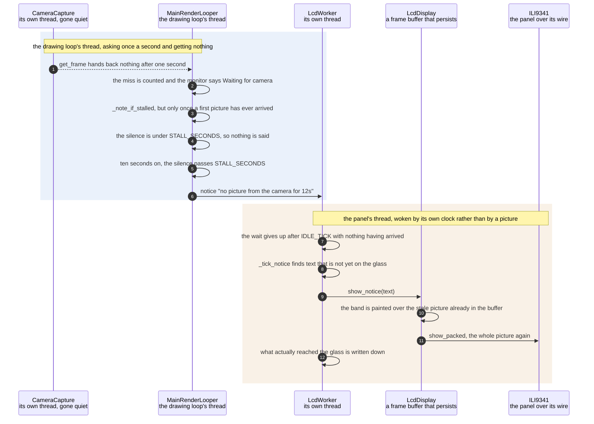

# A camera that stopped delivering frames is detected and announced

**Priority: `MEDIUM`** — it runs only when something has already gone wrong, but it is the difference between a fault somebody can see and one they cannot. [What the priorities mean](../how-to-write-scenario-docs.md).

One morning the computer ran out of memory[^oom] and began killing things off.
The camera stopped supplying pictures at twenty past nine, and the program
carried on redrawing its last good picture for **ninety-five minutes**.

Every way of checking said the program was healthy. It answered a typed command
over its connection[^socket] in 1.4 seconds. The process was running. The small
panel[^panel] was showing a picture. It was showing the same picture it had been
showing at twenty past nine.

Preventing exactly that is what this scenario is for, and the value of it lies
entirely in the sealed box. A frozen picture and a working camera look identical
to a person standing in front of them. There is no clock in the corner and no
counter of pictures. So the one screen the box has must be able to admit that it
has nothing new to show. Anywhere else somebody could read a log file. Here, the
glass is the entire interface.

Two numbers carry the judgement, and both were chosen by thinking about the
*normal* case rather than the broken one.

[`STALL_SECONDS`](../../ascii_camera.py#L87) is ten. The reason is that the
camera's own thread limits its rate to fifteen pictures a second, so a gap of
about a fifteenth of a second is ordinary and even a whole second of silence is
unremarkable. Ten seconds is roughly 150 times the ordinary gap, which cannot
happen by chance. Choosing the number by thinking about the broken case instead
would give either a threshold so short it complains constantly, or one so long
the fault is never reported.

[`STALL_REPEAT`](../../ascii_camera.py#L91) is thirty. That follows from the
fact that a message[^notice] on the panel removes itself after four seconds. A
fault that lasts an hour must not be announced once and then hidden behind the
very picture that is wrong, so the message is said again while it remains true.
Thirty seconds is comfortably longer than the four the message lives for, which
keeps the panel mostly showing the picture, and comfortably short enough that
somebody glancing at the box sees the warning within half a minute.

The awkward part is that this is precisely the situation in which there is **no
picture to carry the message**. Everything else the panel says travels along
with a picture. This one cannot, because the absence of pictures is the news
itself. So the panel's thread has to be able to draw on its own initiative, and
that is exactly what its regular wake-up is for.

| Class | What it represents, and its part in this scenario |
|---|---|
| [`MainRenderLooper`](../../ascii_camera.py#L99) | The single object the whole running program hangs from. In this scenario it is the **witness**. [`_next_frame`](../../ascii_camera.py#L691) is the only code that knows a picture failed to arrive, and [`_note_if_stalled`](../../ascii_camera.py#L352) is the only code that decides the silence has gone on long enough to be worth reporting |
| [`CameraCapture`](../../src/capture/camera.py#L61) | The camera and the thread that reads it. In this scenario it is the **silence**, and it reports nothing at all. [`get_frame`](../../src/capture/camera.py#L175) hands back nothing, and it cannot tell a camera that has died from one that is merely slow. It is never asked to |
| [`LcdWorker`](../../src/lcd/lcd_worker.py#L61) | A thread with a receiving space one picture deep. In this scenario it is the **clock**. With that space empty its [`run`](../../src/lcd/lcd_worker.py#L217) loop still wakes every [`IDLE_TICK`](../../src/lcd/lcd_worker.py#L43), and that regular wake-up is the only reason anything at all can reach the glass when no pictures are arriving |
| [`LcdDisplay`](../../src/lcd/lcd_display.py#L98) | A grid[^grid] of characters turned into coloured dots. In this scenario it is the **band of text**. [`show_notice`](../../src/lcd/lcd_display.py#L259) paints over whatever is already sitting in the frame buffer and sends the result, so a message can be drawn with no fresh picture behind it |

## Ten seconds of nothing, and what the panel does about it

```mermaid
sequenceDiagram
    autonumber
    participant Cam as CameraCapture<br/>its own thread, gone quiet
    participant App as MainRenderLooper<br/>the drawing loop's thread
    participant W as LcdWorker<br/>its own thread
    participant Disp as LcdDisplay<br/>a frame buffer that persists
    participant Panel as ILI9341<br/>the panel over its wire

    rect rgba(80, 140, 220, 0.12)
        note over Cam, App: the drawing loop's thread, asking once a second and getting nothing
        Cam-->>App: get_frame hands back nothing after one second
        App->>App: the miss is counted and the monitor says Waiting for camera
        App->>App: _note_if_stalled, but only once a first picture has ever arrived
        App->>App: the silence is under STALL_SECONDS, so nothing is said
        App->>App: ten seconds on, the silence passes STALL_SECONDS
        App->>W: notice "no picture from the camera for 12s"
    end
    rect rgba(200, 140, 60, 0.12)
        note over W, Panel: the panel's thread, woken by its own clock rather than by a picture
        W->>W: the wait gives up after IDLE_TICK with nothing having arrived
        W->>W: _tick_notice finds text that is not yet on the glass
        W->>Disp: show_notice(text)
        Disp->>Disp: the band is painted over the stale picture already in the buffer
        Disp->>Panel: show_packed, the whole picture again
        W->>W: what actually reached the glass is written down
    end
```

| Step | Message | What is going on |
|---:|---|---|
| 1 | [`get_frame`](../../src/capture/camera.py#L175) hands back nothing after one second | The camera limits its own rate, so a miss here means it is either warming up or has stopped. It can never mean the loop simply asked too quickly. The camera code is deliberately not asked to tell those two apart, because it has no way of knowing either |
| 2 | the miss is counted and the monitor says Waiting for camera | [`message`](../../src/hdmi/ncurses_display.py#L282) reaches a monitor, which inside the sealed box does not exist. That is the entire reason the rest of this scenario is necessary: the obvious place to put the news is the one place where nobody is looking |
| 3 | [`_note_if_stalled`](../../ascii_camera.py#L352), but only once a first picture has ever arrived | Before the first picture there is nothing to conclude. The camera framework[^picamera2] takes fifteen to twenty seconds to hand over the first one on this hardware[^zero2], which is not a fault, it is simply how long it takes. The start-up screen[^splash] owns the panel until then and is already explaining what is happening |
| 4 | the silence is under [`STALL_SECONDS`](../../ascii_camera.py#L87), so nothing is said | Ten seconds, chosen against the ordinary case as described above. A single second of silence is unremarkable and must not produce a warning |
| 5 | ten seconds on, the silence passes `STALL_SECONDS` | Measured from the moment the last real picture arrived, which is written down only when one genuinely does. So a run of misses adds up rather than resetting the clock each time. What matters is the time since the last picture, not how many attempts failed in a row |
| 6 | [`notice`](../../src/lcd/lcd_worker.py#L143) "no picture from the camera for 12s" | Sent by way of [`_note`](../../ascii_camera.py#L338), which puts the text in the status line[^statusline] *and* on the panel. The elapsed time is included in the words on purpose. A message reading only "no picture" cannot be told apart from one left over from a minute ago, whereas a number that keeps growing plainly belongs to now. It is sent again every [`STALL_REPEAT`](../../ascii_camera.py#L91) seconds with a larger number in it |
| 7 | the wait gives up after [`IDLE_TICK`](../../src/lcd/lcd_worker.py#L43) with nothing having arrived | This is the pivot of the whole document. Every other message the panel shows arrives alongside a picture. This one cannot, because no pictures are arriving at all. The panel thread's regular wake-up is its own clock, and it exists precisely so that the one failure with nothing to travel on can still be delivered |
| 8 | [`_tick_notice`](../../src/lcd/lcd_worker.py#L297) finds text that is not yet on the glass | The text is compared against what was last drawn, rather than being redrawn on every wake-up. The wake-up happens five times a second, and each complete send takes about 33 milliseconds, so redrawing blindly would spend 165 milliseconds of every second sending the same unchanged message |
| 9 | [`show_notice`](../../src/lcd/lcd_display.py#L259)`(text)` | This works only because the frame buffer **persists** between uses. The band is drawn over whatever dots are already there, which in this case is the stale picture. There is nothing else available to draw, because the last picture is all the panel has |
| 10 | the band is painted over the stale picture already in the buffer | The stale picture stays visible, and that is the correct choice. Blanking it would swap one silent untruth for another: an empty panel says the machine is switched off, when in fact it is running perfectly and only the camera has stopped |
| 11 | [`show_packed`](../../src/lcd/lcd.py#L186), the whole picture again | All 153,600 bytes, for a band only two lines deep covering 36 of the panel's 240 rows, because the panel accepts nothing smaller than a complete picture. At this rate that is affordable precisely because nothing else wants the wire: there are no camera pictures to send |
| 12 | what actually reached the glass is written down | The text that was drawn is recorded rather than looked up again afterwards. Asking a second time could give a different answer if the message expired in between, and a record that disagreed with the glass would stop the band ever being taken away once pictures resumed |

Two threads are involved and the boundary is crossed once: the drawing loop is
the only part that knows the camera has gone quiet, and the panel's thread is
the only part that can draw. Neither waits for the other. The message is simply
a value left somewhere the panel's thread will find it on its next wake-up.

Recovering needs no code of its own. The moment a picture arrives, the time of
the last picture is written down again and the record of having complained is
cleared. So the message stops being repeated, removes itself four seconds later,
and the same code that painted the band takes it away again by the same route.

## Related scenarios

- [A capture thread hands the render loop its newest frame through a one-slot queue](a-capture-thread-hands-the-render-loop-its-newest-frame-through-a-one-slot-queue.md)
  — the path that has gone quiet here, and where the one-second wait comes from.
- [A frame reaches the SPI panel without stalling the render loop](a-frame-reaches-the-spi-panel-without-stalling-the-render-loop.md)
  — the ordinary way something reaches the glass, with a picture to carry it.
- [A failure notice is painted over the picture on the SPI panel](a-failure-notice-is-painted-over-the-picture-on-the-spi-panel.md)
  — the band itself, how its text is wrapped and how it is positioned, set out
  in full.
- [A frozen picture is held without redrawing or SPI traffic](a-frozen-picture-is-held-without-redrawing-or-spi-traffic.md)
  — the *deliberate* version of a picture that does not change, and why the two
  must never look alike.

### Footnotes

[^oom]: When Linux runs out of memory it kills one of the running programs to
    recover some, and the part that chooses is known as the **out-of-memory
    killer**. On a computer with about 416 megabytes and almost no spare disk
    space set aside for the purpose, that is a routine hazard rather than an
    exotic one. It also does not stop whichever program it did not choose: this
    program carried on running perfectly, with its camera gone.

[^socket]: A **Unix domain socket** is a connection between two programs on the
    same computer, which appears in the file system as though it were a file. It
    behaves like a network connection, with one program writing and another
    reading, except that no network is involved at any point.
    [`CommandServer`](../../src/control/command_server.py#L80) listens on one of
    these, which is how a shell, a phone or another program can reach a running
    camera without the program ever opening a network port.

[^panel]: The **SPI panel** is a small screen measuring 2.4 inches across the
    diagonal, 240 dots by 320, using a controller chip called the ILI9341. It is
    connected to the computer by a simple four-wire arrangement called SPI, which
    is a common way of attaching small devices. It is driven entirely by the
    program itself, through [`ILI9341`](../../src/lcd/lcd.py#L47), with no
    separate system driver involved. In the sealed box this program is built
    for, this panel is the only screen there is. One complete picture for it is
    153,600 bytes, which has to be sent in pieces of 4 kilobytes each — see
    [`SPI_CHUNK`](../../src/lcd/lcd.py#L44) — because that is as much as the
    connection will accept at a time.

[^notice]: A **notice** is a short message painted over the bottom of whatever
    picture is currently on the small panel. It is two lines in a fixed colour,
    laid over the top of the existing picture, and its height is set by
    [`NOTICE_LINES`](../../src/lcd/lcd_display.py#L37). It is how a box with no
    keyboard and no monitor tells somebody that something has gone wrong. It
    covers 36 of the panel's 240 rows of dots.

[^grid]: The **character grid** is how this program holds a picture: as a
    rectangle of character cells rather than of dots. Each cell is one
    character, chosen according to how bright the patch of camera picture behind
    it happens to be. [`to_grid`](../../src/capture/image_processor.py#L172) is
    the code that reduces a picture to that grid. How many cells there are
    depends on where the picture is being sent — 64 across and 24 down on the
    small attached panel at the usual text size, and whatever fits the window
    when the picture goes to an ordinary monitor instead.

[^picamera2]: **picamera2** is the Python library for the Raspberry Pi's camera,
    built on top of a lower-level piece of software called libcamera. It is the
    replacement for an older library that was simply called picamera. It owns
    the camera sensor, the settings given to the camera hardware, and the memory
    that this loop reads its pictures from.

[^zero2]: The **Raspberry Pi Zero 2 W** is the small, inexpensive computer that
    this program is written for and runs on. It has roughly 416 megabytes of
    usable memory and no separate graphics hardware to hand work to. Every
    timing figure quoted in these documents was measured on that machine, which
    is why a single library taking six seconds to load is a fact worth writing
    down.

[^splash]: The **start-up screen** is what the small panel shows before the
    camera has produced anything at all: the program's name, the grid size, a
    short message and a moving bar. It is drawn by
    [`SplashScreen`](../../src/lcd/lcd_splash.py#L55). It exists because the
    camera framework takes about twenty seconds to deliver a first picture, and
    twenty seconds of unlit glass is what broken hardware looks like.

[^statusline]: The **status line** is the single line of readings underneath the
    picture, showing the colour scheme, the ramp, how many pictures a second are
    being drawn, and the size of the grid. It is built by
    [`status_line`](../../src/hdmi/status_line.py#L76). It is also where a
    refusal or a short message appears when the program is running on an
    ordinary monitor, because there is nowhere else on a monitor to put one.
