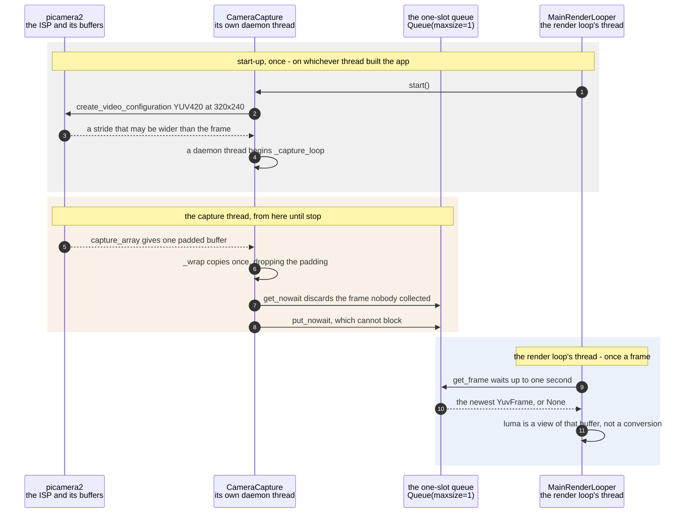

# A capture thread hands the render loop its newest frame through a one-slot queue

**Priority: `HIGH`** — the first step of every frame the app ever draws, twelve times a second, and nothing downstream runs without it. [What the priorities mean](../how-to-write-scenario-docs.md).

The camera runs at its own pace and the render loop runs at its own, and the
two are never the same. The value is that the loop always gets the **newest**
frame rather than the next one in a line: when it falls behind, what it loses
is frames, not currency. A picture that lagged further behind reality the
longer the app ran would be worse than a picture that skipped.

That property is bought by a queue holding exactly one frame, and by the
producer being the one that throws work away. Blocking would be wrong in the
other direction — the capture thread would end up waiting on the renderer, and
the sensor's own timing would start to depend on how expensive the current
colour scheme is. An unbounded queue would be worse still: nothing would ever
be dropped, so a loop running slower than twelve frames a second would
accumulate a backlog it could never clear. So
[`_capture_loop`](../../src/capture/camera.py#L123) takes the old frame out
before putting the new one in, and both operations are the `_nowait` kind that
cannot block.

One copy is made per frame, in [`_wrap`](../../src/capture/camera.py#L151), and
it earns its place twice over. It drops the row padding the ISP may have added
— without which the picture comes out sheared — and it detaches the frame from
the driver's recycled buffers, which is what makes the result safe to hand to
the LCD worker's thread without copying it again. Keeping the chroma planes in
that copy costs 38 KB more than the luma alone at 320x240, and saves a second
copy later when a colour scheme is on.

| Class | What it represents, and its part in this scenario |
|---|---|
| [`CameraCapture`](../../src/capture/camera.py#L61) | The camera and the thread that reads it. Here it is the **producer**, and the only party allowed to discard: [`_capture_loop`](../../src/capture/camera.py#L123) evicts the frame nobody collected before offering a newer one, so the queue's single slot always holds the most recent capture rather than the oldest uncollected one |
| [`YuvFrame`](../../src/capture/camera.py#L22) | One YUV420 frame, exposing its planes as views rather than copies. Here it is the **parcel**: [`luma`](../../src/capture/camera.py#L47) is a slice of the buffer and not a conversion, which is why greyscale costs nothing to extract and why two threads can read one frame at once |
| [`MainRenderLooper`](../../ascii_camera.py#L98) | The one object the process is hung off. Here it is the **consumer**, and a deliberately patient one: [`_next_frame`](../../ascii_camera.py#L690) waits a whole second before concluding anything is wrong, because the camera takes far longer than a frame interval to warm up |

## One frame, from the sensor to the loop

| Step | Message | What is going on |
|---:|---|---|
| 1 | [`start`](../../src/capture/camera.py#L82)`()` | `picamera2` is imported *here* rather than at module scope because on a Zero 2 that import alone costs about six seconds — by far the largest single delay before anything reaches the SPI panel, and nothing above this line needs it. The LCD's own dependencies cost 1.1 s by comparison |
| 2 | create_video_configuration YUV420 at 320x240 | YUV420 is the sensor pipeline's native video format, so asking for it avoids a conversion inside the ISP as well as one here. The size is the smallest that still feeds the character grid: the ISP does the downscale in hardware, which is far cheaper than doing it on this CPU |
| 3 | a stride that may be wider than the frame | The ISP is free to pad each row out to a hardware-friendly width. It is read back rather than assumed, and it is the reason a copy exists at all — a buffer used at its stride rather than its width produces a sheared picture |
| 4 | a daemon thread begins [`_capture_loop`](../../src/capture/camera.py#L123) | Daemon, so a wedged capture cannot keep the process alive after everything else has stopped. From here the two threads never synchronise again except through the queue's single slot |
| 5 | capture_array gives one padded buffer | The driver hands back a buffer it intends to recycle. Anything held onto beyond this call without copying would be overwritten underneath the reader, which is the second reason for the copy in the next step |
| 6 | [`_wrap`](../../src/capture/camera.py#L151) copies once, dropping the padding | One `ascontiguousarray` does both jobs — padding gone, buffer detached — and it is the only copy in the path. Keeping the chroma planes in it costs 38 KB more than the luma alone at 320x240, and saves a second copy later when a colour scheme is on. A short frame is dropped here rather than reshaped into nonsense |
| 7 | get_nowait discards the frame nobody collected | The producer throws away, which is the whole design. Dropping is silent and deliberate: what the consumer wants is the newest frame, and a frame that has been overtaken has no value left in it |
| 8 | put_nowait, which cannot block | Paired with the eviction above rather than trusted on its own — `Full` is still caught, because between the two calls the consumer may have taken the slot. Neither call can stall the capture thread, so the sensor's timing never comes to depend on how expensive the current scheme is |
| 9 | [`get_frame`](../../src/capture/camera.py#L175) waits up to one second | A whole second, where the default is half of one, because the camera takes far longer than a frame interval to deliver its first frame. A shorter wait would report a stall during ordinary warm-up |
| 10 | the newest YuvFrame, or None | `None` means nothing arrived in a second, and the loop treats it as *possibly* stalled rather than certainly broken — it continues, and only says something once the silence persists |
| 11 | [`luma`](../../src/capture/camera.py#L47) is a view of that buffer, not a conversion | The Y plane of YUV420 already *is* an 8-bit greyscale image, so greyscale mode needs no YUV to RGB to grey round trip. This is the property that makes the whole pipeline cheap enough to run at all, and it is a slice rather than a call |

The one-slot queue is the standard library's `Queue`, not a class of this app,
which is why it has no cast row of its own — but it is named in the diagram
because it *is* the collaboration. Everything above turns on the fact that it
holds exactly one thing.

The same `YuvFrame` object is handed to the LCD worker's thread by
[`submit`](../../src/lcd/lcd_worker.py#L173) without being copied again, and
that is safe for exactly the reason established here: the frame was detached
from the driver's buffers in the copy, and every reader only ever reads.

## Related scenarios

- [A frame reaches the SPI panel without stalling the render loop](a-frame-reaches-the-spi-panel-without-stalling-the-render-loop.md)
  — the other thread boundary, and the second reader of the frame this
  scenario delivers.
- [Pixel brightness is mapped to ramp characters](pixel-brightness-is-mapped-to-ramp-characters.md)
  — what the render loop does with the frame once it has one.
- [One YUV420 capture carries greyscale and colour without converting either](one-yuv420-capture-carries-greyscale-and-colour-without-converting-either.md)
  — the plane arithmetic behind `luma` and `chroma`, and how the order of the
  two chroma planes was settled by measurement rather than assumption.
- [A camera that stopped delivering frames is detected and announced](a-camera-that-stopped-delivering-frames-is-detected-and-announced.md) — what
  happens when the answer at the queue is `None` for long enough to mean
  something.
- [The camera, panel, encoder and socket are released on shutdown](the-camera-panel-encoder-and-socket-are-released-on-shutdown.md) — where
  the capture thread is stopped and joined.
