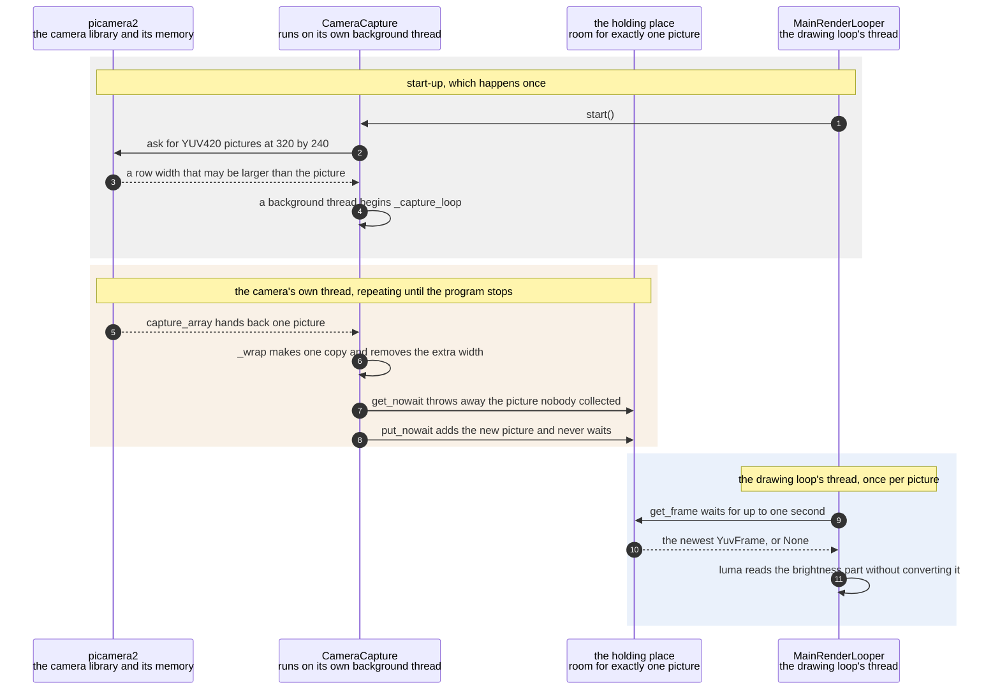

# A capture thread hands the render loop its newest frame through a one-slot queue

**Priority: `HIGH`** — this is the first step of every picture the program ever draws, and it happens fifteen times a second, that being the rate the camera is asked to run at. If this part goes wrong, nothing further along has anything to work with. [What the priorities mean](../how-to-write-scenario-docs.md).

The camera takes pictures at its own steady speed. The part of the program that
draws those pictures on a screen works at its own speed too. These two speeds
are never exactly the same, and neither side can be made to wait for the other.

That difference creates a problem worth thinking about carefully. Suppose the
program kept every picture the camera produced. Whenever the drawing part fell
behind, unused pictures would pile up. The drawing part would then be working
through old pictures while newer ones waited behind them. What you saw on the
screen would show something that had already happened, and the delay would keep
growing for as long as the program ran. A picture that falls further and further
behind reality is worse than one that skips.

So the program does something different. It keeps a holding place that has room
for exactly one picture. When the camera has a new picture ready, the camera
side first removes any picture still sitting in that holding place, and then
puts the new one in. Put another way: an uncollected picture is thrown away as
soon as a fresher one exists. The drawing part therefore always receives the
**newest** picture available, never a queued-up older one. When the drawing part
falls behind, it loses pictures, but what it does show is current.

Two details of the design are worth stating plainly, because both could
reasonably have been done another way.

The first is that the **camera side** is the side that throws pictures away.
That choice keeps the camera running at a constant speed. If the camera side
had to wait for the drawing part to collect a picture, then the camera's timing
would start to depend on how much work the drawing part happened to be doing.
The amount of work varies, because some colour schemes[^scheme] cost more to
draw than others. Making the camera's speed depend on that would be a strange
and hard-to-predict arrangement.

The second is that the holding place is limited to one picture rather than
being allowed to grow. A holding place with no limit would never throw anything
away. That sounds generous, but it produces exactly the growing delay described
above, and it also uses more and more memory as the backlog builds. A limit of
one is what makes the delay stay small and steady.

Finally, the camera side makes one copy of each picture, and that single copy
does two useful jobs at once. It removes any unused space at the end of each row
of the picture, which the camera hardware[^isp] is allowed to add and which would
otherwise make the picture come out slanted. It also disconnects the picture from
the memory the camera driver reuses, so the driver cannot overwrite the picture
while something else is still reading it. Because the copy has already done that
second job, the same picture can safely be handed to the separate part of the
program that drives the small attached screen[^lcd], with no further copying.

| Class | What it represents, and its part in this scenario |
|---|---|
| [`CameraCapture`](../../src/capture/camera.py#L61) | The camera, together with the separate thread[^thread] of work that reads pictures from it. In this scenario it is the **supplier**, and it is the only party permitted to throw a picture away. [`_capture_loop`](../../src/capture/camera.py#L123) removes the picture nobody collected before offering a newer one, so the single space always holds the most recent picture rather than the oldest unclaimed one |
| [`YuvFrame`](../../src/capture/camera.py#L22) | One picture from the camera, stored in a format that keeps brightness and colour separately[^yuv]. In this scenario it is the **parcel** being handed over. It offers its brightness and colour parts as views[^view] rather than as copies, so [`luma`](../../src/capture/camera.py#L47) is simply a way of looking at part of the existing memory. Nothing is converted and nothing is duplicated, which is why two threads can read one picture at the same time |
| [`MainRenderLooper`](../../ascii_camera.py#L99) | The single object that the whole running program hangs from. In this scenario it is the **collector**, and a deliberately patient one. [`_next_frame`](../../ascii_camera.py#L691) is willing to wait a full second before deciding that something has gone wrong, because a camera takes much longer than the gap between two pictures to warm up when the program first starts |

## One picture, from the camera to the drawing loop

```mermaid
sequenceDiagram
    autonumber
    participant Pi as picamera2<br/>the camera library and its memory
    participant Cam as CameraCapture<br/>runs on its own background thread
    participant Q as the holding place<br/>room for exactly one picture
    participant App as MainRenderLooper<br/>the drawing loop's thread

    rect rgba(128, 128, 128, 0.12)
        note over Pi, App: start-up, which happens once
        App->>Cam: start()
        Cam->>Pi: ask for YUV420 pictures at 320 by 240
        Pi-->>Cam: a row width that may be larger than the picture
        Cam->>Cam: a background thread begins _capture_loop
    end
    rect rgba(200, 140, 60, 0.12)
        note over Pi, Q: the camera's own thread, repeating until the program stops
        Pi-->>Cam: capture_array hands back one picture
        Cam->>Cam: _wrap makes one copy and removes the extra width
        Cam->>Q: get_nowait throws away the picture nobody collected
        Cam->>Q: put_nowait adds the new picture and never waits
    end
    rect rgba(80, 140, 220, 0.12)
        note over App: the drawing loop's thread, once per picture
        App->>Q: get_frame waits for up to one second
        Q-->>App: the newest YuvFrame, or None
        App->>App: luma reads the brightness part without converting it
    end
```

| Step | Message | What is going on |
|---:|---|---|
| 1 | [`start`](../../src/capture/camera.py#L82)`()` | The camera library[^picamera2] is loaded at this moment, rather than when the program first begins. The reason is speed. On the small computer this program runs on[^zero2], simply loading that library takes about six seconds. That is the single longest delay before anything appears on the attached screen, and nothing before this point needs the library at all. For comparison, everything the small screen needs takes about 1.1 seconds to load |
| 2 | ask for YUV420 pictures at 320 by 240 | This step calls `create_video_configuration`. YUV420 is the format the camera hardware already produces, so asking for it avoids converting the picture twice: once inside the camera hardware and once afterwards in the program. The size asked for is 320 dots by 240. Those numbers are set in [`CameraCapture`](../../src/capture/camera.py#L61) and can be overridden on the command line, but they were not chosen arbitrarily. They are the smallest size still comfortably larger than the biggest grid of characters[^grid] the program will ever draw. Smaller would discard detail the grid could have used, and larger would pay for detail that is thrown away again moments later. Asking the camera hardware to do the shrinking costs this computer nothing, whereas shrinking afterwards in the program is slow, so it is worth asking for a small picture at the outset |
| 3 | a row width that may be larger than the picture | The camera hardware is allowed to leave unused space at the end of each row, so that every row begins at a memory position it finds convenient. The distance from the start of one row to the start of the next is called the stride[^stride]. The program reads that distance back from the camera rather than assuming it, and this is the reason a copy is needed at all. Using a picture at its stride when its true width is narrower produces a slanted image |
| 4 | a background thread begins [`_capture_loop`](../../src/capture/camera.py#L123) | The thread is created as a daemon thread[^daemon], which means the program will not wait for it before shutting down. From this moment on, the camera's thread and the drawing loop's thread never coordinate with each other again except through the single holding place |
| 5 | capture_array hands back one picture | The camera driver hands over a piece of memory that it fully intends to use again for a later picture. Anything that held onto that memory without copying it would find the contents changing underneath it. This is the second of the two reasons the next step makes a copy |
| 6 | [`_wrap`](../../src/capture/camera.py#L151) makes one copy and removes the extra width | A single call to `ascontiguousarray`[^contig] does both jobs at once. The unused space at the end of each row is removed, and the picture is disconnected from the driver's reusable memory. This is the only copy anywhere in this path. The copy keeps the colour information as well as the brightness. That costs an extra 38 kilobytes, which is arrived at as follows: each of the two colour parts holds a quarter as many values as the brightness part's 76,800, so 19,200 bytes each, and two of those together come to 38,400. In exchange it saves making a second copy later on whenever a colour scheme is being used. If a picture arrives shorter than expected, it is discarded here rather than being forced into the wrong shape |
| 7 | get_nowait throws away the picture nobody collected | This is the design in one line: the side that makes pictures is the side that throws them away. Discarding is silent and entirely intended. What the drawing loop wants is the newest picture, and a picture that has already been overtaken by a newer one has no value left in it |
| 8 | put_nowait adds the new picture and never waits | This step is paired with the removal in the previous step rather than trusted by itself. The program still checks for the holding place being full, because in the short gap between the two steps the drawing loop may have taken the picture for itself. Neither step can ever make the camera's thread wait[^queue], which is what keeps the camera's timing independent of how much work the drawing loop is doing |
| 9 | [`get_frame`](../../src/capture/camera.py#L175) waits for up to one second | One full second, where the ordinary setting is half of one. The reason for the longer wait is the warm-up. At fifteen pictures a second the gap between one picture and the next is about 67 milliseconds, but the camera takes something closer to fifteen or twenty seconds to deliver its very first picture after the program starts. A shorter wait would report a fault during what is really just normal warming up |
| 10 | the newest YuvFrame, or None | A result of `None` means nothing arrived within the second. The drawing loop treats that as *possibly* stalled rather than certainly broken. It carries on, and only reports a problem once the silence has lasted long enough to mean something |
| 11 | [`luma`](../../src/capture/camera.py#L47) reads the brightness part without converting it | In the YUV420 format, the brightness part on its own is already an ordinary greyscale image. Nothing has to be calculated to obtain it. That is why drawing in grey costs the program almost nothing, and it is the single property that makes this whole pipeline cheap enough to run on this computer at all |

The holding place is a `Queue` from Python's own standard library rather than
anything written for this program, which is why it has no row of its own in the
table of classes above. It is still named in the diagram, because the way it
behaves *is* the collaboration being described. Everything in this scenario
follows from the single fact that it holds exactly one picture.

It is worth being clear about which parts of this work happen at the same time.
Three coloured bands appear in the diagram, and each marks a different thread.
The camera's thread and the drawing loop's thread run independently of one
another, and the only thing they share is the holding place in the middle.

The same `YuvFrame` object is later handed to the thread that drives the small
attached screen, by [`submit`](../../src/lcd/lcd_worker.py#L173), and it is not
copied again on the way. That is safe for exactly the reason established here.
The picture was disconnected from the camera driver's reusable memory back at
the copy, and from that point onwards every part of the program that touches it
only ever reads it. Nothing writes to it, so any number of readers can look at
it at once.

## Related scenarios

- [A frame reaches the SPI panel without stalling the render loop](a-frame-reaches-the-spi-panel-without-stalling-the-render-loop.md)
  — the other place where work crosses from one thread to another, and the
  second reader of the very picture this scenario delivers.
- [Pixel brightness is mapped to ramp characters](pixel-brightness-is-mapped-to-ramp-characters.md)
  — what the drawing loop actually does with a picture once it has collected
  one.
- [One YUV420 capture carries greyscale and colour without converting either](one-yuv420-capture-carries-greyscale-and-colour-without-converting-either.md)
  — how the brightness and colour parts are laid out inside the single piece of
  memory, and how the order of the two colour parts was settled by measuring
  rather than by assuming.
- [A camera that stopped delivering frames is detected and announced](a-camera-that-stopped-delivering-frames-is-detected-and-announced.md)
  — what happens when the answer at the holding place is `None` for long enough
  to mean the camera has genuinely stopped.
- [The camera, panel, encoder and socket are released on shutdown](the-camera-panel-encoder-and-socket-are-released-on-shutdown.md)
  — where the camera's thread is asked to stop, and waited for.

### Footnotes

[^scheme]: A **colour scheme** is one of the nine named looks listed in
    [`SCHEMES`](../../src/art/palettes.py#L79). Which one is currently in use is
    part of the program's render configuration, and the knob, a key press or a
    typed command can all change it. The scheme called `grey` is the one the
    program starts with, and it is what the phrase "greyscale mode" refers to:
    characters only, worked out from the brightness part of the picture and
    nothing else. Only the scheme called `live` reads the colour parts, through
    [`colour_grid`](../../src/capture/image_processor.py#L187). The remaining
    seven are tints, such as green phosphor, amber CRT and e-ink on paper. A
    tint recolours the same greyscale picture using two fixed colours, so it
    never looks at the colour parts either.

[^isp]: **Image signal processor**, usually shortened to those three words'
    initials. It is a piece of fixed-purpose hardware sitting between the camera
    sensor and the computer's memory. Its job is to turn the sensor's raw
    output into a finished picture in a named format, and it can resize the
    picture on the way through. Asking it for a 320 by 240 YUV420 picture in
    [`start`](../../src/capture/camera.py#L82) costs this computer's main
    processor nothing at all, which is why both the size and the format are
    settled there rather than being adjusted afterwards. The unused space at the
    end of each row, described below, is also this hardware's doing.

[^lcd]: The **LCD worker** is the part of the program, represented by the class
    [`LcdWorker`](../../src/lcd/lcd_worker.py#L61), that owns the second screen.
    That screen is a small panel measuring 2.4 inches across the diagonal, 240
    by 320 dots, connected by a simple wiring arrangement called SPI. In the
    sealed box this program is built for, that small panel is the only screen
    there is. It is given a thread of its own because sending one picture down
    the wire to it takes about 33 milliseconds, and the drawing loop must not
    spend that time waiting.

[^thread]: A **thread** is a separate line of work inside one running program.
    Several threads can be making progress at what appears to be the same time,
    and each keeps its own place in its own instructions. Two threads matter in
    this scenario: one belongs to the camera and does nothing but collect
    pictures, and one belongs to the drawing loop. Giving the camera its own
    thread means the drawing loop never has to stop and wait for a picture to
    arrive.

[^yuv]: **YUV420** is a way of storing a picture that keeps brightness and
    colour separately, instead of storing a colour for every dot. The brightness
    part, called the luma, holds one brightness value for every dot in the
    picture. The two colour parts, called the chroma, hold colour information at
    half the detail across and half the detail down, so each of them holds a
    quarter as many values as the brightness part does. All three parts arrive
    together in one piece of memory: the brightness first, then the two colour
    parts packed in after it. That arrangement is what
    [`chroma`](../../src/capture/camera.py#L51) knows how to take apart. At 320
    by 240 the brightness part is 76,800 bytes and the two colour parts together
    are 38,400 bytes.

[^view]: A **view** is a second way of looking at memory that already exists,
    rather than a copy of it. When the program takes the brightness part out of
    a picture using [`luma`](../../src/capture/camera.py#L47), no bytes are
    copied and no new memory is used. This is also the reason every part of this
    scenario only ever reads. Several views of one piece of memory are perfectly
    safe to share between threads, for exactly as long as nothing writes through
    any of them.

[^picamera2]: **picamera2** is the Python library for the Raspberry Pi's camera,
    built on top of a lower-level piece of software called libcamera. It is the
    replacement for an older library that was simply called picamera. It owns
    the camera sensor, the settings given to the camera hardware, and the memory
    that this loop reads its pictures from.

[^zero2]: The **Raspberry Pi Zero 2 W** is the small, inexpensive computer that
    this program is written for and runs on. It has roughly 416 megabytes of
    usable memory and no separate graphics hardware to hand work to. Every
    timing figure quoted in these documents was measured on that machine, which
    is why a single library taking six seconds to load is a fact worth writing
    down.

[^grid]: The **character grid** is how this program holds a picture: as a
    rectangle of character cells rather than of dots. Each cell is one
    character, chosen according to how bright the patch of camera picture behind
    it happens to be. [`to_grid`](../../src/capture/image_processor.py#L172) is
    the code that reduces a picture to that grid. How many cells there are
    depends on where the picture is being sent — 64 across and 24 down on the
    small attached panel at the usual text size, and whatever fits the window
    when the picture goes to an ordinary monitor instead.

[^stride]: The **stride** is the distance, measured in bytes, from the start of
    one row of a picture to the start of the next row. It can be larger than a
    row of picture actually needs, because the hardware sometimes prefers each
    row to begin at a convenient position in memory. The program reads this
    distance back from the camera's own settings rather than assuming it. On
    this particular computer at 320 by 240 the distance comes back exactly equal
    to the width, which the running program records in its log as
    `Camera started: 320x240 stride=320 @ 15 fps`. So in the arrangement
    actually deployed there is no unused space to remove, and the trimming step
    inside [`_wrap`](../../src/capture/camera.py#L151) is protection against a
    picture size where there would be.

[^daemon]: A **daemon thread** is a Python setting on a thread, and it has
    nothing to do with the background programs that the word daemon describes
    elsewhere in computing. It means the program will not wait for that thread
    to finish before shutting down. Without this setting, a camera thread that
    became stuck waiting for a picture would keep the whole program alive after
    everything else had already stopped.

[^contig]: **`ascontiguousarray`** is a numpy function that returns a version of
    an array whose rows sit directly end to end in memory with no gaps between
    them. It copies the data only when the array it was given is not already
    arranged that way. A picture taken from rows with unused space at the end is
    not arranged that way, so it is copied. A picture whose rows never had unused
    space already is, so it is handed back untouched.

[^queue]: A **queue** here means `queue.Queue`, a standard Python tool for
    passing objects safely from one thread to another. It is the only thing the
    two threads in this scenario share. Its ordinary `get` and `put` operations
    will wait when the queue is empty or full. The variants named `get_nowait`
    and `put_nowait` refuse to wait, and report a problem straight away instead,
    which [`_capture_loop`](../../src/capture/camera.py#L123) then handles. That
    refusal to wait is what the phrase "never waits" means in this document: the
    camera's timing can never come to depend on the drawing loop's.
