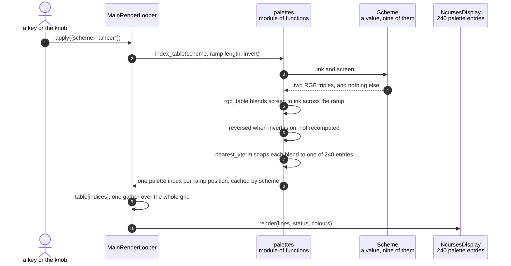

# A colour scheme is compiled into a per-cell lookup table

**Priority: `MEDIUM`** — it runs once per scheme change rather than per frame, and it is what makes seven of the nine schemes cost nothing to draw. [What the priorities mean](../how-to-write-scenario-docs.md).

Seven of the nine schemes are **tints**: amber on near-black, green on
near-black, dark blue on white. A tinted picture is not one colour — a dense
character is drawn at full ink and a sparse one nearly at the screen colour, so
the glyph's own coverage does the shading. That could be arithmetic per cell on
every frame. Instead it is a table of one colour per ramp position, computed
once when the scheme changes and then applied to a whole frame in a single
array gather.

The table has to exist twice, because the two displays cannot use the same
answer. The panel takes RGB directly. The terminal has no RGB at all: it has a
6x6x6 colour cube and a grey ramp, 240 usable entries, so every blend has to be
snapped to the nearest one. Both tables are built from one blend and both are
cached, which is why changing scheme is a keystroke rather than a pause.

The snapping is lossy in a way worth seeing. Amber over a ten-character ramp
compiles to palette indices `232, 234, 236, 58, 94, 94, 136, 172, 178, 215` —
**94 twice**, because two adjacent steps of the blend land nearer to each other
than to any other entry the terminal has. The panel draws those two steps as
distinct colours and the terminal cannot. That is not a bug to fix; it is what
the terminal is.

`invert` is the case that makes the table's shape matter. Reversing the ramp
means a high position now draws a *sparse* glyph, so it must take the screen
end of the blend rather than the ink end. The table is reversed rather than the
blend recomputed, which keeps one definition of what the scheme looks like.

| Class | What it represents, and its part in this scenario |
|---|---|
| [`Scheme`](../../src/art/palettes.py#L69) | One display's whole appearance as a value: lit ink, unlit screen, and which of three kinds it is. Here it is the **definition**, and it has no behaviour — being a plain value is what lets the [nine of them](../../src/art/palettes.py#L79) be a list the knob walks |
| [`palettes`](../../src/art/palettes.py) | A module of functions rather than a class. Here it is the **compiler**: [`rgb_table`](../../src/art/palettes.py#L128) turns a scheme into one colour per ramp position, and [`index_table`](../../src/art/palettes.py#L156) turns that into what a terminal can actually show |
| [`NcursesDisplay`](../../src/hdmi/ncurses_display.py#L34) | The HDMI terminal. Here it is the **constrained consumer**: it can only be given palette indices, so the blend must be snapped to the 240 entries it has |
| [`LcdDisplay`](../../src/lcd/lcd_display.py#L98) | The SPI panel's pixels. Here it is the **unconstrained one**: it takes the RGB table as it is, and blends it against glyph coverage at full depth |

## One scheme, compiled once and gathered per frame

| Step | Message | What is going on |
|---:|---|---|
| 1 | apply({scheme: "amber"}) | Arrives from a key, the knob, a typed line or the model — by the time it is here, nothing says which. A scheme change is the most expensive setting to apply, because [`_adopt`](../../ascii_camera.py#L282) ends it with a repaint of every cell |
| 2 | [`index_table`](../../src/art/palettes.py#L156)`(scheme, ramp length, invert)` | The ramp's *length* rather than its characters: a blend has one entry per position, and which glyph sits at that position is not this module's business |
| 3 | ink and screen | The whole of what a scheme contributes here. `Scheme` has no method that computes anything, which is what lets a new one be added to `palettes.py` as a single line |
| 4 | two RGB triples, and nothing else | Amber is ink `(255, 183, 51)` on screen `(26, 13, 0)`. The `kind` field decides whether this path runs at all — `grey` skips it and `live` reads the chroma instead |
| 5 | [`rgb_table`](../../src/art/palettes.py#L128) blends screen to ink across the ramp | A straight interpolation, so position 0 is exactly the screen colour and the last position exactly the ink. Both ends being exact matters: the darkest cell must match the background it sits on, or the picture shows a grid of faint squares |
| 6 | reversed when invert is on, not recomputed | With the ramp reversed a high position draws a sparse glyph, so it needs the screen end. Reversing the finished table keeps one statement of what the scheme looks like, rather than a second blend that has to agree with the first |
| 7 | [`nearest_xterm`](../../src/art/palettes.py#L117) snaps each blend to one of 240 entries | Searched by distance over the whole palette — cube and grey ramp alike — rather than by cube arithmetic, because a near-black amber is closer to a grey-ramp entry than to anything in the cube. Affordable precisely because it happens once per scheme |
| 8 | one palette index per ramp position, cached by scheme | Cached on scheme, ramp length and invert together. Amber over ten positions gives `232, 234, 236, 58, 94, 94, 136, 172, 178, 215` — 94 twice, because the terminal has no entry between those two steps of the blend |
| 9 | table[indices], one gather over the whole grid | The per-frame cost of a tinted scheme, and all of it: the ramp positions are already in hand from [`to_indices`](../../src/art/ascii_art.py#L195), so colouring a frame is one array index |
| 10 | [`render`](../../src/hdmi/ncurses_display.py#L185)`(lines, status, colours)` | The terminal draws each row as coloured runs rather than per character, which is what keeps a 267-column row affordable |

No thread bands: this is the render loop's own thread. The panel builds the
same blend on its own thread through [`rgb_table`](../../src/art/palettes.py#L128)
and never snaps it, because it has no palette to snap to — the two displays
share the definition and diverge exactly at the point where the hardware does.

## Related scenarios

- [Pixel brightness is mapped to ramp characters](pixel-brightness-is-mapped-to-ramp-characters.md)
  — where the ramp positions this table is indexed by come from.
- [The chroma planes give each character cell its colour](the-chroma-planes-give-each-character-cell-its-colour.md)
  — what the live scheme does instead, which reads the camera rather than a
  table.
- [A rotary encoder detent changes the colour scheme](a-rotary-encoder-detent-changes-the-colour-scheme.md)
  — the route that asks for a new scheme, and why a banked spin is applied as
  one move given what a change costs.
- [The character grid is drawn on the HDMI terminal](the-character-grid-is-drawn-on-the-hdmi-terminal.md)
  — what the terminal does with the indices this produces.
