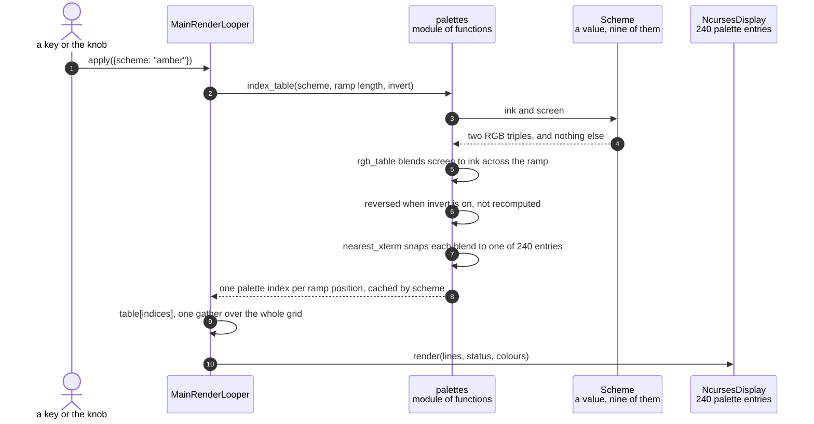

# A colour scheme is compiled into a per-cell lookup table

**Priority: `MEDIUM`** — it runs once per scheme[^scheme] change rather than per frame, and it is what makes seven of the nine schemes cost nothing to draw. [What the priorities mean](../how-to-write-scenario-docs.md).

Seven of the nine schemes are **tints**: amber on near-black, green on
near-black, dark blue on white. A tinted picture is not one colour — a dense
character is drawn at full ink and a sparse one nearly at the screen colour,
so the glyph's own coverage[^coverage] does the shading. That could be
arithmetic per cell on every frame. Instead it is a table of one colour per
ramp[^ramp] position, computed once when the scheme changes and then applied
to a whole frame in a single array gather.

The table has to exist twice, because the two displays cannot use the same
answer. The panel[^panel] takes RGB directly. The terminal has no RGB at all:
it has a 6x6x6 colour cube and a grey ramp, 240 usable entries, so every blend
has to be snapped to the nearest one. Both tables are built from one blend and
both are cached, which is why changing scheme is a keystroke rather than a
pause.

The snapping is lossy in a way worth seeing. Amber over a ten-character ramp
compiles to palette[^xterm] indices `232, 234, 236, 58, 94, 94, 136, 172, 178,
215` — **94 twice**, because two adjacent steps of the blend land nearer to
each other than to any other entry the terminal has. The panel draws those two
steps as distinct colours and the terminal cannot. That is not a bug to fix;
it is what the terminal is.

`invert`[^invert] is the case that makes the table's shape matter. Reversing
the ramp means a high position now draws a *sparse* glyph, so it must take the
screen end of the blend rather than the ink end. The table is reversed rather
than the blend recomputed, which keeps one definition of what the scheme looks
like.

*The lossiness is the thing worth seeing rather than reading. The blend above
has ten distinct colours and the panel draws all ten; the row below has nine,
because two adjacent steps land nearer to each other than to any entry the
terminal owns. Every colour in the figure is what the code produces —
`index_table` for the amber scheme over ten positions really does return
`232, 234, 236, 58, 94, 94, 136, 172, 178, 215`.*

Kept by hand: edit
[`scheme-compiled-twice.svg`](../images/scheme-compiled-twice.svg) directly,
since nothing regenerates it.

| Class | What it represents, and its part in this scenario |
|---|---|
| [`Scheme`](../../src/art/palettes.py#L69) | One display's whole appearance as a value: lit ink, unlit screen, and which of three kinds it is. Here it is the **definition**, and it has no behaviour — being a plain value is what lets the [nine of them](../../src/art/palettes.py#L79) be a list the knob[^detent] walks |
| [`palettes`](../../src/art/palettes.py) | A module of functions rather than a class. Here it is the **compiler**: [`rgb_table`](../../src/art/palettes.py#L128) turns a scheme into one colour per ramp position, and [`index_table`](../../src/art/palettes.py#L156) turns that into what a terminal can actually show |
| [`NcursesDisplay`](../../src/hdmi/ncurses_display.py#L34) | The HDMI terminal. Here it is the **constrained consumer**: it can only be given palette indices, so the blend must be snapped to the 240 entries it has |
| [`LcdDisplay`](../../src/lcd/lcd_display.py#L98) | The SPI panel's pixels. Here it is the **unconstrained one**: it takes the RGB table as it is, and blends it against glyph coverage at full depth |

## One scheme, compiled once and gathered per frame

| Step | Message | What is going on |
|---:|---|---|
| 1 | apply({scheme: "amber"}) | Arrives from a key, the knob, a typed line or the model — by the time it is here, nothing says which. A scheme change is the most expensive setting to apply, because [`_adopt`](../../ascii_camera.py#L282) ends it with a repaint of every cell |
| 2 | [`index_table`](../../src/art/palettes.py#L156)`(scheme, ramp length, invert)` | The ramp's *length* rather than its characters: a blend has one entry per position, and which glyph sits at that position is not this module's business |
| 3 | ink and screen | The whole of what a scheme contributes here. `Scheme` has no method that computes anything, which is what lets a new one be added to `palettes.py` as a single line |
| 4 | two RGB triples, and nothing else | Amber is ink `(255, 183, 51)` on screen `(26, 13, 0)`. The `kind` field decides whether this path runs at all — `grey` skips it and `live` reads the chroma[^yuv] instead |
| 5 | [`rgb_table`](../../src/art/palettes.py#L128) blends screen to ink across the ramp | A straight interpolation, so position 0 is exactly the screen colour and the last position exactly the ink. Both ends being exact matters: the darkest cell must match the background it sits on, or the picture shows a grid of faint squares |
| 6 | reversed when invert is on, not recomputed | With the ramp reversed a high position draws a sparse glyph, so it needs the screen end. Reversing the finished table keeps one statement of what the scheme looks like, rather than a second blend that has to agree with the first |
| 7 | [`nearest_xterm`](../../src/art/palettes.py#L117) snaps each blend to one of 240 entries | Searched by distance over the whole palette — cube and grey ramp alike — rather than by cube arithmetic, because a near-black amber is closer to a grey-ramp entry than to anything in the cube. Affordable precisely because it happens once per scheme |
| 8 | one palette index per ramp position, cached by scheme | Cached on scheme, ramp length and invert together. Amber over ten positions gives `232, 234, 236, 58, 94, 94, 136, 172, 178, 215` — 94 twice, because the terminal has no entry between those two steps of the blend |
| 9 | table[indices], one gather over the whole grid | The per-frame cost of a tinted scheme, and all of it: the ramp positions are already in hand from [`to_indices`](../../src/art/ascii_art.py#L195), so colouring a frame is one array index |
| 10 | [`render`](../../src/hdmi/ncurses_display.py#L185)`(lines, status, colours)` | The terminal draws each row as coloured runs rather than per character, which is what keeps a 267-column row affordable |

No thread bands: this is the render loop's own thread. The panel builds the
same blend on its own thread through [`rgb_table`](../../src/art/palettes.py#L128)
and never snaps it, because it has no palette to snap to — the two displays
share the definition and diverge exactly at the point where the hardware does.

## Related scenarios

- [Pixel brightness is mapped to ramp characters](pixel-brightness-is-mapped-to-ramp-characters.md)
  — where the ramp positions this table is indexed by come from.
- [The chroma planes give each character cell its colour](the-chroma-planes-give-each-character-cell-its-colour.md)
  — what the live scheme does instead, which reads the camera rather than a
  table.
- [A rotary encoder detent changes the colour scheme](a-rotary-encoder-detent-changes-the-colour-scheme.md)
  — the route that asks for a new scheme, and why a banked spin is applied as
  one move given what a change costs.
- [The character grid is drawn on the HDMI terminal](the-character-grid-is-drawn-on-the-hdmi-terminal.md)
  — what the terminal does with the indices this produces.

### Footnotes

[^scheme]: A **colour scheme** is one of the nine named looks in
    [`SCHEMES`](../../src/art/palettes.py#L79), and which one is live is part
    of the render configuration. `grey` is the default, and is what "greyscale
    mode" means: characters only, drawn from the luma plane and nothing else.
    `live` is the only scheme that reads the chroma planes, through
    [`colour_grid`](../../src/capture/image_processor.py#L187). The other seven
    are **tints** — green phosphor, amber CRT, e-ink on paper — which recolour
    the same greyscale picture from two fixed colours.

[^coverage]: **Rasterising** a glyph turns its outline into pixels, and what
    comes out is **coverage**: how much of each pixel the shape actually fills,
    0 to 255. Edge pixels land in between, which is what antialiasing is. It
    matters here that coverage is a fade and not a mask — the panel blends the
    cell's colour towards the unlit screen colour by it, so `@` peaking at 239
    rather than 255 is visible rather than academic.

[^ramp]: A **ramp** is the string of characters the picture is drawn with,
    ordered from lightest to darkest — ` .:-=+*#%@` is one. Brightness picks a
    position along it, so the ramp is what decides how the picture looks before
    any colour is involved. The named ones are in
    [`RAMPS`](../../src/art/ascii_art.py#L17) and the setting chooses between
    them.

[^panel]: The **SPI panel** is a 2.4 inch ILI9341 LCD, 240x320, wired to the
    Pi's SPI bus — a four-wire serial bus for talking to peripherals — and
    driven from userspace by [`ILI9341`](../../src/lcd/lcd.py#L47) with no
    kernel driver behind it. In the sealed enclosure it is the only display
    there is. One full frame is 153,600 bytes, sent in
    [`SPI_CHUNK`](../../src/lcd/lcd.py#L44) pieces of 4 KB because that is what
    the driver's buffer holds.

[^xterm]: A terminal cannot show an arbitrary colour. It has a fixed palette —
    216 cube entries plus 24 greys, the 240 that
    [`XTERM_RGB`](../../src/art/palettes.py#L66) holds — so every colour the
    app computes has to be snapped to the nearest one by
    [`nearest_xterm`](../../src/art/palettes.py#L117). The panel has no such
    limit, which is why the same scheme is compiled twice.

[^invert]: The **invert** setting reverses the ramp, so bright pixels get the
    dark end of it — white-on-black becomes black-on-white in effect. It
    reverses the characters and deliberately leaves the position table alone,
    which is how both displays stay in agreement about which glyph a brightness
    deserves.

[^detent]: A **detent** is one click of the knob — the position it settles
    into, felt as a notch. Electrically it is one full cycle of the two
    switches, which is what [`QuadratureDecoder`](../../src/control/encoder.py#L88)
    counts. **Quadrature** is the arrangement: two switches a quarter-cycle
    apart, so which one changes first says which way the knob turned, and
    contact bounce that does not complete a cycle emits nothing.

[^yuv]: **YUV420** keeps a frame as brightness and colour separately rather
    than as pixels. The **luma** plane, Y, carries one brightness byte per
    pixel; the two **chroma** planes, U and V, carry colour at half resolution
    on each axis, so a quarter of the samples each. All three arrive in one
    buffer of `height * 3 / 2` rows — Y first, then U and V packed together —
    which is the layout [`chroma`](../../src/capture/camera.py#L51) unpacks. At
    320x240 that is 76,800 bytes of luma and 38,400 of chroma.
