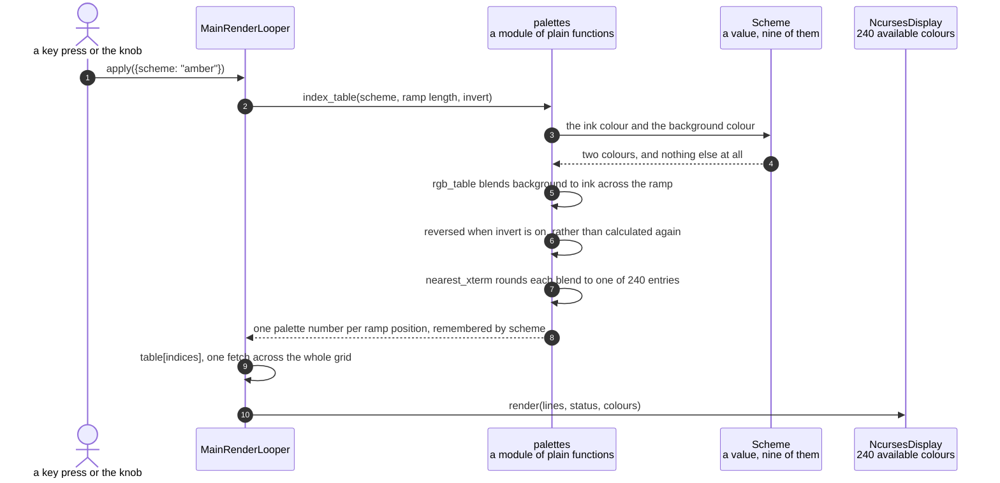

# A colour scheme is compiled into a per-cell lookup table

**Priority: `MEDIUM`** — it runs once each time the colour scheme[^scheme] changes rather than once per picture, and it is what makes seven of the nine schemes cost almost nothing to draw. [What the priorities mean](../how-to-write-scenario-docs.md).

Of the nine colour schemes, seven are **tints**: amber on near-black, green on
near-black, dark blue on white, and so on. The remaining two are the plain grey
scheme the program starts in and the live scheme that takes its colours from the
camera.

A tinted picture is not painted in one flat colour. A dense character such as
`@` is drawn at the full strength of the ink, while a sparse one such as `.` is
drawn almost at the background colour. The shading comes from how much of each
cell the character itself fills[^coverage], so the picture keeps its light and
shade even though only two colours were ever chosen.

That could be worked out afresh for every cell of every picture. Instead it is
prepared once: a table holding one colour for each position along the
ramp[^ramp], calculated when the scheme changes and afterwards applied to a
whole picture in a single fetch.

The table has to exist **twice**, because the two screens cannot use the same
answer. The small panel[^panel] accepts any colour it is given. An ordinary
monitor accepts none: it has a fixed set of colours[^xterm] made up of a cube
with six steps along each of the three colour axes, which is 216 entries, plus
24 shades of grey, giving 240 usable in total. So every blended colour has to be
rounded to whichever of those 240 lies nearest. Both tables are built from one
blend and both are remembered afterwards, which is why changing scheme feels
like a key press rather than a pause.

The rounding loses information in a way worth seeing rather than describing.
Amber over a ten-character ramp becomes the palette numbers `232, 234, 236, 58,
94, 94, 136, 172, 178, 215`. That is **94 twice**, because two neighbouring
steps of the blend end up closer to each other than either is to any other
colour the monitor possesses. The panel draws those two steps as visibly
different colours and the monitor simply cannot. That is not a fault to be
fixed. It is what a terminal is.

The invert setting[^invert] is the case that makes the shape of the table
matter. Reversing the ramp means a high position now draws a *sparse* character,
so it must take the background end of the blend rather than the ink end. The
finished table is reversed rather than the blend being calculated again. That
keeps a single statement of what the scheme looks like, instead of two
calculations that would have to be kept in agreement.

*The loss is the thing worth seeing rather than reading about. The blend along
the top has ten distinct colours and the panel draws all ten. The row underneath
has only nine distinguishable ones, because two neighbouring steps land closer
to each other than to anything the monitor owns. Every colour in the drawing is
what the code actually produces: asked for the amber scheme over ten positions,
it really does return `232, 234, 236, 58, 94, 94, 136, 172, 178, 215`.*

Kept by hand: edit
[`scheme-compiled-twice.svg`](../images/scheme-compiled-twice.svg) directly,
since nothing regenerates it.

| Class | What it represents, and its part in this scenario |
|---|---|
| [`Scheme`](../../src/art/palettes.py#L69) | One screen's entire appearance expressed as a simple value: the lit ink colour, the unlit background colour, and which of three kinds it is. In this scenario it is the **definition**, and it has no behaviour of any sort. Being a plain value is exactly what allows the [nine of them](../../src/art/palettes.py#L79) to be a list that the knob[^detent] can walk along |
| [`palettes`](../../src/art/palettes.py) | A module of plain functions rather than a class. In this scenario it is the **preparer**. [`rgb_table`](../../src/art/palettes.py#L128) turns a scheme into one colour for each ramp position, and [`index_table`](../../src/art/palettes.py#L156) turns that result into something a monitor can actually display |
| [`NcursesDisplay`](../../src/hdmi/ncurses_display.py#L34) | An ordinary monitor connected by an HDMI cable. In this scenario it is the **restricted screen**. It can only be handed numbers identifying colours from its fixed set, so the blend has to be rounded to the 240 it possesses |
| [`LcdDisplay`](../../src/lcd/lcd_display.py#L98) | The small panel's dots. In this scenario it is the **unrestricted one**. It takes the table of colours exactly as calculated, and blends each one against the character's own coverage at full precision |

## One scheme, prepared once and fetched per picture

```mermaid
sequenceDiagram
    autonumber
    actor Asker as a key press or the knob
    participant App as MainRenderLooper
    participant P as palettes<br/>a module of plain functions
    participant S as Scheme<br/>a value, nine of them
    participant Term as NcursesDisplay<br/>240 available colours

    Asker->>App: apply({scheme: "amber"})
    App->>P: index_table(scheme, ramp length, invert)
    P->>S: the ink colour and the background colour
    S-->>P: two colours, and nothing else at all
    P->>P: rgb_table blends background to ink across the ramp
    P->>P: reversed when invert is on, rather than calculated again
    P->>P: nearest_xterm rounds each blend to one of 240 entries
    P-->>App: one palette number per ramp position, remembered by scheme
    App->>App: table[indices], one fetch across the whole grid
    App->>Term: render(lines, status, colours)
```

| Step | Message | What is going on |
|---:|---|---|
| 1 | apply({scheme: "amber"}) | Arrives from a key press, the knob, a typed line or the language model. By the time it reaches here, nothing indicates which. A change of scheme is the most expensive setting to apply, because [`_adopt`](../../ascii_camera.py#L283) finishes it by repainting every cell on the screen |
| 2 | [`index_table`](../../src/art/palettes.py#L156)`(scheme, ramp length, invert)` | What is passed is the ramp's *length* rather than its characters. A blend has one entry per position, and which character happens to sit at that position is none of this module's business |
| 3 | the ink colour and the background colour | This is the whole of what a scheme contributes. The scheme has no method that calculates anything at all, which is what makes adding a new one a single line in one file |
| 4 | two colours, and nothing else at all | Amber is ink `(255, 183, 51)` on a background of `(26, 13, 0)`, which is a warm near-black. A field on the scheme decides whether this path runs at all: the grey scheme skips it entirely, and the live scheme reads the camera's colour parts[^yuv] instead |
| 5 | [`rgb_table`](../../src/art/palettes.py#L128) blends background to ink across the ramp | A straight, even interpolation, so position zero is exactly the background colour and the final position is exactly the ink. Both ends being exact matters more than it might appear. If the darkest cell were even slightly different from the background it sits on, the picture would show a faint grid of squares across the whole screen |
| 6 | reversed when invert is on, rather than calculated again | With the ramp reversed, a high position draws a sparse character and therefore needs the background end of the blend. Reversing the finished table keeps one single statement of what the scheme looks like, instead of a second calculation that would have to be kept in step with the first |
| 7 | [`nearest_xterm`](../../src/art/palettes.py#L117) rounds each blend to one of 240 entries | The search compares distance across the entire fixed set, both the colour cube and the greys, rather than doing arithmetic on the cube alone. That matters because a very dark amber is nearer to one of the grey entries than to anything in the cube. Searching everything is affordable precisely because it happens once per scheme rather than once per picture |
| 8 | one palette number per ramp position, remembered by scheme | Remembered against the scheme, the ramp length and the invert setting together, since changing any of the three changes the answer. Amber over ten positions gives `232, 234, 236, 58, 94, 94, 136, 172, 178, 215`, with 94 appearing twice because the monitor simply has no colour lying between those two steps of the blend |
| 9 | table[indices], one fetch across the whole grid | This is the entire cost of a tinted scheme, per picture. The ramp positions are already to hand from [`to_indices`](../../src/art/ascii_art.py#L195), so colouring a whole picture is a single array lookup |
| 10 | [`render`](../../src/hdmi/ncurses_display.py#L185)`(lines, status, colours)` | The monitor draws each row as runs of one colour rather than one character at a time, which is what keeps a row 267 columns wide affordable |

There are no coloured thread bands, because all of this happens on the drawing
loop's own thread. The small panel builds the same blend on its own thread using
the same code, and never rounds it, because it has no fixed set of colours to
round to. The two screens share the definition of the scheme and part company at
exactly the point where the hardware itself does.

## Related scenarios

- [Pixel brightness is mapped to ramp characters](pixel-brightness-is-mapped-to-ramp-characters.md)
  — where the ramp positions used to look up this table come from.
- [The chroma planes give each character cell its colour](the-chroma-planes-give-each-character-cell-its-colour.md)
  — what the live scheme does instead, reading the camera rather than any
  prepared table.
- [A rotary encoder detent changes the colour scheme](a-rotary-encoder-detent-changes-the-colour-scheme.md)
  — the route that asks for a new scheme, and why a gathered-up spin is applied
  as one move given what a change costs here.
- [The character grid is drawn on the HDMI terminal](the-character-grid-is-drawn-on-the-hdmi-terminal.md)
  — what the monitor does with the palette numbers this produces.

### Footnotes

[^scheme]: A **colour scheme** is one of the nine named looks listed in
    [`SCHEMES`](../../src/art/palettes.py#L79). Which one is currently in use is
    part of the program's render configuration, and the knob, a key press or a
    typed command can all change it. The scheme called `grey` is the one the
    program starts with, and it is what the phrase "greyscale mode" refers to:
    characters only, worked out from the brightness part of the picture and
    nothing else. Only the scheme called `live` reads the colour parts, through
    [`colour_grid`](../../src/capture/image_processor.py#L187). The remaining
    seven are tints, such as green phosphor, amber CRT and e-ink on paper. A
    tint recolours the same greyscale picture using two fixed colours, so it
    never looks at the colour parts either.

[^coverage]: **Drawing a character into dots** turns its outline into a small
    picture, and what comes out is a measure called **coverage**: how much of
    each dot the shape actually fills, on a scale from 0 to 255. Dots along the
    edge land somewhere in between, which is what smoothing means. It matters
    here that coverage is a fade rather than a simple yes or no, because the
    panel uses it to blend the cell's colour towards the unlit background. That
    is why the `@` character peaking at 239 instead of 255 is a visible fact
    rather than a technicality.

[^ramp]: A **ramp** is the set of characters a picture is drawn with, arranged
    in order from the one that looks lightest to the one that looks darkest.
    The sequence ` .:-=+*#%@` is one example. A brightness value picks a
    position along that sequence, so the choice of ramp decides how the picture
    looks before any colour is involved at all. The named ramps are listed in
    [`RAMPS`](../../src/art/ascii_art.py#L17), and a setting chooses between
    them.

[^panel]: The **SPI panel** is a small screen measuring 2.4 inches across the
    diagonal, 240 dots by 320, using a controller chip called the ILI9341. It is
    connected to the computer by a simple four-wire arrangement called SPI, which
    is a common way of attaching small devices. It is driven entirely by the
    program itself, through [`ILI9341`](../../src/lcd/lcd.py#L47), with no
    separate system driver involved. In the sealed box this program is built
    for, this panel is the only screen there is. One complete picture for it is
    153,600 bytes, which has to be sent in pieces of 4 kilobytes each — see
    [`SPI_CHUNK`](../../src/lcd/lcd.py#L44) — because that is as much as the
    connection will accept at a time.

[^xterm]: An ordinary terminal cannot display any colour that is asked of it. It
    offers a fixed set instead, made up of 216 colours arranged as a cube plus
    24 shades of grey, giving 240 in total. Those are what
    [`XTERM_RGB`](../../src/art/palettes.py#L66) holds. Every colour the program
    works out therefore has to be rounded to the nearest one of them by
    [`nearest_xterm`](../../src/art/palettes.py#L117). The small attached panel
    has no such restriction, and that difference is exactly why the same colour
    scheme has to be prepared twice, once for each screen.

[^invert]: The **invert** setting reverses the ramp, so that bright parts of the
    scene are drawn with the dark end of the character sequence instead. In
    effect it turns a light-on-dark picture into a dark-on-light one. It
    reverses the characters and deliberately leaves the list of positions
    untouched, which is how both screens stay in agreement about which
    character a given brightness deserves.

[^detent]: A **detent** is one click of the knob, meaning the position the knob
    settles into and which can be felt as a notch under the fingers.
    Electrically, one click is one complete cycle of the two switches inside the
    knob, and counting those cycles is the job of
    [`QuadratureDecoder`](../../src/control/encoder.py#L88). **Quadrature** is
    the name for the arrangement of those two switches. They are positioned a
    quarter of a cycle apart, so whichever of them changes first reveals which
    way the knob was turned. A switch bouncing without completing a full cycle
    produces nothing at all, which is exactly what is wanted.

[^yuv]: **YUV420** is a way of storing a picture that keeps brightness and
    colour separately, instead of storing a colour for every dot. The brightness
    part, called the luma, holds one brightness value for every dot in the
    picture. The two colour parts, called the chroma, hold colour information at
    half the detail across and half the detail down, so each of them holds a
    quarter as many values as the brightness part does. All three parts arrive
    together in one piece of memory: the brightness first, then the two colour
    parts packed in after it. That arrangement is what
    [`chroma`](../../src/capture/camera.py#L51) knows how to take apart. At 320
    by 240 the brightness part is 76,800 bytes and the two colour parts together
    are 38,400 bytes.
