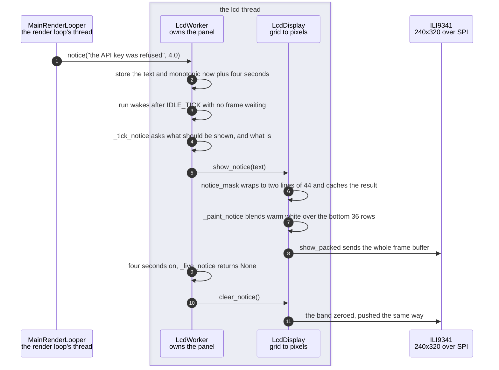

# A failure notice is painted over the picture on the SPI panel

**Priority: `LOW`** — it runs only when something has already gone wrong, but it is the only way a sealed box can tell anyone that it has. [What the priorities mean](../how-to-write-scenario-docs.md).

In the enclosure there is no terminal, no status line and nobody watching a log.
The panel is the entire output of the machine, and it is showing a picture. When
the API key is refused or the camera stops delivering, the picture carries on
looking exactly as it did — which is the failure mode this scenario exists to
prevent.

The answer is a band along the bottom of the panel: [36 pixels of
240](../../src/lcd/lcd_display.py#L37), a seventh of the glass, painted over
whatever is already there and taken away four seconds later. It is drawn in
[fixed ink](../../src/lcd/lcd_display.py#L39) on a
[near-black ground](../../src/lcd/lcd_display.py#L40) rather than in the scheme's
colours, and that is deliberate twice over. The glyph atlas holds only the ramp
characters, so the character grid **cannot spell anything at all** — a message
has to be rasterised separately or it cannot exist. And a message tinted by
whatever cell colours happen to sit under it would be least legible exactly when
it matters most, which under the `live` scheme is most of the time.

**The band is pushed whether or not there is a frame to push it with.** That is
the case the whole mechanism is built for: when the camera stops, the render
loop has nothing to draw, so a notice that could only travel attached to a frame
would never arrive. [`show_notice`](../../src/lcd/lcd_display.py#L259) paints
into the persistent frame buffer and sends it on its own.

| Class | What it represents, and its part in this scenario |
|---|---|
| [`LcdWorker`](../../src/lcd/lcd_worker.py#L61) | The thread that owns the panel. Here it is the **clock**: it holds the text and its expiry, notices when either the message or its absence differs from what is on the glass, and acts only on that difference |
| [`LcdDisplay`](../../src/lcd/lcd_display.py#L98) | The ASCII grid turned into pixels. Here it is the **painter**: it rasterises the message once, blends it into the frame buffer, and knows that taking a band away means writing zeros rather than simply not writing |
| [`ILI9341`](../../src/lcd/lcd.py#L47) | The panel itself, over SPI. Here it is **indifferent**: it is handed a whole 153,600-byte buffer either way, so a notice costs one full transfer and not a partial update |

## A message appears, and four seconds later it does not

| Step | Message | What is going on |
|---:|---|---|
| 1 | [`notice`](../../src/lcd/lcd_worker.py#L143)`("the API key was refused", 4.0)` | Called from [`_note`](../../ascii_camera.py#L337), which says the same sentence on every display the run actually has. The terminal gets a status line; the panel gets this. In the enclosure only the second one exists |
| 2 | store the text and monotonic now plus four seconds | Under a [lock](../../src/lcd/lcd_worker.py#L143), because the caller is the render loop's thread and everything below is the panel's. The expiry is stored, not a timer — nothing has to be cancelled if a second notice arrives |
| 3 | `run` wakes after [`IDLE_TICK`](../../src/lcd/lcd_worker.py#L43) with no frame waiting | A fifth of a second. This is the path that matters: no frame is coming, because the thing being reported is often the reason no frame is coming |
| 4 | [`_tick_notice`](../../src/lcd/lcd_worker.py#L297) asks what should be shown, and what is | The comparison is against `_notice_shown`, which records what was last **put on the glass** rather than what was last asked for. Those differ the moment a notice expires, and the difference is the whole trigger |
| 5 | [`show_notice`](../../src/lcd/lcd_display.py#L259)`(text)` | The no-frame path. The frame buffer persists between renders, so the band can be painted over the last good picture and sent without one |
| 6 | [`notice_mask`](../../src/lcd/lcd_display.py#L213) wraps to two lines of 44 and caches the result | A notice stands for four seconds and the panel redraws 27 times a second, so rasterising per frame would put a PIL text call back on the hot path — the one thing `lcd_display.py` exists to keep off it. [Two lines](../../src/lcd/lcd_display.py#L37) is the whole budget; a third would start eating the picture |
| 7 | [`_paint_notice`](../../src/lcd/lcd_display.py#L246) blends warm white over the bottom 36 rows | Straight into the RGB565 buffer, arithmetic rather than drawing. It writes to the full frame rather than the picture region, so the band lands on the panel edge whatever margin the grid fit leaves |
| 8 | `show_packed` sends the whole frame buffer | 153,600 bytes, 38 writes of 4,096, about 33 ms. There is no partial update: a notice costs a full transfer, which is affordable precisely because it happens when nothing else is using the bus |
| 9 | four seconds on, [`_live_notice`](../../src/lcd/lcd_worker.py#L162) returns None | Expiry is checked on read rather than swept, so no timer thread exists and a notice cannot outlive the run |
| 10 | [`clear_notice`](../../src/lcd/lcd_display.py#L272)`()` | Reached only because `_band_painted` distinguishes *nothing to clean up* from *a message just expired*. Without that flag the two are the same state and the band would never come off |
| 11 | the band zeroed, pushed the same way | **Zeroed, not skipped.** The picture region repaints itself on the next frame, but the margin strip outside it is never written again — so the band's last row would survive for good. It is the same trap the font-size rebuild has, and the same fix |

The band is drawn on the panel's own thread throughout. The render loop's only
part is the first message: it says the sentence and goes back to work, and
whether the panel is mid-transfer at that moment is not its problem.

## What the band can hold

| Message | Lines |
|---|---|
| `the API key was refused` | 1 |
| `no network - words need one, settings do not` | 1 |
| `asking too fast - wait a moment` | 1 |
| `no picture from the camera for 47s` | 1 |
| `cannot do that: I can change how the picture looks, not where the camera points` | 2 |

Forty-four characters a line, eighty-eight in total, and anything longer is cut
with an ellipsis by [`_wrap`](../../src/lcd/lcd_display.py#L236). Every message
the app generates for a *failure* fits on one line, which is not luck — the
[failure summaries](../../src/language/resolver.py#L180) were written to that
width. Declines are the ones that need two, because their text comes from the
model rather than from this codebase.

## Related scenarios

- [A camera that stopped delivering frames is detected and announced](a-camera-that-stopped-delivering-frames-is-detected-and-announced.md)
  — the biggest customer of this path, and the one where no frame is arriving
  to carry the message.
- [A model parse fails and the panel says which kind of failure it was](a-model-parse-fails-and-the-panel-says-which-kind-of-failure-it-was.md)
  — where the sentences in the table above are chosen, and why they are short.
- [A frame reaches the SPI panel without stalling the render loop](a-frame-reaches-the-spi-panel-without-stalling-the-render-loop.md)
  — the ordinary path this one interrupts, and the thread it shares.
