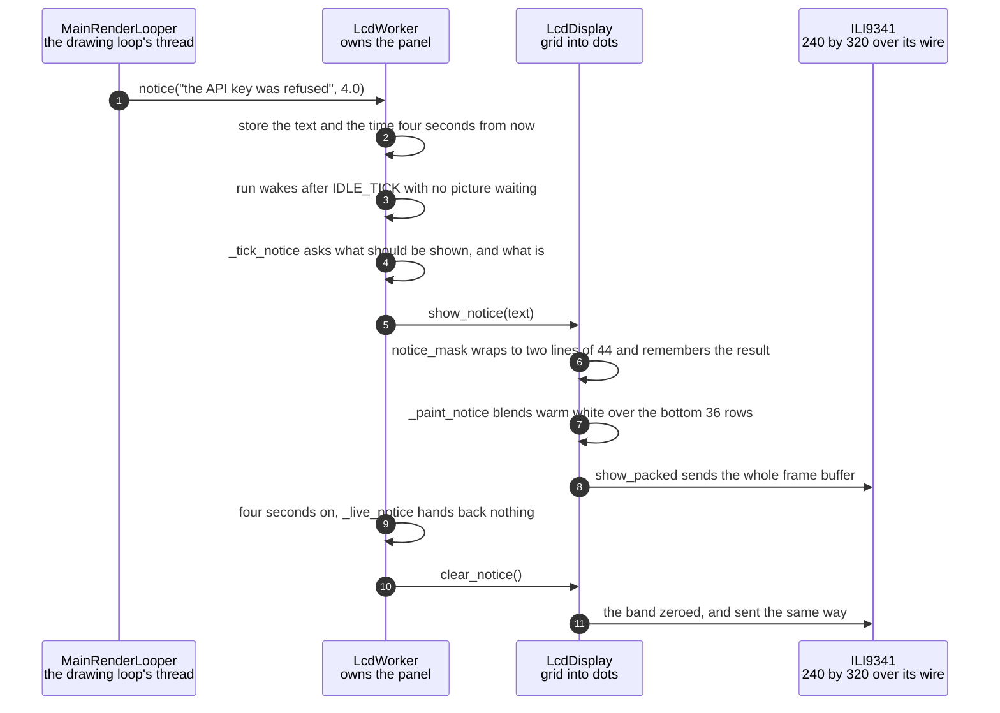

# A failure notice is painted over the picture on the SPI panel

**Priority: `LOW`** — it runs only when something has already gone wrong, but it is the only way a sealed box can tell anybody that it has. [What the priorities mean](../how-to-write-scenario-docs.md).

Inside the sealed box there is no monitor, no status line[^statusline] and
nobody watching a log file. The small panel[^panel] is the machine's entire
output, and it is showing a picture.

When the key that authorises the language model[^apikey] is refused, or the
camera stops supplying pictures, the picture on the panel carries on looking
exactly as it did a moment earlier. That is the failure this scenario exists to
prevent: a machine that is broken but looks fine.

The answer is a band of text along the bottom of the panel. It occupies [36 of
the panel's 240 rows](../../src/lcd/lcd_display.py#L37), which is a little under
a sixth of the glass. It is painted over whatever is already there and removed
again four seconds later.

It is drawn in a [fixed warm white](../../src/lcd/lcd_display.py#L39) on a
[near-black background](../../src/lcd/lcd_display.py#L40), rather than in the
colours of whichever scheme[^scheme] is in use, and that is deliberate for two
separate reasons.

The first is that the collection of ready-made characters[^atlas] holds only the
ramp[^ramp] characters, which is ten of them. The grid of characters[^grid]
therefore **cannot spell anything at all**. A message has to be drawn into
dots[^coverage] separately, or it simply cannot exist on this panel.

The second is legibility. A message tinted by whatever cell colours happened to
lie underneath it would be hardest to read at exactly the moment it matters
most, and under the live colour scheme that would be most of the time.

**The band is sent whether or not there is a picture to send it with.** That is
the case the whole mechanism exists for. When the camera stops, the drawing loop
has nothing to draw, so a message[^notice] that could only travel attached to a
picture would never arrive at all.
[`show_notice`](../../src/lcd/lcd_display.py#L259) paints into the frame buffer,
which persists between uses, and sends it by itself.

*A little under a sixth of the glass, in a fixed colour over whatever lies
underneath. The two smaller pairs show the distinction the whole mechanism turns
on: a message that could only travel attached to a picture would never arrive in
the very situation it exists for, which is the camera having stopped. The dashed
rectangle on the right explains why removing the band means deliberately writing
zeros. The picture area repaints itself on the next picture, but the margin
around it never does.*

Kept by hand: edit [`notice-band.svg`](../images/notice-band.svg) directly, since
nothing regenerates it.

| Class | What it represents, and its part in this scenario |
|---|---|
| [`LcdWorker`](../../src/lcd/lcd_worker.py#L61) | The thread that owns the small panel. In this scenario it is the **clock**. It holds the text and the moment it should disappear, notices when either the message or its absence differs from what is currently on the glass, and acts only on that difference |
| [`LcdDisplay`](../../src/lcd/lcd_display.py#L98) | A grid of characters turned into coloured dots. In this scenario it is the **painter**. It draws the message into dots once, blends it into the frame buffer, and knows that taking a band away means writing zeros rather than merely not writing anything |
| [`ILI9341`](../../src/lcd/lcd.py#L47) | The panel itself, over its wire. In this scenario it is **indifferent**. It is handed a complete 153,600-byte buffer either way, so a message costs one full send rather than a small update |

## A message appears, and four seconds later it does not

```mermaid
sequenceDiagram
    autonumber
    participant Looper as MainRenderLooper<br/>the drawing loop's thread
    participant W as LcdWorker<br/>owns the panel
    participant D as LcdDisplay<br/>grid into dots
    participant P as ILI9341<br/>240 by 320 over its wire

    Looper->>W: notice("the API key was refused", 4.0)
    W->>W: store the text and the time four seconds from now
    W->>W: run wakes after IDLE_TICK with no picture waiting
    W->>W: _tick_notice asks what should be shown, and what is
    W->>D: show_notice(text)
    D->>D: notice_mask wraps to two lines of 44 and remembers the result
    D->>D: _paint_notice blends warm white over the bottom 36 rows
    D->>P: show_packed sends the whole frame buffer
    W->>W: four seconds on, _live_notice hands back nothing
    W->>D: clear_notice()
    D->>P: the band zeroed, and sent the same way
```

| Step | Message | What is going on |
|---:|---|---|
| 1 | [`notice`](../../src/lcd/lcd_worker.py#L143)`("the API key was refused", 4.0)` | Called from [`_note`](../../ascii_camera.py#L338), which says the same sentence on every screen the run actually possesses. A monitor gets a status line; the panel gets this band. Inside the sealed box only the second of those exists |
| 2 | store the text and the time four seconds from now | Done under a lock, because the caller is the drawing loop's thread and everything below happens on the panel's thread. What is stored is the moment of expiry rather than a countdown, so nothing has to be cancelled if a second message arrives before the first has gone |
| 3 | run wakes after [`IDLE_TICK`](../../src/lcd/lcd_worker.py#L43) with no picture waiting | A fifth of a second. This is the path that matters most, because no picture is coming, and very often the thing being reported is the reason no picture is coming |
| 4 | [`_tick_notice`](../../src/lcd/lcd_worker.py#L297) asks what should be shown, and what is | The comparison is against a record of what was last actually **put on the glass**, rather than what was last asked for. Those two differ the instant a message expires, and that difference is the entire trigger for removing the band |
| 5 | [`show_notice`](../../src/lcd/lcd_display.py#L259)`(text)` | The path taken when no picture is available. The frame buffer persists between uses, so the band can be painted over the last good picture and sent without a new one |
| 6 | [`notice_mask`](../../src/lcd/lcd_display.py#L213) wraps to two lines of 44 and remembers the result | A message stands for four seconds and the panel can redraw twenty-seven times a second, so drawing the text afresh each time would mean over a hundred requests to the imaging library[^pil] for one unchanged sentence. That is precisely the kind of per-picture cost the panel code exists to keep out. [Two lines](../../src/lcd/lcd_display.py#L37) is the entire budget; a third would start eating into the picture |
| 7 | [`_paint_notice`](../../src/lcd/lcd_display.py#L246) blends warm white over the bottom 36 rows | Written straight into the buffer in the panel's own colour format[^rgb565], as arithmetic rather than as drawing. It writes to the whole picture rather than only the area the character grid occupies, so the band always sits on the panel's edge whatever margin the grid happens to leave |
| 8 | show_packed sends the whole frame buffer | All 153,600 bytes, as 38 sends of 4,096, taking about 33 milliseconds. There is no way to update part of the panel: a message costs a complete send, which is affordable precisely because it happens at moments when nothing else is using the wire |
| 9 | four seconds on, [`_live_notice`](../../src/lcd/lcd_worker.py#L162) hands back nothing | Expiry is checked at the moment somebody asks, rather than by something sweeping through looking for expired messages. So no extra timer thread exists, and a message cannot outlive the program |
| 10 | [`clear_notice`](../../src/lcd/lcd_display.py#L272)`()` | Reached only because a separate flag distinguishes *there is nothing to clean up* from *a message has just expired*. Without that flag those two situations look identical, and the band would never come off at all |
| 11 | the band zeroed, and sent the same way | **Zeroed, not simply skipped.** The area holding the picture repaints itself when the next picture arrives, but the strip outside that area is never written again, so the band's last row would survive there permanently. It is the same trap that changing the text size has, and it takes the same fix |

The band is drawn on the panel's own thread from beginning to end. The drawing
loop's only involvement is the very first message: it says the sentence and goes
straight back to work, and whether the panel happens to be halfway through a send
at that moment is not its concern.

## What the band can hold

| Message | Lines |
|---|---|
| `the API key was refused` | 1 |
| `no network - words need one, settings do not` | 1 |
| `asking too fast - wait a moment` | 1 |
| `no picture from the camera for 47s` | 1 |
| `cannot do that: I can change how the picture looks, not where the camera points` | 2 |

Forty-four characters to a line and two lines, so eighty-eight in total.
Anything longer is cut short with an ellipsis by
[`_wrap`](../../src/lcd/lcd_display.py#L236). The figure of 44 is not chosen
arbitrarily: it is how many characters of the message font fit across 240 dots.

Every message the program generates itself for a *failure* fits on a single
line, and that is not luck. The [short summaries of
failures](../../src/language/resolver.py#L180) were written to that width
deliberately. The messages that need two lines are the ones where the language
model has declined a request, because that text comes from the model rather than
from this program.

## Related scenarios

- [A camera that stopped delivering frames is detected and announced](a-camera-that-stopped-delivering-frames-is-detected-and-announced.md)
  — the biggest user of this path, and the case in which no picture is arriving
  to carry the message.
- [A model parse fails and the panel says which kind of failure it was](a-model-parse-fails-and-the-panel-says-which-kind-of-failure-it-was.md)
  — where the sentences in the table above are chosen, and why they are kept
  short.
- [A frame reaches the SPI panel without stalling the render loop](a-frame-reaches-the-spi-panel-without-stalling-the-render-loop.md)
  — the ordinary path this one interrupts, and the thread it shares with it.

### Footnotes

[^statusline]: The **status line** is the single line of readings underneath the
    picture, showing the colour scheme, the ramp, how many pictures a second are
    being drawn, and the size of the grid. It is built by
    [`status_line`](../../src/hdmi/status_line.py#L76). It is also where a
    refusal or a short message appears when the program is running on an
    ordinary monitor, because there is nowhere else on a monitor to put one.

[^panel]: The **SPI panel** is a small screen measuring 2.4 inches across the
    diagonal, 240 dots by 320, using a controller chip called the ILI9341. It is
    connected to the computer by a simple four-wire arrangement called SPI, which
    is a common way of attaching small devices. It is driven entirely by the
    program itself, through [`ILI9341`](../../src/lcd/lcd.py#L47), with no
    separate system driver involved. In the sealed box this program is built
    for, this panel is the only screen there is. One complete picture for it is
    153,600 bytes, which has to be sent in pieces of 4 kilobytes each — see
    [`SPI_CHUNK`](../../src/lcd/lcd.py#L44) — because that is as much as the
    connection will accept at a time.

[^apikey]: An **API key** is a secret string that identifies and authorises a
    program making requests to an online service. This one authorises calls to
    the language model, and it is read from a file named by
    [`KEY_FILE`](../../src/language/parser.py#L101) by
    [`api_key`](../../src/language/parser.py#L301). When no key is present the
    entire language-model path is switched off rather than being allowed to fail
    at the moment of the call. That is why every path needing it is rated of low
    importance: the sealed box runs perfectly well without one.

[^scheme]: A **colour scheme** is one of the nine named looks listed in
    [`SCHEMES`](../../src/art/palettes.py#L79). Which one is currently in use is
    part of the program's render configuration, and the knob, a key press or a
    typed command can all change it. The scheme called `grey` is the one the
    program starts with, and it is what the phrase "greyscale mode" refers to:
    characters only, worked out from the brightness part of the picture and
    nothing else. Only the scheme called `live` reads the colour parts, through
    [`colour_grid`](../../src/capture/image_processor.py#L187). The remaining
    seven are tints, such as green phosphor, amber CRT and e-ink on paper. A
    tint recolours the same greyscale picture using two fixed colours, so it
    never looks at the colour parts either.

[^atlas]: A **glyph atlas** is a collection of ready-made character pictures.
    Every character of the *ramp*, which is ten of them for the usual ramp
    rather than a whole font, is drawn once in advance into a single array. The
    code for it is [`GlyphAtlas`](../../src/lcd/lcd_display.py#L46). A complete
    screen is then assembled by copying the right rectangles out of that
    collection, instead of drawing any text. On a grid of 64 by 24 that is one
    array operation rather than 1,536 separate requests to a font renderer.
    Because the collection holds the ramp and not a font, changing the ramp is
    what forces it to be built again.

[^ramp]: A **ramp** is the set of characters a picture is drawn with, arranged
    in order from the one that looks lightest to the one that looks darkest.
    The sequence ` .:-=+*#%@` is one example. A brightness value picks a
    position along that sequence, so the choice of ramp decides how the picture
    looks before any colour is involved at all. The named ramps are listed in
    [`RAMPS`](../../src/art/ascii_art.py#L17), and a setting chooses between
    them.

[^grid]: The **character grid** is how this program holds a picture: as a
    rectangle of character cells rather than of dots. Each cell is one
    character, chosen according to how bright the patch of camera picture behind
    it happens to be. [`to_grid`](../../src/capture/image_processor.py#L172) is
    the code that reduces a picture to that grid. How many cells there are
    depends on where the picture is being sent — 64 across and 24 down on the
    small attached panel at the usual text size, and whatever fits the window
    when the picture goes to an ordinary monitor instead.

[^coverage]: **Drawing a character into dots** turns its outline into a small
    picture, and what comes out is a measure called **coverage**: how much of
    each dot the shape actually fills, on a scale from 0 to 255. Dots along the
    edge land somewhere in between, which is what smoothing means. It matters
    here that coverage is a fade rather than a simple yes or no, because the
    panel uses it to blend the cell's colour towards the unlit background. That
    is why the `@` character peaking at 239 instead of 255 is a visible fact
    rather than a technicality.

[^notice]: A **notice** is a short message painted over the bottom of whatever
    picture is currently on the small panel. It is two lines in a fixed colour,
    laid over the top of the existing picture, and its height is set by
    [`NOTICE_LINES`](../../src/lcd/lcd_display.py#L37). It is how a box with no
    keyboard and no monitor tells somebody that something has gone wrong. It
    covers 36 of the panel's 240 rows of dots.

[^pil]: The **Python Imaging Library**, distributed under the name Pillow, is
    the standard library for handling pictures in Python. In this program it is
    what draws the individual characters into the prepared collection, and what
    the panel's slower alternative path uses to convert a picture. The cost of
    calling it is the thing this program arranges itself to avoid: one call that
    handles a whole picture is perfectly fine, while 1,536 calls that each
    handle one cell are not.

[^rgb565]: **RGB565** is the way the small panel wants each dot to be described:
    two bytes altogether, holding five bits of red, six bits of green and five
    bits of blue. Green is given the spare bit because human eyes notice
    differences in green more readily than differences in red or blue.
    [`rgb565`](../../src/lcd/lcd.py#L271) converts a single colour into that
    form, and [`pack_rgb565`](../../src/lcd/lcd.py#L254) converts a whole
    picture at once.
