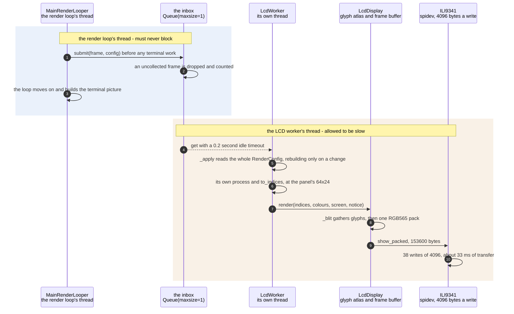

# A frame reaches the SPI panel without stalling the render loop

**Priority: `HIGH`** — in the enclosure the panel[^panel] is the only output there is, and this runs on every frame it shows. [What the priorities mean](../how-to-write-scenario-docs.md).

A full panel frame is 153,600 bytes of RGB565[^rgb565], and the kernel's SPI
buffer is 4,096 — so one frame is 38 writes and about 33 ms of transfer. Done
inside the render loop that would drag the HDMI picture down to the panel's
rate. The value is that it does not: the loop hands over the frame and a
snapshot of the settings and moves straight on, and the panel is drawn on a
thread of its own, at whatever rate it can manage, dropping frames when it
falls behind.

The two outputs are deliberately **not** chained. Each does its own downscale
and its own character mapping from the same frame, which is what lets the
terminal grid[^grid] be resized with the mouse while the panel's 64x24 never
changes, and what lets the panel keep drawing at its own rate while the
terminal builds a much larger picture. The one thing they share is the frame
object itself, handed over without a copy — safe because `CameraCapture`
already detached it from the driver's recycled buffers and because both
readers only ever read.

What crosses the boundary is the app's whole `RenderConfig`[^config], not a
private list of the fields the panel cares about. There used to be an
`LcdConfig` naming eight of them, which meant adding a setting required
remembering to add it in two places — and the field it was missing was never
going to announce itself.

| Class | What it represents, and its part in this scenario |
|---|---|
| [`MainRenderLooper`](../../ascii_camera.py#L98) | The one object the process is hung off. Here it is the **hander-over**, and the ordering is its whole contribution: it calls [`submit`](../../src/lcd/lcd_worker.py#L173) *before* building anything for the terminal, so the two renders overlap instead of queueing |
| [`LcdWorker`](../../src/lcd/lcd_worker.py#L61) | A thread with an inbox one frame deep. Here it is the **absorber**: [`submit`](../../src/lcd/lcd_worker.py#L173) never blocks and never raises, so no state of the panel — busy, blanked, stopping — can ever be felt by the loop that called it |
| [`LcdDisplay`](../../src/lcd/lcd_display.py#L98) | An ASCII grid turned into pixels. Here it is the **compositor**: [`render`](../../src/lcd/lcd_display.py#L299) gathers glyphs from a pre-rendered atlas[^atlas] and packs RGB565 in two numpy operations, because one PIL[^pil] `draw.text` per cell would be 1,536 calls a frame |
| [`ILI9341`](../../src/lcd/lcd.py#L47) | The panel itself, over spidev[^spidev]. Here it is the **sink**, and the reason for all of the above: [`show_packed`](../../src/lcd/lcd.py#L186) is 38 chunked writes, and it is where the 33 ms actually goes |

## One frame, handed over and drawn elsewhere

| Step | Message | What is going on |
|---:|---|---|
| 1 | [`submit`](../../src/lcd/lcd_worker.py#L173)`(frame, config)` before any terminal work | The ordering is deliberate and is the reason the two renders overlap rather than queue. The frame is passed by reference, not copied: `CameraCapture` already detached it from the driver's buffers, and both threads only read. What goes with it is the whole `RenderConfig`, so a setting added to the app cannot be forgotten here |
| 2 | an uncollected frame is dropped and counted | The same one-slot discipline the camera uses, one stage further on: a frame arriving while the previous one is still being drawn simply replaces it, so the panel lags at most one frame behind reality. `dropped` is counted rather than logged, because at 15 fps into a 27 fps panel the number is interesting and the log line would not be |
| 3 | the loop moves on and builds the terminal picture | The step that makes this a scenario at all. Nothing here waits: `submit` cannot block, cannot raise, and returns immediately even when the worker is stopping. In `--no-terminal`[^headless] there is no picture to build and the loop goes straight back to the camera |
| 4 | get with a 0.2 second idle timeout | The timeout is not impatience — it is the worker's clock. It is what lets a notice[^notice] reach the glass with no frame to ride on, which is exactly the case that matters: "the camera stopped" is the one message that cannot be delivered on the frame path, because there are no frames |
| 5 | [`_apply`](../../src/lcd/lcd_worker.py#L409) reads the whole RenderConfig, rebuilding only on a change | Every frame carries every setting, but almost nothing is rebuilt: the ramp[^ramp], the invert[^invert] and the font size are compared against what is already in place. A font-size change does rebuild the glyph atlas, measured at 168 ms the first time and 13 to 24 ms after — a cost paid on a keystroke, never on a frame |
| 6 | its own [`process`](../../src/capture/image_processor.py#L159) and [`to_indices`](../../src/art/ascii_art.py#L195), at the panel's 64x24 | The panel repeats the reduction rather than inheriting the terminal's, and that repetition is the point: the two grids are different sizes and must stay so. It is also why the terminal can be resized freely without the panel changing |
| 7 | [`render`](../../src/lcd/lcd_display.py#L299)`(indices, colours, screen, notice)` | `screen` is the colour scheme[^scheme]'s unlit background — every pixel a glyph does not cover becomes it. The notice is passed in rather than re-read here, because asking twice can give two answers if it expires in between, and then the record of what is on the glass stops matching the glass |
| 8 | [`_blit`](../../src/lcd/lcd_display.py#L339) gathers glyphs, then one RGB565 pack | A pre-rendered atlas and a single numpy gather, not one PIL `draw.text` per cell — at 64x24 that would be 1,536 calls a frame. Measured, the whole draw costs about 3.7 ms of CPU: 1.2 for the blit, 2.4 for the pack. Against 33 ms of transfer, the drawing is not what matters |
| 9 | [`show_packed`](../../src/lcd/lcd.py#L186), 153600 bytes | Already in the panel's own byte order, so this path skips the PIL round trip and the conversion that `show` would do. The length is checked against the panel's own geometry rather than trusted |
| 10 | 38 writes of 4096, about 33 ms of transfer | `/sys/module/spidev/parameters/bufsiz` is 4,096, so a frame cannot go in one call. The transfer dominates, not the clock rate — and `spidev` releases the GIL[^gil] while it runs, which is what makes this thread genuinely concurrent rather than merely separate: the main thread keeps 93% of its throughput while the panel runs at 27 fps |

The two bands are the point of the document, and the boundary between them is
crossed exactly once, in one direction, by one message. Everything to the right
of it may be slow. Nothing to the left of it ever waits.

## Related scenarios

- [A capture thread hands the render loop its newest frame through a one-slot queue](a-capture-thread-hands-the-render-loop-its-newest-frame-through-a-one-slot-queue.md)
  — the other thread boundary, and where the frame shared here was detached
  from the driver's buffers.
- [Pixel brightness is mapped to ramp characters](pixel-brightness-is-mapped-to-ramp-characters.md)
  — the mapping this worker repeats at its own size, and the table both
  displays share.
- [The character grid is packed into RGB565 pixels for the ILI9341](the-character-grid-is-packed-into-rgb565-pixels-for-the-ili9341.md) — the two
  numpy operations behind one message here, drawn in full.
- [The SPI panel shows a start-up screen before the first camera frame](the-spi-panel-shows-a-start-up-screen-before-the-first-camera-frame.md) — what
  the idle timeout above is doing before any frame has ever arrived.
- [A failure notice is painted over the picture on the SPI panel](a-failure-notice-is-painted-over-the-picture-on-the-spi-panel.md) — the other
  thing that timeout exists for.

### Footnotes

[^panel]: The **SPI panel** is a 2.4 inch ILI9341 LCD, 240x320, wired to the
    Pi's SPI bus — a four-wire serial bus for talking to peripherals — and
    driven from userspace by [`ILI9341`](../../src/lcd/lcd.py#L47) with no
    kernel driver behind it. In the sealed enclosure it is the only display
    there is. One full frame is 153,600 bytes, sent in
    [`SPI_CHUNK`](../../src/lcd/lcd.py#L44) pieces of 4 KB because that is what
    the driver's buffer holds.

[^rgb565]: **RGB565** is how the panel wants a pixel: two bytes, five bits of
    red, six of green, five of blue — green gets the spare bit because the eye
    is most sensitive to it. [`rgb565`](../../src/lcd/lcd.py#L271) packs one
    colour and [`pack_rgb565`](../../src/lcd/lcd.py#L254) a whole image.

[^grid]: The **character grid** is the picture as this app holds it: `rows` by
    `cols` character **cells** rather than pixels, each cell one character
    chosen from the brightness of the patch of camera frame it covers.
    [`to_grid`](../../src/capture/image_processor.py#L172) is what resizes a
    plane to it. How big it is depends on where the picture is going — 64 by 24
    on the SPI panel at the default font size, and whatever the window holds on
    the HDMI terminal.

[^config]: The **render configuration** is the complete live state of how the
    picture is drawn — scheme, ramp, contrast, rotation and the rest. It is
    frozen: nothing assigns to it, and every change produces a whole new
    [`RenderConfig`](../../src/control/render_config.py#L118) through
    [`with_changes`](../../src/control/render_config.py#L141), which is also
    the only code that decides whether a value is allowed. What the settings
    are, and what each accepts, is
    [`SPECS`](../../src/control/render_config.py#L74) — one table that the
    validator, the `help` text, the command-line arguments and the model's
    tool schema are all built from.

[^atlas]: A **glyph atlas** is every character of the *ramp* — ten of them for
    the default ramp, not the whole font — drawn once, in advance, into one
    array: [`GlyphAtlas`](../../src/lcd/lcd_display.py#L46). A frame is then
    assembled by copying the right rectangles out of it rather than by drawing
    text, which at 64 by 24 is one array operation instead of 1,536 calls into
    the font renderer. That it holds the ramp and not the font is why changing
    the ramp rebuilds it.

[^pil]: The Python Imaging Library, as maintained in Pillow. It is what
    rasterises the glyphs and what the panel's slower path uses to convert an
    image. Its per-call cost is the thing this app organises itself to avoid:
    one call that does a whole frame is fine, 1,536 calls that each do a cell
    are not.

[^spidev]: The kernel's userspace door onto the SPI bus, `/dev/spidev0.0`. No
    display driver is bound to this panel at all — it is driven from Python
    through this device, which is why nothing here is a framebuffer. Its
    buffer, `/sys/module/spidev/parameters/bufsiz`, is 4,096 bytes, and that is
    the whole reason one frame is 38 writes rather than one.

[^headless]: `--no-terminal` runs the app with no terminal picture at all — a
    stand-in object with the same methods as the display, which does nothing.
    The enclosure boots that way, because there is no monitor attached, so the
    terminal's cost is not wasted so much as never paid.

[^notice]: A **notice** is a short message painted over the bottom of the
    picture on the panel — two lines in fixed ink over whatever is underneath,
    sized by [`NOTICE_LINES`](../../src/lcd/lcd_display.py#L37). It is how a
    box with no keyboard and no terminal says something went wrong, and it
    covers 36 of the panel's 240 rows.

[^ramp]: A **ramp** is the string of characters the picture is drawn with,
    ordered from lightest to darkest — ` .:-=+*#%@` is one. Brightness picks a
    position along it, so the ramp is what decides how the picture looks before
    any colour is involved. The named ones are in
    [`RAMPS`](../../src/art/ascii_art.py#L17) and the setting chooses between
    them.

[^invert]: The **invert** setting reverses the ramp, so bright pixels get the
    dark end of it — white-on-black becomes black-on-white in effect. It
    reverses the characters and deliberately leaves the position table alone,
    which is how both displays stay in agreement about which glyph a brightness
    deserves.

[^scheme]: A **colour scheme** is one of the nine named looks in
    [`SCHEMES`](../../src/art/palettes.py#L79), and which one is live is part
    of the render configuration. `grey` is the default, and is what "greyscale
    mode" means: characters only, drawn from the luma plane and nothing else.
    `live` is the only scheme that reads the chroma planes, through
    [`colour_grid`](../../src/capture/image_processor.py#L187). The other seven
    are **tints** — green phosphor, amber CRT, e-ink on paper — which recolour
    the same greyscale picture from two fixed colours.

[^gil]: Python's **global interpreter lock** normally stops two threads
    running Python at the same time, so threading buys nothing for work done in
    Python. It is released around calls that wait on the outside world, which
    is exactly what an SPI transfer is — the reason a worker thread genuinely
    overlaps here rather than merely interleaving.
