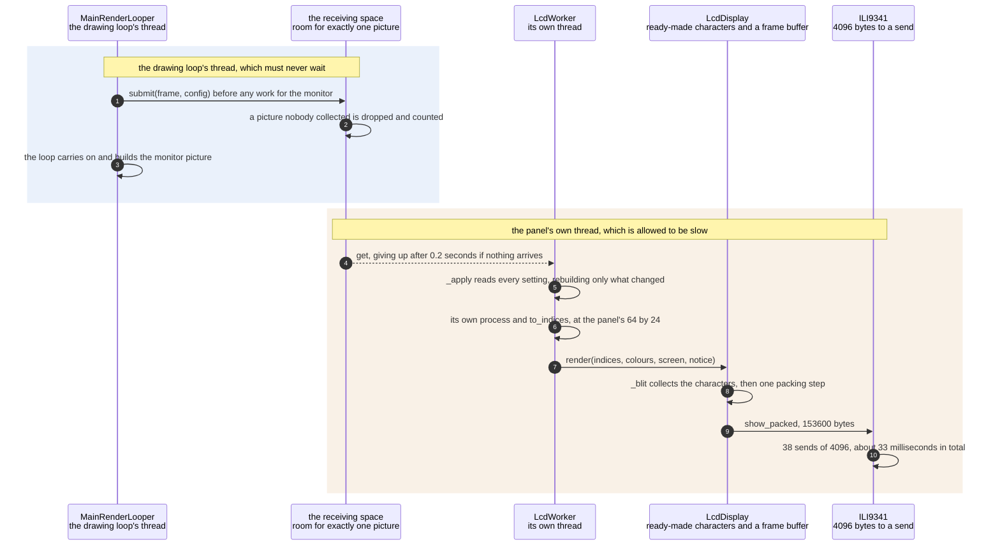

# A frame reaches the SPI panel without stalling the render loop

**Priority: `HIGH`** — inside the sealed box the small attached panel[^panel] is the only screen there is, and this happens for every picture it shows. [What the priorities mean](../how-to-write-scenario-docs.md).

One complete picture for the small panel is 153,600 bytes. That figure is not
arbitrary and is worth taking apart, because the rest of this document follows
from it. The panel is 240 dots wide and 320 dots tall, which is fixed by the
hardware and cannot be changed. Multiplying those gives 76,800 dots. The panel
wants each dot described in two bytes[^rgb565], so the total is 76,800 doubled,
which is 153,600 bytes.

The connection to the panel will only accept 4,096 bytes in any single send.
That limit is not chosen by this program either. It is the size of the buffer
the system sets aside for this kind of connection, which the computer reports at
`/sys/module/spidev/parameters/bufsiz`. Dividing 153,600 by 4,096 gives 37.5, and
since a part-send is still a send, one picture takes 38 of them. Measured
end to end, those 38 sends take about 33 milliseconds.

Thirty-three milliseconds is a long time in this program. If the drawing loop
sent the picture itself, it would have to stand still for that whole period on
every single picture. The picture on an ordinary monitor would then be forced
down to the speed of the small panel, even though the monitor could easily go
faster.

The point of this scenario is that none of that happens. The drawing loop hands
over the camera picture together with a record of all the current settings, and
then immediately carries on with its own work. The small panel is drawn on a
separate thread, at whatever speed that thread can manage, and when it cannot
keep up it simply skips pictures.

The two screens are deliberately **not** joined together in a chain. Each one
shrinks the camera picture itself, and each one works out its own characters
from that same camera picture. That independence is what allows a window on a
monitor to be resized with the mouse while the small panel's grid[^grid] stays
exactly as it was. That grid is 64 cells across and 24 down. Those two numbers
are not settings anybody picked; they fall out of the panel's size and the size
of the text. At the standard text size, fixed by
[`DEFAULT_FONT_SIZE`](../../src/lcd/lcd_display.py#L43), one character occupies
a rectangle that divides the panel's dots exactly, leaving 64 columns and 24
rows with nothing left over. It is also what allows the small panel to keep
drawing at its own speed while the monitor builds a much larger picture. The
only thing the two share is the camera picture itself, handed over without
being copied. That is safe because the camera code already disconnected that
picture from the memory the driver reuses, and because both readers only ever
read and never change anything.

What crosses from one thread to the other is the program's entire set of
settings[^config], rather than a short private list of the settings the panel
happens to care about. There used to be a separate list naming eight of them.
That arrangement meant every new setting had to be remembered in two different
places, and a setting that was forgotten in the second place would never
announce itself. It would simply have no effect on the panel, quietly, for as
long as nobody noticed.

| Class | What it represents, and its part in this scenario |
|---|---|
| [`MainRenderLooper`](../../ascii_camera.py#L99) | The single object the whole running program hangs from. In this scenario it is the **hander-over**, and the order in which it does things is its entire contribution. It calls [`submit`](../../src/lcd/lcd_worker.py#L173) *before* it starts building anything for the monitor, so that the two screens are being prepared at the same time rather than one after the other |
| [`LcdWorker`](../../src/lcd/lcd_worker.py#L61) | A thread with a receiving space exactly one picture deep. In this scenario it is the **absorber**. [`submit`](../../src/lcd/lcd_worker.py#L173) never waits and never reports an error, so no condition the panel might be in — busy, blanked, shutting down — can ever be felt by the drawing loop that called it |
| [`LcdDisplay`](../../src/lcd/lcd_display.py#L98) | A grid of characters turned into actual coloured dots. In this scenario it is the **assembler**. [`render`](../../src/lcd/lcd_display.py#L299) collects ready-made character pictures from a prepared collection[^atlas] and packs the result into the panel's colour arrangement using two whole-array operations, because asking the imaging library[^pil] to draw text once per cell would mean 1,536 separate requests for every picture |
| [`ILI9341`](../../src/lcd/lcd.py#L47) | The panel itself, reached through the system's SPI device[^spidev]. In this scenario it is the **destination**, and the reason for everything above. [`show_packed`](../../src/lcd/lcd.py#L186) is 38 sends in sequence, and it is where the 33 milliseconds actually goes |

## One picture, handed over and drawn somewhere else

```mermaid
sequenceDiagram
    autonumber
    participant App as MainRenderLooper<br/>the drawing loop's thread
    participant Inbox as the receiving space<br/>room for exactly one picture
    participant W as LcdWorker<br/>its own thread
    participant Disp as LcdDisplay<br/>ready-made characters and a frame buffer
    participant Panel as ILI9341<br/>4096 bytes to a send

    rect rgba(80, 140, 220, 0.12)
        note over App, Inbox: the drawing loop's thread, which must never wait
        App->>Inbox: submit(frame, config) before any work for the monitor
        Inbox->>Inbox: a picture nobody collected is dropped and counted
        App->>App: the loop carries on and builds the monitor picture
    end
    rect rgba(200, 140, 60, 0.12)
        note over Inbox, Panel: the panel's own thread, which is allowed to be slow
        Inbox-->>W: get, giving up after 0.2 seconds if nothing arrives
        W->>W: _apply reads every setting, rebuilding only what changed
        W->>W: its own process and to_indices, at the panel's 64 by 24
        W->>Disp: render(indices, colours, screen, notice)
        Disp->>Disp: _blit collects the characters, then one packing step
        Disp->>Panel: show_packed, 153600 bytes
        Panel->>Panel: 38 sends of 4096, about 33 milliseconds in total
    end
```

| Step | Message | What is going on |
|---:|---|---|
| 1 | [`submit`](../../src/lcd/lcd_worker.py#L173)`(frame, config)` before any work for the monitor | Doing this first is deliberate, and it is the reason the two screens are prepared at the same time instead of one after the other. The camera picture is passed by reference rather than copied, which is safe because the camera code already disconnected it from the driver's memory and because both threads only read it. Every setting travels with it, so a setting added to the program cannot be forgotten here |
| 2 | a picture nobody collected is dropped and counted | This is the same one-space discipline the camera uses, applied one stage further along. A picture arriving while the previous one is still being drawn simply replaces it, so the panel is never more than one picture behind reality. The number dropped is counted rather than written to the log, because at fifteen pictures a second going into a panel that can manage twenty-seven, the count is interesting but a log line for each one would be useless noise |
| 3 | the loop carries on and builds the monitor picture | This is the step that makes the whole thing worth a document. Nothing here waits. The handing-over cannot pause, cannot report an error, and returns straight away even when the panel's thread is in the middle of shutting down. When the program is run with no monitor at all[^headless], there is no monitor picture to build, and the loop simply goes straight back to the camera |
| 4 | get, giving up after 0.2 seconds if nothing arrives | This time limit is not impatience. It is the panel thread's own clock. It is what allows a short message[^notice] to reach the glass when there is no picture to carry it, which is exactly the situation that matters most. "The camera has stopped" is the one message that cannot travel along with a picture, for the obvious reason that there are no pictures |
| 5 | [`_apply`](../../src/lcd/lcd_worker.py#L409) reads every setting, rebuilding only what changed | Every picture arrives with every setting attached, yet almost nothing is ever rebuilt. The ramp[^ramp], the invert setting[^invert] and the text size are each compared against what is already in place. Changing the text size does force the collection of ready-made characters to be built again, measured over eleven rebuilds at 168 milliseconds for the first one and between 13 and 24 milliseconds for every one after it, the first being slower almost certainly because the font file is read from disk once and found in memory thereafter. That cost is paid when somebody presses a key, never on an ordinary picture |
| 6 | its own [`process`](../../src/capture/image_processor.py#L159) and [`to_indices`](../../src/art/ascii_art.py#L195), at the panel's 64 by 24 | The panel repeats the shrinking rather than inheriting the monitor's version of it, and that repetition is precisely the point. The two grids are different sizes and have to stay that way. It is also the reason a window on a monitor can be resized freely without the panel changing at all |
| 7 | [`render`](../../src/lcd/lcd_display.py#L299)`(indices, colours, screen, notice)` | The `screen` value is the unlit background colour belonging to the chosen colour scheme[^scheme]. Every dot that no character covers becomes that colour. The short message is passed in rather than looked up again here. Looking it up a second time could give a different answer if it expired in between, and then the program's record of what is on the glass would stop matching what is actually on the glass |
| 8 | [`_blit`](../../src/lcd/lcd_display.py#L339) collects the characters, then one packing step | A prepared collection of character pictures and a single whole-array fetch, rather than one drawing request per cell. On a grid of 64 by 24 the second approach would be 64 multiplied by 24 requests, which is 1,536 of them for every single picture. Those two figures were measured rather than estimated. The entire assembly costs about 3.7 milliseconds of processor time, made up of 1.2 milliseconds collecting the characters and 2.4 packing the colours. Set against the 33 milliseconds the sending takes, the assembly is roughly a tenth of the cost, so it is not the part worth worrying about |
| 9 | [`show_packed`](../../src/lcd/lcd.py#L186), 153600 bytes | The data is already arranged in the exact order the panel expects, so this path skips a conversion through the imaging library that the more general method would perform. The length is checked against the panel's own dimensions rather than simply trusted |
| 10 | 38 sends of 4096, about 33 milliseconds in total | This is the 153,600 bytes divided into 4,096-byte pieces, as set out at the top of this document. It is the sending itself, rather than the speed the wire runs at, that accounts for the time. Raising the buffer size would reduce the number of sends and therefore the total, which is why that limit is worth knowing about even though this program does not change it. Sending also releases Python's interpreter lock[^gil] while it is happening, and that is what makes this thread genuinely simultaneous rather than merely separate: the main thread keeps 93 per cent of its normal throughput while the panel runs at twenty-seven pictures a second. Both of those figures were measured on the real hardware rather than reasoned about, since whether a thread genuinely overlaps is not something source code can be read to determine |

The two coloured bands are the whole point of this document. The boundary
between them is crossed exactly once, in one direction only, by a single
message. Everything on the right of that boundary is allowed to be slow.
Nothing on the left of it ever waits for anything.

### The protection only runs one way

It is worth being exact about what this arrangement does and does not promise,
because it is easy to assume it protects both screens equally. It does not.

If the **panel** falls behind, the drawing loop is entirely unaffected. Handing
over a picture cannot pause and cannot fail, and a picture the panel has not
collected is simply replaced by a newer one. The panel then draws fewer pictures
than the camera produced, and nothing else in the program notices or cares.

If the **monitor** falls behind, the situation is not symmetrical. Building a
monitor picture happens on the drawing loop's own thread, so a slow monitor
makes the whole loop slow. The panel is handed a picture once per turn of that
loop. So a slow monitor gives the panel fewer pictures as well. **The panel
cannot run faster than the loop that feeds it.**

That asymmetry is not an oversight, and it is easier to see once the sizes are
compared. The panel draws 1,536 cells. A monitor filling this Pi's screen draws
roughly 26,700, which is about seventeen times as many. The panel's cost is
mostly *waiting* on the wire, and waiting overlaps with other work. The
monitor's cost is *calculation*, and calculation does not overlap. So the
monitor is by far the more likely of the two to fall behind, despite the panel
being the one attached to the slow connection.

Inside the sealed box none of this arises, because the program is started with
no monitor at all. There is no monitor picture to build, so the loop's only
work is the path leading to the panel.

## Related scenarios

- [A capture thread hands the render loop its newest frame through a one-slot queue](a-capture-thread-hands-the-render-loop-its-newest-frame-through-a-one-slot-queue.md)
  — the other boundary between two threads, and where the camera picture shared
  here was disconnected from the driver's memory.
- [Pixel brightness is mapped to ramp characters](pixel-brightness-is-mapped-to-ramp-characters.md)
  — the conversion this panel thread repeats at its own size, and the prepared
  table that both screens share.
- [The character grid is packed into RGB565 pixels for the ILI9341](the-character-grid-is-packed-into-rgb565-pixels-for-the-ili9341.md)
  — the two whole-array operations behind a single message above, set out in
  full.
- [The SPI panel shows a start-up screen before the first camera frame](the-spi-panel-shows-a-start-up-screen-before-the-first-camera-frame.md)
  — what the time limit above is doing during the period before any camera
  picture has ever arrived.
- [A failure notice is painted over the picture on the SPI panel](a-failure-notice-is-painted-over-the-picture-on-the-spi-panel.md)
  — the other reason that time limit exists.

### Footnotes

[^panel]: The **SPI panel** is a small screen measuring 2.4 inches across the
    diagonal, 240 dots by 320, using a controller chip called the ILI9341. It is
    connected to the computer by a simple four-wire arrangement called SPI, which
    is a common way of attaching small devices. It is driven entirely by the
    program itself, through [`ILI9341`](../../src/lcd/lcd.py#L47), with no
    separate system driver involved. In the sealed box this program is built
    for, this panel is the only screen there is. One complete picture for it is
    153,600 bytes, which has to be sent in pieces of 4 kilobytes each — see
    [`SPI_CHUNK`](../../src/lcd/lcd.py#L44) — because that is as much as the
    connection will accept at a time.

[^rgb565]: **RGB565** is the way the small panel wants each dot to be described:
    two bytes altogether, holding five bits of red, six bits of green and five
    bits of blue. Green is given the spare bit because human eyes notice
    differences in green more readily than differences in red or blue.
    [`rgb565`](../../src/lcd/lcd.py#L271) converts a single colour into that
    form, and [`pack_rgb565`](../../src/lcd/lcd.py#L254) converts a whole
    picture at once.

[^grid]: The **character grid** is how this program holds a picture: as a
    rectangle of character cells rather than of dots. Each cell is one
    character, chosen according to how bright the patch of camera picture behind
    it happens to be. [`to_grid`](../../src/capture/image_processor.py#L172) is
    the code that reduces a picture to that grid. How many cells there are
    depends on where the picture is being sent — 64 across and 24 down on the
    small attached panel at the usual text size, and whatever fits the window
    when the picture goes to an ordinary monitor instead.

[^config]: The **render configuration** is the complete, current description of
    how the picture should be drawn: which colour scheme, which ramp, how much
    contrast, which way up, and so on. It is frozen, meaning no part of the
    program ever alters one. Instead, every change produces an entirely new
    [`RenderConfig`](../../src/control/render_config.py#L118) by way of
    [`with_changes`](../../src/control/render_config.py#L141), which is also the
    only code anywhere that decides whether a proposed value is allowed. The
    list of settings, and what each one will accept, is
    [`SPECS`](../../src/control/render_config.py#L74). That single table is what
    the checking code, the `help` text, the command-line options and the
    description given to the language model are all built from.

[^atlas]: A **glyph atlas** is a collection of ready-made character pictures.
    Every character of the *ramp*, which is ten of them for the usual ramp
    rather than a whole font, is drawn once in advance into a single array. The
    code for it is [`GlyphAtlas`](../../src/lcd/lcd_display.py#L46). A complete
    screen is then assembled by copying the right rectangles out of that
    collection, instead of drawing any text. On a grid of 64 by 24 that is one
    array operation rather than 1,536 separate requests to a font renderer.
    Because the collection holds the ramp and not a font, changing the ramp is
    what forces it to be built again.

[^pil]: The **Python Imaging Library**, distributed under the name Pillow, is
    the standard library for handling pictures in Python. In this program it is
    what draws the individual characters into the prepared collection, and what
    the panel's slower alternative path uses to convert a picture. The cost of
    calling it is the thing this program arranges itself to avoid: one call that
    handles a whole picture is perfectly fine, while 1,536 calls that each
    handle one cell are not.

[^spidev]: **spidev** is the system's way of letting an ordinary program talk
    directly to the SPI connection, and it appears as a file at
    `/dev/spidev0.0`. No display driver is attached to this panel at all. The
    program drives it through that file, which is why nothing here behaves like
    a normal screen as far as the system is concerned. The buffer belonging to
    that connection holds 4,096 bytes, and that single fact is the entire reason
    one picture takes 38 sends rather than one.

[^headless]: The option `--no-terminal` runs the program with no monitor
    picture at all. A stand-in object is used, offering all the same methods as
    a real display but doing nothing when they are called. The sealed box starts
    up that way, because there is no monitor attached to it, so the cost of
    building a monitor picture is not so much wasted as never paid in the first
    place.

[^notice]: A **notice** is a short message painted over the bottom of whatever
    picture is currently on the small panel. It is two lines in a fixed colour,
    laid over the top of the existing picture, and its height is set by
    [`NOTICE_LINES`](../../src/lcd/lcd_display.py#L37). It is how a box with no
    keyboard and no monitor tells somebody that something has gone wrong. It
    covers 36 of the panel's 240 rows of dots.

[^ramp]: A **ramp** is the set of characters a picture is drawn with, arranged
    in order from the one that looks lightest to the one that looks darkest.
    The sequence ` .:-=+*#%@` is one example. A brightness value picks a
    position along that sequence, so the choice of ramp decides how the picture
    looks before any colour is involved at all. The named ramps are listed in
    [`RAMPS`](../../src/art/ascii_art.py#L17), and a setting chooses between
    them.

[^invert]: The **invert** setting reverses the ramp, so that bright parts of the
    scene are drawn with the dark end of the character sequence instead. In
    effect it turns a light-on-dark picture into a dark-on-light one. It
    reverses the characters and deliberately leaves the list of positions
    untouched, which is how both screens stay in agreement about which
    character a given brightness deserves.

[^scheme]: A **colour scheme** is one of the nine named looks listed in
    [`SCHEMES`](../../src/art/palettes.py#L79). Which one is currently in use is
    part of the program's render configuration, and the knob, a key press or a
    typed command can all change it. The scheme called `grey` is the one the
    program starts with, and it is what the phrase "greyscale mode" refers to:
    characters only, worked out from the brightness part of the picture and
    nothing else. Only the scheme called `live` reads the colour parts, through
    [`colour_grid`](../../src/capture/image_processor.py#L187). The remaining
    seven are tints, such as green phosphor, amber CRT and e-ink on paper. A
    tint recolours the same greyscale picture using two fixed colours, so it
    never looks at the colour parts either.

[^gil]: Python's **global interpreter lock** is a rule inside Python that stops
    two threads from running Python instructions at the very same moment. Because
    of it, splitting ordinary Python work across threads usually buys nothing at
    all. The rule is lifted, however, around operations that spend their time
    waiting for something outside Python, and sending data along a wire is
    exactly such an operation. That is why a separate thread genuinely helps
    here, rather than merely taking turns with the main one.
