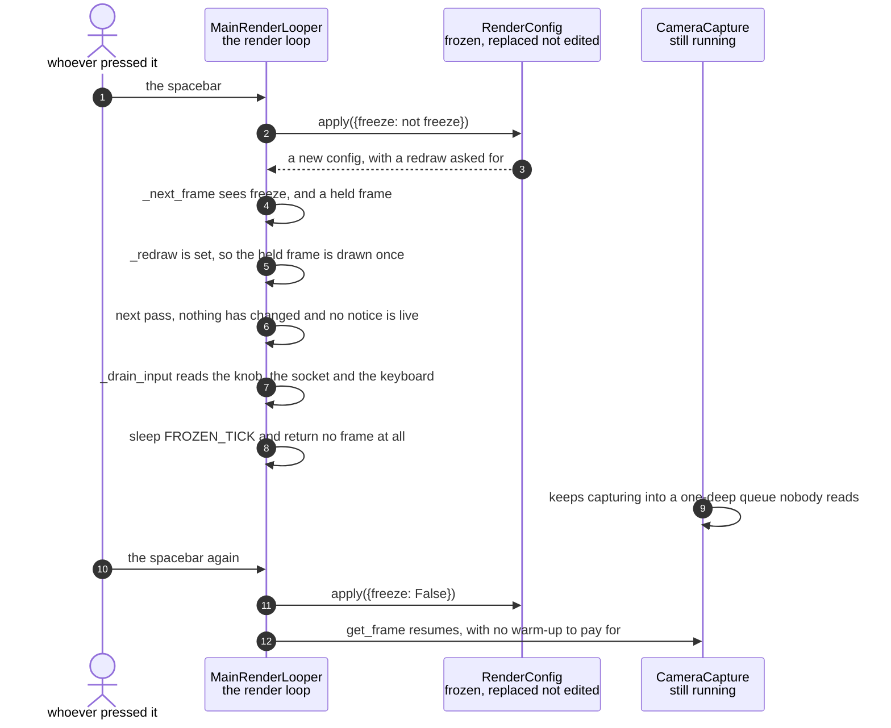

# A frozen picture is held without redrawing or SPI traffic

**Priority: `LOW`** — freezing is something a person does occasionally and on purpose, but what the loop does while frozen is the difference between an idle appliance and one heating up. [What the priorities mean](../how-to-write-scenario-docs.md).

Press the spacebar and the picture stops. The naive implementation of that is to
keep the loop running exactly as before and simply hand it the same frame every
time, which produces a correct picture and a machine burning a core to redraw an
image identical to the one already on screen — and pushing 153,600 bytes down
the SPI bus, thirty-odd times a second, to change nothing.

**So the loop stops producing frames rather than producing repeats.**
[`_next_frame`](../../ascii_camera.py#L690) returns `None` when the picture is
frozen and nothing has changed, and the loop's redraw is skipped entirely.
What replaces it is a [50 ms poll](../../ascii_camera.py#L95): twenty wakeups
a second that read the knob[^detent], drain the socket[^socket] and check for
a keypress, which is enough to feel instant and costs nothing measurable.

**The camera is deliberately left running.** Stopping it would be the obvious
saving and it is the wrong trade: libcamera[^picamera2] takes fifteen to
twenty seconds to come back, so unfreezing would stall for longer than most
freezes last. Its queue is one frame deep, so a camera nobody is reading from
overwrites its own slot and nothing accumulates.

| Class | What it represents, and its part in this scenario |
|---|---|
| [`MainRenderLooper`](../../ascii_camera.py#L98) | Capture, process, draw, once per frame. Here it is the part that **declines to run**: it holds the last frame, decides there is no picture to make, and services input on a timer instead |
| [`RenderConfig`](../../src/control/render_config.py#L118) | The complete live render state, frozen and replaced wholesale. Here it is the **switch**: `freeze` is an ordinary boolean setting, so the spacebar, a typed command, the phone and the model all reach it by the same route as any other change |

## The loop stops making pictures

| Step | Message | What is going on |
|---:|---|---|
| 1 | the spacebar | [The spacebar rather than a letter](../../ascii_camera.py#L608): every other binding is the first letter of what it does, and `freeze` collides with `fill`[^fill]. A pause key nobody has to be told about beats a mnemonic bent to fit |
| 2 | [`apply`](../../ascii_camera.py#L235)`({freeze: not freeze})` | A delta[^delta], exactly like every other route in. The key handler does not assign the setting itself, which is what keeps one validator in the path rather than a shortcut around it |
| 3 | a new config, with a redraw asked for | `_redraw` is set by [every config change](../../ascii_camera.py#L235), because the panel[^panel] reads its settings from the config[^config] handed to it with the next frame — and while frozen there is no next frame unless something asks for one |
| 4 | [`_next_frame`](../../ascii_camera.py#L690) sees freeze, and a held frame | `_held` is [the last frame captured](../../ascii_camera.py#L690), kept for exactly this. Freezing before the first frame arrives falls through to the camera, because there is nothing to hold |
| 5 | `_redraw` is set, so the held frame is drawn once | The change has to reach the glass. A contrast change while frozen redraws the *same* frame with new settings, which is the reason a frozen picture is still worth pointing settings at |
| 6 | next pass, nothing has changed and no notice is live | Both conditions. A live notice[^notice] forces the redraw, because it has to appear and then four seconds later go away — and the redraw that shows an expired notice is the one that clears it, so this settles by itself without a timer |
| 7 | [`_drain_input`](../../ascii_camera.py#L833) reads the knob, the socket and the keyboard | The whole of what a frozen loop does. The knob is polled here rather than on its own timer so it lands in the same place as a keypress: at most one scheme[^scheme] change per pass, applied before anything is drawn |
| 8 | sleep [`FROZEN_TICK`](../../ascii_camera.py#L95) and return no frame at all | The camera normally paces the loop; with nothing being waited for, this is what stops it spinning a core. Twenty wakeups a second, none of which draw |
| 9 | keeps capturing into a one-deep queue nobody reads | The cost of not stopping it, and it is a fixed one. The [single slot](../../src/capture/camera.py#L61) means the newest frame replaces the unread one rather than a backlog forming |
| 10 | the spacebar again | The same key and the same route out. `freeze` has no special unfreeze path |
| 11 | [`apply`](../../ascii_camera.py#L235)`({freeze: False})` | Sets `_redraw` on the way through, which is what makes the first live frame land immediately rather than after the next capture |
| 12 | `get_frame` resumes, with no warm-up to pay for | The saving that justifies leaving the camera on. Had it been stopped, this is where fifteen to twenty seconds of libcamera initialisation would appear, in the middle of an interaction |

The status line[^statusline] says `frozen` rather than a frame rate while this
is going on. A frozen picture stops appending frame times, so a real number
would sit at whatever it was when the freeze began and then [decay
slowly](../../ascii_camera.py#L570) as the window aged — a figure that is
technically derived from measurements and describes nothing.

## What freezing does not stop

| Still running | Why |
|---|---|
| The camera | Restarting it costs 15–20 s; its queue is one deep, so idling is free |
| The command server, the web server, the encoder | A frozen picture is still a machine somebody can talk to, and `unfreeze` has to arrive somehow |
| Notices | They expire on a clock, so the band has to be able to come off while frozen |
| The LCD worker | It stays up on its own [idle tick](../../src/lcd/lcd_worker.py#L43), sending nothing |

What does stop is the picture pipeline: no processing, no ASCII conversion, no
terminal repaint, and no SPI traffic at all.

## Related scenarios

- [A camera that stopped delivering frames is detected and announced](a-camera-that-stopped-delivering-frames-is-detected-and-announced.md)
  — the involuntary version of a still picture, and why the two must not look
  alike.
- [A keypress updates the render configuration](a-keypress-updates-the-render-configuration.md)
  — the route the spacebar takes, and the discipline that keeps it a delta.
- [One configuration change is pushed to both displays](one-configuration-change-is-pushed-to-both-displays.md)
  — why a change while frozen still has to reach the glass, and what `_redraw`
  is for.

### Footnotes

[^detent]: A **detent** is one click of the knob — the position it settles
    into, felt as a notch. Electrically it is one full cycle of the two
    switches, which is what [`QuadratureDecoder`](../../src/control/encoder.py#L88)
    counts. **Quadrature** is the arrangement: two switches a quarter-cycle
    apart, so which one changes first says which way the knob turned, and
    contact bounce that does not complete a cycle emits nothing.

[^socket]: A **Unix domain socket** is a file-backed pipe between processes on
    one machine — the same read-and-write as a network socket, with no network.
    [`CommandServer`](../../src/control/command_server.py#L80) listens on one,
    which is how a shell, a phone or a script reaches a running camera without
    the app ever opening a port.

[^picamera2]: The Python library for the Pi's camera stack, with **libcamera**
    — the Linux camera framework it drives — underneath it. It owns the sensor,
    the ISP configuration and the buffers the app reads from, and it is the
    successor to the older `picamera`.

[^fill]: **fill** and **fit** are the two ways a 4:3 frame can be put into a
    grid of another shape. `fit` keeps all of the picture and leaves blank
    margins — letterboxing. `fill` crops the frame to the grid's on-screen
    shape so no margin remains, at the price of the edges. It is a setting like
    any other, and one of the two that change the grid's shape rather than its
    appearance.

[^delta]: A **delta** is a plain dict of the settings a change means to alter —
    `{"scheme": "amber"}` — and nothing else. Every route in builds one and
    hands it to the configuration; none of them assigns a setting directly.
    That is what keeps validation in one place no matter who asked.

[^panel]: The **SPI panel** is a 2.4 inch ILI9341 LCD, 240x320, wired to the
    Pi's SPI bus — a four-wire serial bus for talking to peripherals — and
    driven from userspace by [`ILI9341`](../../src/lcd/lcd.py#L47) with no
    kernel driver behind it. In the sealed enclosure it is the only display
    there is. One full frame is 153,600 bytes, sent in
    [`SPI_CHUNK`](../../src/lcd/lcd.py#L44) pieces of 4 KB because that is what
    the driver's buffer holds.

[^config]: The **render configuration** is the complete live state of how the
    picture is drawn — scheme, ramp, contrast, rotation and the rest. It is
    frozen: nothing assigns to it, and every change produces a whole new
    [`RenderConfig`](../../src/control/render_config.py#L118) through
    [`with_changes`](../../src/control/render_config.py#L141), which is also
    the only code that decides whether a value is allowed. What the settings
    are, and what each accepts, is
    [`SPECS`](../../src/control/render_config.py#L74) — one table that the
    validator, the `help` text, the command-line arguments and the model's
    tool schema are all built from.

[^notice]: A **notice** is a short message painted over the bottom of the
    picture on the panel — two lines in fixed ink over whatever is underneath,
    sized by [`NOTICE_LINES`](../../src/lcd/lcd_display.py#L37). It is how a
    box with no keyboard and no terminal says something went wrong, and it
    covers 36 of the panel's 240 rows.

[^scheme]: A **colour scheme** is one of the nine named looks in
    [`SCHEMES`](../../src/art/palettes.py#L79), and which one is live is part
    of the render configuration. `grey` is the default, and is what "greyscale
    mode" means: characters only, drawn from the luma plane and nothing else.
    `live` is the only scheme that reads the chroma planes, through
    [`colour_grid`](../../src/capture/image_processor.py#L187). The other seven
    are **tints** — green phosphor, amber CRT, e-ink on paper — which recolour
    the same greyscale picture from two fixed colours.

[^statusline]: The **status line** is the single line of readouts under the
    picture — scheme, ramp, frame rate, grid size — built by
    [`status_line`](../../src/hdmi/status_line.py#L76). It is also where a
    refusal or a notice is shown on the terminal, since there is nowhere else
    to put one.
