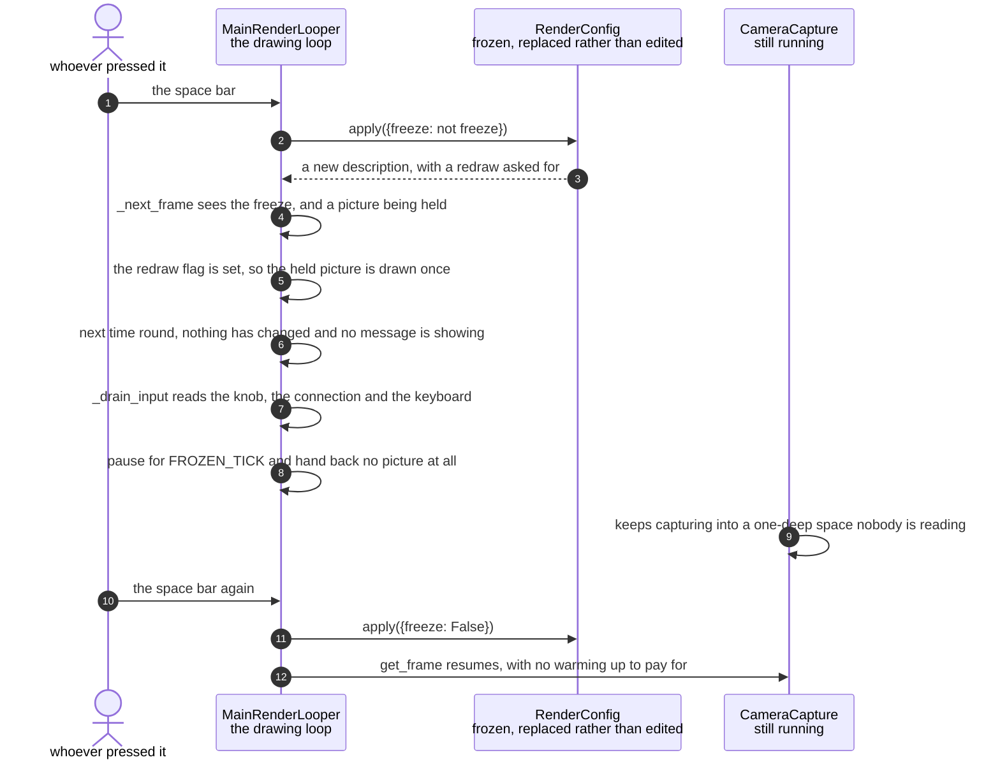

# A frozen picture is held without redrawing or SPI traffic

**Priority: `LOW`** — freezing is something a person does occasionally and deliberately, but what the loop does while frozen is the difference between an idle appliance and one quietly heating up. [What the priorities mean](../how-to-write-scenario-docs.md).

Press the space bar and the picture stops.

The obvious way to build that would be to keep the loop running exactly as
before and simply hand it the same picture every time round. That produces a
correct-looking result and a computer working flat out to redraw a picture
identical to the one already on the screen. It would also send 153,600 bytes
down the wire to the small panel[^panel] fifteen times every second, which
works out at about 2.3 megabytes a second, in order to change nothing at all.

**So the loop stops producing pictures rather than producing repeats.**
[`_next_frame`](../../ascii_camera.py#L691) hands back nothing when the picture
is frozen and nothing has changed, and the drawing is skipped altogether.

What takes its place is a short pause of [50 thousandths of a
second](../../ascii_camera.py#L96) before going round again. That works out at
twenty wake-ups a second, each of which reads the knob[^detent], collects
anything waiting on the connection[^socket] and checks for a key press. Twenty
times a second is frequent enough that a key press feels immediate to a person,
and it costs nothing measurable, because each wake-up does almost no work.

**The camera is deliberately left running.** Switching it off would be the
obvious saving, and it is the wrong trade. The camera framework[^picamera2]
takes fifteen to twenty seconds to start again, so unfreezing would stall for
longer than most freezes last in the first place. Leaving it running is free
because its holding place has room for exactly one picture: a camera nobody is
reading from simply overwrites its own single slot, and no backlog can form.

| Class | What it represents, and its part in this scenario |
|---|---|
| [`MainRenderLooper`](../../ascii_camera.py#L99) | Capture, process, draw, once for every picture. In this scenario it is the part that **declines to run**. It keeps hold of the last picture, decides that there is no new picture to make, and attends to incoming input on a timer instead |
| [`RenderConfig`](../../src/control/render_config.py#L118) | The complete, current description of how the picture should be drawn, frozen and replaced in one piece. In this scenario it is the **switch**. Freezing is an ordinary true-or-false setting, so the space bar, a typed command, a phone and the language model all reach it by exactly the same route as any other change |

## The loop stops making pictures

```mermaid
sequenceDiagram
    autonumber
    actor P as whoever pressed it
    participant Looper as MainRenderLooper<br/>the drawing loop
    participant Cfg as RenderConfig<br/>frozen, replaced rather than edited
    participant Cam as CameraCapture<br/>still running

    P->>Looper: the space bar
    Looper->>Cfg: apply({freeze: not freeze})
    Cfg-->>Looper: a new description, with a redraw asked for
    Looper->>Looper: _next_frame sees the freeze, and a picture being held
    Looper->>Looper: the redraw flag is set, so the held picture is drawn once
    Looper->>Looper: next time round, nothing has changed and no message is showing
    Looper->>Looper: _drain_input reads the knob, the connection and the keyboard
    Looper->>Looper: pause for FROZEN_TICK and hand back no picture at all
    Cam->>Cam: keeps capturing into a one-deep space nobody is reading
    P->>Looper: the space bar again
    Looper->>Cfg: apply({freeze: False})
    Looper->>Cam: get_frame resumes, with no warming up to pay for
```

| Step | Message | What is going on |
|---:|---|---|
| 1 | the space bar | [The space bar rather than a letter](../../ascii_camera.py#L609). Every other key is the first letter of what it does, and the word freeze begins with the same letter as fill[^fill], which is already taken. A pause key that nobody has to be told about is better than a memorable letter bent to fit |
| 2 | [`apply`](../../ascii_camera.py#L236)`({freeze: not freeze})` | A proposed change[^delta], exactly like every other route in. The key handler does not set the setting itself, which is what keeps a single piece of checking code in the path rather than allowing a shortcut around it |
| 3 | a new description, with a redraw asked for | The redraw flag is set by [every change of settings](../../ascii_camera.py#L236), because the small panel reads its settings from the description[^config] handed to it alongside the next picture. While frozen there is no next picture unless something asks for one |
| 4 | [`_next_frame`](../../ascii_camera.py#L691) sees the freeze, and a picture being held | The held picture is [the last one captured](../../ascii_camera.py#L691), kept for exactly this purpose. Freezing before the very first picture has arrived falls through to the camera as normal, because there is nothing yet to hold |
| 5 | the redraw flag is set, so the held picture is drawn once | The change has to reach the glass somehow. Changing the contrast while frozen redraws the *same* picture with the new setting applied, which is precisely why pointing settings at a frozen picture is worth being able to do |
| 6 | next time round, nothing has changed and no message is showing | Both conditions have to hold. A message[^notice] that is currently showing forces a redraw, because it has to appear and then remove itself four seconds later. The redraw that displays an expired message is the very one that clears it, so the situation settles itself without needing a separate timer |
| 7 | [`_drain_input`](../../ascii_camera.py#L894) reads the knob, the connection and the keyboard | This is the whole of what a frozen loop does. The knob is read here rather than on a timer of its own so that it lands in the same place a key press does: at most one change of colour scheme[^scheme] each time round, applied before anything is drawn |
| 8 | pause for [`FROZEN_TICK`](../../ascii_camera.py#L96) and hand back no picture at all | Normally the camera sets the pace of the loop by making it wait for pictures. With nothing being waited for, this pause is what stops the loop spinning uselessly and consuming a whole processor. Twenty wake-ups a second, not one of which draws anything |
| 9 | keeps capturing into a one-deep space nobody is reading | This is the cost of not switching the camera off, and it is a fixed one rather than a growing one. The [single space](../../src/capture/camera.py#L61) means each new picture replaces the unread one, so no backlog can build up however long the freeze lasts |
| 10 | the space bar again | The same key and the same route out. Freezing has no separate unfreezing path of its own |
| 11 | [`apply`](../../ascii_camera.py#L236)`({freeze: False})` | Sets the redraw flag on its way through, which is what makes the first live picture appear immediately rather than only after the next capture |
| 12 | `get_frame` resumes, with no warming up to pay for | This is the saving that justifies leaving the camera running. Had it been switched off, this is exactly where fifteen to twenty seconds of camera start-up would appear, in the middle of somebody interacting with the machine |

The status line[^statusline] shows the word `frozen` instead of a rate while
this is going on. A frozen picture stops recording the times at which pictures
were drawn, so a real figure would sit at whatever it happened to be when the
freeze began and then [drift downwards](../../ascii_camera.py#L571) as the
measuring window aged past it. That would be a number genuinely derived from
measurements which nevertheless describes nothing at all.

## What freezing does not stop

| Still running | Why |
|---|---|
| The camera | Restarting it costs fifteen to twenty seconds, and its holding place is one deep, so leaving it running costs nothing |
| The command connection, the web server, the knob | A frozen picture is still a machine somebody can talk to, and the instruction to unfreeze has to arrive somehow |
| Messages on the panel | They remove themselves on a clock, so the band has to be able to come off while the picture is frozen |
| The panel's thread | It stays awake on its own [regular wake-up](../../src/lcd/lcd_worker.py#L43), sending nothing |

What does stop is the picture-making itself: no shrinking, no choosing of
characters, no repainting of the monitor, and no traffic at all down the wire to
the panel.

## Related scenarios

- [A camera that stopped delivering frames is detected and announced](a-camera-that-stopped-delivering-frames-is-detected-and-announced.md)
  — the unintended version of a picture that has stopped changing, and why the
  two must never look alike.
- [A keypress updates the render configuration](a-keypress-updates-the-render-configuration.md)
  — the route the space bar takes, and the discipline that keeps it a proposed
  change like any other.
- [One configuration change is pushed to both displays](one-configuration-change-is-pushed-to-both-displays.md)
  — why a change made while frozen still has to reach the glass, and what the
  redraw flag is for.

### Footnotes

[^panel]: The **SPI panel** is a small screen measuring 2.4 inches across the
    diagonal, 240 dots by 320, using a controller chip called the ILI9341. It is
    connected to the computer by a simple four-wire arrangement called SPI, which
    is a common way of attaching small devices. It is driven entirely by the
    program itself, through [`ILI9341`](../../src/lcd/lcd.py#L47), with no
    separate system driver involved. In the sealed box this program is built
    for, this panel is the only screen there is. One complete picture for it is
    153,600 bytes, which has to be sent in pieces of 4 kilobytes each — see
    [`SPI_CHUNK`](../../src/lcd/lcd.py#L44) — because that is as much as the
    connection will accept at a time.

[^detent]: A **detent** is one click of the knob, meaning the position the knob
    settles into and which can be felt as a notch under the fingers.
    Electrically, one click is one complete cycle of the two switches inside the
    knob, and counting those cycles is the job of
    [`QuadratureDecoder`](../../src/control/encoder.py#L88). **Quadrature** is
    the name for the arrangement of those two switches. They are positioned a
    quarter of a cycle apart, so whichever of them changes first reveals which
    way the knob was turned. A switch bouncing without completing a full cycle
    produces nothing at all, which is exactly what is wanted.

[^socket]: A **Unix domain socket** is a connection between two programs on the
    same computer, which appears in the file system as though it were a file. It
    behaves like a network connection, with one program writing and another
    reading, except that no network is involved at any point.
    [`CommandServer`](../../src/control/command_server.py#L80) listens on one of
    these, which is how a shell, a phone or another program can reach a running
    camera without the program ever opening a network port.

[^picamera2]: **picamera2** is the Python library for the Raspberry Pi's camera,
    built on top of a lower-level piece of software called libcamera. It is the
    replacement for an older library that was simply called picamera. It owns
    the camera sensor, the settings given to the camera hardware, and the memory
    that this loop reads its pictures from.

[^fill]: **fill** and **fit** are the two ways of placing a picture into a space
    that is not the same shape as the picture. The camera picture is four units
    wide for every three units tall. Choosing `fit` keeps the whole picture and
    shrinks the grid until it matches that shape, which leaves empty cells
    around the picture. Choosing `fill` makes the grid occupy the whole space
    and trims the picture to suit, so no cell is wasted but the edges of the
    picture are lost. It is one of only two settings that change the shape of
    the grid rather than merely its appearance.

[^delta]: A **delta** is a plain list of the settings a change intends to alter,
    paired with their new values, such as `{"scheme": "amber"}`, and nothing
    else besides. Every way of asking for a change builds one of these and hands
    it to the configuration. None of them ever sets a setting directly. That is
    what keeps the checking in a single place no matter who did the asking.

[^config]: The **render configuration** is the complete, current description of
    how the picture should be drawn: which colour scheme, which ramp, how much
    contrast, which way up, and so on. It is frozen, meaning no part of the
    program ever alters one. Instead, every change produces an entirely new
    [`RenderConfig`](../../src/control/render_config.py#L118) by way of
    [`with_changes`](../../src/control/render_config.py#L141), which is also the
    only code anywhere that decides whether a proposed value is allowed. The
    list of settings, and what each one will accept, is
    [`SPECS`](../../src/control/render_config.py#L74). That single table is what
    the checking code, the `help` text, the command-line options and the
    description given to the language model are all built from.

[^notice]: A **notice** is a short message painted over the bottom of whatever
    picture is currently on the small panel. It is two lines in a fixed colour,
    laid over the top of the existing picture, and its height is set by
    [`NOTICE_LINES`](../../src/lcd/lcd_display.py#L37). It is how a box with no
    keyboard and no monitor tells somebody that something has gone wrong. It
    covers 36 of the panel's 240 rows of dots.

[^scheme]: A **colour scheme** is one of the nine named looks listed in
    [`SCHEMES`](../../src/art/palettes.py#L79). Which one is currently in use is
    part of the program's render configuration, and the knob, a key press or a
    typed command can all change it. The scheme called `grey` is the one the
    program starts with, and it is what the phrase "greyscale mode" refers to:
    characters only, worked out from the brightness part of the picture and
    nothing else. Only the scheme called `live` reads the colour parts, through
    [`colour_grid`](../../src/capture/image_processor.py#L187). The remaining
    seven are tints, such as green phosphor, amber CRT and e-ink on paper. A
    tint recolours the same greyscale picture using two fixed colours, so it
    never looks at the colour parts either.

[^statusline]: The **status line** is the single line of readings underneath the
    picture, showing the colour scheme, the ramp, how many pictures a second are
    being drawn, and the size of the grid. It is built by
    [`status_line`](../../src/hdmi/status_line.py#L76). It is also where a
    refusal or a short message appears when the program is running on an
    ordinary monitor, because there is nowhere else on a monitor to put one.
