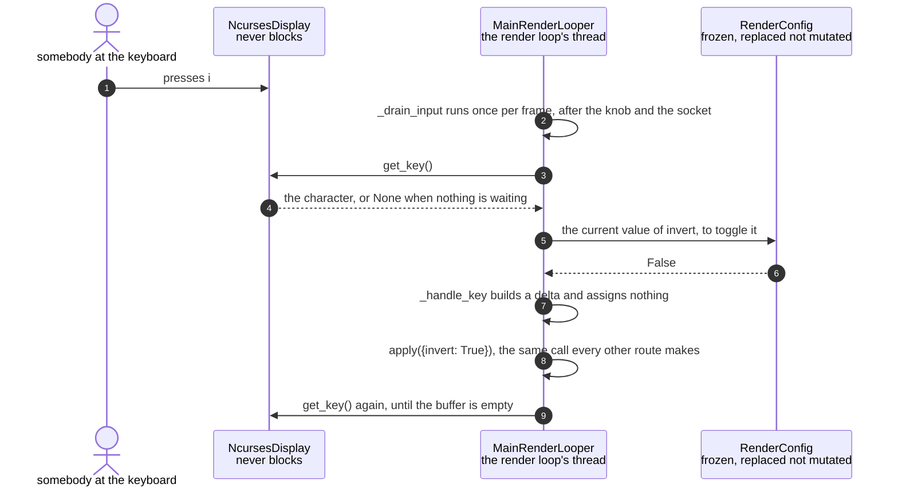

# A keypress updates the render configuration

**Priority: `MEDIUM`** — the fastest route into the settings, and the one the enclosure never uses: `--no-terminal` means there is no keyboard to press. [What the priorities mean](../how-to-write-scenario-docs.md).

Somebody presses `i` and the picture inverts. It is the shortest path in the
app — no socket, no parse, no network — and its value is that it is *only*
short, not different. A key builds the same kind of delta a typed line does and
hands it to the same `apply`, so a key cannot reach a setting the socket
cannot, or set a value the validator would refuse.

That was not always so, and the history is the reason the code looks as it
does. Each key used to assign its setting directly, which meant every branch
had to remember the consequences of its own change — that `invert` also
rebuilds the ASCII generator, that `fill` also invalidates the cached grid.
A new setting had to remember all of them. **Every branch now builds a delta
and none assigns anything**, so the knowledge lives in one place.

Two details in the reading are worth having. Keys are **drained**, not sampled:
a single read per frame would fall behind a burst of keypresses at fifteen
frames a second, so the loop consumes everything buffered before fetching the
next frame. And contrast is *nudged* rather than set — `+` adds 0.1 and lets
`apply` clamp it — so the end stops need no arithmetic in the key handler.

| Class | What it represents, and its part in this scenario |
|---|---|
| [`NcursesDisplay`](../../src/hdmi/ncurses_display.py#L34) | The HDMI terminal. Here it is the **keyboard**, and a non-blocking one: [`get_key`](../../src/hdmi/ncurses_display.py#L265) returns a character or `None` and never waits, because the render loop cannot afford to |
| [`MainRenderLooper`](../../ascii_camera.py#L98) | The one object the process is hung off. Here it is the **translator**: [`_handle_key`](../../ascii_camera.py#L608) turns a character into a delta and hands it on, and is the only code in the app that knows which key means what |
| [`RenderConfig`](../../src/control/render_config.py#L118) | The complete live render state, frozen and replaced rather than changed. Here it is the **judge and the reference**: a key that toggles reads the current value from it, and the delta it produces is checked by it |

## One keypress, between two frames

| Step | Message | What is going on |
|---:|---|---|
| 1 | presses i | One of about a dozen live keys. `q` is the only one that does not produce a delta — it returns `False` and stops the loop, which is the same mechanism a signal uses rather than a second way to quit |
| 2 | [`_drain_input`](../../ascii_camera.py#L833) runs once per frame, after the knob and the socket | All three input routes are read at the same point in the loop, so a key, a detent and a typed line land in the same place and in a defined order. The knob is read here rather than on a timer of its own for exactly that reason |
| 3 | [`get_key`](../../src/hdmi/ncurses_display.py#L265)`()` | Non-blocking, always. A blocking read would stop the picture whenever nobody was typing, which is most of the time |
| 4 | the character, or None when nothing is waiting | `None` ends the drain. A window resize arrives here too, as the pseudo-key `RESIZE`, which is why a resize and a keypress cannot race — they are the same queue |
| 5 | the current value of invert, to toggle it | A toggle has to read before it can flip. Reading from the config rather than from a local copy is what stops the key and the socket disagreeing about what `invert` currently is |
| 6 | False | The config is frozen, so this value cannot change underneath the handler between reading it and building the delta |
| 7 | [`_handle_key`](../../ascii_camera.py#L608) builds a delta and assigns nothing | The rule the whole method is written to. A branch that assigned `self.config.invert` directly would work and would silently skip the ASCII rebuild, which is the class of bug this shape makes impossible |
| 8 | [`apply`](../../ascii_camera.py#L235)`({invert: True})`, the same call every other route makes | The convergence point. By the time this is called, nothing distinguishes the keypress from a typed line, a knob detent or a phrase a language model turned into a delta — and `note=True` is the default here, so a refusal is drawn on the picture rather than returned to a caller |
| 9 | [`get_key`](../../src/hdmi/ncurses_display.py#L265)`()` again, until the buffer is empty | The drain. At fifteen frames a second a single read per frame would lag behind anyone typing quickly, and the lag would grow rather than settle |

No thread bands: everything here is the render loop's own thread, which is the
only thread a setting may be changed on. The keyboard is read from it, the
delta is built on it and the change is applied on it — the shortest route in
the app precisely because it never leaves the thread that draws.

`s` is the exception worth noting: it does not build a delta but calls
[`step`](../../src/control/scheme_cycle.py#L133) on the scheme cycle, so that
the key and the knob walk the schemes by one piece of code rather than two that
have to agree.

## Related scenarios

- [A typed command updates the render configuration](a-typed-command-updates-the-render-configuration.md)
  — the same `apply`, reached the long way round, and where a line's types get
  settled first.
- [A render configuration change is refused](a-render-configuration-change-is-refused.md)
  — what a key gets when it asks for something impossible, and why it appears
  on the picture rather than in a reply.
- [One configuration change is pushed to both displays](one-configuration-change-is-pushed-to-both-displays.md)
  — what happens after `apply` accepts, and the consequences a key no longer
  has to remember.
- [A rotary encoder detent changes the colour scheme](a-rotary-encoder-detent-changes-the-colour-scheme.md)
  — the `s` key's other driver, walking the schemes through the same code.
- [The character grid is drawn on the HDMI terminal](the-character-grid-is-drawn-on-the-hdmi-terminal.md)
  — the display this keyboard belongs to, and the one the enclosure does not
  have.
