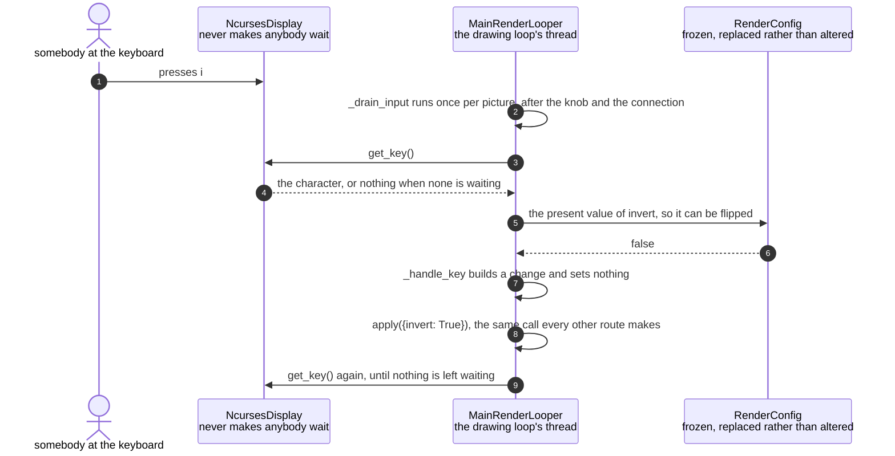

# A keypress updates the render configuration

**Priority: `MEDIUM`** — the quickest route into the settings, and the one the sealed box never uses, because starting with `--no-terminal`[^headless] means there is no keyboard to press. [What the priorities mean](../how-to-write-scenario-docs.md).

Somebody presses `i` and the picture turns inside out, light for dark.

This is the shortest path anywhere in the program. There is no connection[^socket]
to open, no text to interpret, and no network involved. The value of this
scenario is that the path is *only* shorter, and not in any way different. A key
press builds the same kind of change[^delta] that a typed line builds, and hands
it to the same applying step. So a key cannot reach a setting that the typed
route cannot reach, and it cannot set a value the checking code would refuse.

It was not always arranged this way, and the history explains why the code looks
as it does. Each key used to set its own setting directly. That meant every
branch had to remember the consequences of its own change: that inverting[^invert]
also means rebuilding the table of characters, and that switching to fill[^fill]
also means discarding the remembered grid[^grid] size. Every newly added setting
had to remember every one of those consequences. **Now every branch builds a
change and none of them sets anything**, so that knowledge lives in exactly one
place instead of being copied into each branch.

Two details of how keys are read are worth having.

The first is that keys are **emptied out**, not merely sampled. Reading a single
key each time a picture is drawn would fall behind somebody typing quickly. At
fifteen pictures a second, a person typing faster than fifteen characters a
second would build up a backlog that never cleared, and the delay would grow
rather than settle. So the loop consumes every key already waiting before it
goes back for the next camera picture.

The second is that contrast is *nudged* rather than set outright. Pressing `+`
adds 0.1 to whatever the contrast currently is, and leaves the applying step to
bring the result back inside the allowed range. The step of 0.1 is the smallest
that the setting distinguishes: contrast runs from 0.1 at the lowest to 4.0 at
the highest, so a tenth at a time crosses the entire range in about thirty-nine
presses, which is fine for a key somebody holds down. Nudging also means the key
handler needs no arithmetic of its own for the two ends of the range, because
reaching the top and staying there is already what the applying step does.

| Class | What it represents, and its part in this scenario |
|---|---|
| [`NcursesDisplay`](../../src/hdmi/ncurses_display.py#L34) | An ordinary monitor connected by an HDMI cable, together with its keyboard. In this scenario it is the **keyboard**, and a keyboard that never makes anybody wait. [`get_key`](../../src/hdmi/ncurses_display.py#L265) hands back a character if one is ready and nothing at all if none is, and it never pauses, because the drawing loop cannot afford to be paused |
| [`MainRenderLooper`](../../ascii_camera.py#L99) | The single object the whole running program hangs from. In this scenario it is the **translator**. [`_handle_key`](../../ascii_camera.py#L609) turns a character into a proposed change and passes it on, and it is the only code anywhere in the program that knows which key means what |
| [`RenderConfig`](../../src/control/render_config.py#L118) | The complete, current description of how the picture should be drawn, frozen so that it is replaced rather than altered. In this scenario it is both **the reference and the judge**. A key that flips a setting has to read the present value from it first, and the change that key produces is then checked by it |

## One key press, between two pictures

```mermaid
sequenceDiagram
    autonumber
    actor User as somebody at the keyboard
    participant Term as NcursesDisplay<br/>never makes anybody wait
    participant App as MainRenderLooper<br/>the drawing loop's thread
    participant Cfg as RenderConfig<br/>frozen, replaced rather than altered

    User->>Term: presses i
    App->>App: _drain_input runs once per picture, after the knob and the connection
    App->>Term: get_key()
    Term-->>App: the character, or nothing when none is waiting
    App->>Cfg: the present value of invert, so it can be flipped
    Cfg-->>App: false
    App->>App: _handle_key builds a change and sets nothing
    App->>App: apply({invert: True}), the same call every other route makes
    App->>Term: get_key() again, until nothing is left waiting
```

| Step | Message | What is going on |
|---:|---|---|
| 1 | presses i | Twelve keys are live altogether: `q` to quit, `r` to rotate, `s` for the next colour scheme[^scheme], `f` to switch between filling and fitting, `i` to invert, `c` to change the ramp, `+` and `-` for contrast, `a` for automatic levels, the space bar to freeze, `t` to choose which screen a setting applies to, and `l` for the panel's text size. A thirteenth entry in the same piece of code is not a key at all: it is the window being resized. The key `q` is the only one of the twelve that produces no change. It reports that the loop should stop, which is the very same mechanism a signal[^signals] uses, rather than being a second and separate way to quit |
| 2 | [`_drain_input`](../../ascii_camera.py#L894) runs once per picture, after the knob and the connection | All three ways in are read at the same point in the loop, so a key press, a click of the knob[^detent] and a typed line all land in the same place and in a settled order. The knob is read here rather than on a timer of its own for precisely that reason |
| 3 | [`get_key`](../../src/hdmi/ncurses_display.py#L265)`()` | This never pauses, under any circumstances. A reading that waited for a key would stop the picture entirely whenever nobody happened to be typing, which is almost all of the time |
| 4 | the character, or nothing when none is waiting | Receiving nothing is what ends the emptying-out. A window being resized arrives here too, disguised as a key called `RESIZE`, and that is why a resize and a key press can never collide with one another. They are both waiting in the same queue and are taken out in order |
| 5 | the present value of invert, so it can be flipped | Anything that flips a setting has to read it before it can reverse it. Reading from the shared description[^config] rather than from a private copy is what stops the keyboard and the typed connection from disagreeing about what inverting currently is set to |
| 6 | false | Because the description is frozen, this value cannot possibly change underneath the handler in the moment between reading it and building the change from it |
| 7 | [`_handle_key`](../../ascii_camera.py#L609) builds a change and sets nothing | This is the rule the whole method is written to obey. A branch that set the invert setting directly would appear to work perfectly, and would silently skip rebuilding the table of characters. That is exactly the kind of fault this shape makes impossible rather than merely unlikely |
| 8 | [`apply`](../../ascii_camera.py#L236)`({invert: True})`, the same call every other route makes | This is where all the routes meet. By the time this call is made, nothing whatsoever distinguishes the key press from a typed line, a click of the knob, or a phrase a language model turned into a change. Here `note=True` is the default, which means a refusal is drawn onto the picture itself rather than handed back to a caller, because there is no caller waiting |
| 9 | [`get_key`](../../src/hdmi/ncurses_display.py#L265)`()` again, until nothing is left waiting | This is the emptying-out. At fifteen pictures a second, taking one key per picture would fall behind anybody typing at speed, and as explained above that delay would grow rather than settle down |

There are no coloured thread bands in this diagram. Everything here happens on
the drawing loop's own thread, which is the only thread on which a setting may
ever change. The keyboard is read from that thread, the change is built on it,
and the change is applied on it. That is exactly why this is the shortest route
in the program: it never leaves the thread that does the drawing.

The `s` key is the one exception worth pointing out. It does not build a change
of its own. Instead it calls [`step`](../../src/control/scheme_cycle.py#L133) on
the piece of code that walks through the colour schemes, so that the key and the
knob move through those schemes using one piece of code rather than two that
would have to be kept in agreement with each other.

## Related scenarios

- [A typed command updates the render configuration](a-typed-command-updates-the-render-configuration.md)
  — the same applying step, reached by the long way round, and where a typed
  line's values have their types settled first.
- [A render configuration change is refused](a-render-configuration-change-is-refused.md)
  — what a key press gets back when it asks for something impossible, and why
  the answer appears on the picture rather than in a reply.
- [One configuration change is pushed to both displays](one-configuration-change-is-pushed-to-both-displays.md)
  — what happens once the applying step accepts, and the consequences a key
  press no longer has to remember for itself.
- [A rotary encoder detent changes the colour scheme](a-rotary-encoder-detent-changes-the-colour-scheme.md)
  — the other thing that drives the `s` key's behaviour, walking through the
  schemes by way of the same code.
- [The character grid is drawn on the HDMI terminal](the-character-grid-is-drawn-on-the-hdmi-terminal.md)
  — the screen this keyboard belongs to, and the one the sealed box does not
  have.

### Footnotes

[^headless]: The option `--no-terminal` runs the program with no monitor
    picture at all. A stand-in object is used, offering all the same methods as
    a real display but doing nothing when they are called. The sealed box starts
    up that way, because there is no monitor attached to it, so the cost of
    building a monitor picture is not so much wasted as never paid in the first
    place.

[^socket]: A **Unix domain socket** is a connection between two programs on the
    same computer, which appears in the file system as though it were a file. It
    behaves like a network connection, with one program writing and another
    reading, except that no network is involved at any point.
    [`CommandServer`](../../src/control/command_server.py#L80) listens on one of
    these, which is how a shell, a phone or another program can reach a running
    camera without the program ever opening a network port.

[^delta]: A **delta** is a plain list of the settings a change intends to alter,
    paired with their new values, such as `{"scheme": "amber"}`, and nothing
    else besides. Every way of asking for a change builds one of these and hands
    it to the configuration. None of them ever sets a setting directly. That is
    what keeps the checking in a single place no matter who did the asking.

[^invert]: The **invert** setting reverses the ramp, so that bright parts of the
    scene are drawn with the dark end of the character sequence instead. In
    effect it turns a light-on-dark picture into a dark-on-light one. It
    reverses the characters and deliberately leaves the list of positions
    untouched, which is how both screens stay in agreement about which
    character a given brightness deserves.

[^fill]: **fill** and **fit** are the two ways of placing a picture into a space
    that is not the same shape as the picture. The camera picture is four units
    wide for every three units tall. Choosing `fit` keeps the whole picture and
    shrinks the grid until it matches that shape, which leaves empty cells
    around the picture. Choosing `fill` makes the grid occupy the whole space
    and trims the picture to suit, so no cell is wasted but the edges of the
    picture are lost. It is one of only two settings that change the shape of
    the grid rather than merely its appearance.

[^grid]: The **character grid** is how this program holds a picture: as a
    rectangle of character cells rather than of dots. Each cell is one
    character, chosen according to how bright the patch of camera picture behind
    it happens to be. [`to_grid`](../../src/capture/image_processor.py#L172) is
    the code that reduces a picture to that grid. How many cells there are
    depends on where the picture is being sent — 64 across and 24 down on the
    small attached panel at the usual text size, and whatever fits the window
    when the picture goes to an ordinary monitor instead.

[^scheme]: A **colour scheme** is one of the nine named looks listed in
    [`SCHEMES`](../../src/art/palettes.py#L79). Which one is currently in use is
    part of the program's render configuration, and the knob, a key press or a
    typed command can all change it. The scheme called `grey` is the one the
    program starts with, and it is what the phrase "greyscale mode" refers to:
    characters only, worked out from the brightness part of the picture and
    nothing else. Only the scheme called `live` reads the colour parts, through
    [`colour_grid`](../../src/capture/image_processor.py#L187). The remaining
    seven are tints, such as green phosphor, amber CRT and e-ink on paper. A
    tint recolours the same greyscale picture using two fixed colours, so it
    never looks at the colour parts either.

[^signals]: A **signal** is a short message the operating system delivers to a
    running program. `SIGTERM` is the one that politely asks a program to stop,
    and it is what `systemctl stop` sends. `SIGINT` is the one sent by pressing
    ctrl-c at a keyboard. Python's own behaviour when `SIGTERM` arrives is to
    exit immediately without tidying up, which means no clean-up code runs at
    all. That is exactly why this program installs a handler of its own. The
    handler does nothing except set a flag, leaving the ordinary path to do the
    releasing of the hardware in its usual order.

[^detent]: A **detent** is one click of the knob, meaning the position the knob
    settles into and which can be felt as a notch under the fingers.
    Electrically, one click is one complete cycle of the two switches inside the
    knob, and counting those cycles is the job of
    [`QuadratureDecoder`](../../src/control/encoder.py#L88). **Quadrature** is
    the name for the arrangement of those two switches. They are positioned a
    quarter of a cycle apart, so whichever of them changes first reveals which
    way the knob was turned. A switch bouncing without completing a full cycle
    produces nothing at all, which is exactly what is wanted.

[^config]: The **render configuration** is the complete, current description of
    how the picture should be drawn: which colour scheme, which ramp, how much
    contrast, which way up, and so on. It is frozen, meaning no part of the
    program ever alters one. Instead, every change produces an entirely new
    [`RenderConfig`](../../src/control/render_config.py#L118) by way of
    [`with_changes`](../../src/control/render_config.py#L141), which is also the
    only code anywhere that decides whether a proposed value is allowed. The
    list of settings, and what each one will accept, is
    [`SPECS`](../../src/control/render_config.py#L74). That single table is what
    the checking code, the `help` text, the command-line options and the
    description given to the language model are all built from.
