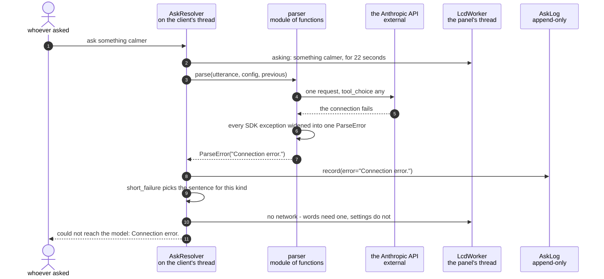

# A model parse fails and the panel says which kind of failure it was

**Priority: `LOW`** — it needs the optional ask[^ask] path to have been switched on and then to have gone wrong, but it is where the app decides whether a failure is a sentence or a silence. [What the priorities mean](../how-to-write-scenario-docs.md).

`ask something calmer` reaches for a network, a key and a model, and any of the
three can fail. The camera's own settings are unaffected — every typed command
still works — so the only real question is what the person standing in front of
the box is told.

**Nothing is the wrong answer, and a traceback is a worse one.** The
panel[^panel] is 240 pixels tall and has [44 characters to work
with](the-spi-panel-shows-a-start-up-screen-before-the-first-camera-frame.md).
[`short_failure`](../../src/language/resolver.py#L180) exists to turn whatever
the SDK[^sdk] raised into a sentence that fits, and it keeps the full text for
the socket[^socket] reply, where whoever typed the command can read a whole
error.

**It sorts by what the person should do next, not by exception class.** "The
network is down" and "the key was refused" call for different actions, and that
difference is worth the two words it costs. It stops splitting exactly where the
advice stops differing: two answer failures come out as `could not ask the
model`, because for both of them the move is to try again.

| Class | What it represents, and its part in this scenario |
|---|---|
| [`AskResolver`](../../src/language/resolver.py#L33) | The whole of the ask path, and the one part of the app allowed to be slow. Here it is the **translator**: it catches the error, shortens it for the panel, keeps it whole for the socket, and writes it down |
| [`parser`](../../src/language/parser.py) | A module of functions, not a class. Here it is the **thing that fails**: four separate places raise, covering the network, the model's own refusal, and two shapes of answer this code cannot read |
| [`ParseError`](../../src/language/parser.py#L270) | One exception for every way a parse can end badly. Here it is the **narrow waist**: the caller's job is to put something on a panel, not to tell an `APIConnectionError` from a `RateLimitError` |

## A parse that does not come back

| Step | Message | What is going on |
|---:|---|---|
| 1 | `ask something calmer` | A phrase the [shortcut table](a-spoken-phrase-is-answered-from-the-shortcut-table-with-no-model-call.md) deliberately declines to answer, so it reaches the model. Had the table known it, none of this would run |
| 2 | `asking: something calmer`, for 22 seconds | Said *before* the attempt, because a parse takes seconds and a panel with no spinner is indistinguishable from a camera ignoring you. The duration is [the parser's timeout plus two](../../src/language/parser.py#L95) — the notice[^notice] must not expire while the request is still out, which the [default four seconds](../../src/lcd/lcd_worker.py#L58) got wrong |
| 3 | [`parse`](../../src/language/parser.py#L401)`(utterance, config, previous)` | The settings go with the utterance, because "calmer" has no meaning without a "than what" |
| 4 | one request, [tool_choice](../../src/language/parser.py#L204) any | One of two tools, never prose. A parser that can reply with a paragraph has a third output shape nothing downstream handles |
| 5 | the connection fails | Or the key is rejected, or it times out at [twenty seconds](../../src/language/parser.py#L95), or the rate limit[^ratelimit] is hit. From here they are the same event |
| 6 | every SDK exception widened into one `ParseError` | [Deliberately broad](../../src/language/parser.py#L401). The class name is in the log either way, and the caller has a 320-pixel band to fill rather than a decision to make |
| 7 | `ParseError("Connection error.")` | The full text, unshortened. This is what the socket reply will carry |
| 8 | [`record`](../../src/language/resolver.py#L216)`(error="Connection error.")` | Written before anything is said, so a failure that also fails to display is still on disk. The outcome is `error`, which is what separates it from a decline in the log |
| 9 | [`short_failure`](../../src/language/resolver.py#L180) picks the sentence for this kind | Substring matching on the lowercased text rather than exception types, because what arrives here is already a string and the SDK's class names are not a stable interface |
| 10 | `no network - words need one, settings do not` | The second half is the useful half. It tells somebody whose network is down that the camera is not broken and every other command still works |
| 11 | `could not reach the model: Connection error.` | The long form, back down the socket. Whoever typed it gets the real error; the panel gets the summary |

Everything above runs on the client's own thread. The render loop is not a
participant and the picture never stops — which is the point of putting the
whole ask path on the socket thread in the first place.

## Which failures are told apart

| What went wrong | What the panel says |
|---|---|
| The network is down or unreachable | `no network - words need one, settings do not` |
| The request timed out at 20 s | `the model took too long - try again` |
| The key was missing, wrong or rejected | `the API key was refused`[^apikey] |
| Too many requests too quickly | `asking too fast - wait a moment` |
| The model's safety classifiers [refused](../../src/language/parser.py#L401) | `the model would not answer - rephrase it` |
| The model [called neither tool](../../src/language/parser.py#L401) | `could not ask the model` |
| The model asked to [change nothing, with no reason](../../src/language/parser.py#L401) | `could not ask the model` |

Every one of those sentences fits on a single 44-character line — the longest is
44 exactly — which is a constraint the wording was written to and not a
coincidence.

**The last two share a sentence, and that is the deliberate part.** A malformed
answer and an answer that changed nothing are different events, and the panel
cannot tell them apart. It does not need to: neither is the asker's doing and
the move for both is to try again, which is what `could not ask the model`
already implies. The log keeps the full text for anyone asking a sharper
question later.

**The refusal used to share it too, and should not have.** Retrying a request
the model's own classifiers rejected cannot work, so advice that amounts to
"try again" is advice guaranteed to fail — and the likeliest reading of a
camera that says nothing useful twice is that the camera is broken. It now says
`the model would not answer - rephrase it`, which is the one action that can
succeed. That branch is [matched
first](../../src/language/resolver.py#L180) and on the whole phrase
`parser.py` writes rather than on the bare word *declined*, which would also
catch a declined card — a billing problem wearing the same word and calling for
the opposite advice.

## Related scenarios

- [A spoken phrase is turned into a config delta by the language model](a-spoken-phrase-is-turned-into-a-config-delta-by-the-language-model.md)
  — the same call when it works, and the notice this one replaces.
- [The language model declines a request it cannot satisfy](the-language-model-declines-a-request-it-cannot-satisfy.md)
  — the other unhappy ending, and why a decline is an answer rather than a
  failure.
- [A failure notice is painted over the picture on the SPI panel](a-failure-notice-is-painted-over-the-picture-on-the-spi-panel.md)
  — how the sentence chosen here actually reaches the glass.
- [Every ask is recorded with its source, its cost and its elapsed time](every-ask-is-recorded-with-its-source-its-cost-and-its-elapsed-time.md)
  — where the unshortened error goes, and why the outcome field matters.

### Footnotes

[^ask]: An **ask** is a request in words rather than in settings — "make it
    warmer" — as opposed to a typed command, which already names the setting.
    It arrives as [`Ask`](../../src/control/command_server.py#L55), and
    [`AskResolver`](../../src/language/resolver.py#L33) decides whether the
    shortcut table can answer it or the language model has to.

[^panel]: The **SPI panel** is a 2.4 inch ILI9341 LCD, 240x320, wired to the
    Pi's SPI bus — a four-wire serial bus for talking to peripherals — and
    driven from userspace by [`ILI9341`](../../src/lcd/lcd.py#L47) with no
    kernel driver behind it. In the sealed enclosure it is the only display
    there is. One full frame is 153,600 bytes, sent in
    [`SPI_CHUNK`](../../src/lcd/lcd.py#L44) pieces of 4 KB because that is what
    the driver's buffer holds.

[^sdk]: The vendor's client library for talking to the model's API. Its
    exceptions are the vendor's, and they are deliberately not allowed out of
    [`parser`](../../src/language/parser.py): everything it can raise is
    widened into one `ParseError`, so no caller has to know one vendor error
    from another to put a sentence on a panel.

[^socket]: A **Unix domain socket** is a file-backed pipe between processes on
    one machine — the same read-and-write as a network socket, with no network.
    [`CommandServer`](../../src/control/command_server.py#L80) listens on one,
    which is how a shell, a phone or a script reaches a running camera without
    the app ever opening a port.

[^notice]: A **notice** is a short message painted over the bottom of the
    picture on the panel — two lines in fixed ink over whatever is underneath,
    sized by [`NOTICE_LINES`](../../src/lcd/lcd_display.py#L37). It is how a
    box with no keyboard and no terminal says something went wrong, and it
    covers 36 of the panel's 240 rows.

[^ratelimit]: A **sliding window** rate limit: the last sixty seconds of
    admitted requests are remembered, and the twenty-first inside that window
    is refused — [`AskLimit`](../../src/control/web_server.py#L167). It counts
    only the requests that reach the model and cost money; settings are free
    and unlimited. What it is really defending against is not an attacker but
    a phone left face up, posting the same form for hours.

[^apikey]: The key that authenticates a call to the model's API, read from
    [`KEY_FILE`](../../src/language/parser.py#L101) by
    [`api_key`](../../src/language/parser.py#L301). Without one the whole model
    path is switched off rather than failing at the call, which is why every
    path that needs it is `LOW` priority: the appliance runs without it.
