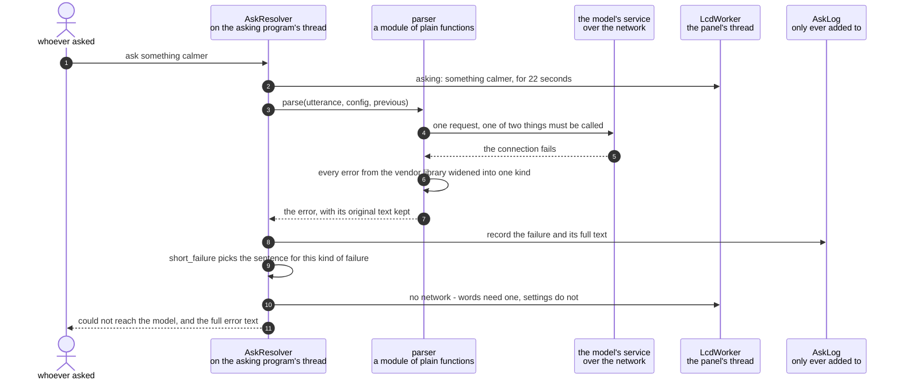

# A model parse fails and the panel says which kind of failure it was

**Priority: `LOW`** — it needs the optional path for requests in words[^ask] to have been switched on and then to have gone wrong, but it is where the program decides whether a failure becomes a sentence or a silence. [What the priorities mean](../how-to-write-scenario-docs.md).

Typing `ask something calmer` reaches for a network, a key and a language model,
and any one of those three can fail.

The camera's own settings are entirely unaffected when that happens. Every typed
command still works exactly as before. So the only real question is what the
person standing in front of the box is told.

**Saying nothing is the wrong answer, and showing a page of error text is a
worse one.** The small panel[^panel] is 240 dots tall and has room for [44
characters on a line](a-failure-notice-is-painted-over-the-picture-on-the-spi-panel.md).
[`short_failure`](../../src/language/resolver.py#L180) exists to turn whatever
the vendor's library[^sdk] reported into a sentence that fits inside that, while
keeping the full text for the reply sent back down the connection[^socket],
where whoever typed the command can read the whole thing.

**It sorts failures by what the person should do next, rather than by what kind
of error was raised.** "The network is down" and "the key was refused" call for
completely different actions, and that difference is worth the two extra words
it costs to distinguish them.

Equally, it stops making distinctions at exactly the point where the advice
stops differing. Two different malformed answers both come out as `could not ask
the model`, because for both of them the sensible move is simply to try again.

| Class | What it represents, and its part in this scenario |
|---|---|
| [`AskResolver`](../../src/language/resolver.py#L33) | The whole path for requests phrased in words, and the one part of the program permitted to be slow. In this scenario it is the **translator**. It catches the error, shortens it for the panel, keeps it whole for the connection, and writes it down |
| [`parser`](../../src/language/parser.py) | A module of plain functions rather than a class. In this scenario it is the **thing that fails**. Four separate places within it report a problem, covering the network, the model's own refusal to answer, and two shapes of reply this code cannot make sense of |
| [`ParseError`](../../src/language/parser.py#L270) | A single kind of error covering every way a request can end badly. In this scenario it is the **narrow waist**. The caller's job is to put something on a panel, not to tell one vendor error apart from another |

## A parse that does not come back

```mermaid
sequenceDiagram
    autonumber
    actor Asker as whoever asked
    participant App as AskResolver<br/>on the asking program's thread
    participant Pr as parser<br/>a module of plain functions
    participant API as the model's service<br/>over the network
    participant Lcd as LcdWorker<br/>the panel's thread
    participant Log as AskLog<br/>only ever added to

    Asker->>App: ask something calmer
    App->>Lcd: asking: something calmer, for 22 seconds
    App->>Pr: parse(utterance, config, previous)
    Pr->>API: one request, one of two things must be called
    API-->>Pr: the connection fails
    Pr->>Pr: every error from the vendor library widened into one kind
    Pr-->>App: the error, with its original text kept
    App->>Log: record the failure and its full text
    App->>App: short_failure picks the sentence for this kind of failure
    App->>Lcd: no network - words need one, settings do not
    App-->>Asker: could not reach the model, and the full error text
```

| Step | Message | What is going on |
|---:|---|---|
| 1 | `ask something calmer` | A phrase the [table of known phrases](a-spoken-phrase-is-answered-from-the-shortcut-table-with-no-model-call.md) deliberately declines to answer, so it reaches the model. Had the table known it, none of this would ever run |
| 2 | `asking: something calmer`, for 22 seconds | Said *before* the attempt is made, because a request takes seconds and a panel with nothing moving on it is indistinguishable from a camera that is ignoring you. The 22 comes from [the request's own time limit of 20 seconds](../../src/language/parser.py#L95) plus two. The message[^notice] must not disappear while the request is still outstanding, which the ordinary [four seconds](../../src/lcd/lcd_worker.py#L58) would have done |
| 3 | [`parse`](../../src/language/parser.py#L401)`(utterance, config, previous)` | The current settings travel with the words, because "calmer" has no meaning at all without a "calmer than what" |
| 4 | one request, [one of two things must be called](../../src/language/parser.py#L204) | Either change a setting or decline, and never ordinary prose. A translator that can reply with a paragraph has a third kind of output that nothing further along knows how to handle |
| 5 | the connection fails | Or the key is rejected, or it runs past the twenty-second limit, or too many requests have been made too quickly[^ratelimit]. From this point onwards they are all the same event |
| 6 | every error from the vendor library widened into one kind | [Deliberately broad](../../src/language/parser.py#L401). The original class name is written to the log either way, and the caller has a band 320 dots wide to fill rather than a decision to make |
| 7 | the error, with its original text kept | The full, unshortened text. This is what the reply sent back down the connection will carry |
| 8 | [`record`](../../src/language/resolver.py#L216) the failure and its full text | Written down *before* anything is displayed, so that a failure which then also fails to display is still recorded on disk. The outcome is noted as an error, which is what separates it in the log from the model declining |
| 9 | [`short_failure`](../../src/language/resolver.py#L180) picks the sentence for this kind of failure | Matched by looking for phrases inside the lowercased text rather than by examining error types, because what arrives here is already a piece of text, and the vendor's class names are not something this program can rely on staying the same |
| 10 | `no network - words need one, settings do not` | The second half is the useful half. It tells somebody whose network is down that the camera itself is not broken and that every other command still works perfectly |
| 11 | could not reach the model, and the full error text | The long form, sent back down the connection. Whoever typed the request gets the real error; the panel gets the summary |

All of this runs on the asking program's own thread. The drawing loop is not a
participant and the picture never stops, which is the entire point of putting
this path on that thread in the first place.

## Which failures are told apart

| What went wrong | What the panel says |
|---|---|
| The network is down or unreachable | `no network - words need one, settings do not` |
| The request ran past its twenty-second limit | `the model took too long - try again` |
| The key was missing, wrong or rejected | `the API key was refused`[^apikey] |
| Too many requests were made too quickly | `asking too fast - wait a moment` |
| The model's own safety checks [refused it](../../src/language/parser.py#L401) | `the model would not answer - rephrase it` |
| The model [called neither of the two things](../../src/language/parser.py#L401) | `could not ask the model` |
| The model asked to [change nothing, and gave no reason](../../src/language/parser.py#L401) | `could not ask the model` |

Every one of those sentences fits on a single line of 44 characters. The longest
is exactly 44. That is a constraint the wording was written to rather than a
happy coincidence, and it is why none of them is a full sentence with a verb.

**The last two share a sentence, and that sharing is deliberate.** A malformed
answer and an answer that changed nothing are genuinely different events, and the
panel cannot tell them apart. It does not need to. Neither is the fault of the
person asking, and the sensible move for both is to try again, which is exactly
what `could not ask the model` already implies. The log keeps the full text for
anybody asking a sharper question later on.

**The refusal used to share that sentence too, and should not have.** Trying
again after the model's own safety checks have rejected a request cannot
possibly work, so advice amounting to "try again" is advice guaranteed to fail.
The likeliest reading of a camera that says something unhelpful twice in a row is
that the camera is broken.

It now says `the model would not answer - rephrase it`, which names the one
action that can actually succeed. That case is [checked
first](../../src/language/resolver.py#L180), and it is matched on the whole
phrase the parsing code writes rather than on the bare word "declined". Matching
the bare word would also catch a declined payment card, which is a billing
problem wearing the same word and calling for the opposite advice entirely.

## Related scenarios

- [A spoken phrase is turned into a config delta by the language model](a-spoken-phrase-is-turned-into-a-config-delta-by-the-language-model.md)
  — the same request when it works, and the message this one replaces.
- [The language model declines a request it cannot satisfy](the-language-model-declines-a-request-it-cannot-satisfy.md)
  — the other unhappy ending, and why a decline counts as an answer rather than
  a failure.
- [A failure notice is painted over the picture on the SPI panel](a-failure-notice-is-painted-over-the-picture-on-the-spi-panel.md)
  — how the sentence chosen here actually reaches the glass, and where the
  44-character limit comes from.
- [Every ask is recorded with its source, its cost and its elapsed time](every-ask-is-recorded-with-its-source-its-cost-and-its-elapsed-time.md)
  — where the unshortened error ends up, and why the outcome field matters.

### Footnotes

[^ask]: An **ask** is a request phrased in ordinary words, such as "make it
    warmer", rather than one that already names a setting and a value. It
    arrives as an [`Ask`](../../src/control/command_server.py#L55), and
    [`AskResolver`](../../src/language/resolver.py#L33) decides whether a table
    of known phrases can answer it or whether a language model has to be asked.

[^panel]: The **SPI panel** is a small screen measuring 2.4 inches across the
    diagonal, 240 dots by 320, using a controller chip called the ILI9341. It is
    connected to the computer by a simple four-wire arrangement called SPI, which
    is a common way of attaching small devices. It is driven entirely by the
    program itself, through [`ILI9341`](../../src/lcd/lcd.py#L47), with no
    separate system driver involved. In the sealed box this program is built
    for, this panel is the only screen there is. One complete picture for it is
    153,600 bytes, which has to be sent in pieces of 4 kilobytes each — see
    [`SPI_CHUNK`](../../src/lcd/lcd.py#L44) — because that is as much as the
    connection will accept at a time.

[^sdk]: An **SDK** is a library supplied by a service's own makers for talking
    to it, and the letters stand for software development kit. The errors it
    reports belong to that vendor, and they are deliberately not allowed to
    escape [`parser`](../../src/language/parser.py). Everything it can report is
    widened into one kind of error, so that no other part of the program has to
    know one vendor's error names in order to put a sentence on a panel.

[^socket]: A **Unix domain socket** is a connection between two programs on the
    same computer, which appears in the file system as though it were a file. It
    behaves like a network connection, with one program writing and another
    reading, except that no network is involved at any point.
    [`CommandServer`](../../src/control/command_server.py#L80) listens on one of
    these, which is how a shell, a phone or another program can reach a running
    camera without the program ever opening a network port.

[^notice]: A **notice** is a short message painted over the bottom of whatever
    picture is currently on the small panel. It is two lines in a fixed colour,
    laid over the top of the existing picture, and its height is set by
    [`NOTICE_LINES`](../../src/lcd/lcd_display.py#L37). It is how a box with no
    keyboard and no monitor tells somebody that something has gone wrong. It
    covers 36 of the panel's 240 rows of dots.

[^ratelimit]: A **rate limit** puts a ceiling on how often something may happen.
    This one remembers the requests admitted during the last sixty seconds and
    refuses the twenty-first inside that window, which is why it is described as
    sliding: the window moves forward continuously rather than resetting on the
    minute. It counts only requests that reach the language model and therefore
    cost money. Ordinary settings are free and unlimited. What it really guards
    against is not an attacker but a phone left face up, posting the same form
    for hours.

[^apikey]: An **API key** is a secret string that identifies and authorises a
    program making requests to an online service. This one authorises calls to
    the language model, and it is read from a file named by
    [`KEY_FILE`](../../src/language/parser.py#L101) by
    [`api_key`](../../src/language/parser.py#L301). When no key is present the
    entire language-model path is switched off rather than being allowed to fail
    at the moment of the call. That is why every path needing it is rated of low
    importance: the sealed box runs perfectly well without one.
