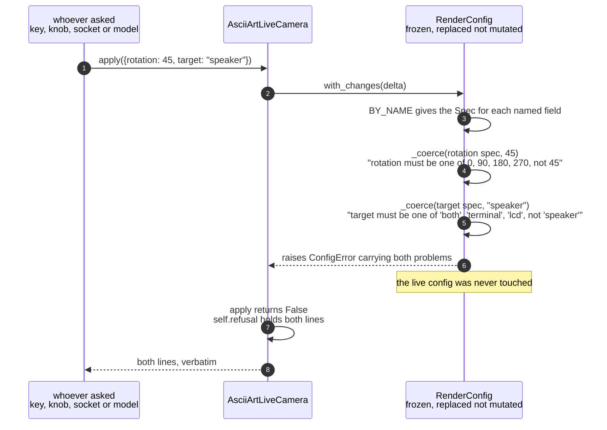
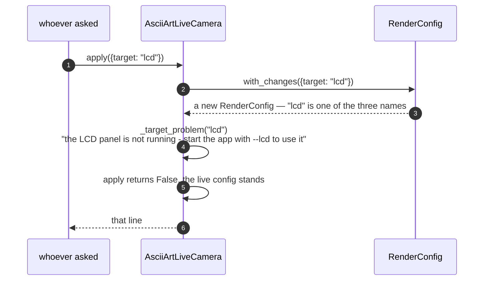

# A render configuration change is refused

Somebody asks for `rotation 45`, and is told `rotation must be one of 0, 90,
180, 270, not 45`. The value is that they are told *that*, in those words,
whoever they are — a key, the knob, a typed line, a phone, or a language model
proposing a delta. There is no route to the hardware that can accept something
the others would refuse, which is the only thing that makes comparing those
routes meaningful.

That property is bought by a rule about what each layer is allowed to decide.
`commands.parse` settles a word's **type** and nothing else: `rotation 45`
becomes the integer 45 and is handed on untouched, because whether 45 is an
allowed rotation is not its question. `RenderConfig` decides what is
**allowed**. The first version of the parser did refuse bad choices itself,
which put "must be one of" in two modules and meant `rotation 45` never reached
the validator at all — `tests/control/commands_test.py` caught it.

| Class | What it represents, and its part in this scenario |
|---|---|
| [`AsciiArtLiveCamera`](../../ascii_camera.py#L103) | The render loop, and the one object the whole process is hung off. Here it is the **caller**: it holds the live config, offers every delta to the validator through [`apply`](../../ascii_camera.py#L241), and adds the single check the validator is not in a position to make — whether this run actually has the display a `target` names |
| [`RenderConfig`](../../src/control/render_config.py#L118) | The complete live render state, frozen so that it is replaced rather than mutated. Here it is the **judge**: [`with_changes`](../../src/control/render_config.py#L141) is the only code in the app that decides whether a value is allowed, and it answers identically whoever asked |
| [`Spec`](../../src/control/render_config.py#L63) | What one setting accepts and what it is for — its `kind`, and either its `choices` or its `low` and `high`. Here it supplies the rule each value is tested against by [`_coerce`](../../src/control/render_config.py#L211), and the wording of the complaint when a value misses. The [twelve of them](../../src/control/render_config.py#L74) are also the source of the `help` text and the model's tool schema, so all three agree by construction |
| [`ConfigError`](../../src/control/render_config.py#L49) | A delta that could not be applied. Here it is the **vehicle for every reason at once** rather than the first one found, which is what lets a caller — or the eval harness — fix a whole delta in a single pass |

## A value RenderConfig does not allow

| Step | Message | What is going on |
|---:|---|---|
| 1 | [`apply`](../../ascii_camera.py#L241)`({rotation: 45, target: "speaker"})` | Every route in arrives here — a key, the knob, a line off the socket, a delta a model proposed. What arrives is a plain dict of field name to value, and nothing about who asked survives the call. That is precisely why the answer can be the same for all of them |
| 2 | [`with_changes`](../../src/control/render_config.py#L141)`(delta)` | The validator, and the only code that decides what a value may *be*. It is asked for a **new** config rather than told to change this one, so the live config is never at risk while its replacement is being checked |
| 3 | [`BY_NAME`](../../src/control/render_config.py#L114) gives the [`Spec`](../../src/control/render_config.py#L63) for each named field | `BY_NAME` is built from [`SPECS`](../../src/control/render_config.py#L74) — twelve `Spec` records that are also the source of the [`help` text](../../src/control/commands.py#L172), the command-line arguments and the model's [tool schema](../../src/language/parser.py#L204), which is why a setting cannot exist and be undocumented. A name absent from it is a problem in its own right. A typed line would have been stopped earlier by [`commands.parse`](../../src/control/commands.py#L49) consulting the same dict; a delta from the model arrives here without that head start |
| 4 | [`_coerce`](../../src/control/render_config.py#L211)`(rotation spec, 45)` `"rotation must be one of 0, 90, 180, 270, not 45"` | `rotation` is a `choice` spec, so 45 is compared against `(0, 90, 180, 270)` and misses. Note what happens *before* that comparison: `bool` is excluded first, because `bool` subclasses `int`, so `False in (0, 90, 180, 270)` is otherwise `True` and a stray `freeze=False` sent to `rotation` would be accepted as "no rotation". The problem is **collected, not raised** |
| 5 | [`_coerce`](../../src/control/render_config.py#L211)`(target spec, "speaker")` `"target must be one of 'both', 'terminal', 'lcd', not 'speaker'"` | The second field is checked even though the first has already failed. That is the whole point of collecting: a caller correcting a delta one fault at a time learns nothing about how many are left, and the [eval harness](../../tests/language/parser_eval.py) scoring the model's proposals wants the entire list |
| 6 | raises [`ConfigError`](../../src/control/render_config.py#L49) carrying both problems | `ConfigError.problems` is the list of reasons, and the exception's own message joins them, so code that prints only the exception still shows all of them. Nothing has been assigned along the way — [`with_changes`](../../src/control/render_config.py#L141) builds a replacement, and this delta never produced one, so there is no half-applied state and nothing to unwind |
| 7 | [`apply`](../../ascii_camera.py#L241) returns `False` `self.refusal` holds both lines | `False` on its own would be ambiguous, because a delta that changes nothing returns `False` too. `self.refusal` is what separates "refused" from "no-op", and is why a caller with a reply channel of its own can say *why* rather than only "nothing changed" |
| 8 | both lines, verbatim | How they arrive depends on who asked. `note=True` — what a key or the knob passes — calls [`_note`](../../ascii_camera.py#L340), which puts the text in the status line **and** on the SPI panel, because in the enclosure the panel is the only output there is. The command socket [passes `note=False`](../../ascii_camera.py#L480) and returns `self.refusal` down the connection instead, its reply already being on its way to whoever typed the line |

No thread bands on this diagram, unlike the typed-line scenario: it all happens
on the render loop's own thread, and a band with nothing on the other side of it
would be decoration.

## A value RenderConfig allows, but this run cannot honour

`target lcd` is a perfectly legal value. Whether *this run* has a panel is a
different question, and not one a config object can answer — it is a fact about
how the app was started, not about the setting. So there is a second gate,
after the first and deliberately not inside it.

| Step | Message | What is going on |
|---:|---|---|
| 1 | [`apply`](../../ascii_camera.py#L241)`({target: "lcd"})` | The same entry point and the same shape of delta. Nothing here distinguishes this from a change that is about to succeed |
| 2 | [`with_changes`](../../src/control/render_config.py#L141)`({target: "lcd"})` | The same validator, asked the same question it was asked above |
| 3 | a new [`RenderConfig`](../../src/control/render_config.py#L118) — `"lcd"` is one of the three names | `"lcd"` is in [`TARGETS`](../../src/control/render_config.py#L46), so the field-level check passes and a replacement config comes back. **`RenderConfig` has said yes** — everything that follows is a second opinion it was never in a position to give |
| 4 | [`_target_problem`](../../ascii_camera.py#L205)`("lcd")` `"the LCD panel is not running - start the app with --lcd to use it"` | The second gate. Whether a panel came up is a fact about how this run was started, and a config object has no way to reach it. So the field-level check lives in `RenderConfig` and the runtime one lives here: two places on purpose, because they answer two different questions |
| 5 | [`apply`](../../ascii_camera.py#L241) returns `False`, the live config stands | The replacement is discarded rather than adopted, and [`_adopt`](../../ascii_camera.py#L285) is never reached — so neither display is told anything and the picture does not flicker on a change that did not happen |
| 6 | that line | Reaches the asker by exactly the route a field-level refusal takes. From outside, the two gates are indistinguishable, which is the intent: the caller has one thing to handle, not two |

Only the two targets naming a *specific* output can fail this way. `both` means
"draw wherever you can", which is always honourable — the app refuses to start
with no output at all, so there is always at least one. An earlier version
refused `both` whenever the terminal was missing, and told the user it could not
draw on "both" alone, which is not a sentence that means anything.

## Out of range is clamped, not refused

Being outside a range is **clamped**, not refused:

| Asked for | What happens |
|---|---|
| `contrast 99` | Clamped to `4.0`, logged, applied |
| `rotation 45` | Refused — an enumeration has no nearest member worth guessing |
| `scheme grean` | Refused — same reason |
| `invert 1` | Refused — `1` is not a `bool`, and quietly accepting the shapes a sloppy caller produces would leave the config holding a value nothing else expects |

The distinction is whether "the nearest legal value" means anything. For a
range it does, and clamping is what lets `a bit more contrast` be a no-op at the
ceiling rather than an error.

## Related scenarios

- [A typed command updates the render configuration](a-typed-command-updates-the-render-configuration.md)
  — the accepted path through the same `apply`, and where a typed line's type
  gets settled before it arrives here.
- **A keypress updates the render configuration** — the route that passes `note=True`,
  so the refusal is drawn on the picture rather than returned to a caller.
- **A spoken phrase is turned into a config delta by the language model** — the case this validator exists
  to make safe: a delta from a language model is judged by exactly this code,
  in exactly these words.
