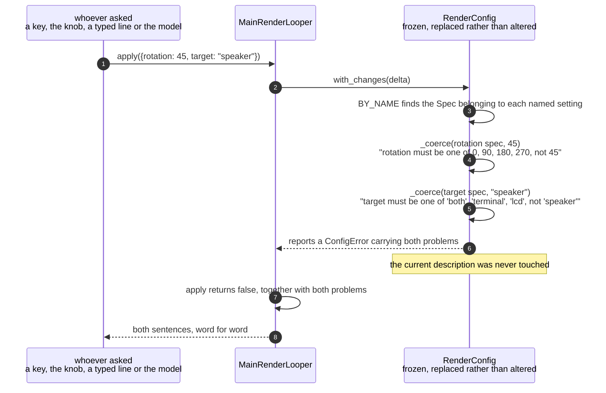
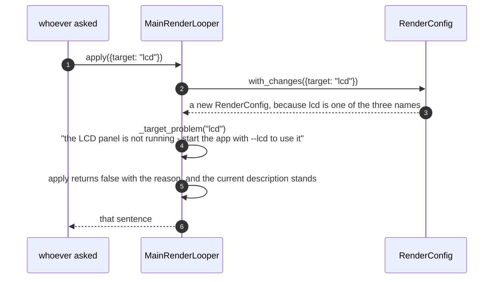

# A render configuration change is refused

**Priority: `MEDIUM`** — this is the guard every route meets, but it only does anything when the input is wrong, and the picture is never at risk while it runs. [What the priorities mean](../how-to-write-scenario-docs.md).

Somebody asks for `rotation 45`, and is told
`rotation must be one of 0, 90, 180, 270, not 45`.

The value of this scenario is that they are told exactly that, in exactly those
words, no matter who they are. The same sentence comes back whether the request
arrived from a key press, from the knob[^detent], from a typed line, from a
phone, or from a language model proposing a change[^delta]. There is no way in
to the hardware that will accept something the other ways in would refuse.
That single fact is what makes it meaningful to compare those routes at all.

The number 45 is worth a moment, because it is chosen rather than picked at
random. Rotation accepts only 0, 90, 180 and 270. Those four are the quarter
turns, and quarter turns are special: turning a rectangular grid by a quarter
turn only relabels which row and column each value sits in, so nothing has to
be recalculated. Any other angle would mean working out new values that were
never in the original picture. So 45 is a request that sounds perfectly
sensible, is the right kind of thing, and still cannot be honoured. That is
precisely the case this scenario exists to handle.

The behaviour is bought by a firm rule about what each layer is allowed to
decide. The parsing code settles what **type** a word is and nothing more. It
turns `rotation 45` into the whole number 45 and passes it along untouched,
because whether 45 is an acceptable rotation is not its question to answer. The
configuration[^config] is what decides what is **allowed**.

That division was learned rather than designed. The first version of the parser
refused unacceptable choices itself. The result was that the sentence "must be
one of" existed in two separate modules, and `rotation 45` never reached the
checking code at all, because the parser had already rejected it. The test file
`tests/control/commands_test.py` is what caught that.

| Class | What it represents, and its part in this scenario |
|---|---|
| [`MainRenderLooper`](../../ascii_camera.py#L99) | The single object the whole running program hangs from, and the only thread on which a setting may ever change. In this scenario it is the **caller**. It holds the current description of the picture, offers every proposed change to the checker by way of [`apply`](../../ascii_camera.py#L236), and adds the one test the checker is not in a position to perform: whether this particular run actually has the screen that a `target` setting names |
| [`RenderConfig`](../../src/control/render_config.py#L118) | The complete, current description of how the picture should be drawn, frozen so that it is replaced rather than altered. In this scenario it is the **judge**. [`with_changes`](../../src/control/render_config.py#L141) is the only code in the entire program that decides whether a value is acceptable, and it gives the same answer no matter who did the asking |
| [`Spec`](../../src/control/render_config.py#L63) | The description of a single setting: what sort of value it takes, and either the list of values it will accept or the lowest and highest it allows. In this scenario it supplies the rule each value is tested against by [`_coerce`](../../src/control/render_config.py#L211), and supplies the wording of the complaint when a value fails. There are [twelve of them](../../src/control/render_config.py#L74), one per setting, and they are also the source of the `help` text and of the description given to the language model[^toolschema], so all three necessarily agree |
| [`ConfigError`](../../src/control/render_config.py#L49) | A proposed change that could not be carried out. In this scenario it is the **carrier of every reason at once**, rather than only the first reason found. That is what lets a caller, or the scoring harness[^eval], correct a whole set of changes in a single pass instead of one at a time |

## A value RenderConfig does not allow

```mermaid
sequenceDiagram
    autonumber
    participant Asker as whoever asked<br/>a key, the knob, a typed line or the model
    participant App as MainRenderLooper
    participant Cfg as RenderConfig<br/>frozen, replaced rather than altered

    Asker->>App: apply({rotation: 45, target: "speaker"})
    App->>Cfg: with_changes(delta)
    Cfg->>Cfg: BY_NAME finds the Spec belonging to each named setting
    Cfg->>Cfg: _coerce(rotation spec, 45)<br/>"rotation must be one of 0, 90, 180, 270, not 45"
    Cfg->>Cfg: _coerce(target spec, "speaker")<br/>"target must be one of 'both', 'terminal', 'lcd', not 'speaker'"
    Cfg-->>App: reports a ConfigError carrying both problems
    Note over Cfg: the current description was never touched
    App->>App: apply returns false, together with both problems
    App-->>Asker: both sentences, word for word
```

| Step | Message | What is going on |
|---:|---|---|
| 1 | [`apply`](../../ascii_camera.py#L236)`({rotation: 45, target: "speaker"})` | Every route in arrives at this one place: a key press, the knob, a line arriving over the connection[^socket], or a change a language model proposed. What arrives is a plain list of setting names paired with values, and nothing whatsoever about who asked survives the call. That is exactly why the answer can be identical for all of them. This particular example carries **two** faults rather than one, chosen deliberately, because a single fault could not demonstrate that every reason is reported rather than only the first |
| 2 | [`with_changes`](../../src/control/render_config.py#L141)`(delta)` | The checker, and the only code that decides what a value is permitted to be. Notice that it is asked to produce a **new** description rather than told to modify the existing one. That is why the description currently in use is never at risk while its potential replacement is being examined |
| 3 | [`BY_NAME`](../../src/control/render_config.py#L114) finds the [`Spec`](../../src/control/render_config.py#L63) belonging to each named setting | This lookup is built from [`SPECS`](../../src/control/render_config.py#L74), the twelve records describing the twelve settings. Those same twelve records are also the source of the [help text](../../src/control/commands.py#L176), of the command-line options, and of the [description handed to the language model](../../src/language/parser.py#L204). That shared origin is why a setting cannot exist in the program and be missing from the documentation. A name that does not appear in the lookup is a fault in its own right. A typed line would have been stopped earlier by [`parse`](../../src/control/commands.py#L53) consulting this very same lookup, whereas a change proposed by the model arrives here without that head start |
| 4 | [`_coerce`](../../src/control/render_config.py#L211)`(rotation spec, 45)` `"rotation must be one of 0, 90, 180, 270, not 45"` | Rotation is a setting with a fixed list of acceptable values, so 45 is compared against the four quarter turns and matches none of them. What happens *before* that comparison matters too. True and false values are excluded first, because in Python a true or false value counts as a kind of whole number, and false is treated as equal to zero. Without that exclusion, a stray `freeze=False` sent to `rotation` would be quietly accepted as meaning "no rotation at all". The problem here is **collected rather than reported immediately** |
| 5 | [`_coerce`](../../src/control/render_config.py#L211)`(target spec, "speaker")` `"target must be one of 'both', 'terminal', 'lcd', not 'speaker'"` | The second setting is examined even though the first has already failed. That is the entire point of collecting rather than stopping. Somebody correcting a request one fault at a time learns nothing about how many faults remain, and the [scoring harness](../../tests/language/parser_eval.py) that judges the model's proposals wants the complete list in one go |
| 6 | reports a [`ConfigError`](../../src/control/render_config.py#L49) carrying both problems | The error carries a list of reasons, and its own message joins them together, so even code that prints nothing but the error still shows all of them. Nothing has been assigned to along the way. Because [`with_changes`](../../src/control/render_config.py#L141) builds a replacement rather than editing anything, and this request never produced one, there is no partly-applied state anywhere and nothing that has to be undone |
| 7 | [`apply`](../../ascii_camera.py#L236) returns false, together with both problems | A plain false on its own would be ambiguous, because a request for something that is already set also comes back false. The reason is what separates "refused" from "nothing to do", and it is why a caller replying over its own connection can explain *why* rather than merely saying "nothing changed". The reason used to be left behind on a separate attribute for the caller to collect afterwards, because this slot held nothing but a true-or-false value. That was a return value in disguise, and it was read by exactly one caller in the whole program |
| 8 | both sentences, word for word | How they arrive depends entirely on who asked. A key press or the knob passes `note=True`, which calls [`_note`](../../ascii_camera.py#L338). That places the text in the status line[^statusline] **and** on the small panel[^panel], because inside the sealed box the panel is the only screen there is. The command connection [passes `note=False`](../../ascii_camera.py#L478) instead and sends the returned reason back down the connection, since its reply is already on its way to whoever typed the line |

This diagram has no coloured thread bands, unlike the typed-line scenario.
Everything here happens on the drawing loop's own thread. A band with nothing on
the other side of it would be decoration rather than information.

## A value RenderConfig allows, but this run cannot honour

`target lcd` is a perfectly legal value. Whether *this particular run of the
program* actually has a small panel attached is a completely different question,
and not one the description of the picture could possibly answer. It is a fact
about how the program was started, not a fact about the setting. So there is a
second gate, placed after the first and deliberately kept outside it.

```mermaid
sequenceDiagram
    autonumber
    participant Asker as whoever asked
    participant App as MainRenderLooper
    participant Cfg as RenderConfig

    Asker->>App: apply({target: "lcd"})
    App->>Cfg: with_changes({target: "lcd"})
    Cfg-->>App: a new RenderConfig, because lcd is one of the three names
    App->>App: _target_problem("lcd")<br/>"the LCD panel is not running - start the app with --lcd to use it"
    App->>App: apply returns false with the reason, and the current description stands
    App-->>Asker: that sentence
```

| Step | Message | What is going on |
|---:|---|---|
| 1 | [`apply`](../../ascii_camera.py#L236)`({target: "lcd"})` | The same way in, and the same shape of request. Nothing at this point distinguishes it from a change that is about to succeed |
| 2 | [`with_changes`](../../src/control/render_config.py#L141)`({target: "lcd"})` | The same checker, asked the same question it was asked in the first diagram |
| 3 | a new [`RenderConfig`](../../src/control/render_config.py#L118), because lcd is one of the three names | The name `"lcd"` appears in [`TARGETS`](../../src/control/render_config.py#L46), which holds exactly three names: `both`, `terminal` and `lcd`. There are three because there are two screens plus the option of using whichever ones exist. So the setting-level check passes and a replacement description comes back. **The configuration has said yes.** Everything that follows is a second opinion it was never in a position to give |
| 4 | [`_target_problem`](../../ascii_camera.py#L200)`("lcd")` `"the LCD panel is not running - start the app with --lcd to use it"` | The second gate. Whether a panel started is a fact about how this run was launched, and the description of the picture has no way of reaching that fact. So the setting-level check lives in the configuration and the run-time check lives here. Two places, on purpose, because they answer two genuinely different questions |
| 5 | [`apply`](../../ascii_camera.py#L236) returns false with the reason, and the current description stands | The replacement is thrown away rather than adopted, and [`_adopt`](../../ascii_camera.py#L283) is never reached at all. So neither screen is told anything, and the picture does not flicker on account of a change that never happened |
| 6 | that sentence | It reaches whoever asked by exactly the same route a setting-level refusal takes. From the outside the two gates are indistinguishable, and that is deliberate: the caller has one kind of outcome to deal with rather than two |

Only the two names that pick out one *specific* screen can fail in this way.
The name `both` means "draw wherever you are able to", which can always be
honoured, because the program refuses to start with no screen at all and so
there is always at least one. An earlier version refused `both` whenever the
monitor was missing, and told the person it could not draw on "both" on its own,
which is not a sentence that means anything.

## Out of range is clamped, not refused

A value that falls outside a permitted range is **brought back to the edge of
that range**, not refused:

| Asked for | What happens |
|---|---|
| `contrast 99` | Brought down to `4.0`, recorded in the log, and applied |
| `rotation 45` | Refused — a fixed list has no nearest member worth guessing at |
| `scheme grean` | Refused — for the same reason |
| `invert 1` | Refused — `1` is a number and this setting takes only true or false. Quietly accepting whatever shape a careless caller produced would leave the description holding a value that nothing else in the program expects |

The deciding question is whether "the nearest legal value" means anything at
all. For a range it plainly does. Contrast runs from `0.1` at the lowest to
`4.0` at the highest, with `1.0` meaning the picture is left exactly as the
camera delivered it. So a request for 99 has an obvious nearest answer, which is
4.0. Bringing it back to the edge is also what allows a phrase such as "a bit
more contrast" to do nothing at all once the ceiling is reached, rather than
producing an error the person cannot act on.

For a fixed list of four quarter turns there is no such nearest answer. Guessing
that 45 meant 0, or that it meant 90, would be inventing an intention nobody
expressed.

## Related scenarios

- [A typed command updates the render configuration](a-typed-command-updates-the-render-configuration.md)
  — the accepted path through the very same applying step, and where a typed
  line's type is settled before it ever arrives here.
- [A keypress updates the render configuration](a-keypress-updates-the-render-configuration.md)
  — the route that passes `note=True`, so that the refusal is drawn onto the
  picture rather than handed back to a caller.
- [A spoken phrase is turned into a config delta by the language model](a-spoken-phrase-is-turned-into-a-config-delta-by-the-language-model.md)
  — the case this checking exists to make safe. A change proposed by a language
  model is judged by exactly this code, in exactly these words.

### Footnotes

[^detent]: A **detent** is one click of the knob, meaning the position the knob
    settles into and which can be felt as a notch under the fingers.
    Electrically, one click is one complete cycle of the two switches inside the
    knob, and counting those cycles is the job of
    [`QuadratureDecoder`](../../src/control/encoder.py#L88). **Quadrature** is
    the name for the arrangement of those two switches. They are positioned a
    quarter of a cycle apart, so whichever of them changes first reveals which
    way the knob was turned. A switch bouncing without completing a full cycle
    produces nothing at all, which is exactly what is wanted.

[^delta]: A **delta** is a plain list of the settings a change intends to alter,
    paired with their new values, such as `{"scheme": "amber"}`, and nothing
    else besides. Every way of asking for a change builds one of these and hands
    it to the configuration. None of them ever sets a setting directly. That is
    what keeps the checking in a single place no matter who did the asking.

[^config]: The **render configuration** is the complete, current description of
    how the picture should be drawn: which colour scheme, which ramp, how much
    contrast, which way up, and so on. It is frozen, meaning no part of the
    program ever alters one. Instead, every change produces an entirely new
    [`RenderConfig`](../../src/control/render_config.py#L118) by way of
    [`with_changes`](../../src/control/render_config.py#L141), which is also the
    only code anywhere that decides whether a proposed value is allowed. The
    list of settings, and what each one will accept, is
    [`SPECS`](../../src/control/render_config.py#L74). That single table is what
    the checking code, the `help` text, the command-line options and the
    description given to the language model are all built from.

[^toolschema]: A **tool schema** is a description, written so that a computer
    can read it, of what a language model is permitted to hand back. It lists
    the setting names, the sort of value each one takes, and which values are
    allowed. [`tools`](../../src/language/parser.py#L204) builds that
    description from the same twelve records the rest of the program uses. So a
    setting cannot exist in the program and be invisible to the model, and it
    cannot be offered to the model in a form the checking code would refuse.

[^eval]: An **eval** is a stored request paired with the answer a person judged
    to be correct. Running a collection of them against the model gives a score,
    which is how a change to the instructions given to the model can be
    measured rather than guessed at.
    [`as_case`](../../src/language/asklog.py#L182) can turn a real recorded
    request into a *candidate* eval, but only a candidate. Its expected answer
    holds whatever the model actually said, and that is the very thing being
    tested. Promoting one without a person looking at it would build a
    collection that only checks the model still does what it did before.

[^socket]: A **Unix domain socket** is a connection between two programs on the
    same computer, which appears in the file system as though it were a file. It
    behaves like a network connection, with one program writing and another
    reading, except that no network is involved at any point.
    [`CommandServer`](../../src/control/command_server.py#L80) listens on one of
    these, which is how a shell, a phone or another program can reach a running
    camera without the program ever opening a network port.

[^statusline]: The **status line** is the single line of readings underneath the
    picture, showing the colour scheme, the ramp, how many pictures a second are
    being drawn, and the size of the grid. It is built by
    [`status_line`](../../src/hdmi/status_line.py#L76). It is also where a
    refusal or a short message appears when the program is running on an
    ordinary monitor, because there is nowhere else on a monitor to put one.

[^panel]: The **SPI panel** is a small screen measuring 2.4 inches across the
    diagonal, 240 dots by 320, using a controller chip called the ILI9341. It is
    connected to the computer by a simple four-wire arrangement called SPI, which
    is a common way of attaching small devices. It is driven entirely by the
    program itself, through [`ILI9341`](../../src/lcd/lcd.py#L47), with no
    separate system driver involved. In the sealed box this program is built
    for, this panel is the only screen there is. One complete picture for it is
    153,600 bytes, which has to be sent in pieces of 4 kilobytes each — see
    [`SPI_CHUNK`](../../src/lcd/lcd.py#L44) — because that is as much as the
    connection will accept at a time.
