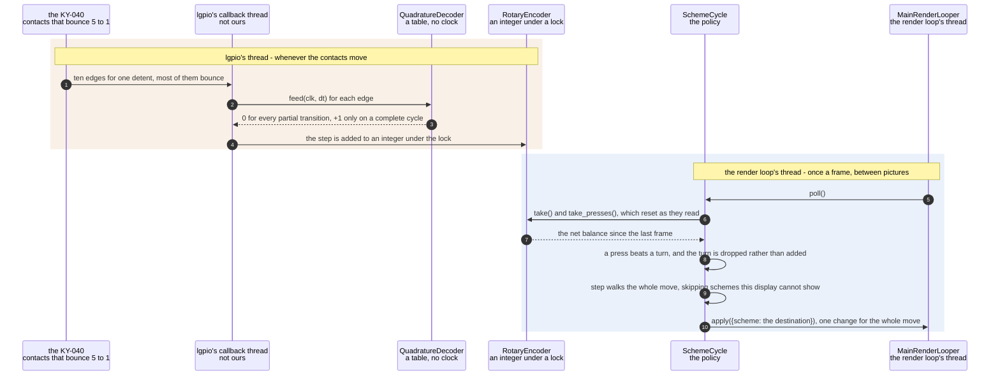

# A rotary encoder detent changes the colour scheme

**Priority: `HIGH`** — in a sealed box the knob[^detent] is the only control that needs no second device, so this is the whole of the user interface. [What the priorities mean](../how-to-write-scenario-docs.md).

Somebody turns the knob one click and the picture changes colour. The value is
that it works with no keyboard, no phone, no network and no terminal — in an
enclosure the knob and the panel[^panel] are the entire machine, and every
other route into the settings requires something the box does not have.

Between the click and the picture are two problems that have nothing to do
with each other. The first is that **the contacts bounce**, about five to one:
twenty deliberate clicks produced 453 electrical edges. The second is that
edges arrive on lgpio[^lgpio]'s own thread whenever the knob moves, and the
render loop can only act between frames.

Neither is solved by filtering. Bounce is rejected **by construction**: a
quadrature transition table only emits on a complete cycle, so the partial
transitions that bounce produces — which is most of them — advance the state
machine and return nothing. Ten edges of a bounced cycle yield exactly one
detent. Debouncing by time, or by sampling the partner pin at each edge, reads
bounce as movement; this does not have to.

The threading is solved by **counting rather than queueing**. The callback
thread adds to an integer under a lock and the loop takes the whole balance
once a frame. That has a consequence worth stating plainly: only counts survive
between frames, never the order events happened in. A turn and a press in the
same frame gap cannot be told apart from a press and a turn, so the press wins
and the rotation is dropped — the answer that is the same wherever the knob had
got to, and that costs one repaint rather than two.

The last piece is that a banked move is applied **as one move**. Five detents
between two frames used to be five calls, and every scheme[^scheme] change
ends in a full repaint of some 27,000 cells; four of those five pictures were
never on screen long enough to see, and the strobing fed on itself because a
slower frame banks more detents.

| Class | What it represents, and its part in this scenario |
|---|---|
| [`QuadratureDecoder`](../../src/control/encoder.py#L88) | Pin levels in, detents out. Here it is the **arbiter of what counts as movement**, and it is deliberately free of hardware, threads and clocks: [`feed`](../../src/control/encoder.py#L100) is a table lookup, so the part that can be subtly wrong is testable on a machine with no encoder attached |
| [`RotaryEncoder`](../../src/control/encoder.py#L123) | A KY-040 on three GPIO[^gpio] pins, read through lgpio's edge callbacks. Here it is the **accumulator**: callbacks arrive on lgpio's thread, so [`take`](../../src/control/encoder.py#L246) hands over the net balance under a lock and resets it |
| [`SchemeCycle`](../../src/control/scheme_cycle.py#L37) | The `s` key and the knob, walked by one piece of code. Here it is the **policy**: [`poll`](../../src/control/scheme_cycle.py#L86) decides that a press beats a turn, and [`step`](../../src/control/scheme_cycle.py#L133) walks the whole move before changing anything |
| [`MainRenderLooper`](../../ascii_camera.py#L98) | The one object the process is hung off. Here it is the **only thread a setting may change on**, and it does nothing else in this scenario but call `poll` once a frame |

## One click, from the contacts to the picture

| Step | Message | What is going on |
|---:|---|---|
| 1 | ten edges for one detent, most of them bounce | Measured: twenty clicks gave 453 edges, and 88 survived a 1 ms debounce. The ratio is why counting edges is not an option — a decoder that treated an edge as movement would read one click as several |
| 2 | [`feed`](../../src/control/encoder.py#L100)`(clk, dt)` for each edge | Both pin levels every time, not one pin sampled at the other's edge. Sampling the partner at an edge is the classic approach and it reads bounce as direction, because during a bounce the partner is whatever it happens to be |
| 3 | 0 for every partial transition, +1 only on a complete cycle | A table indexed by state and by the two pin levels. Bounce moves the state machine back and forth between intermediate states and never completes a cycle, so it emits nothing — rejection by construction rather than by a timer that has to be tuned. One detent on this module is one full cycle |
| 4 | the step is added to an integer under the lock | The whole of the cross-thread contract. An integer, not a queue: a queue would preserve an order nothing downstream can use, and would grow if the loop were slow |
| 5 | [`poll`](../../src/control/scheme_cycle.py#L86)`()` | Called once a frame from the render loop, and returning immediately when nothing moved — which is the usual case and costs only a lock |
| 6 | [`take`](../../src/control/encoder.py#L246)`()` and `take_presses()`, which reset as they read | Read-and-clear under the lock, so a detent arriving mid-frame is banked for the next one rather than lost or double-counted. `take` returns the **net**: two clicks one way and two back is no change, and the picture should not flicker through four schemes to say so |
| 7 | the net balance since the last frame | Zero almost always. On a slow frame it may be several, which is the case the rest of this scenario exists to handle |
| 8 | a press beats a turn, and the turn is dropped rather than added | Only counts survive, not order, so a turn and a press in one frame gap are indistinguishable from a press and a turn. The press wins because its answer — jump home to grey — is the same wherever the knob had got to, and it costs one repaint rather than two |
| 9 | [`step`](../../src/control/scheme_cycle.py#L133) walks the whole move, skipping schemes this display cannot show | The walk is arithmetic, not a series of changes: it finds the destination and changes the display **once**. A whole lap is the identity, so the move reduces modulo the scheme count — clamping instead would land a lap off. Schemes a monochrome terminal cannot show are skipped on the way past rather than settled on |
| 10 | apply({scheme: the destination}), one change for the whole move | One [`apply`](../../ascii_camera.py#L235), so a five-detent spin is one repaint of some 27,000 cells rather than five. It used to be five, and it fed on itself: a slower frame banks more detents, which made the next frame slower still. The check that this still holds is that a two-detent move writes a single `Scheme:` line to the log |

The boundary is crossed once and in one direction, by an integer. Nothing on
lgpio's thread ever touches a setting, and nothing on the render loop's thread
ever waits for a knob — which is what lets the picture keep its frame rate
through a spin fast enough to bank a dozen detents.

Which direction counts as forwards cannot be derived: it depends on which pin
was called CLK when the thing was wired. It was settled by turning the real
knob, and `--encoder-reverse` exists for the other answer.

## Related scenarios

- [A typed command updates the render configuration](a-typed-command-updates-the-render-configuration.md)
  — where the delta produced here arrives, and the validator it meets.
- [One configuration change is pushed to both displays](one-configuration-change-is-pushed-to-both-displays.md)
  — what a scheme change costs once it has been accepted, and why one repaint
  rather than five matters so much.
- [A render configuration change is refused](a-render-configuration-change-is-refused.md)
  — the same validator, in the case where a value is not allowed. A scheme the
  knob walks to is always legal, because the walk only visits real ones.
- [A keypress updates the render configuration](a-keypress-updates-the-render-configuration.md) — the `s` key, which reaches
  `SchemeCycle.step` by the other route and never banks anything.

### Footnotes

[^detent]: A **detent** is one click of the knob — the position it settles
    into, felt as a notch. Electrically it is one full cycle of the two
    switches, which is what [`QuadratureDecoder`](../../src/control/encoder.py#L88)
    counts. **Quadrature** is the arrangement: two switches a quarter-cycle
    apart, so which one changes first says which way the knob turned, and
    contact bounce that does not complete a cycle emits nothing.

[^panel]: The **SPI panel** is a 2.4 inch ILI9341 LCD, 240x320, wired to the
    Pi's SPI bus — a four-wire serial bus for talking to peripherals — and
    driven from userspace by [`ILI9341`](../../src/lcd/lcd.py#L47) with no
    kernel driver behind it. In the sealed enclosure it is the only display
    there is. One full frame is 153,600 bytes, sent in
    [`SPI_CHUNK`](../../src/lcd/lcd.py#L44) pieces of 4 KB because that is what
    the driver's buffer holds.

[^lgpio]: The userspace library this app uses to read GPIO pins on the Pi,
    talking to the kernel's character-device interface. It replaces the older
    `RPi.GPIO` and needs no daemon, unlike `pigpio`.

[^scheme]: A **colour scheme** is one of the nine named looks in
    [`SCHEMES`](../../src/art/palettes.py#L79), and which one is live is part
    of the render configuration. `grey` is the default, and is what "greyscale
    mode" means: characters only, drawn from the luma plane and nothing else.
    `live` is the only scheme that reads the chroma planes, through
    [`colour_grid`](../../src/capture/image_processor.py#L187). The other seven
    are **tints** — green phosphor, amber CRT, e-ink on paper — which recolour
    the same greyscale picture from two fixed colours.

[^gpio]: The Pi's general-purpose pins. A pin is claimed by whoever is using
    it and is unusable to anyone else until it is given back, which is what
    makes an unreleased pin a fault in the *next* run rather than this one.
