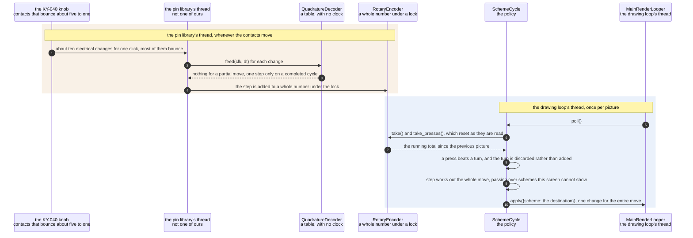

# A rotary encoder detent changes the colour scheme

**Priority: `HIGH`** — inside a sealed box the knob is the only control that needs no second device, so one click[^detent] of it is the whole of the user interface. [What the priorities mean](../how-to-write-scenario-docs.md).

Somebody turns the knob by one click and the picture changes colour.

The value is that this works with no keyboard, no phone, no network and no
monitor. Inside the sealed box the knob and the small panel[^panel] are the
entire machine. Every other way of changing a setting needs something the box
simply does not have.

Between the click and the picture changing lie two problems that have nothing
whatever to do with one another.

The first problem is that **the electrical contacts bounce**. When a metal
contact closes, it does not close cleanly once. It makes and breaks contact
several times in a few thousandths of a second before settling. This was
measured on this actual knob: twenty deliberate clicks produced 453 separate
electrical changes, which is a ratio of roughly five bounces for every one real
change. After filtering out anything shorter than a thousandth of a second, 88
changes remained, which is still more than the twenty clicks that were made. So
counting electrical changes cannot possibly work.

The second problem is about timing. The electrical changes arrive on a thread
belonging to the library that watches the pins[^lgpio], at whatever moment the
knob happens to move. The drawing loop, by contrast, can only act between one
picture and the next.

Neither problem is solved by filtering, and that is worth dwelling on.

Bounce is rejected **by the shape of the solution rather than by a filter**. The
two switches inside the knob are arranged a quarter of a turn apart, and the
decoding works from a table of which pairs of switch positions may legally
follow which. It only reports movement when a complete cycle has been finished.
Bounce produces partial movements that go back and forth without ever completing
a cycle, so it advances the internal state and reports nothing at all. Ten
electrical changes belonging to one bounced click therefore yield exactly one
click. Filtering by time, or looking at the second switch each time the first one
changes, both read bounce as movement. This approach does not have to.

The timing problem is solved by **counting rather than queueing**. The thread
watching the pins adds to a single whole number, protected by a lock so the two
threads cannot interfere with one another, and the drawing loop takes the whole
running total once per picture.

That has a consequence worth stating plainly, because it is a real limitation
rather than an oversight. Only the counts survive from one picture to the next,
never the order in which things happened. A turn followed by a press cannot be
told apart from a press followed by a turn. The program resolves this by letting
the press win and discarding the turn. That is the right choice because the
press means "go back to grey", and the answer to that is the same wherever the
knob had got to. It also costs one repaint rather than two.

The last piece is that a gathered-up move is applied **as a single move**. Five
clicks arriving between two pictures used to mean five separate changes. Every
change of colour scheme[^scheme] ends in repainting every cell, which on a
monitor showing roughly 267 cells across and 100 down is about 26,700 cells. Four
of those five pictures were never on screen long enough for anybody to see. Worse,
the problem fed on itself: a slower picture gathers up more clicks, which makes
the next picture slower still.

*This drawing shows the arrangement rather than describing it. The two switches
sit a quarter of a cycle apart, and one whole click is a single round trip from
the resting position back to the resting position again. The rapid chatter on
every edge is the bounce that makes counting electrical changes impossible. The
green marker is the answer to it: only the change that completes the full cycle
reports anything at all.*

Kept by hand: edit
[`quadrature-detent.svg`](../images/quadrature-detent.svg) directly, since
nothing regenerates it.

| Class | What it represents, and its part in this scenario |
|---|---|
| [`QuadratureDecoder`](../../src/control/encoder.py#L88) | Switch positions go in, completed clicks come out. In this scenario it is the **judge of what counts as movement**, and it is deliberately free of any hardware, any thread and any clock. [`feed`](../../src/control/encoder.py#L100) is nothing more than a table lookup, which means the part most likely to be subtly wrong can be tested on a computer with no knob attached to it at all |
| [`RotaryEncoder`](../../src/control/encoder.py#L123) | A KY-040 knob wired to three of the computer's general-purpose pins[^gpio], watched through the pin library's notifications. In this scenario it is the **accumulator**. Notifications arrive on the library's own thread, so [`take`](../../src/control/encoder.py#L246) hands over the running total under a lock and resets it to zero in the same breath |
| [`SchemeCycle`](../../src/control/scheme_cycle.py#L37) | The `s` key and the knob, walked through by one shared piece of code. In this scenario it is the **policy**. [`poll`](../../src/control/scheme_cycle.py#L86) decides that a press beats a turn, and [`step`](../../src/control/scheme_cycle.py#L133) works out the whole move before changing anything at all |
| [`MainRenderLooper`](../../ascii_camera.py#L99) | The single object the whole running program hangs from. In this scenario it is the **only thread on which a setting may change**, and it does nothing else here but ask the policy once per picture whether anything happened |

## One click, from the contacts to the picture

```mermaid
sequenceDiagram
    autonumber
    participant Knob as the KY-040 knob<br/>contacts that bounce about five to one
    participant Cb as the pin library's thread<br/>not one of ours
    participant Dec as QuadratureDecoder<br/>a table, with no clock
    participant Enc as RotaryEncoder<br/>a whole number under a lock
    participant Cyc as SchemeCycle<br/>the policy
    participant App as MainRenderLooper<br/>the drawing loop's thread

    rect rgba(200, 140, 60, 0.12)
        note over Knob, Enc: the pin library's thread, whenever the contacts move
        Knob->>Cb: about ten electrical changes for one click, most of them bounce
        Cb->>Dec: feed(clk, dt) for each change
        Dec-->>Cb: nothing for a partial move, one step only on a completed cycle
        Cb->>Enc: the step is added to a whole number under the lock
    end
    rect rgba(80, 140, 220, 0.12)
        note over Cyc, App: the drawing loop's thread, once per picture
        App->>Cyc: poll()
        Cyc->>Enc: take() and take_presses(), which reset as they are read
        Enc-->>Cyc: the running total since the previous picture
        Cyc->>Cyc: a press beats a turn, and the turn is discarded rather than added
        Cyc->>Cyc: step works out the whole move, passing over schemes this screen cannot show
        Cyc->>App: apply({scheme: the destination}), one change for the entire move
    end
```

| Step | Message | What is going on |
|---:|---|---|
| 1 | about ten electrical changes for one click, most of them bounce | Measured on this knob: twenty clicks produced 453 electrical changes, of which 88 survived a filter that ignored anything shorter than a thousandth of a second. Dividing 453 by 20 gives roughly 22 changes per click, and even the filtered 88 is more than four per click. Those ratios are exactly why treating an electrical change as movement cannot work: one click would be read as several |
| 2 | [`feed`](../../src/control/encoder.py#L100)`(clk, dt)` for each change | Both switch positions are supplied every time, rather than one switch being examined at the moment the other changes. Examining the second switch at the first one's change is the usual approach, and it reads bounce as direction, because during a bounce the second switch is simply wherever it happens to be at that instant |
| 3 | nothing for a partial move, one step only on a completed cycle | A table looked up by the current state together with the two switch positions. Bounce moves the state backwards and forwards between intermediate positions and never completes a cycle, so it reports nothing. That is rejection built into the shape of the solution, rather than a timer somebody has to tune. On this particular knob, one click is exactly one complete cycle |
| 4 | the step is added to a whole number under the lock | This is the entire agreement between the two threads. A whole number rather than a queue: a queue would preserve an ordering that nothing further along is able to use, and it would grow without limit if the drawing loop were slow |
| 5 | [`poll`](../../src/control/scheme_cycle.py#L86)`()` | Called once per picture from the drawing loop, and returning immediately when nothing has moved. That is the usual case, and it costs nothing beyond taking and releasing the lock |
| 6 | [`take`](../../src/control/encoder.py#L246)`()` and `take_presses()`, which reset as they are read | Reading and clearing happen together under the lock, so a click arriving in the middle of a picture is saved for the next one rather than being lost or counted twice. The total handed back is the **net** figure: two clicks one way and two back again is no change at all, and the picture should certainly not flicker through four colour schemes in order to say so |
| 7 | the running total since the previous picture | Almost always zero. On a slow picture it may be several, and that is the case the rest of this scenario exists to handle |
| 8 | a press beats a turn, and the turn is discarded rather than added | Only counts survive, never the order, so a turn and a press within one gap between pictures cannot be distinguished from a press and then a turn. The press is allowed to win because its meaning, which is to jump straight back to grey, gives the same answer wherever the knob had reached. It also costs one repaint instead of two |
| 9 | [`step`](../../src/control/scheme_cycle.py#L133) works out the whole move, passing over schemes this screen cannot show | The walk is arithmetic rather than a series of separate changes: it works out the destination and changes the display exactly **once**. There are nine schemes, so a move of nine lands back where it started, and the move is therefore reduced by whole laps of nine. Simply clamping a large move to the last scheme would land a whole lap away from the right answer. Schemes that a monitor showing only one colour cannot display are passed over on the way rather than settled on |
| 10 | apply({scheme: the destination}), one change for the entire move | A single call to [`apply`](../../ascii_camera.py#L236), so a five-click spin means one repaint of about 26,700 cells rather than five. It used to be five, and the problem fed on itself: a slower picture gathers up more clicks, which made the following picture slower still. The check that this still holds is that a two-click move writes exactly one `Scheme:` line into the log rather than two |

The boundary between the two threads is crossed once, in one direction, by a
whole number. Nothing on the pin library's thread ever touches a setting, and
nothing on the drawing loop's thread ever waits for the knob. That is what lets
the picture keep its normal rate through a spin fast enough to gather up a dozen
clicks at once.

Which direction counts as forwards cannot be worked out from first principles.
It depends entirely on which of the two pins was called CLK when the knob was
wired up. It was settled by turning the real knob and looking, and the option
`--encoder-reverse` exists for anybody whose wiring gives the other answer.

## Related scenarios

- [A typed command updates the render configuration](a-typed-command-updates-the-render-configuration.md)
  — where the change produced here arrives, and the checking it then meets.
- [One configuration change is pushed to both displays](one-configuration-change-is-pushed-to-both-displays.md)
  — what a change of scheme actually costs once accepted, and why one repaint
  rather than five matters as much as it does.
- [A render configuration change is refused](a-render-configuration-change-is-refused.md)
  — the same checking, in the case where a value is not allowed. A scheme the
  knob walks to is always allowed, because the walk only ever visits real ones.
- [A keypress updates the render configuration](a-keypress-updates-the-render-configuration.md)
  — the `s` key, which reaches the same walking code by the other route and
  never has anything to gather up.

### Footnotes

[^detent]: A **detent** is one click of the knob, meaning the position the knob
    settles into and which can be felt as a notch under the fingers.
    Electrically, one click is one complete cycle of the two switches inside the
    knob, and counting those cycles is the job of
    [`QuadratureDecoder`](../../src/control/encoder.py#L88). **Quadrature** is
    the name for the arrangement of those two switches. They are positioned a
    quarter of a cycle apart, so whichever of them changes first reveals which
    way the knob was turned. A switch bouncing without completing a full cycle
    produces nothing at all, which is exactly what is wanted.

[^panel]: The **SPI panel** is a small screen measuring 2.4 inches across the
    diagonal, 240 dots by 320, using a controller chip called the ILI9341. It is
    connected to the computer by a simple four-wire arrangement called SPI, which
    is a common way of attaching small devices. It is driven entirely by the
    program itself, through [`ILI9341`](../../src/lcd/lcd.py#L47), with no
    separate system driver involved. In the sealed box this program is built
    for, this panel is the only screen there is. One complete picture for it is
    153,600 bytes, which has to be sent in pieces of 4 kilobytes each — see
    [`SPI_CHUNK`](../../src/lcd/lcd.py#L44) — because that is as much as the
    connection will accept at a time.

[^lgpio]: **lgpio** is the library this program uses to read the computer's
    general-purpose pins. It talks to the part of Linux that presents those pins
    as a device, and it needs no background program of its own running
    alongside, which some of the alternatives do. It replaces an older library
    called `RPi.GPIO`.

[^scheme]: A **colour scheme** is one of the nine named looks listed in
    [`SCHEMES`](../../src/art/palettes.py#L79). Which one is currently in use is
    part of the program's render configuration, and the knob, a key press or a
    typed command can all change it. The scheme called `grey` is the one the
    program starts with, and it is what the phrase "greyscale mode" refers to:
    characters only, worked out from the brightness part of the picture and
    nothing else. Only the scheme called `live` reads the colour parts, through
    [`colour_grid`](../../src/capture/image_processor.py#L187). The remaining
    seven are tints, such as green phosphor, amber CRT and e-ink on paper. A
    tint recolours the same greyscale picture using two fixed colours, so it
    never looks at the colour parts either.

[^gpio]: The computer's **general-purpose pins** are the row of electrical
    connections along the edge of the board, which a program can set high or low
    or read the state of. A pin is claimed by whichever program is using it, and
    it remains unusable by anything else until it is given back. That is why a
    pin left unreleased causes a fault in the *next* run of a program rather
    than in the one that failed to release it.
