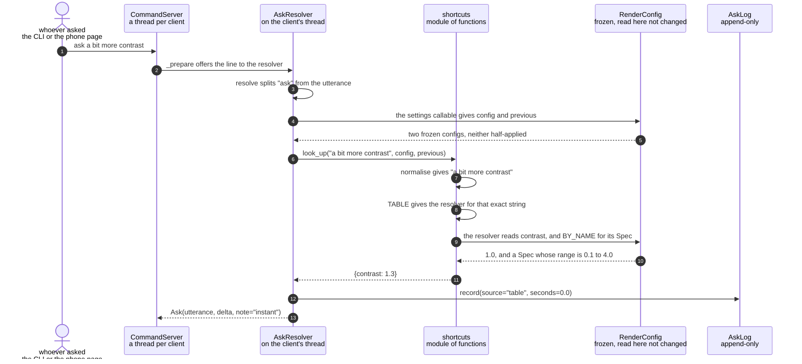

# A spoken phrase is answered from the shortcut table, with no model call

**Priority: `MEDIUM`** — asking is opt-in, but this is the half of it that still works with the network down and no key present. [What the priorities mean](../how-to-write-scenario-docs.md).

`ask make it green` used to cross a network, wait 2.6 seconds and cost a third
of a US cent to work out `{"scheme": "green"}` — which is the scheme's own name,
said out loud. A table of 137 phrasings answers that class of phrase before any
model call or key check happens, in microseconds and for nothing.

Two properties fall out of putting the lookup **before** the key check, and both
are worth more than the money. A hit needs no API key and no network, so with
the WiFi down `green` and `freeze it` still work and `ask` stops being all or
nothing. And a hit is instant, which on a 240x320 panel with no spinner is the
difference you actually feel.

**The table is exact and the model is fuzzy, and that split is the whole
design.** The lookup matches a normalised string and returns `None` the moment
it is not certain. A table that guessed would be competing with the model at the
thing the model is for, and losing quietly: a near-miss becomes a wrong setting
with no round trip to blame it on. So `something calmer`, `green, high contrast
and the fine ramp`, and every phrase that should be *declined* are left alone —
a table cannot decline well, it can only fail to match, which is not the same
thing.

| Class | What it represents, and its part in this scenario |
|---|---|
| [`CommandServer`](../../src/control/command_server.py#L80) | The Unix socket and a thread per client. Here it is only the **doorway**: [`_prepare`](../../src/control/command_server.py#L214) offers the line to a resolver and does nothing else, which is what lets everything below run on a thread the picture does not depend on |
| [`AskResolver`](../../src/language/resolver.py#L33) | The whole of the ask path, and the one part of the app allowed to be slow. Here it is the **triage**: [`resolve`](../../src/language/resolver.py#L98) recognises an `ask`, reads the settings through a callable, and tries the table first. Only if the table declines does it reach for a key, a network and the model |
| [`shortcuts`](../../src/language/shortcuts.py) | A module of functions, not a class. Here it is the **exact matcher**: [`look_up`](../../src/language/shortcuts.py#L246) either knows a phrase precisely or says `None`. It holds no fuzziness at all, on purpose |
| [`RenderConfig`](../../src/control/render_config.py#L118) | The complete live render state. Here it is **read, never written**: a stepped phrase like "a bit more contrast" is meaningless without the current value, so the table's entries are functions of the config rather than constants |
| [`AskLog`](../../src/language/asklog.py#L75) | An append-only record of every ask. Here it records `source: "table"`, which is what makes the entry evidence of the *table* and not of the prompt — anything counting hit rate or promoting real phrases into eval cases has to filter on it |

## A phrase the table knows exactly

| Step | Message | What is going on |
|---:|---|---|
| 1 | `ask a bit more contrast` | The `ask` prefix is the whole of the syntax. On the phone page a toggle adds it for you, so what is typed there is bare words |
| 2 | [`_prepare`](../../src/control/command_server.py#L214) offers the line to the resolver | The resolver hook exists so that anything slow happens **here**, on the client's thread, rather than on the render loop. That a table hit turns out not to be slow at all is a bonus — the hook was built for the four-second case |
| 3 | [`resolve`](../../src/language/resolver.py#L98) splits "ask" from the utterance | Anything whose first word is not `ask` returns `None` and passes through untouched as an ordinary typed command. An `ask` with nothing after it returns a [`Reply`](../../src/control/command_server.py#L74) — an answer that never troubles the render loop at all |
| 4 | the settings callable gives config and previous | Read from this thread without a lock. [`AskResolver`](../../src/language/resolver.py#L33) is given a callable rather than the values, because an ask arrives whenever somebody types one and is about the settings as they are at that moment |
| 5 | two frozen configs, neither half-applied | Safe precisely because [`RenderConfig`](../../src/control/render_config.py#L118) is frozen and replaced wholesale on the loop's thread: this either sees a change or does not, and can never catch one halfway |
| 6 | [`look_up`](../../src/language/shortcuts.py#L246)`("a bit more contrast", config, previous)` | Tried **before** the API key is even looked for. That ordering is the whole reason a hit survives a dead network, and it is worth more than the money it saves |
| 7 | [`normalise`](../../src/language/shortcuts.py#L64) gives "a bit more contrast" | Lower case, single-spaced, trailing punctuation dropped, [courtesies](../../src/language/shortcuts.py#L61) stripped. **Deliberately shallow** — stemming or stopword removal would let two different requests collapse to one string, and "a bit more contrast" is not "way more contrast" |
| 8 | `TABLE` gives the resolver for that exact string | An exact dict lookup over [137 phrasings](../../src/language/shortcuts.py#L145), or `None`. No fuzzy matching exists here to go wrong. Two entries claiming one phrase [raise at import](../../src/language/shortcuts.py#L154) rather than letting dict order decide which silently never runs |
| 9 | the resolver reads contrast, and `BY_NAME` for its [`Spec`](../../src/control/render_config.py#L63) | A [stepped entry](../../src/language/shortcuts.py#L109) is a function of the live config, not a constant — "more" has no meaning without a "than what". The step is [×1.3](../../src/language/shortcuts.py#L55), the smallest move that is unmistakable on the panel |
| 10 | 1.0, and a `Spec` whose range is 0.1 to 4.0 | The step is [clamped](../../src/language/shortcuts.py#L103) to the spec, so asking for more contrast at the ceiling yields `{contrast: 4.0}` — a no-op rather than a refusal. Clamping is what makes a step phrase safe to repeat |
| 11 | `{contrast: 1.3}` | A delta in exactly the shape a typed command produces. From here nothing downstream can tell the table answered |
| 12 | [`record`](../../src/language/asklog.py#L90)`(source="table", seconds=0.0)` | Written on this thread too, and silently skipped if there is no log — an ask that works is worth more than a record of it. The `source` field is the load-bearing part: a table hit says nothing about the prompt, because the model was never asked |
| 13 | [`Ask`](../../src/control/command_server.py#L55)`(utterance, delta, note="instant")` | A delta already worked out, on its way to the render loop, which will apply it exactly as it applies a typed one. `note="instant"` is what the person sees in place of the model's elapsed seconds |

Everything above happens on the client's own thread, and the render loop is not
a participant — which is why there are no thread bands on this diagram. The
picture keeps drawing throughout, and would have done so even had the phrase
missed and cost four seconds against the model.

## Which phrases earn a place

| Kind | Examples | Why the table and not the model |
|---|---|---|
| A setting's value, said out loud | `green`, `make it amber`, `fine characters` | Generated from `SPECS`, so a scheme added to `palettes.py` is speakable the same day without editing the table |
| A boolean, said as a verb | `freeze it`, `invert it`, `mirror it` | There is nothing to interpret |
| A step along a range | `a bit more contrast`, `bigger characters` | Arithmetic on a value the model would have to be told |
| [`undo that`](../../src/language/shortcuts.py#L103) | `undo`, `put that back` | Not a guess at all — the app knows the previous config exactly, so the restoring delta is [a diff](../../src/control/render_config.py#L178). The model can only approximate this from a sparse description in its prompt |

`undo that` with nothing to undo returns `None` and falls through to the model
rather than answering with a shrug. That spends an API call on a request nobody
can satisfy, which is the cheaper mistake: the alternative is this module
inventing a reply.

Every fixed entry is [run through the validator at import](../../src/language/shortcuts.py#L222),
so a scheme renamed in `palettes.py` fails at start-up rather than as a refusal
in front of somebody using the camera.

## How far the normalising goes

Punctuation and manners come off together, in one loop, rather than punctuation
once and then manners:

| Said | Normalised to | |
|---|---|---|
| `green please` | `green` | hit |
| `please green` | `green` | hit |
| `can you make it green` | `make it green` | hit |
| `Green, please` | `green` | hit |
| `could you freeze it, please` | `freeze it` | hit |
| `green, high contrast` | `green, high contrast` | miss, correctly — a compound is the model's |
| `pleasant green` | `pleasant green` | miss, correctly — not a courtesy |

Writing this scenario is what found the bug that made the fourth and fifth rows
misses. Punctuation used to be stripped **once, before** the courtesies, so a
comma sitting between the phrase and the courtesy survived: `green, please`
normalised to `green,` and fell through to the model. Nothing broke — a miss is
answered correctly, just slowly — but the phrasing most people actually type was
the one paying 2.6 seconds and an API call for an answer the table already had.
The docstring promised "no trailing punctuation, no manners" and delivered each
separately.

The last two rows are the guard rails on the fix. An inner comma is part of the
request and has to survive, or two different phrasings could collapse to one
string — the one failure this table cannot afford. And the character after a
courtesy is checked rather than assumed, so `pleasant` is not read as `please`.

## Related scenarios

- [A spoken phrase is turned into a config delta by the language model](a-spoken-phrase-is-turned-into-a-config-delta-by-the-language-model.md) — what
  happens instead when `look_up` returns `None`: the key check, the `asking:`
  notice on the panel, and the four-second round trip this scenario avoids.
- [A typed command updates the render configuration](a-typed-command-updates-the-render-configuration.md)
  — takes over where this one stops. The `Ask` goes on the same inbox a typed
  line does, and by the time the render loop sees it there is nothing left to
  wait for.
- [A render configuration change is refused](a-render-configuration-change-is-refused.md)
  — the delta produced here is judged by exactly the same validator, which is
  why the table is checked against it at import.
