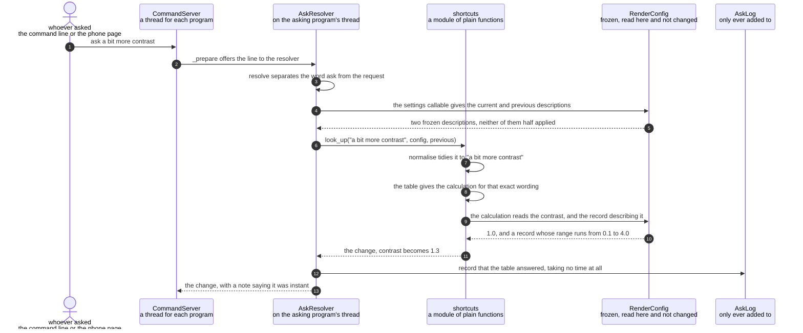

# A spoken phrase is answered from the shortcut table, with no model call

**Priority: `MEDIUM`** — asking in words is something somebody switches on deliberately, but this is the half of it that still works with the network down and no key present. [What the priorities mean](../how-to-write-scenario-docs.md).

Typing `ask make it green`[^ask] used to cross a network, wait about 2.6
seconds and cost roughly a third of a penny, in order to work out the setting
`{"scheme": "green"}`[^scheme]. That answer is simply the colour scheme's own
name, said out loud.

A table of 137 phrasings now answers that whole class of request before any
model is contacted and before the key is even looked for. It takes microseconds
and costs nothing.

Two properties follow from putting the lookup **before** the key check, and both
are worth considerably more than the money saved.

A match needs no key[^apikey] and no network at all. So with the wireless down,
`green` and `freeze it` still work, and asking in words stops being an
all-or-nothing feature that disappears the moment the connection does.

A match is also instant, and on a small panel[^panel] with nothing moving on it
to show that anything is happening, instant against two and a half seconds is
the difference somebody actually notices.

**The table is exact and the model is flexible, and that split is the entire
design.** The lookup compares a tidied-up version of what was typed against a
list, and hands back nothing the moment it is not certain.

A table that guessed would be competing with the model at the very thing the
model is for, and it would lose quietly. A near miss becomes a wrong setting,
with no network request anywhere to blame it on. So `something calmer`, `green,
high contrast and the fine ramp`[^ramp], and every phrase that ought to be
*declined* are all deliberately left out. A table cannot decline gracefully. It
can only fail to match, and those two things are not the same.

| Class | What it represents, and its part in this scenario |
|---|---|
| [`CommandServer`](../../src/control/command_server.py#L80) | The connection[^socket] and a thread for each program attached to it. In this scenario it is only the **doorway**. [`_prepare`](../../src/control/command_server.py#L214) offers the line to a resolver and does nothing else at all, which is what allows everything below it to run on a thread the picture does not depend on |
| [`AskResolver`](../../src/language/resolver.py#L33) | The whole path for requests phrased in words, and the one part of the program permitted to be slow. In this scenario it is the **sorter**. [`resolve`](../../src/language/resolver.py#L98) recognises the word `ask`, reads the settings through a callable, and tries the table first. Only if the table declines does it reach for a key, a network and the model |
| [`shortcuts`](../../src/language/shortcuts.py) | A module of plain functions rather than a class. In this scenario it is the **exact matcher**. [`look_up`](../../src/language/shortcuts.py#L246) either knows a phrase precisely or hands back nothing. It contains no flexibility whatsoever, and that is on purpose |
| [`RenderConfig`](../../src/control/render_config.py#L118) | The complete, current description of how the picture is drawn. In this scenario it is **read and never written**. A phrase that asks for a step, such as "a bit more contrast", is meaningless without knowing the present value, so the table's entries are calculations over the current description[^config] rather than fixed answers |
| [`AskLog`](../../src/language/asklog.py#L75) | A record of every request, only ever added to. Here it records that the *table* answered, which is what makes the entry evidence about the table rather than about the instructions given to the model. Anything counting how often the table succeeds, or promoting real phrases into test cases[^eval], has to filter on that field |

## A phrase the table knows exactly

```mermaid
sequenceDiagram
    autonumber
    actor Asker as whoever asked<br/>the command line or the phone page
    participant CS as CommandServer<br/>a thread for each program
    participant App as AskResolver<br/>on the asking program's thread
    participant Sh as shortcuts<br/>a module of plain functions
    participant Cfg as RenderConfig<br/>frozen, read here and not changed
    participant Log as AskLog<br/>only ever added to

    Asker->>CS: ask a bit more contrast
    CS->>App: _prepare offers the line to the resolver
    App->>App: resolve separates the word ask from the request
    App->>Cfg: the settings callable gives the current and previous descriptions
    Cfg-->>App: two frozen descriptions, neither of them half applied
    App->>Sh: look_up("a bit more contrast", config, previous)
    Sh->>Sh: normalise tidies it to "a bit more contrast"
    Sh->>Sh: the table gives the calculation for that exact wording
    Sh->>Cfg: the calculation reads the contrast, and the record describing it
    Cfg-->>Sh: 1.0, and a record whose range runs from 0.1 to 4.0
    Sh-->>App: the change, contrast becomes 1.3
    App->>Log: record that the table answered, taking no time at all
    App-->>CS: the change, with a note saying it was instant
```

| Step | Message | What is going on |
|---:|---|---|
| 1 | `ask a bit more contrast` | The word `ask` at the front is the entire syntax. On the phone page a switch adds it on the sender's behalf, so what somebody types there is just the plain words |
| 2 | [`_prepare`](../../src/control/command_server.py#L214) offers the line to the resolver | This hook exists so that anything slow happens **here**, on the asking program's thread, rather than on the drawing loop. That a table match turns out not to be slow at all is a bonus: the hook was built for the case that takes seconds |
| 3 | [`resolve`](../../src/language/resolver.py#L98) separates the word ask from the request | Anything whose first word is not `ask` is handed straight back untouched and continues as an ordinary typed command. An `ask` with nothing after it produces a [reply](../../src/control/command_server.py#L74) on the spot, which never troubles the drawing loop at all |
| 4 | the settings callable gives the current and previous descriptions | Read from this thread with no lock taken. The sorter is given a callable rather than the values themselves, because a request can arrive at any moment and is about the settings as they stand right then |
| 5 | two frozen descriptions, neither of them half applied | This is safe precisely because the description is frozen and replaced in one piece on the drawing loop's thread. This code either sees a change or does not, and can never catch one halfway through being made |
| 6 | [`look_up`](../../src/language/shortcuts.py#L246)`("a bit more contrast", config, previous)` | Tried **before** the key is even looked for. That ordering is the whole reason a match survives a dead network, and it is worth more than the money it saves |
| 7 | [`normalise`](../../src/language/shortcuts.py#L64) tidies it to "a bit more contrast" | Lower case, single spaces, trailing punctuation removed, and [polite words](../../src/language/shortcuts.py#L61) stripped off. It is **deliberately shallow**. Anything cleverer, such as reducing words to their stems, would let two genuinely different requests collapse into the same string, and "a bit more contrast" is not "way more contrast" |
| 8 | the table gives the calculation for that exact wording | A plain lookup across [137 phrasings](../../src/language/shortcuts.py#L145), which either matches or does not. No flexible matching exists here to go wrong. Two entries claiming the same phrase [report an error as the program loads](../../src/language/shortcuts.py#L154) rather than letting the order of a list decide which one silently never runs |
| 9 | the calculation reads the contrast, and the record describing it | A [stepping entry](../../src/language/shortcuts.py#L109) is a calculation over the live settings rather than a fixed answer, because the word "more" has no meaning without a "more than what". The step multiplies by [1.3](../../src/language/shortcuts.py#L55), which is the smallest change that is unmistakable on the panel: anything smaller and somebody would press again thinking nothing had happened |
| 10 | 1.0, and a record whose range runs from 0.1 to 4.0 | The result is [brought inside that range](../../src/language/shortcuts.py#L103), so asking for more contrast when it is already at the top gives 4.0 again. That is a change that does nothing, rather than a refusal, and it is what makes a stepping phrase safe to repeat |
| 11 | the change, contrast becomes 1.3 | A proposed change[^delta] in exactly the shape a typed command produces. From this point on, nothing further along can tell that the table answered |
| 12 | record that the table answered, taking no time at all | Written on this thread too, and quietly skipped if there is no log file, because an answer that works matters more than a record of it. The field naming the source is the load-bearing part: a table match tells you nothing about the instructions given to the model, since the model was never asked |
| 13 | the change, with a note saying it was instant | A worked-out change on its way to the drawing loop, which will apply it exactly as it applies a typed one. The note is what a person sees in place of the model's elapsed seconds |

Everything above happens on the asking program's own thread, and the drawing
loop is not a participant at all, which is why this diagram has no coloured
bands. The picture carries on drawing throughout, and would have done so even if
the phrase had missed and cost seconds against the model.

## Which phrases earn a place

| Kind | Examples | Why the table and not the model |
|---|---|---|
| A setting's value, said out loud | `green`, `make it amber`, `fine characters` | Generated from the same twelve records the rest of the program uses, so a colour scheme added in one file becomes speakable the same day without anybody editing the table |
| A yes-or-no setting, said as a verb | `freeze it`, `invert it`[^invert], `mirror it` | There is nothing here to interpret |
| A step along a range | `a bit more contrast`, `bigger characters` | Arithmetic on a value the model would otherwise have to be told |
| [Undoing](../../src/language/shortcuts.py#L122) | `undo`, `undo that`, `put that back` | Not a guess at all. The program knows the previous description exactly, so the change that restores it is [a comparison](../../src/control/render_config.py#L178) between two known things. A model could only approximate that from the summary in its instructions |

Asking to undo when there is nothing to undo hands back nothing and falls
through to the model, rather than answering with a shrug. That spends a request
on something nobody can satisfy, which is the cheaper of the two mistakes: the
alternative is this module inventing a reply of its own.

Every fixed entry is [checked against the validator as the program
loads](../../src/language/shortcuts.py#L222), so a colour scheme renamed in one
file causes a failure at start-up rather than a refusal in front of somebody
using the camera.

## How far the tidying goes

Punctuation and politeness come off together, in one pass, rather than
punctuation first and politeness afterwards:

| Said | Tidied to | |
|---|---|---|
| `green please` | `green` | match |
| `please green` | `green` | match |
| `can you make it green` | `make it green` | match |
| `Green, please` | `green` | match |
| `could you freeze it, please` | `freeze it` | match |
| `green, high contrast` | `green, high contrast` | correctly no match — a compound request belongs to the model |
| `pleasant green` | `pleasant green` | correctly no match — not a polite word |

Writing this scenario is what uncovered the fault that made the fourth and fifth
rows fail to match. Punctuation used to be stripped **once, before** the polite
words were removed, so a comma sitting between the phrase and the courtesy
survived the process. `green, please` was tidied to `green,` with the comma
still attached, and fell through to the model.

Nothing appeared broken, because a miss is still answered correctly, merely
slowly. But the phrasing most people naturally type was the one paying two and a
half seconds and a request to the model for an answer the table already had. The
description in the code promised "no trailing punctuation, no manners" and
delivered each of those separately.

The last two rows are the guard rails on the fix. A comma inside the request is
part of the request and has to survive, or two different phrasings could collapse
into one string, which is the single failure this table cannot afford. And the
character following a polite word is examined rather than assumed, so `pleasant`
is not mistaken for `please`.

## Related scenarios

- [A spoken phrase is turned into a config delta by the language model](a-spoken-phrase-is-turned-into-a-config-delta-by-the-language-model.md)
  — what happens instead when the table hands back nothing: the key check, the
  message on the panel, and the round trip this scenario avoids.
- [A typed command updates the render configuration](a-typed-command-updates-the-render-configuration.md)
  — takes over where this scenario stops. The change joins the same queue a
  typed line does, and by the time the drawing loop sees it there is nothing
  left to wait for.
- [A render configuration change is refused](a-render-configuration-change-is-refused.md)
  — the change produced here is judged by exactly the same checking code, which
  is why the whole table is checked against it as the program loads.

### Footnotes

[^ask]: An **ask** is a request phrased in ordinary words, such as "make it
    warmer", rather than one that already names a setting and a value. It
    arrives as an [`Ask`](../../src/control/command_server.py#L55), and
    [`AskResolver`](../../src/language/resolver.py#L33) decides whether a table
    of known phrases can answer it or whether a language model has to be asked.

[^scheme]: A **colour scheme** is one of the nine named looks listed in
    [`SCHEMES`](../../src/art/palettes.py#L79). Which one is currently in use is
    part of the program's render configuration, and the knob, a key press or a
    typed command can all change it. The scheme called `grey` is the one the
    program starts with, and it is what the phrase "greyscale mode" refers to:
    characters only, worked out from the brightness part of the picture and
    nothing else. Only the scheme called `live` reads the colour parts, through
    [`colour_grid`](../../src/capture/image_processor.py#L187). The remaining
    seven are tints, such as green phosphor, amber CRT and e-ink on paper. A
    tint recolours the same greyscale picture using two fixed colours, so it
    never looks at the colour parts either.

[^apikey]: An **API key** is a secret string that identifies and authorises a
    program making requests to an online service. This one authorises calls to
    the language model, and it is read from a file named by
    [`KEY_FILE`](../../src/language/parser.py#L101) by
    [`api_key`](../../src/language/parser.py#L301). When no key is present the
    entire language-model path is switched off rather than being allowed to fail
    at the moment of the call. That is why every path needing it is rated of low
    importance: the sealed box runs perfectly well without one.

[^panel]: The **SPI panel** is a small screen measuring 2.4 inches across the
    diagonal, 240 dots by 320, using a controller chip called the ILI9341. It is
    connected to the computer by a simple four-wire arrangement called SPI, which
    is a common way of attaching small devices. It is driven entirely by the
    program itself, through [`ILI9341`](../../src/lcd/lcd.py#L47), with no
    separate system driver involved. In the sealed box this program is built
    for, this panel is the only screen there is. One complete picture for it is
    153,600 bytes, which has to be sent in pieces of 4 kilobytes each — see
    [`SPI_CHUNK`](../../src/lcd/lcd.py#L44) — because that is as much as the
    connection will accept at a time.

[^ramp]: A **ramp** is the set of characters a picture is drawn with, arranged
    in order from the one that looks lightest to the one that looks darkest.
    The sequence ` .:-=+*#%@` is one example. A brightness value picks a
    position along that sequence, so the choice of ramp decides how the picture
    looks before any colour is involved at all. The named ramps are listed in
    [`RAMPS`](../../src/art/ascii_art.py#L17), and a setting chooses between
    them.

[^socket]: A **Unix domain socket** is a connection between two programs on the
    same computer, which appears in the file system as though it were a file. It
    behaves like a network connection, with one program writing and another
    reading, except that no network is involved at any point.
    [`CommandServer`](../../src/control/command_server.py#L80) listens on one of
    these, which is how a shell, a phone or another program can reach a running
    camera without the program ever opening a network port.

[^config]: The **render configuration** is the complete, current description of
    how the picture should be drawn: which colour scheme, which ramp, how much
    contrast, which way up, and so on. It is frozen, meaning no part of the
    program ever alters one. Instead, every change produces an entirely new
    [`RenderConfig`](../../src/control/render_config.py#L118) by way of
    [`with_changes`](../../src/control/render_config.py#L141), which is also the
    only code anywhere that decides whether a proposed value is allowed. The
    list of settings, and what each one will accept, is
    [`SPECS`](../../src/control/render_config.py#L74). That single table is what
    the checking code, the `help` text, the command-line options and the
    description given to the language model are all built from.

[^eval]: An **eval** is a stored request paired with the answer a person judged
    to be correct. Running a collection of them against the model gives a score,
    which is how a change to the instructions given to the model can be
    measured rather than guessed at.
    [`as_case`](../../src/language/asklog.py#L182) can turn a real recorded
    request into a *candidate* eval, but only a candidate. Its expected answer
    holds whatever the model actually said, and that is the very thing being
    tested. Promoting one without a person looking at it would build a
    collection that only checks the model still does what it did before.

[^delta]: A **delta** is a plain list of the settings a change intends to alter,
    paired with their new values, such as `{"scheme": "amber"}`, and nothing
    else besides. Every way of asking for a change builds one of these and hands
    it to the configuration. None of them ever sets a setting directly. That is
    what keeps the checking in a single place no matter who did the asking.

[^invert]: The **invert** setting reverses the ramp, so that bright parts of the
    scene are drawn with the dark end of the character sequence instead. In
    effect it turns a light-on-dark picture into a dark-on-light one. It
    reverses the characters and deliberately leaves the list of positions
    untouched, which is how both screens stay in agreement about which
    character a given brightness deserves.
