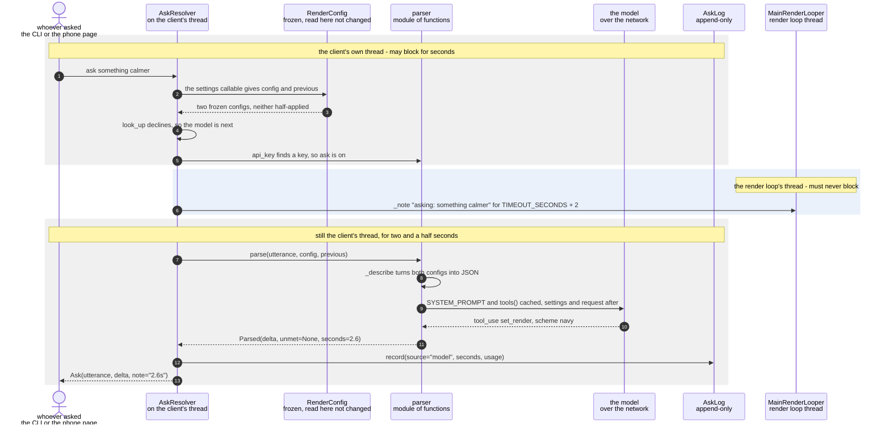

# A spoken phrase is turned into a config delta by the language model

**Priority: `LOW`** — off entirely without an API key[^apikey] and a network, and the one path here that costs seconds and money. [What the priorities mean](../how-to-write-scenario-docs.md).

Somebody says `ask something calmer`[^ask]. No table can answer that — there
is no list of phrasings on which "calmer" is a colour scheme[^scheme] — so it
costs a network round trip, about two and a half seconds, and roughly four
hundred tokens[^tokens], and comes back as `{"scheme": "navy"}`. The value is
that a request nobody anticipated still lands as an ordinary settings change:
by the time the render loop sees it, it is a dict indistinguishable from a
line somebody typed, and it is judged by the same validator in the same words.

This is the path taken only when
[`look_up`](../../src/language/shortcuts.py#L246) has already declined. That
ordering is the design: the table is exact and the model is fuzzy, so the table
is asked first and **before the API key is even looked for**, and what reaches
here is only what a table could not answer without guessing. A table that
guessed would compete with the model at the thing the model is for, and lose
quietly — a near miss becomes a wrong setting with no round trip to blame it
on. So `something calmer` is deliberately absent from the 137 phrasings, and
arrives here instead.

Two things are spent that the table costs nothing for, and both are visible in
the document below. The first is **time**, which on a 240x320 panel[^panel]
with no spinner is indistinguishable from a camera that ignored you — so this
is the one path in the app that announces itself before doing its work, and
the only one whose diagram crosses a thread boundary. The second is
**evidence**: [`AskLog`](../../src/language/asklog.py#L75) records
`source="model"` with the elapsed seconds and the token usage, which is what
makes the entry a fact about the prompt. A table hit says nothing about the
prompt, because the model was never asked.

| Class | What it represents, and its part in this scenario |
|---|---|
| [`AskResolver`](../../src/language/resolver.py#L33) | The whole of the ask path, and the one part of the app allowed to be slow. Here it is the **escort**: [`resolve`](../../src/language/resolver.py#L98) finds the table has declined, confirms there is a key, says so on every display this run has, and hands the words to the parser. It never touches a setting itself |
| [`parser`](../../src/language/parser.py) | A module of functions rather than a class. Here it is the **translator**: [`parse`](../../src/language/parser.py#L401) builds a prompt whose tool schema[^toolschema] is generated from [`SPECS`](../../src/control/render_config.py#L74), calls the model, and turns whichever tool came back into a `Parsed`. It is the only code in the app that knows a model exists |
| [`Parsed`](../../src/language/parser.py#L274) | What one utterance came back as. Here it is the **answer**, and a deliberately narrow one: exactly one of `delta`[^delta] and `declined` is set, so nothing downstream has a third shape to handle. `unmet` rides alongside a delta and is not a refusal |
| [`RenderConfig`](../../src/control/render_config.py#L118) | The complete live render state, frozen so that it is replaced rather than mutated. Here it is the **briefing**: [`_describe`](../../src/language/parser.py#L396) turns it into the JSON the model is shown, which is the only reason "calmer" and "undo that" can mean anything. Read on this path, never written |
| [`MainRenderLooper`](../../ascii_camera.py#L98) | The one object the process is hung off, and the only thread a setting may be changed on. Here it is the **announcer**, and nothing else: [`_note`](../../ascii_camera.py#L337) is handed to the resolver as a callable so a slow request can say so on the panel and the status line[^statusline] without the resolver knowing either exists |
| [`AskLog`](../../src/language/asklog.py#L75) | An append-only record of every ask. Here it is the **receipt**: [`record`](../../src/language/asklog.py#L90) keeps the seconds and the token usage as well as the delta, so the cost of this path can be counted rather than estimated |

## A phrase no table could answer

| Step | Message | What is going on |
|---:|---|---|
| 1 | `ask something calmer` | The `ask` prefix is the whole of the syntax, and everything after it is the utterance. Nothing here distinguishes a phrase the table knows from one it does not — that is discovered further down, which is why both scenarios share an entrance |
| 2 | the settings callable gives config and previous | [`AskResolver`](../../src/language/resolver.py#L33) is handed a callable rather than the values, because an ask arrives whenever somebody types one and is about the settings as they are at that moment |
| 3 | two frozen configs, neither half-applied | `previous` is the config[^config] before the last change, and it is what makes `undo that` answerable at all. It is `None` on the first change of a run, which is honest — there is nothing to undo yet |
| 4 | [`look_up`](../../src/language/shortcuts.py#L246) declines, so the model is next | An exact lookup over 137 phrasings, or `None`. `something calmer` is deliberately not among them: a table cannot decline well, it can only fail to match, and the two are not the same thing. **This step is the entire entry condition for this document** |
| 5 | [`api_key`](../../src/language/parser.py#L301) finds a key, so ask is on | Checked *after* the table and not before it, which is the whole reason a table hit survives a dead network and a missing key. With no key this returns a [`Reply`](../../src/control/command_server.py#L74) naming [`KEY_FILE`](../../src/language/parser.py#L101) and saying every other command still works — an answer, not a crash |
| 6 | [`_note`](../../ascii_camera.py#L337) "asking: something calmer" for [`TIMEOUT_SECONDS`](../../src/language/parser.py#L95) + 2 | The only step that crosses a thread. Two seconds of silence on a panel with no spinner is indistinguishable from a camera that ignored you, so the request announces itself before making it. The `+ 2` matters: the notice[^notice] must outlive the parser's own timeout, or the panel goes quiet while the request is still out. A fixed four seconds was wrong for exactly this — a request may run for twenty |
| 7 | [`parse`](../../src/language/parser.py#L401)`(utterance, config, previous)` | The config is passed *in* rather than read here, so relative requests resolve against real values. A parse that raced a keypress resolves against settings one change stale, which for "something calmer" is not worth a lock |
| 8 | [`_describe`](../../src/language/parser.py#L396) turns both configs into JSON | Becomes `now` and, when `previous` is not `None`, `before`. This is the only reason the model can answer a comparative at all — "calmer" is meaningless without knowing what it is calmer *than* |
| 9 | [`SYSTEM_PROMPT`](../../src/language/parser.py#L127) and [`tools`](../../src/language/parser.py#L204)`()` cached, settings and request after | Deliberate ordering, not stylistic. The prompt and the schema are identical on every call, so they are the cache prefix[^promptcache] — measured at 2,103 cached tokens against roughly 420 that vary. Putting the current settings in the system prompt[^systemprompt] would change the prefix on every request and cache nothing |
| 10 | tool_use set_render, scheme navy | [`tools`](../../src/language/parser.py#L204)`()` is generated from [`SPECS`](../../src/control/render_config.py#L74), so a scheme added to `palettes.py` is speakable without editing a schema. `tool_choice`[^tooluse] is `any`: one of the two tools and never prose, because a parser that can reply with a paragraph has a third output shape nothing downstream handles. The tools are **not** strict, on purpose — [`RenderConfig`](../../src/control/render_config.py#L118) is already the validator, and an eval that could never observe a malformed delta could not measure how often one is produced |
| 11 | [`Parsed`](../../src/language/parser.py#L274)`(delta, unmet=None, seconds=2.6)` | Exactly one of `delta` and `declined` is set. `unmet` is the third thing and is *not* a refusal: `smallest characters possible` really returned `{"lcd_font_size": 4}` alongside a note that the terminal's character size is not this device's to change. The delta still applies; the sentence explains what it could not cover |
| 12 | [`record`](../../src/language/asklog.py#L90)`(source="model", seconds, usage)` | Written on this thread too, and silently skipped when there is no log. `source` is the load-bearing field — filtering on it is what separates a fact about the prompt from a fact about the table — and `usage` is why the cost of this path can be counted rather than guessed at |
| 13 | [`Ask`](../../src/control/command_server.py#L55)`(utterance, delta, note="2.6s")` | The same shape a table hit produces, so from here nothing can tell which route answered. The note is the difference a person sees: elapsed seconds where a table hit says `instant`, with `unmet` appended after a dash when there is one. The delta itself is still unjudged — [`with_changes`](../../src/control/render_config.py#L141) has not run yet, and will refuse this in the same words it refuses a typed line |

Unlike the shortcut-table scenario, this diagram is banded, because this one
really does cross a thread. The crossing is a single step and it is deliberately
one-way: [`_note`](../../ascii_camera.py#L337) rebinds one tuple that the render
loop reads on its next pass, and hands the same text to `LcdWorker`, whose
[`notice`](../../src/lcd/lcd_worker.py#L143) takes a lock and records rather than
draws. Nothing is drawn from this thread, and nothing waits on the loop — the
picture keeps its frame rate through the whole two and a half seconds.

The one outcome drawn here is the one that succeeds. A parse that raises, and a
request the model declines, are different outcomes with the same cast, and get
their own documents rather than an `alt` in this one.

## Related scenarios

- [A spoken phrase is answered from the shortcut table, with no model call](a-spoken-phrase-is-answered-from-the-shortcut-table-with-no-model-call.md)
  — the route taken instead when `look_up` knows the phrase exactly: no key, no
  network, no seconds, and the reason this document begins where it does.
- [A typed command updates the render configuration](a-typed-command-updates-the-render-configuration.md)
  — where the `Ask` produced here goes next. It joins the same inbox a typed
  line does, and by then there is nothing left to wait for.
- [A render configuration change is refused](a-render-configuration-change-is-refused.md)
  — what judges the delta this produces. The model's output earns no special
  treatment, which is the point of letting it through unstrict.
- [A model parse fails and the panel says which kind of failure it was](a-model-parse-fails-and-the-panel-says-which-kind-of-failure-it-was.md) — the
  `ParseError` outcome, where `short_failure` shortens a sentence to something
  that fits a 320-pixel band.
- [The language model declines a request it cannot satisfy](the-language-model-declines-a-request-it-cannot-satisfy.md) — the `declined`
  outcome, which is an answer rather than a failure and still has to reach the
  panel rather than only the socket.

### Footnotes

[^apikey]: The key that authenticates a call to the model's API, read from
    [`KEY_FILE`](../../src/language/parser.py#L101) by
    [`api_key`](../../src/language/parser.py#L301). Without one the whole model
    path is switched off rather than failing at the call, which is why every
    path that needs it is `LOW` priority: the appliance runs without it.

[^ask]: An **ask** is a request in words rather than in settings — "make it
    warmer" — as opposed to a typed command, which already names the setting.
    It arrives as [`Ask`](../../src/control/command_server.py#L55), and
    [`AskResolver`](../../src/language/resolver.py#L33) decides whether the
    shortcut table can answer it or the language model has to.

[^scheme]: A **colour scheme** is one of the nine named looks in
    [`SCHEMES`](../../src/art/palettes.py#L79), and which one is live is part
    of the render configuration. `grey` is the default, and is what "greyscale
    mode" means: characters only, drawn from the luma plane and nothing else.
    `live` is the only scheme that reads the chroma planes, through
    [`colour_grid`](../../src/capture/image_processor.py#L187). The other seven
    are **tints** — green phosphor, amber CRT, e-ink on paper — which recolour
    the same greyscale picture from two fixed colours.

[^tokens]: A **token** is the unit a language model reads and writes and is
    billed by — roughly a short word or a piece of one. It is why the cost of
    an ask can be stated as a fraction of a cent rather than guessed at:
    [`record`](../../src/language/asklog.py#L90) keeps the count the model
    itself reports.

[^panel]: The **SPI panel** is a 2.4 inch ILI9341 LCD, 240x320, wired to the
    Pi's SPI bus — a four-wire serial bus for talking to peripherals — and
    driven from userspace by [`ILI9341`](../../src/lcd/lcd.py#L47) with no
    kernel driver behind it. In the sealed enclosure it is the only display
    there is. One full frame is 153,600 bytes, sent in
    [`SPI_CHUNK`](../../src/lcd/lcd.py#L44) pieces of 4 KB because that is what
    the driver's buffer holds.

[^toolschema]: A **tool schema** is the machine-readable description of what
    the model is allowed to hand back — the setting names, their types and
    their permitted values. [`tools`](../../src/language/parser.py#L204) builds
    it from `SPECS`, so a setting cannot exist in the app and be invisible to
    the model, or be offered to the model in a form the validator would
    refuse.

[^delta]: A **delta** is a plain dict of the settings a change means to alter —
    `{"scheme": "amber"}` — and nothing else. Every route in builds one and
    hands it to the configuration; none of them assigns a setting directly.
    That is what keeps validation in one place no matter who asked.

[^statusline]: The **status line** is the single line of readouts under the
    picture — scheme, ramp, frame rate, grid size — built by
    [`status_line`](../../src/hdmi/status_line.py#L76). It is also where a
    refusal or a notice is shown on the terminal, since there is nowhere else
    to put one.

[^config]: The **render configuration** is the complete live state of how the
    picture is drawn — scheme, ramp, contrast, rotation and the rest. It is
    frozen: nothing assigns to it, and every change produces a whole new
    [`RenderConfig`](../../src/control/render_config.py#L118) through
    [`with_changes`](../../src/control/render_config.py#L141), which is also
    the only code that decides whether a value is allowed. What the settings
    are, and what each accepts, is
    [`SPECS`](../../src/control/render_config.py#L74) — one table that the
    validator, the `help` text, the command-line arguments and the model's
    tool schema are all built from.

[^notice]: A **notice** is a short message painted over the bottom of the
    picture on the panel — two lines in fixed ink over whatever is underneath,
    sized by [`NOTICE_LINES`](../../src/lcd/lcd_display.py#L37). It is how a
    box with no keyboard and no terminal says something went wrong, and it
    covers 36 of the panel's 240 rows.

[^promptcache]: The model's provider bills a repeated **prefix** of a request
    at a lower rate if it is identical to last time. The system prompt and the
    tool schema never vary, so they go first and are cached — measured at 2,103
    cached tokens against roughly 420 that change. Putting the live settings
    into the prompt instead would alter the prefix on every call and cache
    nothing.

[^systemprompt]: The standing instructions sent ahead of every request —
    [`SYSTEM_PROMPT`](../../src/language/parser.py#L127) — telling the model
    what this device is and what it may change. It is fixed text, which is what
    lets it be the cached part of the call.

[^tooluse]: Rather than replying in prose, the model is made to answer by
    **calling a tool** — naming one of the schemas it was given and filling in
    its arguments. `tool_choice` is set so that it must call one, never write a
    sentence, which is what keeps the answer a shape this code can act on
    instead of one it would have to parse.
