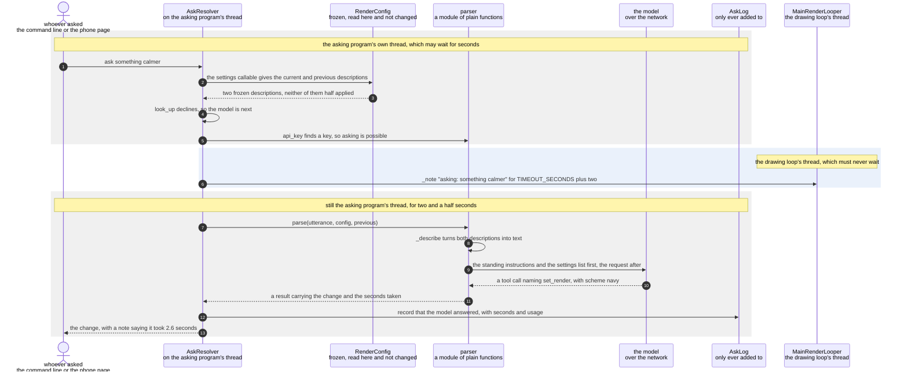

# A spoken phrase is turned into a config delta by the language model

**Priority: `LOW`** — switched off entirely without a key[^apikey] and a working network, and it is the one path in the program that costs both seconds and money. [What the priorities mean](../how-to-write-scenario-docs.md).

Somebody types `ask something calmer`[^ask].

No table of known phrases can answer that. There is no list anybody could write
on which the word "calmer" corresponds to a particular colour scheme[^scheme].
So the request goes over the network to a language model. It takes about two and
a half seconds, uses roughly four hundred units of text[^tokens], and comes back
as the single setting change `{"scheme": "navy"}`.

The value is that a request nobody anticipated still arrives as an ordinary
change of settings. By the time the drawing loop sees it, it is a plain list of
settings and values, indistinguishable from a line somebody typed by hand, and
it is judged by the same checking code in the same words.

This path is taken **only** when
[`look_up`](../../src/language/shortcuts.py#L246) has already declined to
answer. That ordering is deliberate. The table is exact and the model is
flexible, so the table is asked first, and it is asked **before the key is even
looked for**. What reaches the model is only what a table could not answer
without guessing.

A table that guessed would be competing with the model at the very thing the
model is for, and it would lose quietly. A near miss becomes a wrong setting,
with no network request anywhere to blame it on. So the phrase `something
calmer` is deliberately absent from the 137 phrasings the table holds, and
arrives here instead.

Two things are spent on this path that a table hit costs nothing for, and both
are visible in the diagram below.

The first is **time**. Two and a half seconds of silence on a small
panel[^panel] with nothing moving on it is indistinguishable from a camera that
ignored you entirely. So this is the one path in the program that announces
itself before doing its work, and consequently the only one whose diagram
crosses from one thread to another.

The second is **evidence**. [`AskLog`](../../src/language/asklog.py#L75) records
that the answer came from the model, along with how long it took and how much
text was used. That is what makes the entry a fact about the instructions given
to the model. A table hit tells you nothing about those instructions, because
the model was never asked.

| Class | What it represents, and its part in this scenario |
|---|---|
| [`AskResolver`](../../src/language/resolver.py#L33) | The whole of the path for requests phrased in words, and the one part of the program permitted to be slow. In this scenario it is the **escort**. [`resolve`](../../src/language/resolver.py#L98) discovers that the table has declined, confirms a key exists, says so on every screen this run possesses, and hands the words to the translator. It never touches a setting itself |
| [`parser`](../../src/language/parser.py) | A module of plain functions rather than a class. In this scenario it is the **translator**. [`parse`](../../src/language/parser.py#L401) builds the request, whose description of the available settings[^toolschema] is generated from the same twelve records the rest of the program uses, sends it, and turns whatever comes back into a result. It is the only code in the entire program that knows a language model exists |
| [`Parsed`](../../src/language/parser.py#L274) | What one request came back as. In this scenario it is the **answer**, and a deliberately narrow one. Exactly one of "here is a change" and "I decline" is filled in, so nothing further along has a third possibility to handle. A note about something it could not do rides alongside a change and is not a refusal |
| [`RenderConfig`](../../src/control/render_config.py#L118) | The complete, current description of how the picture is drawn, frozen so that it is replaced rather than altered. In this scenario it is the **briefing**. [`_describe`](../../src/language/parser.py#L396) turns it into the text the model is shown, which is the only reason words like "calmer" and "undo that" can mean anything at all. It is read on this path and never written |
| [`MainRenderLooper`](../../ascii_camera.py#L99) | The single object the whole running program hangs from, and the only thread on which a setting may change. In this scenario it is the **announcer** and nothing else. [`_note`](../../ascii_camera.py#L338) is handed to the escort as a callable, so a slow request can say so on the panel and in the status line[^statusline] without the escort needing to know that either of those exists |
| [`AskLog`](../../src/language/asklog.py#L75) | A record of every request, only ever added to. In this scenario it is the **receipt**. [`record`](../../src/language/asklog.py#L90) keeps the seconds taken and the amount of text used as well as the change itself, so the cost of this path can be counted rather than estimated |

## A phrase no table could answer

```mermaid
sequenceDiagram
    autonumber
    actor Asker as whoever asked<br/>the command line or the phone page
    participant App as AskResolver<br/>on the asking program's thread
    participant Cfg as RenderConfig<br/>frozen, read here and not changed
    participant P as parser<br/>a module of plain functions
    participant M as the model<br/>over the network
    participant Log as AskLog<br/>only ever added to
    participant Looper as MainRenderLooper<br/>the drawing loop's thread

    rect rgba(128, 128, 128, 0.12)
        note over Asker, Log: the asking program's own thread, which may wait for seconds
        Asker->>App: ask something calmer
        App->>Cfg: the settings callable gives the current and previous descriptions
        Cfg-->>App: two frozen descriptions, neither of them half applied
        App->>App: look_up declines, so the model is next
        App->>P: api_key finds a key, so asking is possible
    end
    rect rgba(80, 140, 220, 0.12)
        note over Looper: the drawing loop's thread, which must never wait
        App->>Looper: _note "asking: something calmer" for TIMEOUT_SECONDS plus two
    end
    rect rgba(128, 128, 128, 0.12)
        note over Asker, Log: still the asking program's thread, for two and a half seconds
        App->>P: parse(utterance, config, previous)
        P->>P: _describe turns both descriptions into text
        P->>M: the standing instructions and the settings list first, the request after
        M-->>P: a tool call naming set_render, with scheme navy
        P-->>App: a result carrying the change and the seconds taken
        App->>Log: record that the model answered, with seconds and usage
        App-->>Asker: the change, with a note saying it took 2.6 seconds
    end
```

| Step | Message | What is going on |
|---:|---|---|
| 1 | `ask something calmer` | The word `ask` at the front is the entire syntax, and everything after it is the request. Nothing at this point distinguishes a phrase the table knows from one it does not. That is discovered further down, which is why this scenario and the table scenario share an entrance |
| 2 | the settings callable gives the current and previous descriptions | The escort is handed a callable rather than the values themselves, because a request can arrive at any moment and is about the settings as they stand at that moment, not as they stood when the program started |
| 3 | two frozen descriptions, neither of them half applied | The previous one is the description[^config] as it was before the last change, and it is what makes a request like "undo that" answerable at all. It is empty on the first change of a run, which is honest: there is genuinely nothing to undo yet |
| 4 | [`look_up`](../../src/language/shortcuts.py#L246) declines, so the model is next | An exact lookup across 137 phrasings, which either matches or does not. The phrase `something calmer` is deliberately not among them, because a table cannot decline gracefully, it can only fail to match, and those are not the same thing. **This step is the entire entry condition for this document** |
| 5 | [`api_key`](../../src/language/parser.py#L301) finds a key, so asking is possible | Checked *after* the table rather than before it, which is the whole reason a table hit still works with no network and no key at all. With no key this hands back a [reply](../../src/control/command_server.py#L74) naming the file it looked in and pointing out that every other command still works. That is an answer rather than a failure |
| 6 | [`_note`](../../ascii_camera.py#L338) "asking: something calmer" for [`TIMEOUT_SECONDS`](../../src/language/parser.py#L95) plus two | The only step that crosses between threads. Two seconds of silence on a panel with nothing moving is indistinguishable from a camera that ignored you, so the request announces itself before it is made. The extra two seconds matter: the message[^notice] must outlive the request's own time limit, which is 20 seconds, or the panel would fall silent while the request was still outstanding. A fixed four seconds was wrong for exactly that reason, because a request may legitimately run for twenty |
| 7 | [`parse`](../../src/language/parser.py#L401)`(utterance, config, previous)` | The settings are passed *in* rather than read here, so that relative requests are resolved against real values. A request that raced a key press would be resolved against settings one change out of date, which for a phrase like "something calmer" is not worth locking anything for |
| 8 | [`_describe`](../../src/language/parser.py#L396) turns both descriptions into text | These become "now" and, when there is a previous one, "before". This is the only reason the model can answer a comparison at all. The word "calmer" is meaningless without knowing what it is being compared with |
| 9 | the standing instructions and the settings list first, the request after | The ordering is deliberate rather than a matter of style. The standing instructions[^systemprompt] and the list of available settings are identical on every single call, so they are placed first and are the part the provider can charge less for repeating[^promptcache]. Measured on this program: 2,103 units of text are the repeated part against roughly 420 that vary. Putting the current settings into the standing instructions would change that repeated part on every request and save nothing at all |
| 10 | a tool call naming set_render, with scheme navy | The list of settings offered to the model is generated from the same twelve records the checking code uses, so a colour scheme added in one file becomes speakable without anybody editing a description. The model is required to answer by calling one of two named things[^tooluse] and never by writing a sentence, because a translator that can reply with a paragraph has a third kind of output that nothing further along knows how to handle. The descriptions are deliberately **not** made strict, because the checking code is already the judge, and a test that could never see a malformed answer could not measure how often one is produced |
| 11 | a result carrying the change and the seconds taken | Exactly one of "here is a change" and "I decline" is filled in. There is a third field, and it is *not* a refusal: asked for the smallest characters possible, the model really did return a font size of 4 for the panel alongside a note that the character size on a monitor is not this device's to change. The change still applies; the note explains what could not be covered |
| 12 | record that the model answered, with seconds and usage | Written on this thread as well, and quietly skipped when there is no log file. The field naming the model as the source is the load-bearing one, because filtering on it is what separates a fact about the instructions from a fact about the table. The usage figures are why the cost of this path can be counted rather than guessed |
| 13 | the change, with a note saying it took 2.6 seconds | This is the same shape a table hit produces, so from this point on nothing can tell which route answered. The note is the difference a person actually notices: the elapsed seconds, where a table hit simply says it was instant. The change itself is still unjudged at this stage. The checking code has not run yet, and it will refuse this in exactly the same words it refuses a typed line |

Unlike the table scenario, this diagram is banded, because this one genuinely
does cross between threads. The crossing is a single step and it is deliberately
one-way. The announcing call replaces one small piece of state that the drawing
loop reads on its next pass, and hands the same text to the panel's thread,
which takes a lock and writes it down rather than drawing anything. Nothing is
drawn from this thread and nothing waits on the drawing loop, so the picture
keeps its normal rate throughout the whole two and a half seconds.

The one outcome drawn here is the one that succeeds. A request that fails, and a
request the model declines, are different outcomes with the same cast, and they
get documents of their own rather than a branch in this one.

## Related scenarios

- [A spoken phrase is answered from the shortcut table, with no model call](a-spoken-phrase-is-answered-from-the-shortcut-table-with-no-model-call.md)
  — the route taken instead when the table knows the phrase exactly: no key, no
  network, no seconds, and the reason this document begins where it does.
- [A typed command updates the render configuration](a-typed-command-updates-the-render-configuration.md)
  — where the change produced here goes next. It joins the same queue a typed
  line does, and by then there is nothing left to wait for.
- [A render configuration change is refused](a-render-configuration-change-is-refused.md)
  — what judges the change this produces. The model's answer earns no special
  treatment, which is precisely the point of letting it through unchecked here.
- [A model parse fails and the panel says which kind of failure it was](a-model-parse-fails-and-the-panel-says-which-kind-of-failure-it-was.md)
  — the outcome where the request fails outright, and how a long explanation is
  shortened to something that fits across 320 dots.
- [The language model declines a request it cannot satisfy](the-language-model-declines-a-request-it-cannot-satisfy.md)
  — the outcome where the model answers but says no, which is an answer rather
  than a failure and still has to reach the panel.

### Footnotes

[^apikey]: An **API key** is a secret string that identifies and authorises a
    program making requests to an online service. This one authorises calls to
    the language model, and it is read from a file named by
    [`KEY_FILE`](../../src/language/parser.py#L101) by
    [`api_key`](../../src/language/parser.py#L301). When no key is present the
    entire language-model path is switched off rather than being allowed to fail
    at the moment of the call. That is why every path needing it is rated of low
    importance: the sealed box runs perfectly well without one.

[^ask]: An **ask** is a request phrased in ordinary words, such as "make it
    warmer", rather than one that already names a setting and a value. It
    arrives as an [`Ask`](../../src/control/command_server.py#L55), and
    [`AskResolver`](../../src/language/resolver.py#L33) decides whether a table
    of known phrases can answer it or whether a language model has to be asked.

[^scheme]: A **colour scheme** is one of the nine named looks listed in
    [`SCHEMES`](../../src/art/palettes.py#L79). Which one is currently in use is
    part of the program's render configuration, and the knob, a key press or a
    typed command can all change it. The scheme called `grey` is the one the
    program starts with, and it is what the phrase "greyscale mode" refers to:
    characters only, worked out from the brightness part of the picture and
    nothing else. Only the scheme called `live` reads the colour parts, through
    [`colour_grid`](../../src/capture/image_processor.py#L187). The remaining
    seven are tints, such as green phosphor, amber CRT and e-ink on paper. A
    tint recolours the same greyscale picture using two fixed colours, so it
    never looks at the colour parts either.

[^tokens]: A **token** is the unit of text a language model reads and writes,
    and the unit it is charged by. One is roughly a short word or a piece of a
    longer one. Tokens are why the cost of a request can be stated as a fraction
    of a penny rather than guessed at:
    [`record`](../../src/language/asklog.py#L90) keeps the count the model
    itself reports having used.

[^panel]: The **SPI panel** is a small screen measuring 2.4 inches across the
    diagonal, 240 dots by 320, using a controller chip called the ILI9341. It is
    connected to the computer by a simple four-wire arrangement called SPI, which
    is a common way of attaching small devices. It is driven entirely by the
    program itself, through [`ILI9341`](../../src/lcd/lcd.py#L47), with no
    separate system driver involved. In the sealed box this program is built
    for, this panel is the only screen there is. One complete picture for it is
    153,600 bytes, which has to be sent in pieces of 4 kilobytes each — see
    [`SPI_CHUNK`](../../src/lcd/lcd.py#L44) — because that is as much as the
    connection will accept at a time.

[^toolschema]: A **tool schema** is a description, written so that a computer
    can read it, of what a language model is permitted to hand back. It lists
    the setting names, the sort of value each one takes, and which values are
    allowed. [`tools`](../../src/language/parser.py#L204) builds that
    description from the same twelve records the rest of the program uses. So a
    setting cannot exist in the program and be invisible to the model, and it
    cannot be offered to the model in a form the checking code would refuse.

[^statusline]: The **status line** is the single line of readings underneath the
    picture, showing the colour scheme, the ramp, how many pictures a second are
    being drawn, and the size of the grid. It is built by
    [`status_line`](../../src/hdmi/status_line.py#L76). It is also where a
    refusal or a short message appears when the program is running on an
    ordinary monitor, because there is nowhere else on a monitor to put one.

[^config]: The **render configuration** is the complete, current description of
    how the picture should be drawn: which colour scheme, which ramp, how much
    contrast, which way up, and so on. It is frozen, meaning no part of the
    program ever alters one. Instead, every change produces an entirely new
    [`RenderConfig`](../../src/control/render_config.py#L118) by way of
    [`with_changes`](../../src/control/render_config.py#L141), which is also the
    only code anywhere that decides whether a proposed value is allowed. The
    list of settings, and what each one will accept, is
    [`SPECS`](../../src/control/render_config.py#L74). That single table is what
    the checking code, the `help` text, the command-line options and the
    description given to the language model are all built from.

[^notice]: A **notice** is a short message painted over the bottom of whatever
    picture is currently on the small panel. It is two lines in a fixed colour,
    laid over the top of the existing picture, and its height is set by
    [`NOTICE_LINES`](../../src/lcd/lcd_display.py#L37). It is how a box with no
    keyboard and no monitor tells somebody that something has gone wrong. It
    covers 36 of the panel's 240 rows of dots.

[^systemprompt]: The **standing instructions** are the fixed text sent ahead of
    every request to the language model, held in
    [`SYSTEM_PROMPT`](../../src/language/parser.py#L127). They tell the model
    what this device is and what it is permitted to change. Because the text
    never varies, it can be the repeated part of the request that the provider
    charges less for.

[^promptcache]: The company providing the model charges a lower rate for a
    repeated **opening section** of a request, provided it is identical to the
    one before. The standing instructions and the list of settings never vary,
    so they are placed first and qualify. Measured on this program, that
    repeated section is 2,103 units of text against roughly 420 that change from
    request to request. Putting the current settings into the instructions
    instead would alter the opening section every time and save nothing.

[^tooluse]: Instead of replying in ordinary prose, the model is required to
    answer by **calling a tool**: naming one of the descriptions it was given
    and filling in its values. The setting that governs this is arranged so that
    it must call one and may never write a sentence. That is what keeps the
    answer in a shape this program can act on directly, rather than one it would
    have to interpret.
