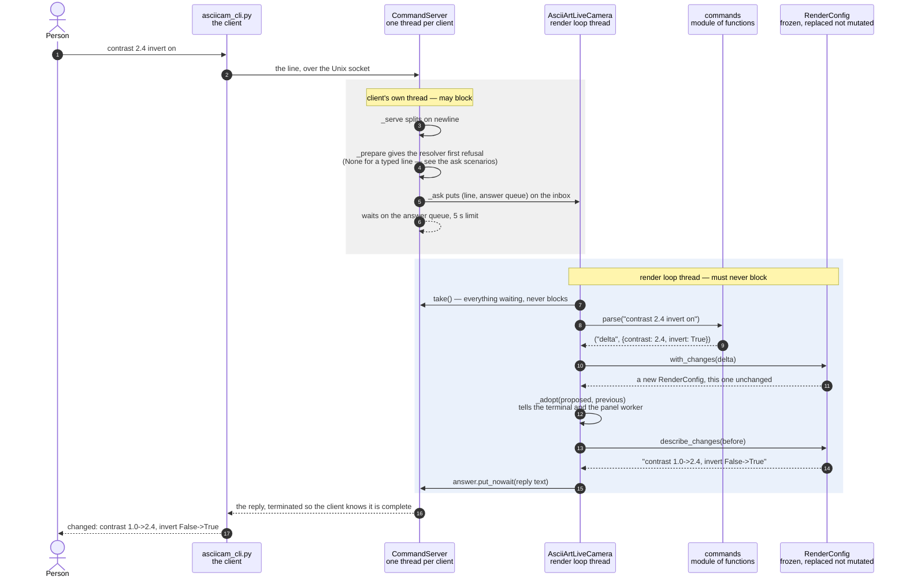

# A typed command updates the render configuration

Somebody types `contrast 2.4 invert on` at a shell and the picture changes on
both displays. The value is that this works against a process with no terminal
of its own — the boot service, in the enclosure — where no key can be pressed;
and that it gets there without the render loop ever waiting on whoever typed it.

The collaboration turns on one division. `CommandServer` runs on its own thread
and owns the socket, but it does not understand a single setting: it splits
lines, hands each to the render loop, and blocks its own client for the answer.
`AsciiArtLiveCamera` understands the line but never touches the socket. Between
them is a queue, drained once per frame in the same place keys and the knob are
read — so a typed setting lands exactly where a keypress would, and cannot
arrive halfway through a frame.

The other division is that `commands.parse` turns text into typed values and
stops. It is deliberately forgiving about syntax — `scheme=green` and
`scheme green` both work — and not forgiving at all about names and values,
because deciding what is *allowed* belongs to `RenderConfig` one layer down.
That is why `rotation 45` parses cleanly and is then refused, in the same words
a keypress would have earned. A front end that could accept more than the
validated path would let a phrase work by hand and fail through the parser.

| Class | What it represents, and its part in this scenario |
|---|---|
| [`CommandServer`](../../src/control/command_server.py#L80) | A `threading.Thread` owning the Unix socket, with a thread per connected client. Here it is the **courier**: it splits lines, offers each to the resolver, puts it on the inbox and blocks its own client for the answer. It understands not one setting, which is exactly what keeps the socket's concerns out of the render loop |
| [`commands`](../../src/control/commands.py) | A module of functions rather than a class — its only class is [`CommandError`](../../src/control/commands.py#L49), the exception. Here it is the **translator and the dispatcher**: [`parse`](../../src/control/commands.py#L53) turns a line into typed values and stops, holding no opinion about what is allowed so that exactly one place does, while [`run_command`](../../src/control/commands.py#L352) decides what each kind of line means and words every answer |
| [`AsciiArtLiveCamera`](../../ascii_camera.py#L98) | The render loop, and the one object the whole process is hung off. Here it is the **applier**: it [drains the inbox once per frame](../../ascii_camera.py#L455), binds this run's own state to the dispatcher, and is the only thing that pushes an adopted config out to the terminal and the panel worker |
| [`RenderConfig`](../../src/control/render_config.py#L118) | The complete live render state, frozen so that it is replaced rather than mutated. Here it is both **validator and diff**: [`with_changes`](../../src/control/render_config.py#L141) returns the new config, and [`describe_changes`](../../src/control/render_config.py#L191) produces the text the person gets back |

## From the command socket to the render loop

| Step | Message | What is going on |
|---:|---|---|
| 1 | `contrast 2.4 invert on` | Two settings in one line. Syntax is forgiving — `contrast=2.4` works too — and names and values are not, which is the distinction that stops this front end accepting anything the validated path would refuse |
| 2 | the line, over the Unix socket | The socket is created mode 0600, so it is unreachable from the network and only the user running the app can connect. `--no-commands` switches it off entirely |
| 3 | [`_serve`](../../src/control/command_server.py#L189) splits on newline | Reads from one client until it goes away. Anything past [4 KB](../../src/control/command_server.py#L47) is refused rather than buffered: nothing legitimate comes close, and it stops a stuck client growing memory without limit |
| 4 | [`_prepare`](../../src/control/command_server.py#L214) gives the resolver first refusal (None for a typed line — see the ask scenarios) | The hook where anything slow belongs. A typed line comes back `None` and passes straight through. The natural-language path instead returns an [`Ask`](../../src/control/command_server.py#L55) here — a delta already worked out, on this thread — which is why a four-second model call never reaches the render loop as a wait. A resolver that raises is contained here: the client is told, the loop never hears about it, and the connection stays up |
| 5 | [`_ask`](../../src/control/command_server.py#L236) puts (line, answer queue) on the inbox | The handover. Each request carries its own single-slot answer queue, so replies cannot be crossed between clients |
| 6 | waits on the answer queue, 5 s limit | The loop [drains the inbox once per frame](../../ascii_camera.py#L455), so [five seconds](../../src/control/command_server.py#L43) is generous by two orders of magnitude. It exists to stop a client hanging for ever against an app that has wedged — on a timeout the client is told the app did not answer, which on this hardware is a real possibility worth being able to see |
| 7 | [`take`](../../src/control/command_server.py#L258)`()` — everything waiting, never blocks | Drained on this thread rather than the socket's, because applying a setting repaints the window, rebuilds the ASCII generator and talks to the panel worker, none of which is safe elsewhere. Called in the same place [keys](../../ascii_camera.py#L608) and [the knob](../../src/control/scheme_cycle.py#L86) are read, so a typed setting lands exactly where a keypress would and cannot arrive halfway through a frame |
| 8 | [`parse`](../../src/control/commands.py#L53)`("contrast 2.4 invert on")` | Text in, typed values out, and nothing more. Returns `(kind, payload)` — `"delta"` here, or `"help"`, `"show"`, `"reset"`, `"none"`. Raises [`CommandError`](../../src/control/commands.py#L49) with a message written to be read by whoever typed it |
| 9 | `("delta", {contrast: 2.4, invert: True})` | Only the **type** has been settled. A value of the right type and the wrong magnitude — [`rotation 45`](a-render-configuration-change-is-refused.md) — is handed on untouched, because deciding what is allowed belongs one layer down |
| 10 | [`with_changes`](../../src/control/render_config.py#L141)`(delta)` | Reached through [`apply`](../../ascii_camera.py#L235), the single way settings ever change and the same call a keypress and the knob make |
| 11 | a new [`RenderConfig`](../../src/control/render_config.py#L118), this one unchanged | Frozen, so it is replaced rather than mutated. A setting that can be assigned in place is one that can change without anyone being told, which is how the panel's copy came to be maintained by hand |
| 12 | [`_adopt`](../../ascii_camera.py#L282)`(proposed, previous)` tells the terminal and the panel worker | The one place that knows what each setting costs to change. Before it existed, "invert also has to rebuild the ASCII generator" and "fill also has to invalidate the grid" were spread across [the key handler](../../ascii_camera.py#L608), and every new setting had to remember them all |
| 13 | [`describe_changes`](../../src/control/render_config.py#L191)`(before)` | Diffs the adopted config against the one it replaced, in [`SPECS`](../../src/control/render_config.py#L74) order |
| 14 | `"contrast 1.0->2.4, invert False->True"` | Empty when nothing changed, so a caller can use it as the test for whether the change was real rather than tracking that itself |
| 15 | `answer.put_nowait(reply text)` | [Every line is answered](../../ascii_camera.py#L455), including the ones that changed nothing, so no client is ever left waiting on a reply that is not coming |
| 16 | the reply, terminated so the client knows it is complete | A reply may run to several lines — what [`help_text`](../../src/control/commands.py#L176) returns does — and the client has no other way to know it has all of them |
| 17 | `changed: contrast 1.0->2.4, invert False->True` | What the person sees. The outcome word comes from [`_report`](../../src/control/commands.py#L307): at a prompt a request and a report of what became of it look alike, and only the camera can say which of *changed*, *unchanged* or *refused* it was. The change itself is worded exactly as a keypress would have put it in the [status line](../../ascii_camera.py#L570) |

`_ask` putting the request on the inbox and `take()` draining it are the same
queue seen from its two ends, and that handover is the boundary the two bands
mark: everything above it may take as long as it likes, and nothing below it
may.

This is the accepted path only. When `with_changes` refuses instead of
returning, the collaboration is a different shape and has its own scenario —
see below.

## Related scenarios

- **A spoken phrase is turned into a config delta by the language model** — the same diagram with
  `_prepare`'s resolver returning an `Ask` instead of `None`, so the delta is
  worked out on the client's thread and the render loop still only ever applies
  a dict.
- **A keypress updates the render configuration** — joins this one at `apply()`, which is
  the point of routing both through it.
- **One configuration change is pushed to both displays** — takes over at `_adopt`, where this
  scenario stops.
- [A render configuration change is refused](a-render-configuration-change-is-refused.md)
  — what happens in place of the `_adopt` and `describe_changes` exchange when a
  name or value is rejected. Same cast, same reply channel, different outcome,
  which is why it is drawn separately rather than as a branch here.

*(The unlinked entries above are documents not written yet.)*
