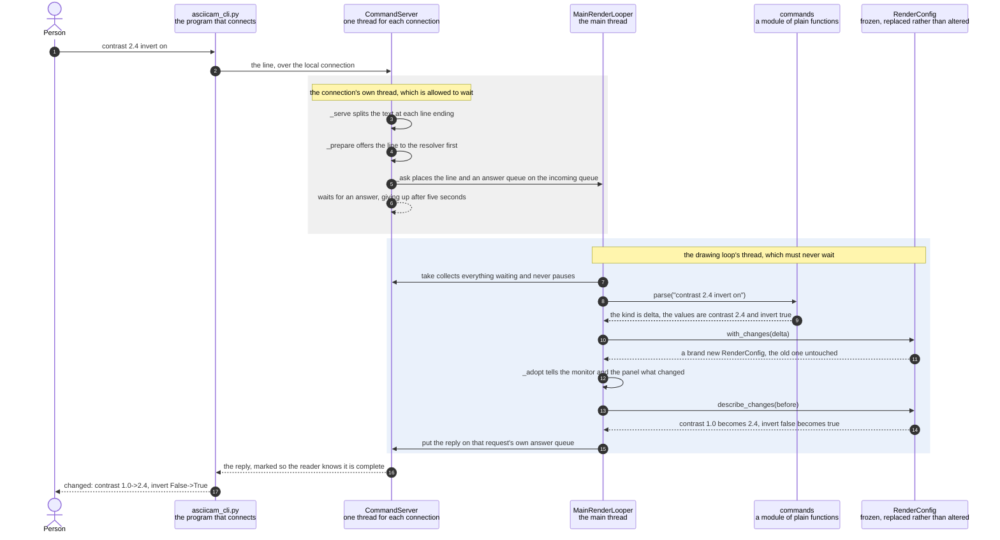

# A typed command updates the render configuration

**Priority: `HIGH`** — every way of changing a setting arrives here in the end, so this runs on every change the program ever makes. [What the priorities mean](../how-to-write-scenario-docs.md).

Somebody types `contrast 2.4 invert on`[^invert] into a shell on the computer,
and the picture changes on both screens.

Two things make that worth a document. The first is that it works even when the
program has no terminal of its own. Inside the sealed box the program is started
automatically by the system's service manager[^systemd], with no keyboard and no
monitor attached, so there is no key anybody could press. A typed line is the
only way in. The second is that it gets there without the drawing loop ever
having to stop and wait for whoever typed it.

The arrangement turns on one clear division of responsibility.
[`CommandServer`](../../src/control/command_server.py#L80) runs on its own
thread and owns the connection[^socket] that carries the typed line. It does not
understand a single setting. It splits the incoming text into lines, hands each
line to the drawing loop, and then waits on behalf of whoever typed it.
[`MainRenderLooper`](../../ascii_camera.py#L99) is the opposite: it understands
the line completely and never touches the connection. Between the two sits a
queue, emptied once for every picture drawn, in exactly the same place that key
presses and the knob[^detent] are read. That is what makes a typed setting land
in the same place a key press would, and what stops it arriving halfway through
a picture being drawn.

There is a second division, and it is just as deliberate. The code in
[`parse`](../../src/control/commands.py#L53) turns text into properly typed
values and then stops. It is intentionally relaxed about the shape of what was
typed, so `scheme=green`[^scheme] and `scheme green` both work. It is not
relaxed at all about names and values, because deciding what is *allowed* is the
job of the configuration[^config] one layer further down.

That division is the reason `rotation 45` gets through the parsing stage without
complaint and is then refused, using precisely the same words a key press would
have earned. If the typed route could accept anything the checked route would
not, then a phrase could work when typed by hand and fail when it came through
the parser, and the two would slowly drift apart.

| Class | What it represents, and its part in this scenario |
|---|---|
| [`CommandServer`](../../src/control/command_server.py#L80) | A thread that owns the connection, with a further thread for each program currently connected to it. In this scenario it is the **courier**. It splits the text into lines, offers each line to the resolver, places it on the drawing loop's incoming queue, and then waits for the answer on behalf of its own caller. It understands not one single setting, and that ignorance is exactly what keeps the connection's concerns out of the drawing loop |
| [`commands`](../../src/control/commands.py) | A module of plain functions rather than a class. The only class it contains is [`CommandError`](../../src/control/commands.py#L49), which is how it reports a problem. In this scenario it is the **translator and the dispatcher**. [`parse`](../../src/control/commands.py#L53) turns a line of text into typed values and stops there, holding no opinion at all about what is permitted so that exactly one place does. [`run_command`](../../src/control/commands.py#L352) then decides what each kind of line means and chooses the words of every reply |
| [`MainRenderLooper`](../../ascii_camera.py#L99) | The single object the whole running program hangs from, and the only thread on which a setting is ever allowed to change. In this scenario it is the **applier**. It [empties the incoming queue once per picture](../../ascii_camera.py#L456), attaches this particular run's own state to the dispatcher, and is the only thing that pushes an accepted configuration out to the monitor and to the panel[^panel] |
| [`RenderConfig`](../../src/control/render_config.py#L118) | The complete, current description of how the picture should be drawn, frozen so that it is replaced rather than altered. In this scenario it is both **the checker and the comparer**. [`with_changes`](../../src/control/render_config.py#L141) produces the new description, and [`describe_changes`](../../src/control/render_config.py#L191) produces the sentence that goes back to the person who typed |

## From the command connection to the drawing loop

```mermaid
sequenceDiagram
    autonumber
    actor Person
    participant CLI as asciicam_cli.py<br/>the program that connects
    participant CS as CommandServer<br/>one thread for each connection
    participant App as MainRenderLooper<br/>the main thread
    participant Cmds as commands<br/>a module of plain functions
    participant Cfg as RenderConfig<br/>frozen, replaced rather than altered

    Person->>CLI: contrast 2.4 invert on
    CLI->>CS: the line, over the local connection

    rect rgba(128, 128, 128, 0.12)
        note over CS: the connection's own thread, which is allowed to wait
        CS->>CS: _serve splits the text at each line ending
        CS->>CS: _prepare offers the line to the resolver first
        CS->>App: _ask places the line and an answer queue on the incoming queue
        CS-->>CS: waits for an answer, giving up after five seconds
    end

    rect rgba(80, 140, 220, 0.12)
        note over App, Cfg: the drawing loop's thread, which must never wait
        App->>CS: take collects everything waiting and never pauses
        App->>Cmds: parse("contrast 2.4 invert on")
        Cmds-->>App: the kind is delta, the values are contrast 2.4 and invert true
        App->>Cfg: with_changes(delta)

        Cfg-->>App: a brand new RenderConfig, the old one untouched
        App->>App: _adopt tells the monitor and the panel what changed
        App->>Cfg: describe_changes(before)
        Cfg-->>App: contrast 1.0 becomes 2.4, invert false becomes true

        App->>CS: put the reply on that request's own answer queue
    end

    CS-->>CLI: the reply, marked so the reader knows it is complete
    CLI-->>Person: changed: contrast 1.0->2.4, invert False->True
```

| Step | Message | What is going on |
|---:|---|---|
| 1 | `contrast 2.4 invert on` | Two settings in a single line. The shape of what is typed is treated generously, so `contrast=2.4` works just as well, while the names and the values are not treated generously at all. That distinction is what stops this way in accepting something the checked path would refuse |
| 2 | the line, over the local connection | The connection is created with permissions of `0600`, which in the usual way of writing file permissions means readable and writable by its owner and by nobody else at all. It is therefore unreachable across a network, and only the user account running the program can connect to it. Starting the program with `--no-commands` removes it altogether |
| 3 | [`_serve`](../../src/control/command_server.py#L189) splits the text at each line ending | Reads from one connected program until it disconnects. Anything longer than [`MAX_LINE`](../../src/control/command_server.py#L47), which is 4,096 characters, is refused rather than stored up. That figure is chosen to be far beyond anything genuine: the longest sensible command is a few dozen characters, so 4,096 leaves an enormous margin while still preventing a faulty program from growing the memory in use without any limit at all |
| 4 | [`_prepare`](../../src/control/command_server.py#L214) offers the line to the resolver first | This is the place where anything slow belongs. For an ordinary typed line the resolver hands back nothing and the line passes straight through. The natural-language route instead hands back an [`Ask`](../../src/control/command_server.py#L55) at this point, carrying a change[^delta] that has already been worked out on this thread. That is why a request to a language model, which can easily take four seconds, never reaches the drawing loop as a wait. A resolver that fails is contained here too: the connected program is told, the drawing loop never hears about it, and the connection stays open |
| 5 | [`_ask`](../../src/control/command_server.py#L236) places the line and an answer queue on the incoming queue | This is the handover from one thread to the other. Each request carries an answer queue of its very own, with room for one answer, so that replies can never be delivered to the wrong connected program |
| 6 | waits for an answer, giving up after five seconds | Five seconds comes from [`REPLY_TIMEOUT`](../../src/control/command_server.py#L43). It is deliberately far longer than the job should ever take: the drawing loop empties the incoming queue once per picture, and at fifteen pictures a second that is roughly every 67 milliseconds, so five seconds is about seventy times longer than one full turn of the loop. The limit does not exist to catch slowness. It exists so that a connected program is not left hanging for ever against a program that has stopped responding altogether, which on hardware this small is a real possibility worth being able to see |
| 7 | [`take`](../../src/control/command_server.py#L258) collects everything waiting and never pauses | The queue is emptied on this thread rather than the connection's, because applying a setting repaints the window, rebuilds the character table and speaks to the panel, none of which is safe to do from anywhere else. It happens in the same place that [key presses](../../ascii_camera.py#L609) and [the knob](../../src/control/scheme_cycle.py#L86) are read, so a typed setting lands exactly where a key press would and cannot arrive part way through a picture |
| 8 | [`parse`](../../src/control/commands.py#L53)`("contrast 2.4 invert on")` | Text goes in, properly typed values come out, and nothing else happens. It returns a kind together with a payload. The kind here is `"delta"`, and the other possibilities are `"help"`, `"show"`, `"reset"` and `"none"`. When it cannot make sense of the line it reports a [`CommandError`](../../src/control/commands.py#L49) whose message is written to be read by the person who typed |
| 9 | the kind is delta, the values are contrast 2.4 and invert true | Only the *type* of each value has been settled at this point. A value of the correct type but an unacceptable magnitude, such as [`rotation 45`](a-render-configuration-change-is-refused.md), is passed along untouched, because deciding what is allowed belongs one layer further down |
| 10 | [`with_changes`](../../src/control/render_config.py#L141)`(delta)` | Reached by way of [`apply`](../../ascii_camera.py#L236), which is the single route by which settings ever change, and the very same call that a key press and the knob both make |
| 11 | a brand new [`RenderConfig`](../../src/control/render_config.py#L118), the old one untouched | The description is frozen, so it is replaced rather than altered in place. A setting that can be changed in place is a setting that can change without anything being told about it, and that is precisely how the panel's own copy of the settings once came to be maintained by hand |
| 12 | [`_adopt`](../../ascii_camera.py#L283) tells the monitor and the panel what changed | This is the one place that knows what each setting costs to change. Before it existed, facts such as "inverting also means rebuilding the character table" and "filling also means discarding the cached grid size" were scattered through [the key handler](../../ascii_camera.py#L609), and every newly added setting had to remember all of them |
| 13 | [`describe_changes`](../../src/control/render_config.py#L191)`(before)` | Compares the accepted description against the one it replaced, and lists the differences in the order they appear in [`SPECS`](../../src/control/render_config.py#L74) |
| 14 | contrast 1.0 becomes 2.4, invert false becomes true | The starting contrast is 1.0, meaning the picture is left exactly as the camera delivered it, so this line is reporting a change from no adjustment to a moderate one. The sentence is empty when nothing actually changed, which lets a caller use its emptiness as the test of whether anything happened rather than having to keep track separately |
| 15 | put the reply on that request's own answer queue | [Every line receives an answer](../../ascii_camera.py#L456), including lines that changed nothing at all, so no connected program is ever left waiting for a reply that is never going to arrive |
| 16 | the reply, marked so the reader knows it is complete | A reply may run to several lines. What [`help_text`](../../src/control/commands.py#L176) returns does exactly that. The connected program has no other way of telling whether it has received all of the reply or only part of it |
| 17 | `changed: contrast 1.0->2.4, invert False->True` | This is what the person actually sees. The opening word comes from [`_report`](../../src/control/commands.py#L307). At a prompt, a request and a report of what became of that request look very much alike, and only the program itself can say which of *changed*, *unchanged* or *refused* applies. The description of the change is worded exactly as a key press would have put it in the [status line](../../ascii_camera.py#L571) |

The placing of the request on the queue and the collecting of it are the same
queue seen from its two ends. That handover is the boundary the two coloured
bands mark. Everything above the boundary may take as long as it likes.
Nothing below it may take any time at all.

This document describes the accepted path only. When the configuration refuses
a change instead of producing a new one, the arrangement is a different shape
and has a scenario of its own, listed below.

## Related scenarios

- [A spoken phrase is turned into a config delta by the language model](a-spoken-phrase-is-turned-into-a-config-delta-by-the-language-model.md)
  — the same diagram, but with the resolver handing back a worked-out change
  instead of nothing, so the change is decided on the connection's thread and
  the drawing loop still only ever applies a plain set of values.
- [A keypress updates the render configuration](a-keypress-updates-the-render-configuration.md)
  — joins this scenario at the moment of applying, which is the entire point of
  routing both through the same place.
- [One configuration change is pushed to both displays](one-configuration-change-is-pushed-to-both-displays.md)
  — takes over at the moment of adopting, where this scenario stops.
- [A render configuration change is refused](a-render-configuration-change-is-refused.md)
  — what happens instead of the adopting and describing exchange when a name or
  a value is rejected. The same cast, the same reply channel, a different
  outcome, which is why it is drawn separately rather than as a branch here.

### Footnotes

[^invert]: The **invert** setting reverses the ramp, so that bright parts of the
    scene are drawn with the dark end of the character sequence instead. In
    effect it turns a light-on-dark picture into a dark-on-light one. It
    reverses the characters and deliberately leaves the list of positions
    untouched, which is how both screens stay in agreement about which
    character a given brightness deserves.

[^systemd]: **systemd** is the part of Linux that starts and supervises
    long-running programs. It is what launches this program when the computer
    boots, using the options `--lcd --encoder --no-terminal`, and it is what
    starts the program again if it stops unexpectedly. That automatic restart is
    the reason an untidy exit matters here: the next start is only seconds away
    and nobody has to ask for it.

[^socket]: A **Unix domain socket** is a connection between two programs on the
    same computer, which appears in the file system as though it were a file. It
    behaves like a network connection, with one program writing and another
    reading, except that no network is involved at any point.
    [`CommandServer`](../../src/control/command_server.py#L80) listens on one of
    these, which is how a shell, a phone or another program can reach a running
    camera without the program ever opening a network port.

[^detent]: A **detent** is one click of the knob, meaning the position the knob
    settles into and which can be felt as a notch under the fingers.
    Electrically, one click is one complete cycle of the two switches inside the
    knob, and counting those cycles is the job of
    [`QuadratureDecoder`](../../src/control/encoder.py#L88). **Quadrature** is
    the name for the arrangement of those two switches. They are positioned a
    quarter of a cycle apart, so whichever of them changes first reveals which
    way the knob was turned. A switch bouncing without completing a full cycle
    produces nothing at all, which is exactly what is wanted.

[^scheme]: A **colour scheme** is one of the nine named looks listed in
    [`SCHEMES`](../../src/art/palettes.py#L79). Which one is currently in use is
    part of the program's render configuration, and the knob, a key press or a
    typed command can all change it. The scheme called `grey` is the one the
    program starts with, and it is what the phrase "greyscale mode" refers to:
    characters only, worked out from the brightness part of the picture and
    nothing else. Only the scheme called `live` reads the colour parts, through
    [`colour_grid`](../../src/capture/image_processor.py#L187). The remaining
    seven are tints, such as green phosphor, amber CRT and e-ink on paper. A
    tint recolours the same greyscale picture using two fixed colours, so it
    never looks at the colour parts either.

[^config]: The **render configuration** is the complete, current description of
    how the picture should be drawn: which colour scheme, which ramp, how much
    contrast, which way up, and so on. It is frozen, meaning no part of the
    program ever alters one. Instead, every change produces an entirely new
    [`RenderConfig`](../../src/control/render_config.py#L118) by way of
    [`with_changes`](../../src/control/render_config.py#L141), which is also the
    only code anywhere that decides whether a proposed value is allowed. The
    list of settings, and what each one will accept, is
    [`SPECS`](../../src/control/render_config.py#L74). That single table is what
    the checking code, the `help` text, the command-line options and the
    description given to the language model are all built from.

[^panel]: The **SPI panel** is a small screen measuring 2.4 inches across the
    diagonal, 240 dots by 320, using a controller chip called the ILI9341. It is
    connected to the computer by a simple four-wire arrangement called SPI, which
    is a common way of attaching small devices. It is driven entirely by the
    program itself, through [`ILI9341`](../../src/lcd/lcd.py#L47), with no
    separate system driver involved. In the sealed box this program is built
    for, this panel is the only screen there is. One complete picture for it is
    153,600 bytes, which has to be sent in pieces of 4 kilobytes each — see
    [`SPI_CHUNK`](../../src/lcd/lcd.py#L44) — because that is as much as the
    connection will accept at a time.

[^delta]: A **delta** is a plain list of the settings a change intends to alter,
    paired with their new values, such as `{"scheme": "amber"}`, and nothing
    else besides. Every way of asking for a change builds one of these and hands
    it to the configuration. None of them ever sets a setting directly. That is
    what keeps the checking in a single place no matter who did the asking.
