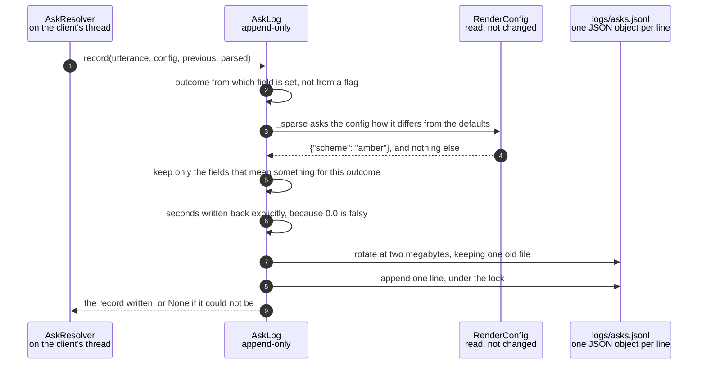

# Every ask is recorded with its source, its cost and its elapsed time

**Priority: `LOW`** — nothing depends on it and it is allowed to fail silently, which is exactly why it is the last thing anyone checks and the first thing worth getting right. [What the priorities mean](../how-to-write-scenario-docs.md).

The ask path is the one part of this app whose behaviour cannot be asserted in a
test. A model's answer to "something calmer" is not a fact about the codebase,
so the only way to know whether the prompt is any good is to keep what really
happened and look at it later.

[`AskLog`](../../src/language/asklog.py#L75) writes one JSON line per ask to
`logs/asks.jsonl`. It records what was said, what the settings were at the time,
what came back, how long it took and what it cost — and, in the field that
matters most, **who answered**.

**`source` decides what a record is evidence of.** A `table` record says nothing
whatsoever about the prompt, because the model was never asked. Anything
counting hit rate, or promoting real utterances into eval cases, has to filter
on it or it will score the model on answers it never gave. It is written even on
the default, because a record that omits it is ambiguous rather than obviously a
model answer, and this file is read months later.

**It is allowed to do nothing, and it is never allowed to raise.** The caller is
in the middle of answering somebody. A full disk or a read-only mount costs a
line in the app log and nothing else — an ask that works is worth more than a
record of it.

| Class | What it represents, and its part in this scenario |
|---|---|
| [`AskResolver`](../../src/language/resolver.py#L33) | The whole of the ask path. Here it is the **single caller**: [`record`](../../src/language/resolver.py#L216) is invoked from five places and nowhere else, so every ending — table hit, answer, decline, failure — passes through one function |
| [`AskLog`](../../src/language/asklog.py#L75) | An append-only record of every ask. Here it is the **archivist**: it decides the outcome, prunes the fields that mean nothing for it, rotates the file, and swallows everything that can go wrong doing so |

## One ask, written down



| Step | Message | What is going on |
|---:|---|---|
| 1 | [`record`](../../src/language/asklog.py#L90)`(utterance, config, previous, parsed)` | On the client's thread, alongside the parse — never the render loop. A disk write is exactly the kind of thing the picture must not wait for |
| 2 | outcome from which field is set, not from a flag | `error` beats `declined` beats everything else. Deriving it from the fields rather than passing it in means the record cannot disagree with itself |
| 3 | [`_sparse`](../../src/language/asklog.py#L67) asks the config how it differs from the defaults | Storing all twelve settings on every line would make the file unreadable by eye. Storing the difference makes each record show what was unusual about the moment |
| 4 | `{"scheme": "amber"}`, and nothing else | This is the same shape `eval_cases.json` uses for `now`, on purpose: a real ask can be lifted into a test case without reshaping it |
| 5 | keep only the fields that mean something for this outcome | A declined record has no `delta`; an error has no `usage`. The pruning is a plain [truthiness test](../../src/language/asklog.py#L90), which is why the next step exists |
| 6 | `seconds` written back explicitly, because `0.0` is falsy | A table hit takes no measurable time, and the truthiness test would drop the field precisely for the records where it is most informative. Two lines of code to keep a zero that means something |
| 7 | rotate at [two megabytes](../../src/language/asklog.py#L64), keeping one old file | About 5,000 asks at roughly 400 bytes each. Less about disk than about an append-only file nobody ever rotates eventually surprising someone on a small card |
| 8 | append one line, under the lock | The socket thread and the phone's handler can both be answering at once, and a JSONL file survives interleaving only if whole lines are written whole |
| 9 | the record written, or None if it could not be | The return value is used by tests and ignored in production. Returning `None` rather than raising is the whole contract: this is the one place in the path allowed to do nothing at all |

## What four real records look like

Produced by running the code, not by hand:

```json
{"when": "2026-08-20T06:41:28Z", "utterance": "make it amber", "outcome": "answered", "source": "model", "now": {"scheme": "amber"}, "delta": {"scheme": "amber"}, "seconds": 2.61, "usage": {"input": 1520, "output": 38, "cache_read": 1409, "cache_write": 0}}
{"when": "2026-08-20T06:41:28Z", "utterance": "green", "outcome": "answered", "source": "table", "now": {"scheme": "amber"}, "delta": {"scheme": "green"}, "seconds": 0.0}
{"when": "2026-08-20T06:41:28Z", "utterance": "point it at the door", "outcome": "declined", "source": "model", "now": {"scheme": "amber"}, "declined": "I can change how the picture looks, not where the camera points"}
{"when": "2026-08-20T06:41:28Z", "utterance": "something calmer", "outcome": "error", "source": "model", "now": {"scheme": "amber"}, "error": "Connection error."}
```

Four things are visible in those four lines. The two `answered` records differ
only in `source` and `seconds`, and treating them as equivalent is exactly the
mistake `source` exists to prevent. `cache_read` at 1,409 of 1,520 input tokens
is the [system prompt and tool schema](../../src/language/parser.py#L127) being
served from cache, which is what makes a second ask cheaper than a first.
`before` is absent throughout, because it was identical to the defaults and the
pruning dropped it. And the table hit kept its `seconds: 0.0`.

## Turning a record back into a test

[`as_case`](../../src/language/asklog.py#L182) lifts one record into a candidate
eval case — **candidate**, not case. `expect` is filled in with what the model
actually said, which is the thing under test, so a human has to look at it and
decide whether that answer was right before it is worth anything. Promoting
records automatically would build a suite that tests only that the model still
does what it already did.

## Related scenarios

- [A spoken phrase is turned into a config delta by the language model](a-spoken-phrase-is-turned-into-a-config-delta-by-the-language-model.md)
  — where `seconds` and `usage` come from, and the round trip they measure.
- [A spoken phrase is answered from the shortcut table, with no model call](a-spoken-phrase-is-answered-from-the-shortcut-table-with-no-model-call.md)
  — the records whose `source` is `table`, and why they cannot score a prompt.
- [The language model declines a request it cannot satisfy](the-language-model-declines-a-request-it-cannot-satisfy.md)
  — the outcome that is not an error, and reads as evidence the system worked.
- [A model parse fails and the panel says which kind of failure it was](a-model-parse-fails-and-the-panel-says-which-kind-of-failure-it-was.md)
  — the outcome that is, and where the unshortened text is kept.
