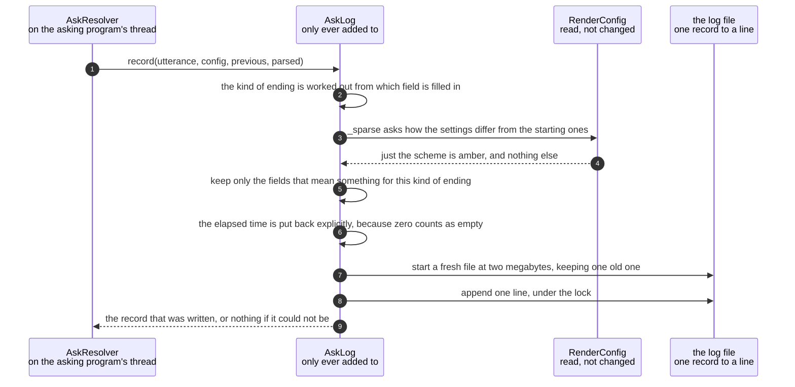

# Every ask is recorded with its source, its cost and its elapsed time

**Priority: `LOW`** — nothing at all depends on it and it is permitted to fail silently, which is precisely why it is the last thing anybody checks and the first thing worth getting right. [What the priorities mean](../how-to-write-scenario-docs.md).

The path for requests phrased in words[^ask] is the one part of this program
whose behaviour cannot be checked by a test.

The reason is worth stating plainly. A test can confirm that code does what it
was written to do. It cannot confirm that a language model gives a good answer
to "something calmer", because that answer is not a fact about this program at
all. It depends on the model and on the instructions it was given. So the only
way to find out whether those instructions are any good is to keep a record of
what really happened and look at it afterwards.

[`AskLog`](../../src/language/asklog.py#L75) writes one line of structured
text[^jsonl] for each request into a file. It records what was said, what the
settings were at that moment, what came back, how long it took and what it cost.
And, in the field that matters more than any of those, **who answered**.

**That field decides what a record is evidence of.** A record saying the table
answered tells you nothing whatever about the instructions given to the model,
because the model was never asked. Anything counting how often the table
succeeds, or promoting real requests into test cases[^eval], has to filter on
that field or it will end up scoring the model on answers it never gave.

It is written down even when it holds the ordinary value, because a record that
simply omits it is ambiguous rather than obviously meaning "the model". This
file is read months later, by somebody who will not remember.

**The recording is allowed to do nothing at all, and is never allowed to fail
loudly.** The caller is in the middle of answering a person. A full disk or a
storage device that has become read-only costs one line in the program's own log
and nothing more. A request that works is worth more than a record of it.

| Class | What it represents, and its part in this scenario |
|---|---|
| [`AskResolver`](../../src/language/resolver.py#L33) | The whole path for requests phrased in words. In this scenario it is the **only caller**. [`record`](../../src/language/resolver.py#L216) is called from five places and from nowhere else, so every possible ending — a table match, an answer, a decline, a failure — passes through one single function |
| [`AskLog`](../../src/language/asklog.py#L75) | A record of every request, only ever added to. In this scenario it is the **archivist**. It works out what kind of ending this was, removes the fields that mean nothing for that kind, starts a fresh file when the old one grows too large, and quietly absorbs anything that goes wrong while doing so |

## One request, written down


```mermaid
sequenceDiagram
    autonumber
    participant App as AskResolver<br/>on the asking program's thread
    participant Log as AskLog<br/>only ever added to
    participant Cfg as RenderConfig<br/>read, not changed
    participant Disk as the log file<br/>one record to a line

    App->>Log: record(utterance, config, previous, parsed)
    Log->>Log: the kind of ending is worked out from which field is filled in
    Log->>Cfg: _sparse asks how the settings differ from the starting ones
    Cfg-->>Log: just the scheme is amber, and nothing else
    Log->>Log: keep only the fields that mean something for this kind of ending
    Log->>Log: the elapsed time is put back explicitly, because zero counts as empty
    Log->>Disk: start a fresh file at two megabytes, keeping one old one
    Log->>Disk: append one line, under the lock
    Log-->>App: the record that was written, or nothing if it could not be
```

| Step | Message | What is going on |
|---:|---|---|
| 1 | [`record`](../../src/language/asklog.py#L90)`(utterance, config, previous, parsed)` | Runs on the asking program's thread, alongside the request itself, and never on the drawing loop. Writing to a disk is exactly the sort of thing the picture must not be made to wait for |
| 2 | the kind of ending is worked out from which field is filled in | An error outranks a decline, which outranks everything else. Working it out from the fields already present, rather than being told separately, means the record cannot end up contradicting itself |
| 3 | [`_sparse`](../../src/language/asklog.py#L67) asks how the settings differ from the starting ones | Storing all twelve settings on every line would make the file impossible to read by eye. Storing only the differences makes each record show what was unusual about that particular moment |
| 4 | just the scheme is amber, and nothing else | This is deliberately the same shape the stored test cases use, so that a real request can be lifted into a test without anybody having to reshape it first |
| 5 | keep only the fields that mean something for this kind of ending | A declined request has no change[^delta] to record; a failed one has no usage figures[^tokens]. The removal is done by a plain test for emptiness, which is exactly why the next step has to exist |
| 6 | the elapsed time is put back explicitly, because zero counts as empty | A table match takes no measurable time at all, and a plain test for emptiness would therefore drop the timing from precisely the records where it is most informative. Two lines of code to preserve a zero that genuinely means something |
| 7 | start a fresh file at [two megabytes](../../src/language/asklog.py#L64), keeping one old one | At roughly 400 bytes a record, two megabytes is about 5,200 requests. The concern is less about running out of space than about a file that is only ever added to eventually surprising somebody on a small memory card |
| 8 | append one line, under the lock | The connection's thread and the phone page's handler can both be answering at the same moment, and a file of one record per line only survives that if each line is written whole rather than interleaved with another |
| 9 | the record that was written, or nothing if it could not be | The returned value is used by tests and ignored in ordinary running. Handing back nothing rather than reporting an error is the whole agreement here: this is the one place along the path permitted to do nothing at all |

## What four real records look like

Produced by running the code rather than written out by hand:

```json
{"when": "2026-08-20T06:41:28Z", "utterance": "make it amber", "outcome": "answered", "source": "model", "now": {"scheme": "amber"}, "delta": {"scheme": "amber"}, "seconds": 2.61, "usage": {"input": 1520, "output": 38, "cache_read": 1409, "cache_write": 0}}
{"when": "2026-08-20T06:41:28Z", "utterance": "green", "outcome": "answered", "source": "table", "now": {"scheme": "amber"}, "delta": {"scheme": "green"}, "seconds": 0.0}
{"when": "2026-08-20T06:41:28Z", "utterance": "point it at the door", "outcome": "declined", "source": "model", "now": {"scheme": "amber"}, "declined": "I can change how the picture looks, not where the camera points"}
{"when": "2026-08-20T06:41:28Z", "utterance": "something calmer", "outcome": "error", "source": "model", "now": {"scheme": "amber"}, "error": "Connection error."}
```

Four separate things are visible in those four lines.

The two records marked as answered differ only in who answered and how long it
took. Treating them as equivalent is exactly the mistake that field exists to
prevent.

The figure of 1,409 out of 1,520 units of input text being served from the
cache[^promptcache] is the standing instructions and the list of settings being
charged at the lower repeat rate. That is what makes a second request cheaper
than a first: about 93 per cent of the input was material the model had already
been sent.

The description of the settings before the change is absent from all four,
because in each case it was identical to the starting values and the removal step
dropped it.

And the table match kept its elapsed time of zero, which is the case step six
exists for.

## Turning a record back into a test

[`as_case`](../../src/language/asklog.py#L182) lifts one record into a
**candidate** test case, and the word candidate is doing real work there.

The expected answer is filled in with whatever the model actually said, and that
is the very thing under test. So a person has to look at it and decide whether
that answer was right before the case is worth anything at all. Promoting
records automatically would build a collection of tests that only ever checks
that the model still does what it already did, which measures nothing.

## Related scenarios

- [A spoken phrase is turned into a config delta by the language model](a-spoken-phrase-is-turned-into-a-config-delta-by-the-language-model.md)
  — where the elapsed time and the usage figures come from, and the round trip
  they measure.
- [A spoken phrase is answered from the shortcut table, with no model call](a-spoken-phrase-is-answered-from-the-shortcut-table-with-no-model-call.md)
  — the records where the table answered, and why they cannot be used to judge
  the instructions given to the model.
- [The language model declines a request it cannot satisfy](the-language-model-declines-a-request-it-cannot-satisfy.md)
  — the ending that is not an error, and which reads as evidence the system
  worked properly.
- [A model parse fails and the panel says which kind of failure it was](a-model-parse-fails-and-the-panel-says-which-kind-of-failure-it-was.md)
  — the ending that is an error, and where the unshortened text is kept.

### Footnotes

[^ask]: An **ask** is a request phrased in ordinary words, such as "make it
    warmer", rather than one that already names a setting and a value. It
    arrives as an [`Ask`](../../src/control/command_server.py#L55), and
    [`AskResolver`](../../src/language/resolver.py#L33) decides whether a table
    of known phrases can answer it or whether a language model has to be asked.

[^jsonl]: **JSON Lines** is a way of storing records: one complete structured
    object to a line, appended to the end of the file and never rewritten. A
    file kept that way is still valid if the program stops halfway through
    writing, can still be read a line at a time by ordinary tools, and does not
    have to be read in full before something can be added to it. That is exactly
    what a record kept by an appliance needs to be.

[^eval]: An **eval** is a stored request paired with the answer a person judged
    to be correct. Running a collection of them against the model gives a score,
    which is how a change to the instructions given to the model can be
    measured rather than guessed at.
    [`as_case`](../../src/language/asklog.py#L182) can turn a real recorded
    request into a *candidate* eval, but only a candidate. Its expected answer
    holds whatever the model actually said, and that is the very thing being
    tested. Promoting one without a person looking at it would build a
    collection that only checks the model still does what it did before.

[^delta]: A **delta** is a plain list of the settings a change intends to alter,
    paired with their new values, such as `{"scheme": "amber"}`, and nothing
    else besides. Every way of asking for a change builds one of these and hands
    it to the configuration. None of them ever sets a setting directly. That is
    what keeps the checking in a single place no matter who did the asking.

[^tokens]: A **token** is the unit of text a language model reads and writes,
    and the unit it is charged by. One is roughly a short word or a piece of a
    longer one. Tokens are why the cost of a request can be stated as a fraction
    of a penny rather than guessed at:
    [`record`](../../src/language/asklog.py#L90) keeps the count the model
    itself reports having used.

[^promptcache]: The company providing the model charges a lower rate for a
    repeated **opening section** of a request, provided it is identical to the
    one before. The standing instructions and the list of settings never vary,
    so they are placed first and qualify. Measured on this program, that
    repeated section is 2,103 units of text against roughly 420 that change from
    request to request. Putting the current settings into the instructions
    instead would alter the opening section every time and save nothing.
