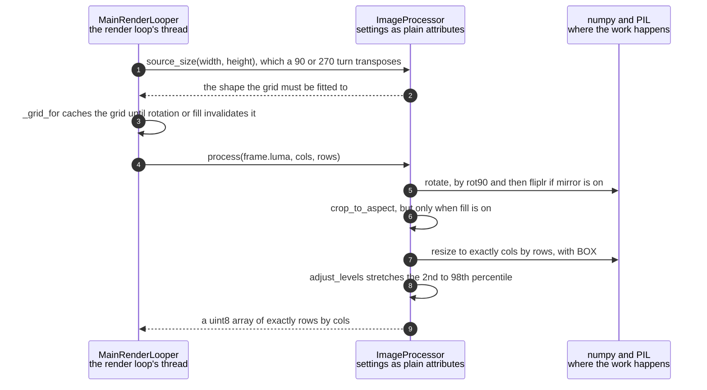

# ImageProcessor rotates, crops and resizes a frame to the character grid

**Priority: `HIGH`** — every frame is reshaped here, and it is the step that makes everything after it small. [What the priorities mean](../how-to-write-scenario-docs.md).

A sensor frame is 320x240. A character grid is 64x24 on the panel and something
like 267x100 in a full-screen terminal. Between them sits one method that turns
the first into the second, and the value is that **everything downstream is
grid-sized**: the brightness mapping, the colour conversion and the packing all
work on thousands of cells rather than tens of thousands of pixels, because
this ran first.

The order is rotate, then crop, then resize, and each step is where it is for a
reason. Rotation comes first because cropping to an aspect ratio is meaningless
before the picture is the right way up. The crop only happens in `fill` mode,
and is the difference between a picture that fills the grid and one letterboxed
inside it. The resize is last and uses area averaging, which is not merely the
fast choice — an ASCII cell *represents* the mean brightness of the region it
covers, so BOX computes exactly the right thing. LANCZOS is markedly slower and
its extra sharpness is invisible at one character per pixel.

The rotation defaults took three corrections to reach, and the history is kept
in the code because none of it was derived — each was confirmed by eye.
`rotation=180` alone was correct vertically but silently mirrored, since a
180 degree rotation flips both axes and only one was wanted. Adding the
horizontal flip fixed the handedness. Then the picture was upside down again,
which no composition of those two explains — the camera had been physically
remounted in between. The net transform today is the identity, and both knobs
remain because between them they reach all eight orientations.

The subtle requirement is that [`to_grid`](../../src/capture/image_processor.py#L172)
is **shared** by the luma and the chroma planes. Any difference in rotation or
cropping between them would show up as colour fringing along every edge in the
picture, so the two must go through the same code rather than through two
implementations that agree today.

| Class | What it represents, and its part in this scenario |
|---|---|
| [`MainRenderLooper`](../../ascii_camera.py#L98) | The one object the process is hung off. Here it is the **sizer**: [`_grid_for`](../../ascii_camera.py#L545) decides how many characters the picture is to become, from the window and the frame's own shape, and caches that decision until something invalidates it |
| [`ImageProcessor`](../../src/capture/image_processor.py#L49) | Rotate, crop, resize, levels — the whole reshaping. Here it is the **reducer**, and its settings are plain attributes assigned when the config changes rather than arguments threaded through every call: [`process`](../../src/capture/image_processor.py#L159) takes only the plane and the grid |

## From 320x240 to a grid of characters

| Step | Message | What is going on |
|---:|---|---|
| 1 | [`source_size`](../../src/capture/image_processor.py#L216)`(width, height)`, which a 90 or 270 turn transposes | The grid has to be fitted to the frame *as it will be after rotation*, not as it arrived. A quarter turn swaps the axes, so a 4:3 sensor feeding a portrait grid is a different fitting problem from the same sensor upright |
| 2 | the shape the grid must be fitted to | Returned rather than applied, because the caller is choosing a grid and has not asked for any pixels yet. Nothing has been rotated at this point |
| 3 | [`_grid_for`](../../ascii_camera.py#L545) caches the grid until rotation or fill invalidates it | Recomputing the fit every frame would be wasted work on a value that changes only when the window or the settings do. [`_adopt`](../../ascii_camera.py#L282) clears the cache for exactly `rotation` and `fill`, the two settings that change a shape rather than an appearance |
| 4 | [`process`](../../src/capture/image_processor.py#L159)`(frame.luma, cols, rows)` | The plane and the grid, and nothing else. Contrast, auto-levels, rotation, fill and mirror are attributes the processor already holds — assigned when the config changed, not passed on every frame |
| 5 | [`rotate`](../../src/capture/image_processor.py#L76), by rot90 and then fliplr if mirror is on | The flip is applied **after** the rotation and to every plane, because `to_grid` routes luma and chroma both through here. Rotation before crop, because cropping to an aspect ratio has no meaning until the picture is upright |
| 6 | [`crop_to_aspect`](../../src/capture/image_processor.py#L109), but only when fill is on | The target is `cols / (rows * cell_aspect)` — the grid's shape *on screen*, not in characters, since a character cell is about twice as tall as it is wide. A 4:3 frame into a 2:1 grid loses 80 rows of height; into a square grid it loses 80 columns of width. Without this the picture is letterboxed inside the grid instead of filling it |
| 7 | [`resize`](../../src/capture/image_processor.py#L131) to exactly cols by rows, with BOX | Area averaging, and the step that makes everything downstream cheap: 76,800 pixels become 2,400 at an 80x30 grid. It is also the correct filter rather than the fast one, since an ASCII cell is the mean brightness of what it covers |
| 8 | [`adjust_levels`](../../src/capture/image_processor.py#L144) stretches the 2nd to 98th percentile | Percentiles rather than the true extremes, so one bright speck cannot flatten everything else. Skipped when the range is under 8, which stops a nearly-flat frame being amplified into noise. Applied after the resize, so it costs 2,400 comparisons rather than 76,800 |
| 9 | a uint8 array of exactly rows by cols | One value per character cell, and the only thing anything downstream sees. The same array is handed to the brightness mapping and, in a live scheme, back into `colour_grid` as the Y term — so the colour of a cell and its glyph are derived from identical brightness |

No thread bands: all of this is the render loop's own thread. The panel repeats
every step of it on its own thread at its own grid size, which is what lets the
terminal be resized with the mouse while the panel's 64x24 never moves — but
that is a separate collaboration, not a boundary crossed here.

## Related scenarios

- [One YUV420 capture carries greyscale and colour without converting either](one-yuv420-capture-carries-greyscale-and-colour-without-converting-either.md)
  — where `frame.luma` comes from, and why `to_grid` is shared with the chroma.
- [Pixel brightness is mapped to ramp characters](pixel-brightness-is-mapped-to-ramp-characters.md)
  — what happens to the array this produces.
- [A frame reaches the SPI panel without stalling the render loop](a-frame-reaches-the-spi-panel-without-stalling-the-render-loop.md)
  — the thread that repeats all of this at a different size.
- **One configuration change is pushed to both displays** — where `rotation` and
  `fill` invalidate the cached grid, and why only those two do.

*(The unlinked entries above are documents not written yet.)*
