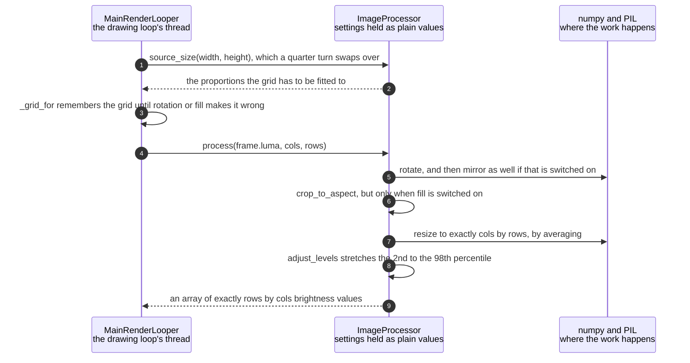

# ImageProcessor rotates, crops and resizes a frame to the character grid

**Priority: `HIGH`** — every picture is reshaped here, and this is the step that makes everything after it small. [What the priorities mean](../how-to-write-scenario-docs.md).

A picture from the camera is 320 dots across and 240 down. A grid[^grid] of
characters is 64 across and 24 down on the small panel[^panel], and something
like 267 across and 100 down on a monitor showing a full-screen window. Between
those two sits one piece of code that turns the first into the second.

Those numbers all have origins worth stating. The 320 by 240 is the size the
program asks the camera for, chosen as the smallest still comfortably larger
than the biggest grid it will ever need to fill. The 64 by 24 falls out of the
panel's own dots and the standard text size. The 267 by 100 is simply how many
character cells fit on this Pi's screen at a small text size.

The value of this step is that **everything after it is grid-sized**. Choosing
characters, converting colour and packing dots all work on a few thousand cells
rather than tens of thousands of dots, purely because this ran first.

The order is rotate, then trim, then shrink, and each of the three is where it
is for a reason.

Rotating comes first because trimming a picture to a particular shape is
meaningless until the picture is the right way up.

The trimming only happens when the `fill` setting[^fill] is switched on. It is
the difference between a grid that occupies the whole window and one that
shrinks to the picture's own proportions, leaving the window blank around it.

The shrinking comes last and works by averaging[^box] the dots that fall inside
each cell. That is not merely the quickest method available. A character cell
*stands for* the average brightness of the region behind it, so averaging
computes exactly the right thing. The sharper alternative is markedly slower and
its extra sharpness cannot be seen at all when one character represents one
value.

The rotation defaults took three corrections to arrive at, and the history is
kept in the code because none of it could be worked out in advance. Each was
confirmed by looking. Setting the rotation to 180 degrees alone was correct
vertically but silently produced a mirror image, because turning by 180 degrees
reverses both axes when only one reversal was wanted. Adding a horizontal flip
fixed the handedness. Then the picture was upside down once more, which no
combination of those two changes explains, because the camera had been
physically remounted in between. The net effect of the settings today is to
leave the picture exactly as it arrives. Both controls remain, because between
them they can reach all eight possible orientations.

The requirement that is easiest to overlook is that
[`to_grid`](../../src/capture/image_processor.py#L172) is **shared** between the
brightness part of a picture and its two colour parts[^yuv]. Any difference at
all in how they were rotated or trimmed would appear as coloured edges around
every object in the picture. So all three must pass through one piece of code,
rather than through two pieces that happen to agree with each other today.

![One camera frame at each stage of the pipeline: a 320 by 240 frame carrying a
large letter F, the same frame after a rotation that as mounted turns nothing,
the frame with hatched bands top and bottom marking the rows a fill-mode crop
cuts away, the surviving strip divided into character cells with a few shaded to
show each one averaging the pixels it covers, and finally a grid of ramp
characters. Below them the same window drawn twice: with fill the grid is the
whole window and the F is cut off top and bottom, and with fit a narrower grid
holds the whole F while the window stays blank at both
sides](../images/imageprocessor-pipeline.svg)

*The five stages in order, showing the picture as it stands at each one. The
three in the middle are the ones the shared code performs, so the colour parts
go through exactly those and differ only in skipping the brightness stretch at
the end. The letter F is there so that a rotation, a mirror or a trim is visible
at a single glance, which five plain rectangles would not be.*

*The pair underneath is what the trimming is **for**, and the only place the two
settings can be told apart. Choosing `fill` makes the grid the whole window and
pays for it with 80 rows of the picture. Choosing `fit` keeps the whole picture
and pays for it with 6,700 blank cells at the sides of that same window. Both
figures are this program's own: in a window 267 cells across and 50 down, the
fitting code really does return a grid of 133 by 50, which is 6,650 cells used
and 6,700 left empty out of the 13,350 the window holds.*

Edit [`imageprocessor-pipeline.svg`](../images/imageprocessor-pipeline.svg) if
the order of the stages ever changes. It is drawn by hand rather than generated,
so nothing regenerates it.

| Class | What it represents, and its part in this scenario |
|---|---|
| [`MainRenderLooper`](../../ascii_camera.py#L99) | The single object the whole running program hangs from. In this scenario it is the **sizer**. [`_grid_for`](../../ascii_camera.py#L546) decides how many characters the picture is to become, working from the size of the window and the proportions of the camera picture, and it remembers that decision until something makes it wrong |
| [`ImageProcessor`](../../src/capture/image_processor.py#L49) | Rotating, trimming, shrinking and adjusting brightness[^levels]: the whole of the reshaping. In this scenario it is the **reducer**. Its settings are plain stored values, written when the description of the picture[^config] changes, rather than arguments passed down through every call. So [`process`](../../src/capture/image_processor.py#L159) needs only the picture and the grid size |

## From 320 by 240 to a grid of characters

```mermaid
sequenceDiagram
    autonumber
    participant App as MainRenderLooper<br/>the drawing loop's thread
    participant Proc as ImageProcessor<br/>settings held as plain values
    participant NP as numpy and PIL<br/>where the work happens

    App->>Proc: source_size(width, height), which a quarter turn swaps over
    Proc-->>App: the proportions the grid has to be fitted to
    App->>App: _grid_for remembers the grid until rotation or fill makes it wrong
    App->>Proc: process(frame.luma, cols, rows)
    Proc->>NP: rotate, and then mirror as well if that is switched on
    Proc->>Proc: crop_to_aspect, but only when fill is switched on
    Proc->>NP: resize to exactly cols by rows, by averaging
    Proc->>Proc: adjust_levels stretches the 2nd to the 98th percentile
    Proc-->>App: an array of exactly rows by cols brightness values
```

| Step | Message | What is going on |
|---:|---|---|
| 1 | [`source_size`](../../src/capture/image_processor.py#L216)`(width, height)`, which a quarter turn swaps over | The grid has to be fitted to the picture *as it will be after rotating*, not as it arrived. A quarter turn exchanges the two dimensions, so a picture four units wide by three tall feeding a tall narrow grid is a completely different fitting problem from the same picture the right way up |
| 2 | the proportions the grid has to be fitted to | Handed back rather than acted upon, because the caller is still choosing a grid and has not asked for any dots yet. Nothing has been rotated at this point |
| 3 | [`_grid_for`](../../ascii_camera.py#L546) remembers the grid until rotation or fill makes it wrong | Working the fit out afresh for every picture would be wasted effort on a value that only changes when the window or the settings do. [`_adopt`](../../ascii_camera.py#L283) discards the remembered value for exactly two settings, rotation and fill, because those two are the only ones that change a *shape* rather than an appearance |
| 4 | [`process`](../../src/capture/image_processor.py#L159)`(frame.luma, cols, rows)` | The picture and the grid size, and nothing else. Contrast, automatic levels, rotation, fill and mirror are all values the reducer is already holding, written when the description changed rather than passed in on every picture |
| 5 | [`rotate`](../../src/capture/image_processor.py#L76), and then mirror as well if that is switched on | The mirroring is applied **after** the rotating, and to every part of the picture, because the shared code routes the brightness and both colour parts through here. Rotating happens before trimming, because trimming to a shape has no meaning until the picture is upright |
| 6 | [`crop_to_aspect`](../../src/capture/image_processor.py#L109), but only when fill is switched on | The shape aimed at is `cols / (rows * cell_aspect)`, which is the grid's shape *as it appears on screen* rather than counted in characters. That matters because a character cell is not square. The program takes it as twice as tall as it is wide, set by `DEFAULT_CELL_ASPECT`, which is why a grid of 64 by 24 does not look like a 64 by 24 rectangle. Trimming a 320 by 240 picture to a shape twice as wide as it is tall leaves 320 by 160, losing 80 rows. Trimming the same picture to a square leaves 240 by 240, losing 80 columns. With fill switched off nothing is cut at all: [`_grid_for`](../../ascii_camera.py#L546) asks [`fit_grid`](../../src/capture/image_processor.py#L25) for a grid matching the picture's own proportions instead, and the window is left with blank cells around it |
| 7 | [`resize`](../../src/capture/image_processor.py#L131) to exactly cols by rows, by averaging | This is the step that makes everything after it cheap. On the panel's grid, the 76,800 brightness values coming from the camera become 1,536, which is fifty times fewer. It is also the correct method rather than the fast one, since a character cell genuinely is the average brightness of what it covers |
| 8 | [`adjust_levels`](../../src/capture/image_processor.py#L144) stretches the 2nd to the 98th percentile | Percentiles rather than the true darkest and lightest values, so that one bright speck cannot flatten the contrast of everything else. Reaching in by 2 per cent from each end steps over a handful of stray dots while leaving 96 per cent of the picture untouched. It is skipped altogether when the gap between those two points is under 8. Since the full range is 256, a gap of 8 is about 3 per cent of it, meaning a picture with almost no variation, which stretching would turn into meaningless noise. Note that this runs *after* the shrinking, so it examines 1,536 values rather than 76,800 |
| 9 | an array of exactly rows by cols brightness values | One value for each character cell, and the only thing anything further along ever sees. The same array is handed both to the character-choosing code and, when a live colour scheme[^scheme] is switched on, back in as the brightness term of the colour conversion. That is what makes a cell's colour and its character derive from identical brightness |

There are no coloured thread bands in the diagram. All of this happens on the
drawing loop's own thread. The small panel repeats every one of these steps on
its own thread at its own grid size, which is what allows a window on a monitor
to be resized with the mouse while the panel's 64 by 24 never moves. That
repetition is a separate arrangement, though, rather than a boundary crossed
here.

## Related scenarios

- [One YUV420 capture carries greyscale and colour without converting either](one-yuv420-capture-carries-greyscale-and-colour-without-converting-either.md)
  — where the brightness part comes from, and why the shrinking code is shared
  with the two colour parts.
- [Pixel brightness is mapped to ramp characters](pixel-brightness-is-mapped-to-ramp-characters.md)
  — what happens next to the array this step produces.
- [A frame reaches the SPI panel without stalling the render loop](a-frame-reaches-the-spi-panel-without-stalling-the-render-loop.md)
  — the thread that repeats all of this at a different size.
- [One configuration change is pushed to both displays](one-configuration-change-is-pushed-to-both-displays.md)
  — where rotation and fill discard the remembered grid, and why only those two
  settings do.

### Footnotes

[^grid]: The **character grid** is how this program holds a picture: as a
    rectangle of character cells rather than of dots. Each cell is one
    character, chosen according to how bright the patch of camera picture behind
    it happens to be. [`to_grid`](../../src/capture/image_processor.py#L172) is
    the code that reduces a picture to that grid. How many cells there are
    depends on where the picture is being sent — 64 across and 24 down on the
    small attached panel at the usual text size, and whatever fits the window
    when the picture goes to an ordinary monitor instead.

[^panel]: The **SPI panel** is a small screen measuring 2.4 inches across the
    diagonal, 240 dots by 320, using a controller chip called the ILI9341. It is
    connected to the computer by a simple four-wire arrangement called SPI, which
    is a common way of attaching small devices. It is driven entirely by the
    program itself, through [`ILI9341`](../../src/lcd/lcd.py#L47), with no
    separate system driver involved. In the sealed box this program is built
    for, this panel is the only screen there is. One complete picture for it is
    153,600 bytes, which has to be sent in pieces of 4 kilobytes each — see
    [`SPI_CHUNK`](../../src/lcd/lcd.py#L44) — because that is as much as the
    connection will accept at a time.

[^fill]: **fill** and **fit** are the two ways of placing a picture into a space
    that is not the same shape as the picture. The camera picture is four units
    wide for every three units tall. Choosing `fit` keeps the whole picture and
    shrinks the grid until it matches that shape, which leaves empty cells
    around the picture. Choosing `fill` makes the grid occupy the whole space
    and trims the picture to suit, so no cell is wasted but the edges of the
    picture are lost. It is one of only two settings that change the shape of
    the grid rather than merely its appearance.

[^box]: When a picture is made smaller, several original dots have to become one
    new value, and there is more than one way to decide what that value should
    be. **Averaging**, known in imaging libraries as the box method, simply takes
    the mean of the dots covering the new cell. A more elaborate method called
    **Lanczos** looks at a wider area and works harder to keep edges crisp, at a
    real cost in time. Crisp edges cannot be seen when one character stands for
    one value, and the mean is exactly what a character cell is supposed to
    represent, so here the cheaper method is also the more correct one.

[^yuv]: **YUV420** is a way of storing a picture that keeps brightness and
    colour separately, instead of storing a colour for every dot. The brightness
    part, called the luma, holds one brightness value for every dot in the
    picture. The two colour parts, called the chroma, hold colour information at
    half the detail across and half the detail down, so each of them holds a
    quarter as many values as the brightness part does. All three parts arrive
    together in one piece of memory: the brightness first, then the two colour
    parts packed in after it. That arrangement is what
    [`chroma`](../../src/capture/camera.py#L51) knows how to take apart. At 320
    by 240 the brightness part is 76,800 bytes and the two colour parts together
    are 38,400 bytes.

[^levels]: **Levels** are the brightness adjustments applied before a character
    is chosen: the contrast setting, and the automatic stretch that pins the
    darkest and lightest parts of *this particular picture* to the two ends of
    the character sequence. Both are worked into a table of 256 prepared answers
    by [`_level_lut`](../../src/art/ascii_art.py#L66), so the cost is paid once
    per picture rather than once per dot.

[^config]: The **render configuration** is the complete, current description of
    how the picture should be drawn: which colour scheme, which ramp, how much
    contrast, which way up, and so on. It is frozen, meaning no part of the
    program ever alters one. Instead, every change produces an entirely new
    [`RenderConfig`](../../src/control/render_config.py#L118) by way of
    [`with_changes`](../../src/control/render_config.py#L141), which is also the
    only code anywhere that decides whether a proposed value is allowed. The
    list of settings, and what each one will accept, is
    [`SPECS`](../../src/control/render_config.py#L74). That single table is what
    the checking code, the `help` text, the command-line options and the
    description given to the language model are all built from.

[^scheme]: A **colour scheme** is one of the nine named looks listed in
    [`SCHEMES`](../../src/art/palettes.py#L79). Which one is currently in use is
    part of the program's render configuration, and the knob, a key press or a
    typed command can all change it. The scheme called `grey` is the one the
    program starts with, and it is what the phrase "greyscale mode" refers to:
    characters only, worked out from the brightness part of the picture and
    nothing else. Only the scheme called `live` reads the colour parts, through
    [`colour_grid`](../../src/capture/image_processor.py#L187). The remaining
    seven are tints, such as green phosphor, amber CRT and e-ink on paper. A
    tint recolours the same greyscale picture using two fixed colours, so it
    never looks at the colour parts either.
