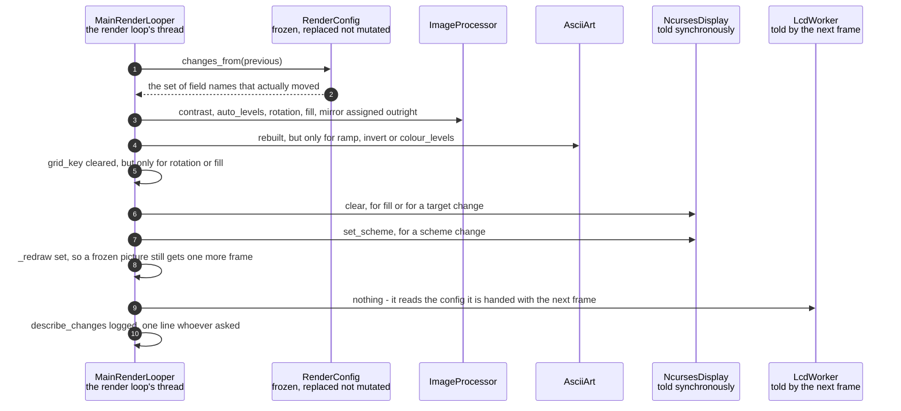

# One configuration change is pushed to both displays

**Priority: `HIGH`** — every accepted change of any kind ends here, whichever route asked for it. [What the priorities mean](../how-to-write-scenario-docs.md).

A setting has been validated and a replacement config[^config] exists.
Something now has to *happen* — and what has to happen is different for every
setting. `contrast` is an assignment the next frame picks up.
`invert`[^invert] means rebuilding the ASCII generator. `fill`[^fill]
invalidates the cached grid[^grid] **and** needs the terminal cleared, because
letterboxing leaves cells the picture no longer writes to and they would keep
the previous frame's characters for good.

The value is that this knowledge lives in **one place**. Before
[`_adopt`](../../ascii_camera.py#L282), "invert also has to rebuild the ASCII
generator" and "fill also has to invalidate the grid" were spread across the
key handler, and every new setting had to remember them all — a list nobody
holds completely, which is the kind of thing that is wrong for months before
anyone notices.

The title is half true, and the half that is false is the interesting one. The
terminal really is **pushed** to: cleared, re-schemed[^scheme], its grid
invalidated, synchronously and here. The panel[^panel] is not. It reads its
settings out of the `RenderConfig` it is handed **with the next frame**, so
there is nothing to push — the change reaches it by the ordinary route a
moment later, on its own thread. Which leaves exactly one gap, and the code
closes it: if the picture is frozen there is no next frame, so `_redraw` is
set to make one happen.

Nothing here is conditional on which route asked. A key, the knob[^detent], a
typed line, a phone and a language model all arrive as a plain dict at
[`apply`](../../ascii_camera.py#L235), and by the time this runs there is
nothing left that could tell them apart.

| Class | What it represents, and its part in this scenario |
|---|---|
| [`MainRenderLooper`](../../ascii_camera.py#L98) | The one object the process is hung off, and the only thread a setting may change on. Here it is the **distributor**: [`_adopt`](../../ascii_camera.py#L282) is the single place that knows what each setting costs to change, and it works from a **set of changed names** rather than from the values |
| [`RenderConfig`](../../src/control/render_config.py#L118) | The complete live render state, frozen and replaced rather than mutated. Here it is the **diff**: `changes_from` says which fields actually moved, so a delta[^delta] that asks for what is already set costs nothing at all |
| [`NcursesDisplay`](../../src/hdmi/ncurses_display.py#L34) | The HDMI terminal. Here it is the **pushed** one: it is told about a scheme, cleared when the picture's shape changes, and does so synchronously on this thread |
| [`LcdWorker`](../../src/lcd/lcd_worker.py#L61) | The panel's thread. Here it is the **not pushed** one, and deliberately: it reads the whole config out of the next frame it is handed, so the only thing this code does for it is make sure a next frame exists |

## One accepted change, and everything that must be told

| Step | Message | What is going on |
|---:|---|---|
| 1 | `changes_from(previous)` | The diff, not the config. Everything below keys off names rather than values, which is what makes "did `invert` move" a question with a cheap answer |
| 2 | the set of field names that actually moved | Empty is the common case and returns immediately. A delta asking for what is already set is not an error and not a no-op that still repaints — it costs nothing, which is why `a bit more contrast` at the ceiling is safe to repeat |
| 3 | contrast, auto_levels, rotation, fill, mirror assigned outright | The cheap ones: plain attributes the processor reads on its next frame. Assigned unconditionally because testing whether each moved would cost more than the assignment |
| 4 | rebuilt, but only for ramp, invert or colour_levels | Three settings and one rebuild, because all three change the same object: the ramp[^ramp] string, its reversal, and the quantisation. Rebuilding on `contrast` would throw away a 256-entry table[^lut] for nothing |
| 5 | grid_key cleared, but only for rotation or fill | The grid is fitted from the frame's shape and the window, so only the settings that change a *shape* invalidate it. `scheme` does not — which is why switching scheme with the knob never resizes the picture |
| 6 | clear, for fill or for a target change | `fill` off leaves letterboxed cells the picture no longer writes to, which would keep the previous frame's characters for ever. A `target` change needs it in **both** directions: switching the terminal off leaves the picture on screen, and switching it back on leaves the off-message under a picture that no longer covers every cell |
| 7 | set_scheme, for a scheme change | The expensive one, and the reason the knob banks its detents: this ends in a full repaint of every cell — some 27,000 in a full-screen terminal — so a five-detent spin applied one at a time was five repaints of pictures nobody could see |
| 8 | _redraw set, so a frozen picture still gets one more frame | The gap in "the panel finds out with the next frame": while frozen there is no next frame. Without this a setting changed on a frozen picture would sit invisible until it was unfrozen |
| 9 | nothing - it reads the config it is handed with the next frame | The panel is handed the whole `RenderConfig` with every frame, so a change reaches it without anything being pushed. There used to be an `LcdConfig` naming eight fields the panel cared about, which meant adding a setting required remembering to add it in two places — and the field it was missing was never going to announce itself |
| 10 | describe_changes logged, one line whoever asked | The one output of the whole exchange, and it names the fields and their old and new values rather than dumping the config. It is also the check that the knob's banking still works: a two-detent move must write **one** line |

No thread bands, and the reason is the substance of the document rather than an
absence of one. Everything here happens on the render loop's thread because
that is the only thread a setting may change on. The panel's thread is a
participant that is deliberately never spoken to — the arrow to it carries
nothing, which is exactly the design.

## Related scenarios

- [A typed command updates the render configuration](a-typed-command-updates-the-render-configuration.md)
  — the route in, and where `apply` calls this.
- [A render configuration change is refused](a-render-configuration-change-is-refused.md)
  — what happens instead when the replacement config is never built, so none of
  this runs and nothing is half-applied.
- [A rotary encoder detent changes the colour scheme](a-rotary-encoder-detent-changes-the-colour-scheme.md)
  — why a banked move is applied as one change, given what a scheme change
  costs here.
- [A frame reaches the SPI panel without stalling the render loop](a-frame-reaches-the-spi-panel-without-stalling-the-render-loop.md)
  — the next frame, which is how the panel actually learns about all of this.
- [A keypress updates the render configuration](a-keypress-updates-the-render-configuration.md) — the shortest route to
  `apply`, and the one that passes `note=True`.

### Footnotes

[^config]: The **render configuration** is the complete live state of how the
    picture is drawn — scheme, ramp, contrast, rotation and the rest. It is
    frozen: nothing assigns to it, and every change produces a whole new
    [`RenderConfig`](../../src/control/render_config.py#L118) through
    [`with_changes`](../../src/control/render_config.py#L141), which is also
    the only code that decides whether a value is allowed. What the settings
    are, and what each accepts, is
    [`SPECS`](../../src/control/render_config.py#L74) — one table that the
    validator, the `help` text, the command-line arguments and the model's
    tool schema are all built from.

[^invert]: The **invert** setting reverses the ramp, so bright pixels get the
    dark end of it — white-on-black becomes black-on-white in effect. It
    reverses the characters and deliberately leaves the position table alone,
    which is how both displays stay in agreement about which glyph a brightness
    deserves.

[^fill]: **fill** and **fit** are the two ways a 4:3 frame can be put into a
    grid of another shape. `fit` keeps all of the picture and leaves blank
    margins — letterboxing. `fill` crops the frame to the grid's on-screen
    shape so no margin remains, at the price of the edges. It is a setting like
    any other, and one of the two that change the grid's shape rather than its
    appearance.

[^grid]: The **character grid** is the picture as this app holds it: `rows` by
    `cols` character **cells** rather than pixels, each cell one character
    chosen from the brightness of the patch of camera frame it covers.
    [`to_grid`](../../src/capture/image_processor.py#L172) is what resizes a
    plane to it. How big it is depends on where the picture is going — 64 by 24
    on the SPI panel at the default font size, and whatever the window holds on
    the HDMI terminal.

[^scheme]: A **colour scheme** is one of the nine named looks in
    [`SCHEMES`](../../src/art/palettes.py#L79), and which one is live is part
    of the render configuration. `grey` is the default, and is what "greyscale
    mode" means: characters only, drawn from the luma plane and nothing else.
    `live` is the only scheme that reads the chroma planes, through
    [`colour_grid`](../../src/capture/image_processor.py#L187). The other seven
    are **tints** — green phosphor, amber CRT, e-ink on paper — which recolour
    the same greyscale picture from two fixed colours.

[^panel]: The **SPI panel** is a 2.4 inch ILI9341 LCD, 240x320, wired to the
    Pi's SPI bus — a four-wire serial bus for talking to peripherals — and
    driven from userspace by [`ILI9341`](../../src/lcd/lcd.py#L47) with no
    kernel driver behind it. In the sealed enclosure it is the only display
    there is. One full frame is 153,600 bytes, sent in
    [`SPI_CHUNK`](../../src/lcd/lcd.py#L44) pieces of 4 KB because that is what
    the driver's buffer holds.

[^detent]: A **detent** is one click of the knob — the position it settles
    into, felt as a notch. Electrically it is one full cycle of the two
    switches, which is what [`QuadratureDecoder`](../../src/control/encoder.py#L88)
    counts. **Quadrature** is the arrangement: two switches a quarter-cycle
    apart, so which one changes first says which way the knob turned, and
    contact bounce that does not complete a cycle emits nothing.

[^delta]: A **delta** is a plain dict of the settings a change means to alter —
    `{"scheme": "amber"}` — and nothing else. Every route in builds one and
    hands it to the configuration; none of them assigns a setting directly.
    That is what keeps validation in one place no matter who asked.

[^ramp]: A **ramp** is the string of characters the picture is drawn with,
    ordered from lightest to darkest — ` .:-=+*#%@` is one. Brightness picks a
    position along it, so the ramp is what decides how the picture looks before
    any colour is involved. The named ones are in
    [`RAMPS`](../../src/art/ascii_art.py#L17) and the setting chooses between
    them.

[^lut]: A **lookup table** trades arithmetic for memory: every possible input
    is worked out once, in advance, and afterwards the answer is fetched rather
    than computed. Brightness is a byte, so 256 entries covers every case. The
    fetch is a numpy **gather** — one array operation that reads a whole grid
    of values out of the table at once, with no Python loop over cells.
