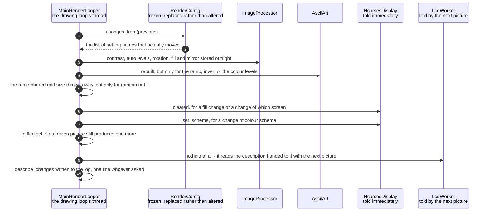

# One configuration change is pushed to both displays

**Priority: `HIGH`** — every accepted change of any kind finishes here, no matter which route asked for it. [What the priorities mean](../how-to-write-scenario-docs.md).

A setting has been checked and accepted, and a replacement description of the
picture[^config] now exists. Something has to *happen* as a result, and what has
to happen is different for every setting.

Changing the contrast is simply a value being stored, which the next picture
picks up by itself. Changing the invert setting[^invert] means the table of
characters has to be built again from scratch. Changing between filling and
fitting[^fill] does two things at once: it throws away the remembered grid[^grid]
size, and it also requires the monitor to be cleared. That last requirement is
easy to miss. When a picture no longer fills the whole window, the cells around
the edge stop being written to, and whatever characters they held last would
simply stay there for ever.

The value of this scenario is that all of that knowledge lives in **one place**.
Before [`_adopt`](../../ascii_camera.py#L283) existed, facts like "inverting also
means rebuilding the character table" and "filling also means discarding the
remembered grid" were scattered across the key handler. Every newly added
setting had to remember all of them. That is a list nobody ever holds completely
in their head, which is exactly the kind of thing that stays wrong for months
before anybody notices.

The title of this document is half true, and the half that is false is the more
interesting one. The monitor genuinely is **pushed** to: it is cleared, told
about the colour scheme[^scheme], and has its remembered grid thrown away, all
immediately and all on this thread. The small panel[^panel] is not pushed to at
all. It reads its settings out of the description it is handed **along with the
next picture**, so there is nothing to push. The change reaches it by the
ordinary route a fraction of a second later, on its own thread.

That leaves exactly one gap, and the code closes it deliberately. If the picture
has been frozen, then there is no next picture, so the panel would never find
out. A flag is therefore set to force one more picture to be produced.

None of this depends in any way on who asked. A key press, the knob[^detent], a
typed line, a phone and a language model all arrive as the same plain list of
values at [`apply`](../../ascii_camera.py#L236), and by the time this code runs
there is nothing left that could possibly tell them apart.

| Class | What it represents, and its part in this scenario |
|---|---|
| [`MainRenderLooper`](../../ascii_camera.py#L99) | The single object the whole running program hangs from, and the only thread on which a setting may change. In this scenario it is the **distributor**. [`_adopt`](../../ascii_camera.py#L283) is the one place that knows what each setting costs to change, and it works from a **list of which setting names moved** rather than from the values themselves |
| [`RenderConfig`](../../src/control/render_config.py#L118) | The complete, current description of how the picture should be drawn, frozen and replaced rather than altered. In this scenario it is the **comparer**. Asking it which fields actually moved means a proposed change[^delta] that requests something already set costs nothing whatsoever |
| [`NcursesDisplay`](../../src/hdmi/ncurses_display.py#L34) | An ordinary monitor connected by an HDMI cable. In this scenario it is the one that **is pushed to**. It is told about a colour scheme, and cleared when the shape of the picture changes, and both of those happen immediately on this thread |
| [`LcdWorker`](../../src/lcd/lcd_worker.py#L61) | The small panel's own thread. In this scenario it is the one that is **not pushed to**, and that is deliberate. It reads the entire description out of the next picture it is handed, so the only thing this code does on its behalf is make certain that a next picture will exist |

## One accepted change, and everything that has to be told about it

```mermaid
sequenceDiagram
    autonumber
    participant App as MainRenderLooper<br/>the drawing loop's thread
    participant Cfg as RenderConfig<br/>frozen, replaced rather than altered
    participant Proc as ImageProcessor
    participant Art as AsciiArt
    participant Term as NcursesDisplay<br/>told immediately
    participant W as LcdWorker<br/>told by the next picture

    App->>Cfg: changes_from(previous)
    Cfg-->>App: the list of setting names that actually moved
    App->>Proc: contrast, auto levels, rotation, fill and mirror stored outright
    App->>Art: rebuilt, but only for the ramp, invert or the colour levels
    App->>App: the remembered grid size thrown away, but only for rotation or fill
    App->>Term: cleared, for a fill change or a change of which screen
    App->>Term: set_scheme, for a change of colour scheme
    App->>App: a flag set, so a frozen picture still produces one more
    App->>W: nothing at all - it reads the description handed to it with the next picture
    App->>App: describe_changes written to the log, one line whoever asked
```

| Step | Message | What is going on |
|---:|---|---|
| 1 | `changes_from(previous)` | What is asked for is the difference, not the description itself. Everything below works from names rather than values, and that is what makes "did the invert setting move" a question with a very cheap answer |
| 2 | the list of setting names that actually moved | An empty list is the ordinary case, and it returns straight away. A request for something already set is neither an error nor a change that repaints anyway. It costs nothing at all, which is why a phrase such as "a bit more contrast" is safe to repeat once the top of the range has been reached |
| 3 | contrast, auto levels, rotation, fill and mirror stored outright | These are the cheap ones: plain values that the picture-processing code reads the next time it runs. They are stored without first checking whether they moved, because checking would cost more than simply storing them |
| 4 | rebuilt, but only for the ramp, invert or the colour levels | Three settings and a single rebuild, because all three change the same object: the ramp[^ramp] of characters, whether that ramp is reversed, and how many distinct levels it is divided into. Rebuilding when the contrast changed would throw away a table[^lut] of 256 prepared answers for no reason at all, since none of those answers depends on contrast |
| 5 | the remembered grid size thrown away, but only for rotation or fill | The grid size is worked out from the shape of the camera picture and the shape of the window, so only settings that change a *shape* can make it wrong. Changing the colour scheme cannot, and that is precisely why turning the knob to change scheme never resizes the picture |
| 6 | cleared, for a fill change or a change of which screen | Turning off fill leaves cells around the edge that the picture no longer writes to, and those cells would keep their old characters permanently. A change of which screen a setting applies to needs a clear in **both** directions: switching the monitor off leaves the last picture sitting on the screen, and switching it back on leaves the "switched off" message underneath a picture that no longer covers every cell |
| 7 | set_scheme, for a change of colour scheme | This is the expensive one, and it is the reason the knob gathers up its clicks before acting. Changing the scheme ends in repainting every single cell. On a monitor showing roughly 267 cells across and 100 down, that is about 26,700 cells repainted. So a five-click spin applied one click at a time meant five complete repaints, four of them showing pictures that were replaced before anybody could see them |
| 8 | a flag set, so a frozen picture still produces one more | This closes the one gap in "the panel finds out with the next picture". While the picture is frozen there is no next picture. Without this flag, a setting changed during a freeze would sit invisible until somebody unfroze it |
| 9 | nothing at all - it reads the description handed to it with the next picture | The panel receives the whole description with every picture, so a change reaches it without anything having to be pushed. There used to be a separate, smaller description naming just the eight settings the panel cared about. That meant every newly added setting had to be remembered in two places, and a setting forgotten in the second place would never announce itself. It would simply have no effect on the panel |
| 10 | describe_changes written to the log, one line whoever asked | This is the single output of the entire exchange. It names the settings that moved together with their old and new values, rather than printing the whole description. It is also the check that the knob's gathering-up still works: a two-click move must produce exactly **one** line in the log, not two |

There are no coloured thread bands here, and their absence is the substance of
the document rather than an oversight. Everything happens on the drawing loop's
thread, because that is the only thread on which a setting may change. The
panel's thread appears in the diagram as a participant that is deliberately
never spoken to. The arrow pointing at it carries nothing at all, and that
emptiness is the design rather than a gap in it.

## Related scenarios

- [A typed command updates the render configuration](a-typed-command-updates-the-render-configuration.md)
  — the route in, and the place where the applying step calls this code.
- [A render configuration change is refused](a-render-configuration-change-is-refused.md)
  — what happens instead when the replacement description is never built at
  all, so none of this runs and nothing is left half done.
- [A rotary encoder detent changes the colour scheme](a-rotary-encoder-detent-changes-the-colour-scheme.md)
  — why a gathered-up move is applied as a single change, given what a change
  of scheme costs here.
- [A frame reaches the SPI panel without stalling the render loop](a-frame-reaches-the-spi-panel-without-stalling-the-render-loop.md)
  — the next picture, which is how the panel actually learns about any of this.
- [A keypress updates the render configuration](a-keypress-updates-the-render-configuration.md)
  — the shortest route to the applying step, and the one that asks for the
  answer to be drawn on the picture.

### Footnotes

[^config]: The **render configuration** is the complete, current description of
    how the picture should be drawn: which colour scheme, which ramp, how much
    contrast, which way up, and so on. It is frozen, meaning no part of the
    program ever alters one. Instead, every change produces an entirely new
    [`RenderConfig`](../../src/control/render_config.py#L118) by way of
    [`with_changes`](../../src/control/render_config.py#L141), which is also the
    only code anywhere that decides whether a proposed value is allowed. The
    list of settings, and what each one will accept, is
    [`SPECS`](../../src/control/render_config.py#L74). That single table is what
    the checking code, the `help` text, the command-line options and the
    description given to the language model are all built from.

[^invert]: The **invert** setting reverses the ramp, so that bright parts of the
    scene are drawn with the dark end of the character sequence instead. In
    effect it turns a light-on-dark picture into a dark-on-light one. It
    reverses the characters and deliberately leaves the list of positions
    untouched, which is how both screens stay in agreement about which
    character a given brightness deserves.

[^fill]: **fill** and **fit** are the two ways of placing a picture into a space
    that is not the same shape as the picture. The camera picture is four units
    wide for every three units tall. Choosing `fit` keeps the whole picture and
    shrinks the grid until it matches that shape, which leaves empty cells
    around the picture. Choosing `fill` makes the grid occupy the whole space
    and trims the picture to suit, so no cell is wasted but the edges of the
    picture are lost. It is one of only two settings that change the shape of
    the grid rather than merely its appearance.

[^grid]: The **character grid** is how this program holds a picture: as a
    rectangle of character cells rather than of dots. Each cell is one
    character, chosen according to how bright the patch of camera picture behind
    it happens to be. [`to_grid`](../../src/capture/image_processor.py#L172) is
    the code that reduces a picture to that grid. How many cells there are
    depends on where the picture is being sent — 64 across and 24 down on the
    small attached panel at the usual text size, and whatever fits the window
    when the picture goes to an ordinary monitor instead.

[^scheme]: A **colour scheme** is one of the nine named looks listed in
    [`SCHEMES`](../../src/art/palettes.py#L79). Which one is currently in use is
    part of the program's render configuration, and the knob, a key press or a
    typed command can all change it. The scheme called `grey` is the one the
    program starts with, and it is what the phrase "greyscale mode" refers to:
    characters only, worked out from the brightness part of the picture and
    nothing else. Only the scheme called `live` reads the colour parts, through
    [`colour_grid`](../../src/capture/image_processor.py#L187). The remaining
    seven are tints, such as green phosphor, amber CRT and e-ink on paper. A
    tint recolours the same greyscale picture using two fixed colours, so it
    never looks at the colour parts either.

[^panel]: The **SPI panel** is a small screen measuring 2.4 inches across the
    diagonal, 240 dots by 320, using a controller chip called the ILI9341. It is
    connected to the computer by a simple four-wire arrangement called SPI, which
    is a common way of attaching small devices. It is driven entirely by the
    program itself, through [`ILI9341`](../../src/lcd/lcd.py#L47), with no
    separate system driver involved. In the sealed box this program is built
    for, this panel is the only screen there is. One complete picture for it is
    153,600 bytes, which has to be sent in pieces of 4 kilobytes each — see
    [`SPI_CHUNK`](../../src/lcd/lcd.py#L44) — because that is as much as the
    connection will accept at a time.

[^detent]: A **detent** is one click of the knob, meaning the position the knob
    settles into and which can be felt as a notch under the fingers.
    Electrically, one click is one complete cycle of the two switches inside the
    knob, and counting those cycles is the job of
    [`QuadratureDecoder`](../../src/control/encoder.py#L88). **Quadrature** is
    the name for the arrangement of those two switches. They are positioned a
    quarter of a cycle apart, so whichever of them changes first reveals which
    way the knob was turned. A switch bouncing without completing a full cycle
    produces nothing at all, which is exactly what is wanted.

[^delta]: A **delta** is a plain list of the settings a change intends to alter,
    paired with their new values, such as `{"scheme": "amber"}`, and nothing
    else besides. Every way of asking for a change builds one of these and hands
    it to the configuration. None of them ever sets a setting directly. That is
    what keeps the checking in a single place no matter who did the asking.

[^ramp]: A **ramp** is the set of characters a picture is drawn with, arranged
    in order from the one that looks lightest to the one that looks darkest.
    The sequence ` .:-=+*#%@` is one example. A brightness value picks a
    position along that sequence, so the choice of ramp decides how the picture
    looks before any colour is involved at all. The named ramps are listed in
    [`RAMPS`](../../src/art/ascii_art.py#L17), and a setting chooses between
    them.

[^lut]: A **lookup table** trades arithmetic for memory. Every answer that could
    ever be needed is worked out once, in advance, and stored. Afterwards the
    program fetches an answer instead of calculating one. A brightness value is
    a single byte, so 256 entries is enough to cover every possible case. The
    fetch itself is a single operation that reads a whole grid of answers out of
    the table at once, rather than a loop that visits each cell in turn.
