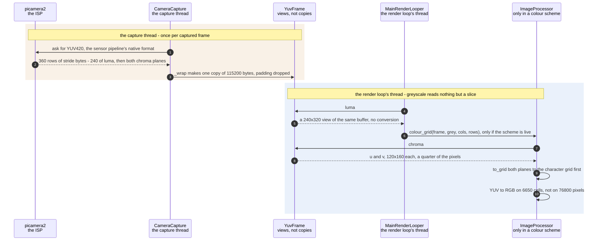

# One YUV420 capture carries greyscale and colour without converting either

**Priority: `HIGH`** — every frame passes through this, and the whole pipeline is affordable on a Zero 2 only because it does. [What the priorities mean](../how-to-write-scenario-docs.md).

A colour camera and a greyscale picture normally cost a conversion. This one
does not, and the reason is that YUV420 already contains both answers: the
**Y plane is an 8-bit greyscale image**, and the two chroma planes beside it are
everything a colour scheme needs. Greyscale mode reads a slice of the capture
buffer and does no arithmetic at all.

The value is measured rather than asserted. At 320x240 the whole frame is
115,200 bytes: 76,800 of luma and 19,200 in each of two chroma planes, which
are half resolution on both axes and so a quarter of the pixels each. Keeping
the chroma costs **38 KB more than the luma alone**, and buys the colour path
for free. Converting instead — YUV to RGB to grey, at full resolution, per frame
— was the single most expensive thing in the original pipeline.

Two decisions make this work and neither is obvious. The first is that
[`_wrap`](../../src/capture/camera.py#L151) makes **one** copy holding all three
planes together, rather than one copy of the luma now and another of the chroma
later if colour turns out to be on. The second is that the conversion, when a
colour scheme does want RGB, happens **after** the downscale to the character
grid — at 133x50 that is about 6,650 pixels of arithmetic instead of 76,800.

The one thing here that could not be reasoned out was the plane order. U before
V is what this sensor delivers, and it was settled by capturing the same scene
as reference RGB888 and comparing, rather than by reading it off a diagram —
the two orders differ only by swapping blue and red, which is easy to look at
and be wrong about.

| Class | What it represents, and its part in this scenario |
|---|---|
| [`YuvFrame`](../../src/capture/camera.py#L22) | One YUV420 frame, exposing its planes as views rather than copies. Here it is the **whole subject**: [`luma`](../../src/capture/camera.py#L47) is a slice and [`chroma`](../../src/capture/camera.py#L51) is arithmetic on offsets, so neither costs anything until somebody reads the pixels |
| [`CameraCapture`](../../src/capture/camera.py#L61) | The camera and the thread that reads it. Here it is the **packer**: it asks the ISP for YUV420 in the first place, and [`_wrap`](../../src/capture/camera.py#L151) makes the single copy that keeps all three planes together and detaches them from the driver's buffers |
| [`ImageProcessor`](../../src/capture/image_processor.py#L49) | Rotate, crop, resize, levels. Here it is the **only reader of the chroma**: [`colour_grid`](../../src/capture/image_processor.py#L187) is the one place the U and V planes are touched, and it runs after the downscale rather than before |

## Two pictures in one buffer

| Step | Message | What is going on |
|---:|---|---|
| 1 | ask for YUV420, the sensor pipeline's native format | Asking for the format the ISP already produces avoids a conversion *inside* the ISP as well as one here. Requesting RGB would have moved the same arithmetic somewhere less visible rather than removing it |
| 2 | 360 rows of stride bytes - 240 of luma, then both chroma planes | The buffer is `height * 3 // 2` rows: the luma plane, then U and V packed together beneath it. `stride` may exceed the width, which is why a copy is needed at all — a buffer read at its stride rather than its width comes out sheared |
| 3 | [`_wrap`](../../src/capture/camera.py#L151) makes one copy of 115200 bytes, padding dropped | One `ascontiguousarray` doing two jobs: dropping the padding and detaching the frame from the driver's recycled buffers. Keeping the chroma in it is the 38 KB decision — one copy now against a second copy later, taken once for every frame whether colour is on or not |
| 4 | [`luma`](../../src/capture/camera.py#L47) | A property that returns `self._buf[:height, :width]`. There is no method here that converts anything, because there is nothing to convert |
| 5 | a 240x320 view of the same buffer, no conversion | 76,800 bytes that were already in the copy. This is the entire greyscale path: the Y plane of YUV420 *is* an 8-bit greyscale image, and the app never learns that from a conversion because there never is one |
| 6 | [`colour_grid`](../../src/capture/image_processor.py#L187)`(frame, grey, cols, rows)`, only if the scheme is live | Reached only from [`_colours_for`](../../ascii_camera.py#L498), and only when the scheme's kind is `live`. Greyscale and the tinted schemes never touch the chroma, so the 38 KB sits unread — paid for on every frame and used on some |
| 7 | [`chroma`](../../src/capture/camera.py#L51) | Offsets into the same buffer, not a decode: the flat region below the luma is split in half and each half reshaped. Half resolution on both axes, so a quarter of the pixels each |
| 8 | u and v, 120x160 each, a quarter of the pixels | **U before V**, which was checked against a reference RGB888 capture of the same scene rather than assumed. Getting it the wrong way round swaps blue and red, which looks plausible enough to survive a glance |
| 9 | [`to_grid`](../../src/capture/image_processor.py#L172) both planes to the character grid first | The same rotate-crop-resize the luma went through, which is why it is a shared method: any difference in rotation or cropping between the planes would show as colour fringing along every edge |
| 10 | YUV to RGB on 6650 cells, not on 76800 pixels | The order is the optimisation. `grey` is passed back in as the Y term rather than being recomputed, so the colour of a cell is derived from exactly the brightness that chose its character — the two cannot disagree |

No thread bands would be wrong here and one band would be misleading: the frame
is built on the capture thread and read on the render loop's, and later read
again on the LCD worker's. That is safe for the reason established in the
capture scenario — the copy detached it from the driver, and every reader only
reads — but it is the reason the planes are exposed as views rather than handed
out as arrays somebody might modify.

## Related scenarios

- [A capture thread hands the render loop its newest frame through a one-slot queue](a-capture-thread-hands-the-render-loop-its-newest-frame-through-a-one-slot-queue.md)
  — how the frame described here reaches the loop, and why one copy is made.
- [Pixel brightness is mapped to ramp characters](pixel-brightness-is-mapped-to-ramp-characters.md)
  — what the luma plane becomes.
- [The chroma planes give each character cell its colour](the-chroma-planes-give-each-character-cell-its-colour.md) — the arithmetic of
  the last message here, drawn in full.
- [A colour scheme is compiled into a per-cell lookup table](a-colour-scheme-is-compiled-into-a-per-cell-lookup-table.md) — the other
  colour path, which never reads the chroma at all.
