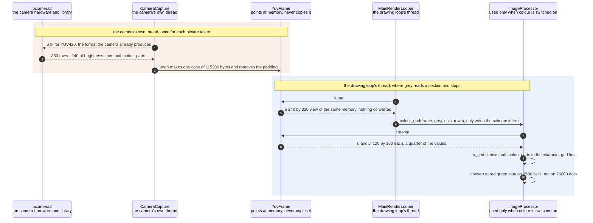

# One YUV420 capture carries greyscale and colour without converting either

**Priority: `HIGH`** — every single picture the camera takes passes through this step, and the whole program is only affordable on a computer as small as this one[^zero2] because of it. [What the priorities mean](../how-to-write-scenario-docs.md).

Normally, taking a colour picture from a camera and turning it into a grey
picture costs work. The program has to look at every dot, combine its red,
green and blue amounts into a single brightness, and write the answer down.
That is a large amount of arithmetic to do fifteen times a second.

This program never does that work at all. The reason is the format the camera
is asked for, which is called YUV420[^yuv]. That format already contains both
answers side by side. It keeps brightness in one part and colour in two
others. The brightness part, on its own and with nothing done to it, is
already an ordinary grey picture. So drawing in grey means reading a section
of memory and stopping there. No arithmetic happens.

The saving can be measured rather than merely claimed, and the arithmetic is
worth setting out in full, because several later figures depend on it.

The program asks the camera for pictures 320 dots wide and 240 dots tall. Those
two numbers are set in [`CameraCapture`](../../src/capture/camera.py#L61) and can
be changed on the command line, but they were not picked at random. They are the
smallest size that is still comfortably larger than the biggest grid of
characters the program will ever draw. Anything smaller would throw away detail
the grid could have used. Anything larger would pay for detail that is going to
be discarded anyway.

Multiplying 320 by 240 gives 76,800 dots, and the brightness part holds one
value for each of them, so the brightness alone comes to 76,800 bytes. Each
colour part is half as detailed across and half as detailed down. Half of one
dimension multiplied by half of the other is a quarter, so each colour part holds
a quarter as many values: 76,800 divided by four, which is 19,200 bytes. There
are two of them, so the colour costs 38,400 bytes altogether, and that is the
**38 kilobytes** referred to throughout this document. Adding all three parts
together gives 76,800 plus 19,200 plus 19,200, or 115,200 bytes for one complete
picture.

So keeping the colour costs about 38 kilobytes more than keeping the brightness
alone, and in exchange the colour picture comes free. Doing the conversion instead,
from this format to red-green-blue and then to grey, at full detail, once per
picture, was the most expensive single thing the program used to do.

Two decisions make this work, and neither is obvious from looking at the code.

The first decision is that [`_wrap`](../../src/capture/camera.py#L151) makes
**one** copy containing all three parts together. The alternative would have
been to copy the brightness now, and then copy the colour later if it turned
out that a colour scheme[^scheme] was switched on. That would mean two copies
on every picture where colour is wanted, and a more complicated piece of code
to decide between them. One copy, always, is simpler and cheaper on average.

The second decision is about *when* the colour conversion happens, in the
cases where colour really is wanted. It happens **after** the picture has been
shrunk down to the grid of characters[^grid] the program draws, not before. The
amount of arithmetic is the reason, and the size of the difference depends on
how big the grid is. Inside the sealed box, which is the arrangement this
program is really built for, that grid is 64 cells across and 24 down, which
comes to 1,536 cells. Shrinking first therefore means converting 1,536 values.
Converting first would mean converting all 76,800 of them. That is fifty times
the work for a result that looks exactly the same, so the cheaper order is
simply the better one.

One detail here could not be worked out by reasoning, and had to be tested. The
two colour parts arrive one after the other in memory, and something has to
decide which of the two comes first. On this camera the part called U comes
before the part called V. That was settled by photographing a scene, capturing
the same scene again in an ordinary red-green-blue format[^rgb888] as a
reference, and comparing the two. It was not settled by reading a diagram. The
reason for going to that trouble is that getting the order backwards swaps red
and blue, and a picture with red and blue exchanged still looks like a
reasonable picture at a glance.

*The point of the drawing is that the grey picture is a **section** of the
memory, taken exactly as it already is, rather than something calculated. The
two blocks underneath it are where the extra 38 kilobytes go. Turning 60 rows
of 320 values into 120 rows of 160 is done purely by counting positions, not by
decoding anything. The two colour patches at the side show the mistake that
choosing the wrong order would produce: red and blue exchanged, which is just
believable enough to pass unnoticed.*

Kept by hand: edit [`yuv420-buffer.svg`](../images/yuv420-buffer.svg) directly,
since nothing regenerates it.

| Class | What it represents, and its part in this scenario |
|---|---|
| [`YuvFrame`](../../src/capture/camera.py#L22) | One picture from the camera, held in the YUV420 format. It offers its brightness and colour parts as views[^view] rather than as copies. In this scenario it is the **whole subject**. [`luma`](../../src/capture/camera.py#L47) simply points at a section of the existing memory, and [`chroma`](../../src/capture/camera.py#L51) works out positions by counting. Neither costs anything at all until some other part of the program actually reads the values |
| [`CameraCapture`](../../src/capture/camera.py#L61) | The camera, together with the separate thread[^thread] of work that reads pictures from it. In this scenario it is the **packer**. It is the part that asks the camera hardware[^isp] for the YUV420 format in the first place, and [`_wrap`](../../src/capture/camera.py#L151) is where it makes the single copy that keeps all three parts together and disconnects them from the memory the camera driver reuses |
| [`ImageProcessor`](../../src/capture/image_processor.py#L49) | The part that turns, trims, shrinks and adjusts the brightness of a picture. In this scenario it is the **only reader of the colour parts**. [`colour_grid`](../../src/capture/image_processor.py#L187) is the single place in the whole program that looks at them, and it runs after the picture has been shrunk rather than before |

## Two pictures inside one piece of memory

```mermaid
sequenceDiagram
    autonumber
    participant Pi as picamera2<br/>the camera hardware and library
    participant Cam as CameraCapture<br/>the camera's own thread
    participant F as YuvFrame<br/>points at memory, never copies it
    participant App as MainRenderLooper<br/>the drawing loop's thread
    participant Proc as ImageProcessor<br/>used only when colour is switched on

    rect rgba(200, 140, 60, 0.12)
        note over Pi, F: the camera's own thread, once for each picture taken
        Cam->>Pi: ask for YUV420, the format the camera already produces
        Pi-->>Cam: 360 rows - 240 of brightness, then both colour parts
        Cam->>F: _wrap makes one copy of 115200 bytes and removes the padding
    end
    rect rgba(80, 140, 220, 0.12)
        note over F, Proc: the drawing loop's thread, where grey reads a section and stops
        App->>F: luma
        F-->>App: a 240 by 320 view of the same memory, nothing converted
        App->>Proc: colour_grid(frame, grey, cols, rows), only when the scheme is live
        Proc->>F: chroma
        F-->>Proc: u and v, 120 by 160 each, a quarter of the values
        Proc->>Proc: to_grid shrinks both colour parts to the character grid first
        Proc->>Proc: convert to red green blue on 1536 cells, not on 76800 dots
    end
```

| Step | Message | What is going on |
|---:|---|---|
| 1 | ask for YUV420, the format the camera already produces | The request is made through the Raspberry Pi's camera library[^picamera2]. Asking for the format the camera hardware makes anyway avoids one conversion inside that hardware as well as one in the program. Asking for red-green-blue instead would not have removed the arithmetic. It would only have moved it somewhere harder to see |
| 2 | 360 rows - 240 of brightness, then both colour parts | The memory holds one and a half times as many rows as the picture is tall. The brightness fills the top, and the two colour parts are packed in underneath it. The distance from one row to the next, called the stride[^stride], may be larger than the picture is wide. That possibility is the reason a copy is needed at all, because reading a picture using the wrong row distance produces a slanted image |
| 3 | [`_wrap`](../../src/capture/camera.py#L151) makes one copy of 115200 bytes and removes the padding | A single call to `ascontiguousarray`[^contig] does two jobs at once. It removes the unused space at the end of each row, and it disconnects the picture from the memory the camera driver intends to reuse. Keeping the colour parts inside that copy is the 38 kilobyte decision described above: one copy now, rather than a second copy later, paid on every picture whether colour is switched on or not |
| 4 | [`luma`](../../src/capture/camera.py#L47) | This is a property that hands back `self._buf[:height, :width]`. There is no code here that converts anything, for the simple reason that there is nothing to convert |
| 5 | a 240 by 320 view of the same memory, nothing converted | These 76,800 bytes were already inside the copy made in the previous step. This is the entire grey picture path. The brightness part of YUV420 *is* an ordinary grey image, and the program never has to discover that by calculating, because no calculation ever takes place |
| 6 | [`colour_grid`](../../src/capture/image_processor.py#L187)`(frame, grey, cols, rows)`, only when the scheme is live | This step is reached only from [`_colours_for`](../../ascii_camera.py#L499), and only when the chosen colour scheme is the one called `live`. The grey scheme and the seven tinted schemes never look at the colour parts at all. For those schemes the extra 38 kilobytes sit unread. They are paid for on every picture and used on some |
| 7 | [`chroma`](../../src/capture/camera.py#L51) | This works out positions within the same piece of memory rather than decoding anything. The flat region below the brightness is divided in half, and each half is treated as a rectangle. Each colour part is half as detailed across and half as detailed down, so each holds a quarter as many values as the brightness does |
| 8 | u and v, 120 by 160 each, a quarter of the values | **U comes before V.** That order was checked against a reference photograph of the same scene in an ordinary red-green-blue format, rather than being assumed. Taking the two the wrong way round exchanges blue and red, and the result still looks plausible enough that a quick glance would not catch it |
| 9 | [`to_grid`](../../src/capture/image_processor.py#L172) shrinks both colour parts to the character grid first | This is the same turning, trimming and shrinking that the brightness part already went through, which is why one shared piece of code does it. If the colour parts were turned or trimmed even slightly differently from the brightness, the difference would appear as coloured edges around every object in the picture |
| 10 | convert to red green blue on 1536 cells, not on 76800 dots | The saving comes entirely from doing this last, and the two figures in the message are the 1,536 cells of the panel's grid against the 76,800 dots of the camera picture. The already-calculated brightness is passed back in and reused rather than worked out a second time, which means the colour of a character cell is derived from exactly the same brightness that chose which character to draw there. The two therefore cannot disagree with one another |

Thread bands are worth explaining rather than leaving to be noticed. The
picture is built on the camera's thread and read on the drawing loop's thread,
and later read a third time on the thread that drives the small attached
screen[^lcd]. That is safe, for the reason set out in the scenario about the
one-slot holding place: the copy disconnected the picture from the camera
driver's memory, and every part of the program that touches it afterwards only
reads it. Nothing ever writes to it. That is also precisely why the brightness
and colour parts are offered as views onto memory rather than handed out as
arrays that somebody might be tempted to change.

## Related scenarios

- [A capture thread hands the render loop its newest frame through a one-slot queue](a-capture-thread-hands-the-render-loop-its-newest-frame-through-a-one-slot-queue.md)
  — how the picture described here travels from the camera to the drawing loop,
  and why exactly one copy is made on the way.
- [Pixel brightness is mapped to ramp characters](pixel-brightness-is-mapped-to-ramp-characters.md)
  — what the brightness part becomes once the drawing loop has it.
- [The chroma planes give each character cell its colour](the-chroma-planes-give-each-character-cell-its-colour.md)
  — the arithmetic behind the very last step above, set out in full.
- [A colour scheme is compiled into a per-cell lookup table](a-colour-scheme-is-compiled-into-a-per-cell-lookup-table.md)
  — the other way of producing colour, which never reads the camera's colour
  parts at all.

### Footnotes

[^zero2]: The **Raspberry Pi Zero 2 W** is the small, inexpensive computer that
    this program is written for and runs on. It has roughly 416 megabytes of
    usable memory and no separate graphics hardware to hand work to. Every
    timing figure quoted in these documents was measured on that machine, which
    is why a single library taking six seconds to load is a fact worth writing
    down.

[^yuv]: **YUV420** is a way of storing a picture that keeps brightness and
    colour separately, instead of storing a colour for every dot. The brightness
    part, called the luma, holds one brightness value for every dot in the
    picture. The two colour parts, called the chroma, hold colour information at
    half the detail across and half the detail down, so each of them holds a
    quarter as many values as the brightness part does. All three parts arrive
    together in one piece of memory: the brightness first, then the two colour
    parts packed in after it. That arrangement is what
    [`chroma`](../../src/capture/camera.py#L51) knows how to take apart. At 320
    by 240 the brightness part is 76,800 bytes and the two colour parts together
    are 38,400 bytes.

[^scheme]: A **colour scheme** is one of the nine named looks listed in
    [`SCHEMES`](../../src/art/palettes.py#L79). Which one is currently in use is
    part of the program's render configuration, and the knob, a key press or a
    typed command can all change it. The scheme called `grey` is the one the
    program starts with, and it is what the phrase "greyscale mode" refers to:
    characters only, worked out from the brightness part of the picture and
    nothing else. Only the scheme called `live` reads the colour parts, through
    [`colour_grid`](../../src/capture/image_processor.py#L187). The remaining
    seven are tints, such as green phosphor, amber CRT and e-ink on paper. A
    tint recolours the same greyscale picture using two fixed colours, so it
    never looks at the colour parts either.

[^grid]: The **character grid** is how this program holds a picture: as a
    rectangle of character cells rather than of dots. Each cell is one
    character, chosen according to how bright the patch of camera picture behind
    it happens to be. [`to_grid`](../../src/capture/image_processor.py#L172) is
    the code that reduces a picture to that grid. How many cells there are
    depends on where the picture is being sent — 64 across and 24 down on the
    small attached panel at the usual text size, and whatever fits the window
    when the picture goes to an ordinary monitor instead.

[^rgb888]: **RGB888** is the ordinary, straightforward way of storing a colour
    picture: one byte for red, one for green and one for blue, for every single
    dot. It is written that way because each of the three colours gets eight
    bits of memory. It is mentioned here only because a photograph stored in
    that form was used as a reference to check something against. The small
    attached panel uses a more tightly packed arrangement, and the camera uses
    YUV420, so this ordinary form appears nowhere else in the program.

[^view]: A **view** is a second way of looking at memory that already exists,
    rather than a copy of it. When the program takes the brightness part out of
    a picture using [`luma`](../../src/capture/camera.py#L47), no bytes are
    copied and no new memory is used. This is also the reason every part of this
    scenario only ever reads. Several views of one piece of memory are perfectly
    safe to share between threads, for exactly as long as nothing writes through
    any of them.

[^thread]: A **thread** is a separate line of work inside one running program.
    Several threads can be making progress at what appears to be the same time,
    and each keeps its own place in its own instructions. Two threads matter in
    this scenario: one belongs to the camera and does nothing but collect
    pictures, and one belongs to the drawing loop. Giving the camera its own
    thread means the drawing loop never has to stop and wait for a picture to
    arrive.

[^isp]: **Image signal processor**, usually shortened to those three words'
    initials. It is a piece of fixed-purpose hardware sitting between the camera
    sensor and the computer's memory. Its job is to turn the sensor's raw
    output into a finished picture in a named format, and it can resize the
    picture on the way through. Asking it for a 320 by 240 YUV420 picture in
    [`start`](../../src/capture/camera.py#L82) costs this computer's main
    processor nothing at all, which is why both the size and the format are
    settled there rather than being adjusted afterwards. The unused space at the
    end of each row, described below, is also this hardware's doing.

[^picamera2]: **picamera2** is the Python library for the Raspberry Pi's camera,
    built on top of a lower-level piece of software called libcamera. It is the
    replacement for an older library that was simply called picamera. It owns
    the camera sensor, the settings given to the camera hardware, and the memory
    that this loop reads its pictures from.

[^stride]: The **stride** is the distance, measured in bytes, from the start of
    one row of a picture to the start of the next row. It can be larger than a
    row of picture actually needs, because the hardware sometimes prefers each
    row to begin at a convenient position in memory. The program reads this
    distance back from the camera's own settings rather than assuming it. On
    this particular computer at 320 by 240 the distance comes back exactly equal
    to the width, which the running program records in its log as
    `Camera started: 320x240 stride=320 @ 15 fps`. So in the arrangement
    actually deployed there is no unused space to remove, and the trimming step
    inside [`_wrap`](../../src/capture/camera.py#L151) is protection against a
    picture size where there would be.

[^contig]: **`ascontiguousarray`** is a numpy function that returns a version of
    an array whose rows sit directly end to end in memory with no gaps between
    them. It copies the data only when the array it was given is not already
    arranged that way. A picture taken from rows with unused space at the end is
    not arranged that way, so it is copied. A picture whose rows never had unused
    space already is, so it is handed back untouched.

[^lcd]: The **LCD worker** is the part of the program, represented by the class
    [`LcdWorker`](../../src/lcd/lcd_worker.py#L61), that owns the second screen.
    That screen is a small panel measuring 2.4 inches across the diagonal, 240
    by 320 dots, connected by a simple wiring arrangement called SPI. In the
    sealed box this program is built for, that small panel is the only screen
    there is. It is given a thread of its own because sending one picture down
    the wire to it takes about 33 milliseconds, and the drawing loop must not
    spend that time waiting.
