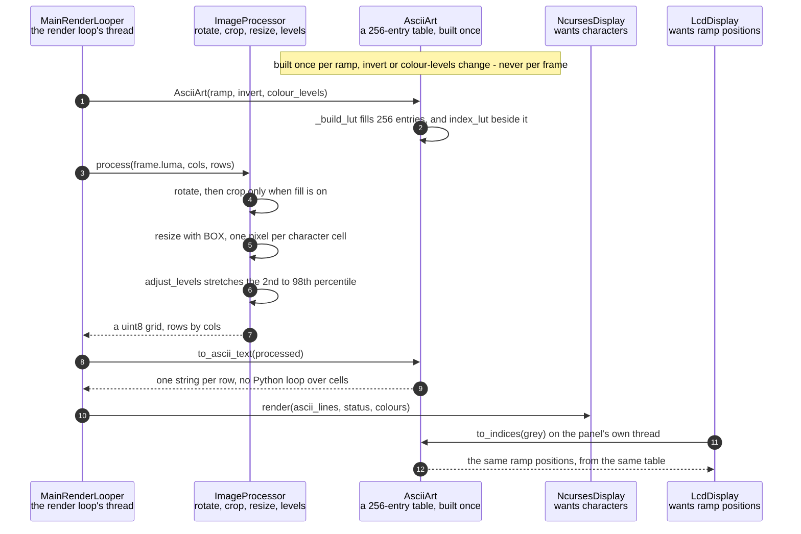

# Pixel brightness is mapped to ramp characters

**Priority: `HIGH`** — this is the transformation the app exists to perform, and it runs on every cell of every frame. [What the priorities mean](../how-to-write-scenario-docs.md).

A frame arrives as 76,800 bytes of greyscale and leaves as a few thousand
characters. The value is the picture itself — but the reason this is a scenario
rather than a line of code is *how* it is done: a 256-entry lookup table built
once, applied to the whole grid with a single numpy fancy-index. The obvious
nested loop costs one Python interpreter round trip per character, and at
267x100 that is 26,700 per frame, which on a Zero 2 is slower than everything
else in the pipeline combined.

The order of operations is the design. Brightness is not mapped where the
camera left it — the frame is first reduced to exactly one pixel per character
cell, so the mapping runs over the *grid* rather than over the sensor image.
At 320x240 into an 80x30 grid that is 76,800 lookups reduced to 2,400. Area
averaging is the correct filter for that reduction and not merely the fast one:
an ASCII cell represents the mean brightness of the region it covers, which is
precisely what BOX computes.

The table is built in [`_build_lut`](../../src/art/ascii_art.py#L159) and
produces **two** outputs from one calculation: characters for the terminal, and
ramp *positions* for the SPI panel, which draws pre-rendered glyphs from an
atlas and wants an index rather than a character. Deriving both from the same
`indices` array is what keeps the two displays choosing identically. It also
survives `invert`, which reverses the character sequence while leaving the
position table untouched — so both outputs flip together, by construction
rather than by both remembering to.

| Class | What it represents, and its part in this scenario |
|---|---|
| [`ImageProcessor`](../../src/capture/image_processor.py#L49) | Rotate, crop, resize and level-adjust, shared by the luma and chroma planes so they stay in register. Here it is the **reducer**: [`process`](../../src/capture/image_processor.py#L159) turns a sensor-sized plane into exactly one pixel per character cell, which is what makes the mapping that follows cheap |
| [`AsciiArt`](../../src/art/ascii_art.py#L81) | Brightness to characters, as a table rather than as a calculation. Here it is the **mapper**, and it does its real work in its constructor: [`_build_lut`](../../src/art/ascii_art.py#L159) runs once per ramp change, and [`to_indices`](../../src/art/ascii_art.py#L195) is thereafter a single array gather |
| [`NcursesDisplay`](../../src/hdmi/ncurses_display.py#L34) | The HDMI terminal. Here it is **one of two consumers**, and the one that wants characters: it is handed finished strings by [`to_ascii_text`](../../src/art/ascii_art.py#L207), one per row |
| [`LcdDisplay`](../../src/lcd/lcd_display.py#L98) | The SPI panel. Here it is **the other consumer**, and it wants the ramp *position* instead, because it blits glyphs from an atlas rather than printing text. Both consumers are fed from one table so they cannot disagree about which character a brightness deserves |

## One frame's brightness becomes one grid of characters

| Step | Message | What is going on |
|---:|---|---|
| 1 | [`AsciiArt`](../../src/art/ascii_art.py#L81)`(ramp, invert, colour_levels)` | A ramp *name*, never the characters themselves. That used to fall back to treating an unrecognised value as a literal ramp, so `--ramp standard` silently drew the picture out of the letters of the typo rather than complaining. An unknown name now raises |
| 2 | [`_build_lut`](../../src/art/ascii_art.py#L159) fills 256 entries, and index_lut beside it | `levels * n // 256`, clamped — so with the ten-character coarse ramp the boundaries land at brightness 0, 26, 52, 77, 103, 128, 154, 180, 205 and 231. Two tables come out of the one calculation: characters for the terminal, positions for the panel. `invert` reverses the characters and leaves the positions alone, which is exactly why the two displays cannot drift apart |
| 3 | [`process`](../../src/capture/image_processor.py#L159)`(frame.luma, cols, rows)` | `luma` is a view of the capture buffer rather than a conversion, so the pipeline starts with no work done at all. `cols` and `rows` are the character grid, not the image — everything after this point is grid-sized |
| 4 | rotate, then crop only when fill is on | Rotation first, because cropping to an aspect ratio is meaningless before the picture is the right way up. The crop is what `fill` buys: without it the picture is letterboxed inside the grid rather than filling it |
| 5 | [`resize`](../../src/capture/image_processor.py#L131) with BOX, one pixel per character cell | Area averaging, and the correct filter rather than merely the fast one: an ASCII cell *is* the mean brightness of the region it covers. LANCZOS is markedly slower and its extra sharpness is invisible at one character per pixel. This is also the step that makes everything downstream small — 76,800 pixels become 2,400 at an 80x30 grid |
| 6 | [`adjust_levels`](../../src/capture/image_processor.py#L144) stretches the 2nd to 98th percentile | Percentiles rather than the true minimum and maximum, so one bright speck cannot flatten the rest of the picture. The stretch is skipped entirely when the range is under 8, which stops a nearly-flat frame being amplified into noise |
| 7 | a uint8 grid, rows by cols | The same array feeds both the character mapping and, in a live colour scheme, the per-cell colour — so the glyph and its colour are always derived from identical brightness |
| 8 | [`to_ascii_text`](../../src/art/ascii_art.py#L207)`(processed)` | The gather and the row assembly in one call. This is the step the whole class exists to make cheap |
| 9 | one string per row, no Python loop over cells | Each row becomes a string with a single `tobytes()` and `decode()`. A ramp of pure ASCII is a uint8 table decoded as ASCII; a ramp with non-ASCII glyphs would be a `U1` table decoded as UTF-32-LE. No ramp needs the second path today, but it is kept because adding one back would otherwise cost 40 ms a frame |
| 10 | [`render`](../../src/hdmi/ncurses_display.py#L185)`(ascii_lines, status, colours)` | The terminal is handed finished strings. In greyscale `colours` is `None`, which is not a missing value but the cheapest instruction there is: draw in the terminal's own foreground colour |
| 11 | [`to_indices`](../../src/art/ascii_art.py#L195)`(grey)` on the panel's own thread | The panel does its own downscale and its own mapping, on its own thread, from the same frame — so this step runs concurrently with everything above rather than after it. It asks the same table a different question |
| 12 | the same ramp positions, from the same table | The panel blits glyphs from a pre-rendered atlas, so it wants the index, not the character. Because both answers come from one `_build_lut`, a brightness that is a `#` on the terminal is the `#` glyph on the panel — including after an invert, and without either display knowing the other exists |

No thread bands, even though the last two messages happen on the LCD worker's
thread: nothing crosses between them. The panel is handed the *frame*, not this
grid, and repeats the reduction itself at its own size — which is why the
terminal can be resized with the mouse while the panel's 64x24 never changes.
The boundary that does exist is drawn in its own scenario.

## Related scenarios

- [A capture thread hands the render loop its newest frame through a one-slot queue](a-capture-thread-hands-the-render-loop-its-newest-frame-through-a-one-slot-queue.md)
  — where the frame this scenario consumes comes from, and why its `luma` costs
  nothing to read.
- [A frame reaches the SPI panel without stalling the render loop](a-frame-reaches-the-spi-panel-without-stalling-the-render-loop.md)
  — the last two messages above, from the other side of the thread boundary.
- [The chroma planes give each character cell its colour](the-chroma-planes-give-each-character-cell-its-colour.md) — the parallel path
  through the same `ImageProcessor`, kept in register with this one so that
  colour cannot fringe against the glyphs.
- [A colour scheme is compiled into a per-cell lookup table](a-colour-scheme-is-compiled-into-a-per-cell-lookup-table.md) — what happens to
  the ramp positions produced here when the scheme is a tint.
