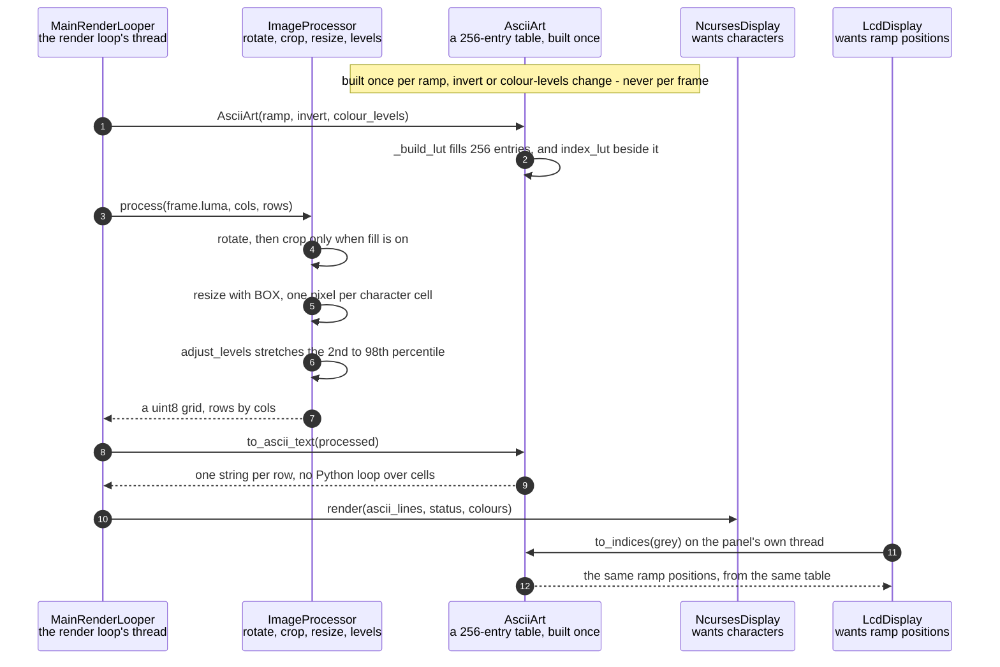

# Pixel brightness is mapped to ramp characters

**Priority: `HIGH`** — this is the transformation the app exists to perform, and it runs on every cell of every frame. [What the priorities mean](../how-to-write-scenario-docs.md).

A frame arrives as 76,800 bytes of greyscale[^scheme] and leaves as a few
thousand characters. The value is the picture itself — but the reason this is
a scenario rather than a line of code is *how* it is done: a 256-entry lookup
table[^lut] built once, applied to the whole grid with a single numpy
fancy-index. The obvious nested loop costs one Python interpreter round trip
per character, and at 267x100 that is 26,700 per frame, which on a Zero
2[^zero2] is slower than everything else in the pipeline combined.

The order of operations is the design. Brightness is not mapped where the
camera left it — the frame is first reduced to exactly one pixel per character
cell, so the mapping runs over the *grid* rather than over the sensor image.
At 320x240 into an 80x30 grid that is 76,800 lookups reduced to 2,400. Area
averaging is the correct filter for that reduction and not merely the fast
one: an ASCII cell represents the mean brightness of the region it covers,
which is precisely what BOX[^box] computes.

One number does the whole job, and the figure above follows it from end to
end. The ramp[^ramp] in use here has ten characters, so each of them covers
about 26 of the 256 possible brightnesses, and every brightness it covers gets
the same answer: that character's *position* along the ramp. Where the two displays part is what
they do with that number. The terminal is handed the character standing at the
position and prints it. The SPI panel[^panel] is handed the position itself,
because it never draws text at all: it keeps the ramp already rendered as
fixed-size tiles — a **glyph atlas**[^atlas] — and copies the tile standing at
that index. So a position, a character and a tile are three views of one
number.

The table is built in [`_build_lut`](../../src/art/ascii_art.py#L159) and
produces **two** outputs from one calculation: the characters for the terminal,
and the positions for the panel. Deriving both from the same `indices` array is
what keeps the two displays choosing identically. It also survives `invert`[^invert], which
reverses the character sequence while leaving the position table untouched —
so both outputs flip together, by construction rather than by both remembering
to.

![A bar of all 256 brightness values, dark at the left and light at the right,
divided where one ramp character gives way to the next, with two labelled rows
beneath it: the character the terminal draws, and the ramp position the panel
uses to index its glyph atlas, boxed to read as an index. Below those, one whole
row of the picture as the terminal takes it and the same row as the panel takes it; and at
the foot, a strip of the atlas itself: the ten ramp characters drawn as tiles and
numbered 0 to 9, which is what those positions
select](../images/brightness-to-ramp.svg)

*The whole conversion, as one picture. The two rows under the bar are the same
table asked two different questions: the terminal wants the character, and the
panel wants the position, because it blits a tile from its atlas rather than
drawing text. Neither row is a second table — there is one `indices` array and
both answers are read out of it, which is why the displays cannot disagree about
which glyph a brightness deserves, and why `invert` reverses the characters
while leaving the positions alone.*

*The strip at the foot is what a position is a position **in**: the panel's
atlas, every ramp character drawn once as a tile and picked by number. Seeing
the tiles is the quickest way to understand why one display wants a character
and the other wants an integer.*

Kept by hand: edit [`brightness-to-ramp.svg`](../images/brightness-to-ramp.svg)
directly, since nothing regenerates it.

*What the panel does with the number, which is the half the table above cannot
show. Follow one chain and the mechanism is plain: a position picks a tile, and
the tile is copied — pixels and all — into the place that position names.
Nothing is drawn at any point, which is why the panel wants a number and has no
use for the character standing at it. The third chain is worth the space on its
own: position 0 is the **blank** tile, so an empty cell is a copy like any
other rather than a cell that was skipped.*

Kept by hand: edit [`position-to-tile.svg`](../images/position-to-tile.svg)
directly, since nothing regenerates it.

| Class | What it represents, and its part in this scenario |
|---|---|
| [`ImageProcessor`](../../src/capture/image_processor.py#L49) | Rotate, crop, resize and level-adjust, shared by the luma[^yuv] and chroma planes so they stay in register. Here it is the **reducer**: [`process`](../../src/capture/image_processor.py#L159) turns a sensor-sized plane into exactly one pixel per character cell, which is what makes the mapping that follows cheap |
| [`AsciiArt`](../../src/art/ascii_art.py#L81) | Brightness to characters, as a table rather than as a calculation. Here it is the **mapper**, and it does its real work in its constructor: [`_build_lut`](../../src/art/ascii_art.py#L159) runs once per ramp change, and [`to_indices`](../../src/art/ascii_art.py#L195) is thereafter a single array gather |
| [`NcursesDisplay`](../../src/hdmi/ncurses_display.py#L34) | The HDMI terminal. Here it is **one of two consumers**, and the one that wants characters: it is handed finished strings by [`to_ascii_text`](../../src/art/ascii_art.py#L207), one per row |
| [`LcdDisplay`](../../src/lcd/lcd_display.py#L98) | The SPI panel. Here it is **the other consumer**, and it wants the ramp *position* instead, because it blits glyphs from an atlas rather than printing text. Both consumers are fed from one table so they cannot disagree about which character a brightness deserves |

## One frame's brightness becomes one grid of characters

| Step | Message | What is going on |
|---:|---|---|
| 1 | [`AsciiArt`](../../src/art/ascii_art.py#L81)`(ramp, invert, colour_levels)` | A ramp *name*, never the characters themselves. That used to fall back to treating an unrecognised value as a literal ramp, so `--ramp standard` silently drew the picture out of the letters of the typo rather than complaining. An unknown name now raises |
| 2 | [`_build_lut`](../../src/art/ascii_art.py#L159) fills 256 entries, and index_lut beside it | `levels * n // 256`, clamped — so with the ten-character coarse ramp the boundaries land at brightness 0, 26, 52, 77, 103, 128, 154, 180, 205 and 231. Two tables come out of the one calculation: characters for the terminal, positions for the panel. `invert` reverses the characters and leaves the positions alone, which is exactly why the two displays cannot drift apart |
| 3 | [`process`](../../src/capture/image_processor.py#L159)`(frame.luma, cols, rows)` | `luma` is a view[^view] of the capture buffer rather than a conversion, so the pipeline starts with no work done at all. `cols` and `rows` are the character grid[^grid], not the image — everything after this point is grid-sized |
| 4 | rotate, then crop only when fill is on | Rotation first, because cropping to an aspect ratio is meaningless before the picture is the right way up. The crop is what `fill` buys: without it the grid takes the frame's own shape instead, and the window is left with blank cells around it |
| 5 | [`resize`](../../src/capture/image_processor.py#L131) with BOX, one pixel per character cell | Area averaging, and the correct filter rather than merely the fast one: an ASCII cell *is* the mean brightness of the region it covers. LANCZOS is markedly slower and its extra sharpness is invisible at one character per pixel. This is also the step that makes everything downstream small — 76,800 pixels become 2,400 at an 80x30 grid |
| 6 | [`adjust_levels`](../../src/capture/image_processor.py#L144) stretches the 2nd to 98th percentile | Percentiles rather than the true minimum and maximum, so one bright speck cannot flatten the rest of the picture. The stretch is skipped entirely when the range is under 8, which stops a nearly-flat frame being amplified into noise |
| 7 | a uint8 grid, rows by cols | The same array feeds both the character mapping and, in a live colour scheme, the per-cell colour — so the glyph and its colour are always derived from identical brightness |
| 8 | [`to_ascii_text`](../../src/art/ascii_art.py#L207)`(processed)` | The gather and the row assembly in one call. This is the step the whole class exists to make cheap |
| 9 | one string per row, no Python loop over cells | Each row becomes a string with a single `tobytes()` and `decode()`. A ramp of pure ASCII is a uint8 table decoded as ASCII; a ramp with non-ASCII glyphs would be a `U1` table decoded as UTF-32-LE. No ramp needs the second path today, but it is kept because adding one back would otherwise cost 40 ms a frame |
| 10 | [`render`](../../src/hdmi/ncurses_display.py#L185)`(ascii_lines, status, colours)` | The terminal is handed finished strings. In greyscale `colours` is `None`, which is not a missing value but the cheapest instruction there is: draw in the terminal's own foreground colour |
| 11 | [`to_indices`](../../src/art/ascii_art.py#L195)`(grey)` on the panel's own thread | The panel does its own downscale and its own mapping, on its own thread, from the same frame — so this step runs concurrently with everything above rather than after it. It asks the same table a different question |
| 12 | the same ramp positions, from the same table | The panel blits glyphs from a pre-rendered atlas, so it wants the index, not the character. Because both answers come from one `_build_lut`, a brightness that is a `#` on the terminal is the `#` glyph on the panel — including after an invert, and without either display knowing the other exists |

No thread bands, even though the last two messages happen on the LCD
worker[^lcd]'s thread: nothing crosses between them. The panel is handed the
*frame*, not this grid, and repeats the reduction itself at its own size —
which is why the terminal can be resized with the mouse while the panel's
64x24 never changes. The boundary that does exist is drawn in its own
scenario.

## Related scenarios

- [A capture thread hands the render loop its newest frame through a one-slot queue](a-capture-thread-hands-the-render-loop-its-newest-frame-through-a-one-slot-queue.md)
  — where the frame this scenario consumes comes from, and why its `luma` costs
  nothing to read.
- [A frame reaches the SPI panel without stalling the render loop](a-frame-reaches-the-spi-panel-without-stalling-the-render-loop.md)
  — the last two messages above, from the other side of the thread boundary.
- [The chroma planes give each character cell its colour](the-chroma-planes-give-each-character-cell-its-colour.md) — the parallel path
  through the same `ImageProcessor`, kept in register with this one so that
  colour cannot fringe against the glyphs.
- [A colour scheme is compiled into a per-cell lookup table](a-colour-scheme-is-compiled-into-a-per-cell-lookup-table.md) — what happens to
  the ramp positions produced here when the scheme is a tint.

### Footnotes

[^scheme]: A **colour scheme** is one of the nine named looks in
    [`SCHEMES`](../../src/art/palettes.py#L79), and which one is live is part
    of the render configuration. `grey` is the default, and is what "greyscale
    mode" means: characters only, drawn from the luma plane and nothing else.
    `live` is the only scheme that reads the chroma planes, through
    [`colour_grid`](../../src/capture/image_processor.py#L187). The other seven
    are **tints** — green phosphor, amber CRT, e-ink on paper — which recolour
    the same greyscale picture from two fixed colours.

[^lut]: A **lookup table** trades arithmetic for memory: every possible input
    is worked out once, in advance, and afterwards the answer is fetched rather
    than computed. Brightness is a byte, so 256 entries covers every case. The
    fetch is a numpy **gather** — one array operation that reads a whole grid
    of values out of the table at once, with no Python loop over cells.

[^zero2]: The Raspberry Pi Zero 2 W: the machine this app is built for and
    deployed on, with about 416 MB of usable RAM and no graphics acceleration
    to call on. Every timing in these documents was measured there.

[^box]: `BOX` and `LANCZOS` are resampling filters, named as the imaging
    library names them. `BOX` averages the pixels covering a cell; `LANCZOS`
    weights a wider neighbourhood and keeps edges sharper, at a real cost in
    time. Sharpness is invisible at one character per cell, and the average is
    what a cell means, so the cheaper filter is also the correct one here.

[^ramp]: A **ramp** is the string of characters the picture is drawn with,
    ordered from lightest to darkest — ` .:-=+*#%@` is one. Brightness picks a
    position along it, so the ramp is what decides how the picture looks before
    any colour is involved. The named ones are in
    [`RAMPS`](../../src/art/ascii_art.py#L17) and the setting chooses between
    them.

[^panel]: The **SPI panel** is a 2.4 inch ILI9341 LCD, 240x320, wired to the
    Pi's SPI bus — a four-wire serial bus for talking to peripherals — and
    driven from userspace by [`ILI9341`](../../src/lcd/lcd.py#L47) with no
    kernel driver behind it. In the sealed enclosure it is the only display
    there is. One full frame is 153,600 bytes, sent in
    [`SPI_CHUNK`](../../src/lcd/lcd.py#L44) pieces of 4 KB because that is what
    the driver's buffer holds.

[^atlas]: A **glyph atlas** is every character of the *ramp* — ten of them for
    the default ramp, not the whole font — drawn once, in advance, into one
    array: [`GlyphAtlas`](../../src/lcd/lcd_display.py#L46). A frame is then
    assembled by copying the right rectangles out of it rather than by drawing
    text, which at 64 by 24 is one array operation instead of 1,536 calls into
    the font renderer. That it holds the ramp and not the font is why changing
    the ramp rebuilds it.

[^invert]: The **invert** setting reverses the ramp, so bright pixels get the
    dark end of it — white-on-black becomes black-on-white in effect. It
    reverses the characters and deliberately leaves the position table alone,
    which is how both displays stay in agreement about which glyph a brightness
    deserves.

[^yuv]: **YUV420** keeps a frame as brightness and colour separately rather
    than as pixels. The **luma** plane, Y, carries one brightness byte per
    pixel; the two **chroma** planes, U and V, carry colour at half resolution
    on each axis, so a quarter of the samples each. All three arrive in one
    buffer of `height * 3 / 2` rows — Y first, then U and V packed together —
    which is the layout [`chroma`](../../src/capture/camera.py#L51) unpacks. At
    320x240 that is 76,800 bytes of luma and 38,400 of chroma.

[^view]: A numpy **view** is a second array object pointing into the first
    one's memory. Slicing copies no bytes, which is why
    [`luma`](../../src/capture/camera.py#L47) costs nothing to take — and why
    every reader of a frame is a reader only: several views of one buffer are
    safe to share across threads exactly as long as nothing writes through any
    of them.

[^grid]: The **character grid** is the picture as this app holds it: `rows` by
    `cols` character **cells** rather than pixels, each cell one character
    chosen from the brightness of the patch of camera frame it covers.
    [`to_grid`](../../src/capture/image_processor.py#L172) is what resizes a
    plane to it. How big it is depends on where the picture is going — 64 by 24
    on the SPI panel at the default font size, and whatever the window holds on
    the HDMI terminal.

[^lcd]: The **LCD worker**, [`LcdWorker`](../../src/lcd/lcd_worker.py#L61), is
    the thread that owns the SPI panel. It exists so that the render loop never
    waits on the bus: pushing one frame takes about 33 ms, and the loop has
    other work to do in that time.
