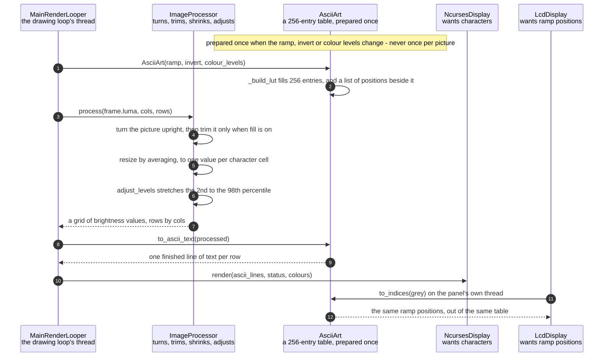

# Pixel brightness is mapped to ramp characters

**Priority: `HIGH`** — this is the one transformation the whole program exists to perform, and it runs on every character cell of every picture. [What the priorities mean](../how-to-write-scenario-docs.md).

A picture arrives from the camera as 76,800 brightness values and leaves as a
few thousand text characters. That conversion is the point of the program. The
reason it deserves a document of its own is not *what* it produces but *how*
the work is arranged, because the obvious arrangement is far too slow to use.

That figure of 76,800 is worth pinning down before going further, because
several other numbers in this document follow from it. The program asks the
camera for pictures 320 dots wide and 240 dots tall. Those two numbers are set
in [`CameraCapture`](../../src/capture/camera.py#L61) and can be overridden on
the command line, but they are not arbitrary. They were chosen as the smallest
size that is still comfortably larger than the biggest grid of characters the
program will ever draw. Smaller would mean throwing away detail the grid could
have used. Larger would mean paying for detail that is going to be discarded
anyway. The camera hardware[^isp] does the shrinking itself, at no cost to the
computer, whereas shrinking afterwards in the program is expensive. So it is
worth asking the camera for a small picture in the first place. Since the
brightness of each dot is one value, 320 multiplied by 240 gives 76,800 of
them.

The obvious way to turn those values into characters would be to look at each
character cell in turn, decide which character suits its brightness, and write
that character down. To see why that is too slow, it helps to use the largest
case rather than a typical one, because that is where the cost bites hardest.
The biggest grid this program produces is roughly 267 cells across and 100
down, which is what a terminal window fills when it takes up the whole of this
Pi's screen at a small text size. Multiplying those gives 26,700 separate
decisions for every picture. Each decision would be a small piece of Python
work, and small pieces of Python work are expensive. On a computer as modest as
this one[^zero2], doing it that way is slower than everything else in the
program put together.

What the program does instead is prepare the answers in advance. A brightness
value is stored in a single byte, and a byte can hold 256 different values. The
number 256 therefore is not a choice anybody made; it is simply how many
possibilities exist. Because that count is both fixed and small, the program can
work out the answer for every one of them once, store those 256 answers in a
list, and afterwards look answers up instead of calculating them. A list used
this way is called a lookup table[^lut]. Fetching several thousand answers out
of it is a single operation, so the per-cell cost disappears entirely.

The order in which things happen matters just as much as the table does. The
brightness is **not** converted while the picture is still camera-sized. The
picture is first reduced so that there is exactly one brightness value for each
character cell, and only then is the table applied. The saving depends on how
big the grid is. Inside the sealed box, which is the arrangement this program is
really built for, the small attached panel[^panel] draws a grid 64 cells across
and 24 down. Those two numbers come from the panel's own size and the size of
the text: at the standard text size, set by
[`DEFAULT_FONT_SIZE`](../../src/lcd/lcd_display.py#L43), each character occupies
a rectangle that divides the panel's 320 by 240 dots exactly, leaving 64 columns
and 24 rows. Sixty-four multiplied by twenty-four is 1,536 cells. So reducing
first turns 76,800 lookups into 1,536, which is fifty times fewer.

The way the picture is reduced matters too, and the reason is worth stating
because it is not simply about speed. When several camera dots fall inside one
character cell, the program averages them[^box]. That average is not merely the
quickest answer available. It is the *correct* one, because a character cell
stands for the overall brightness of the patch of scene behind it. Averaging is
what that means.

One number does the entire job, and it is worth following that number to both
of its destinations. The set of characters the picture is drawn with is called
the ramp[^ramp], and the ramp normally in use here has ten characters in it. The
256 possible brightness values have to be shared out between those ten
characters, and 256 divided by 10 is 25.6. So each character covers about 26 of
the possible brightness values, and every brightness inside that band gets the
same answer: the *position* of that character along the ramp. A ramp with more
characters would divide the same 256 values into narrower bands, and one with
fewer would divide them into wider ones. Nothing else about the arrangement
changes.

The two screens then do different things with that one position. An ordinary
monitor is given the character standing at that position, and prints it. The
small attached panel is given the position itself, because it never draws text
at all. Instead it keeps every ramp character already drawn as a small
fixed-size picture, a collection known as a glyph atlas[^atlas], and it copies
whichever of those small pictures sits at that position. So a position, a
character, and a small picture are three different views of the same single
number.

The table is built in [`_build_lut`](../../src/art/ascii_art.py#L159), and one
calculation produces **two** results at once: the characters for the monitor,
and the positions for the panel. Both come from the same underlying list of
positions, which is what guarantees the two screens always choose the same
thing. It also means the setting called invert[^invert] behaves correctly with
no extra effort. Inverting reverses the order of the characters and leaves the
list of positions untouched, so both screens flip together automatically rather
than because two separate pieces of code each remembered to.

![A bar of all 256 brightness values, dark at the left and light at the right,
divided where one ramp character gives way to the next, with two labelled rows
beneath it: the character the terminal draws, and the ramp position the panel
uses to index its glyph atlas, boxed to read as an index. Below those, one whole
row of the picture as the terminal takes it and the same row as the panel takes it; and at
the foot, a strip of the atlas itself: the ten ramp characters drawn as tiles and
numbered 0 to 9, which is what those positions
select](../images/brightness-to-ramp.svg)

*This is the whole conversion in one drawing. The two rows underneath the bar
are the same table being asked two different questions. The monitor asks for the
character. The panel asks for the position, because it copies a small ready-made
picture rather than drawing any text. Neither row is a separate table. There is
one list of positions, and both answers are read out of it, which is why the two
screens can never disagree about which character a brightness deserves, and why
inverting reverses the characters while leaving the positions exactly as they
were.*

*The strip along the bottom shows what a position is a position **in**: the
panel's collection of ready-made character pictures, each drawn once and chosen
by number. Seeing those small pictures is the quickest way to understand why one
screen wants a character and the other wants a plain number.*

Kept by hand: edit [`brightness-to-ramp.svg`](../images/brightness-to-ramp.svg)
directly, since nothing regenerates it.

*This second drawing shows what the panel does with the number, which is the
half the first drawing cannot show. Follow any one of the three chains and the
mechanism becomes plain. A position selects a small ready-made picture, and that
small picture is copied, dot for dot, into the place the position names. Nothing
is drawn at any stage. That is exactly why the panel wants a number and has no
use at all for the character standing at it. The third chain earns its place on
its own: position zero is the **blank** picture, so an empty-looking cell is a
copy like every other cell rather than a cell that was skipped over.*

Kept by hand: edit [`position-to-tile.svg`](../images/position-to-tile.svg)
directly, since nothing regenerates it.

| Class | What it represents, and its part in this scenario |
|---|---|
| [`ImageProcessor`](../../src/capture/image_processor.py#L49) | The part that turns, trims, shrinks and adjusts the brightness of a picture. The same code handles the brightness part and the colour parts[^yuv] of a camera picture, so that the two always line up with each other. In this scenario it is the **reducer**. [`process`](../../src/capture/image_processor.py#L159) takes a camera-sized picture and returns one holding exactly one brightness value per character cell, and that reduction is what makes everything after it cheap |
| [`AsciiArt`](../../src/art/ascii_art.py#L81) | Brightness turned into characters, done as a prepared table rather than as a calculation. In this scenario it is the **mapper**, and it does its real work when it is first created. [`_build_lut`](../../src/art/ascii_art.py#L159) runs once whenever the ramp changes, and after that [`to_indices`](../../src/art/ascii_art.py#L195) is a single fetch of many values at once |
| [`NcursesDisplay`](../../src/hdmi/ncurses_display.py#L34) | An ordinary monitor connected by an HDMI cable. In this scenario it is **one of the two screens**, and it is the one that wants characters. It is handed finished lines of text by [`to_ascii_text`](../../src/art/ascii_art.py#L207), one line for each row of the grid |
| [`LcdDisplay`](../../src/lcd/lcd_display.py#L98) | The small attached panel. In this scenario it is **the other screen**, and it wants the ramp position instead of the character, because it copies ready-made character pictures rather than printing any text. Both screens are fed from the one table, so they cannot disagree about which character a brightness deserves |

## One picture's brightness becomes one grid of characters

```mermaid
sequenceDiagram
    autonumber
    participant App as MainRenderLooper<br/>the drawing loop's thread
    participant Proc as ImageProcessor<br/>turns, trims, shrinks, adjusts
    participant Art as AsciiArt<br/>a 256-entry table, prepared once
    participant Term as NcursesDisplay<br/>wants characters
    participant Panel as LcdDisplay<br/>wants ramp positions

    note over Art: prepared once when the ramp, invert or colour levels change - never once per picture
    App->>Art: AsciiArt(ramp, invert, colour_levels)
    Art->>Art: _build_lut fills 256 entries, and a list of positions beside it
    App->>Proc: process(frame.luma, cols, rows)
    Proc->>Proc: turn the picture upright, then trim it only when fill is on
    Proc->>Proc: resize by averaging, to one value per character cell
    Proc->>Proc: adjust_levels stretches the 2nd to the 98th percentile
    Proc-->>App: a grid of brightness values, rows by cols
    App->>Art: to_ascii_text(processed)
    Art-->>App: one finished line of text per row
    App->>Term: render(ascii_lines, status, colours)
    Panel->>Art: to_indices(grey) on the panel's own thread
    Art-->>Panel: the same ramp positions, out of the same table
```

| Step | Message | What is going on |
|---:|---|---|
| 1 | [`AsciiArt`](../../src/art/ascii_art.py#L81)`(ramp, invert, colour_levels)` | What is passed in is the *name* of a ramp, never the characters themselves. An earlier version treated a name it did not recognise as though it were a set of characters to draw with. So a mistyped `--ramp standard` quietly drew the picture using the letters of the typo, with no complaint at all. An unrecognised name now reports an error instead |
| 2 | [`_build_lut`](../../src/art/ascii_art.py#L159) fills 256 entries, and a list of positions beside it | The sum used is `levels * n // 256`, kept inside the valid range, where `n` is how many characters the ramp holds. It spreads the 256 possible brightness values evenly across those characters. With the ten-character ramp that means bands about 25.6 values wide, so the boundaries between one character and the next fall at brightness 0, 26, 52, 77, 103, 128, 154, 180, 205 and 231. Those ten figures are not chosen by anybody; they are simply where the division lands, which is why they are not round numbers. Two tables come out of this single calculation: characters for the monitor, positions for the panel. Inverting reverses the characters and leaves the positions alone, which is exactly why the two screens can never drift apart from one another |
| 3 | [`process`](../../src/capture/image_processor.py#L159)`(frame.luma, cols, rows)` | The brightness part of the camera picture is a view[^view] of memory that already exists rather than anything converted, so the sequence begins with no work having been done at all. The `cols` and `rows` values describe the character grid[^grid], not the camera picture, so everything from this point onwards is grid-sized rather than camera-sized |
| 4 | turn the picture upright, then trim it only when fill is on | Turning comes first, because trimming a picture to a particular shape is meaningless until the picture is the right way up. The trimming is what the `fill` setting buys. Without it the grid takes the camera picture's own proportions instead, and the display is left with empty cells around the edges |
| 5 | [`resize`](../../src/capture/image_processor.py#L131) by averaging, to one value per character cell | Averaging is the correct method here rather than merely the fastest, because a character cell genuinely *is* the average brightness of the patch it covers. The sharper alternative[^box] is noticeably slower, and its extra sharpness cannot be seen at all when one character stands for one value. This is also the step that makes everything after it small. On the panel's grid of 64 by 24, the 76,800 brightness values coming from the camera become 1,536 |
| 6 | [`adjust_levels`](../../src/capture/image_processor.py#L144) stretches the 2nd to the 98th percentile | The stretch uses percentiles rather than the true darkest and brightest values, so that a single bright speck somewhere in the scene cannot flatten the contrast of everything else. Reaching in by 2 per cent from each end is enough to step over a handful of stray dots while still leaving 96 per cent of the picture untouched, which is why those two figures were picked rather than, say, the 10th and 90th, which would begin discarding real detail. The stretch is skipped altogether when the gap between those two points is smaller than 8. Since the full range is 256, a gap of 8 is about 3 per cent of it, meaning a picture with almost no variation in it at all. Stretching such a picture would take that tiny variation and magnify it into meaningless noise |
| 7 | a grid of brightness values, rows by cols | This one grid feeds both the character mapping and, when a live colour scheme[^scheme] is switched on, the colour of each cell. Because both come from the same grid, the character and its colour are always derived from identical brightness and cannot contradict each other |
| 8 | [`to_ascii_text`](../../src/art/ascii_art.py#L207)`(processed)` | The lookup and the assembling of rows into lines of text happen together in this one call. This is the step the entire class exists to make cheap |
| 9 | one finished line of text per row | Each row is turned into a line of text by two fast operations rather than by any loop over the cells. A ramp made only of ordinary keyboard characters takes the simple path. A ramp containing unusual symbols would take a slightly different one. No ramp in the program needs that second path today, but it is kept, because putting it back later would otherwise cost a measured 40 milliseconds on every picture, which at fifteen pictures a second is more time than the program has to spare |
| 10 | [`render`](../../src/hdmi/ncurses_display.py#L185)`(ascii_lines, status, colours)` | The monitor is handed finished lines of text. When the picture is being drawn in grey, `colours` is `None`. That is not a missing value but the cheapest possible instruction: draw everything in whatever colour the terminal normally uses |
| 11 | [`to_indices`](../../src/art/ascii_art.py#L195)`(grey)` on the panel's own thread | The panel shrinks the picture itself, at its own size, on its own thread, starting from the same camera picture. So this step happens at the same time as everything above rather than afterwards. It asks the same prepared table a different question |
| 12 | the same ramp positions, out of the same table | The panel copies ready-made character pictures, so it wants the position rather than the character. Because both answers were produced by the same single call to `_build_lut`, a brightness drawn as `#` on the monitor is the `#` picture on the panel. That remains true after inverting, and neither screen has to know the other exists |

There are no thread bands in the diagram above, even though the last two
messages happen on the thread that drives the small panel[^lcd]. The reason is
that nothing crosses between the threads here. The panel is handed the camera
*picture*, not this grid, and it repeats the reduction itself at its own size.
That is why the window on a monitor can be resized with the mouse while the
panel's grid of 64 by 24 never changes. There is a real boundary between those
two threads, but it is drawn in a scenario of its own rather than here.

## Related scenarios

- [A capture thread hands the render loop its newest frame through a one-slot queue](a-capture-thread-hands-the-render-loop-its-newest-frame-through-a-one-slot-queue.md)
  — where the camera picture used here comes from, and why reading its
  brightness part costs nothing.
- [A frame reaches the SPI panel without stalling the render loop](a-frame-reaches-the-spi-panel-without-stalling-the-render-loop.md)
  — the last two messages above, seen from the other side of the boundary
  between the two threads.
- [The chroma planes give each character cell its colour](the-chroma-planes-give-each-character-cell-its-colour.md)
  — the matching path for colour through the same reducing code, kept lined up
  with this one so that colours cannot fringe against the characters.
- [A colour scheme is compiled into a per-cell lookup table](a-colour-scheme-is-compiled-into-a-per-cell-lookup-table.md)
  — what becomes of the ramp positions produced here when the chosen scheme is
  a tint.

### Footnotes

[^isp]: **Image signal processor**, usually shortened to those three words'
    initials. It is a piece of fixed-purpose hardware sitting between the camera
    sensor and the computer's memory. Its job is to turn the sensor's raw
    output into a finished picture in a named format, and it can resize the
    picture on the way through. Asking it for a 320 by 240 YUV420 picture in
    [`start`](../../src/capture/camera.py#L82) costs this computer's main
    processor nothing at all, which is why both the size and the format are
    settled there rather than being adjusted afterwards. The unused space at the
    end of each row, described below, is also this hardware's doing.

[^zero2]: The **Raspberry Pi Zero 2 W** is the small, inexpensive computer that
    this program is written for and runs on. It has roughly 416 megabytes of
    usable memory and no separate graphics hardware to hand work to. Every
    timing figure quoted in these documents was measured on that machine, which
    is why a single library taking six seconds to load is a fact worth writing
    down.

[^lut]: A **lookup table** trades arithmetic for memory. Every answer that could
    ever be needed is worked out once, in advance, and stored. Afterwards the
    program fetches an answer instead of calculating one. A brightness value is
    a single byte, so 256 entries is enough to cover every possible case. The
    fetch itself is a single operation that reads a whole grid of answers out of
    the table at once, rather than a loop that visits each cell in turn.

[^panel]: The **SPI panel** is a small screen measuring 2.4 inches across the
    diagonal, 240 dots by 320, using a controller chip called the ILI9341. It is
    connected to the computer by a simple four-wire arrangement called SPI, which
    is a common way of attaching small devices. It is driven entirely by the
    program itself, through [`ILI9341`](../../src/lcd/lcd.py#L47), with no
    separate system driver involved. In the sealed box this program is built
    for, this panel is the only screen there is. One complete picture for it is
    153,600 bytes, which has to be sent in pieces of 4 kilobytes each — see
    [`SPI_CHUNK`](../../src/lcd/lcd.py#L44) — because that is as much as the
    connection will accept at a time.

[^box]: When a picture is made smaller, several original dots have to become one
    new value, and there is more than one way to decide what that value should
    be. **Averaging**, known in imaging libraries as the box method, simply takes
    the mean of the dots covering the new cell. A more elaborate method called
    **Lanczos** looks at a wider area and works harder to keep edges crisp, at a
    real cost in time. Crisp edges cannot be seen when one character stands for
    one value, and the mean is exactly what a character cell is supposed to
    represent, so here the cheaper method is also the more correct one.

[^ramp]: A **ramp** is the set of characters a picture is drawn with, arranged
    in order from the one that looks lightest to the one that looks darkest.
    The sequence ` .:-=+*#%@` is one example. A brightness value picks a
    position along that sequence, so the choice of ramp decides how the picture
    looks before any colour is involved at all. The named ramps are listed in
    [`RAMPS`](../../src/art/ascii_art.py#L17), and a setting chooses between
    them.

[^atlas]: A **glyph atlas** is a collection of ready-made character pictures.
    Every character of the *ramp*, which is ten of them for the usual ramp
    rather than a whole font, is drawn once in advance into a single array. The
    code for it is [`GlyphAtlas`](../../src/lcd/lcd_display.py#L46). A complete
    screen is then assembled by copying the right rectangles out of that
    collection, instead of drawing any text. On a grid of 64 by 24 that is one
    array operation rather than 1,536 separate requests to a font renderer.
    Because the collection holds the ramp and not a font, changing the ramp is
    what forces it to be built again.

[^invert]: The **invert** setting reverses the ramp, so that bright parts of the
    scene are drawn with the dark end of the character sequence instead. In
    effect it turns a light-on-dark picture into a dark-on-light one. It
    reverses the characters and deliberately leaves the list of positions
    untouched, which is how both screens stay in agreement about which
    character a given brightness deserves.

[^yuv]: **YUV420** is a way of storing a picture that keeps brightness and
    colour separately, instead of storing a colour for every dot. The brightness
    part, called the luma, holds one brightness value for every dot in the
    picture. The two colour parts, called the chroma, hold colour information at
    half the detail across and half the detail down, so each of them holds a
    quarter as many values as the brightness part does. All three parts arrive
    together in one piece of memory: the brightness first, then the two colour
    parts packed in after it. That arrangement is what
    [`chroma`](../../src/capture/camera.py#L51) knows how to take apart. At 320
    by 240 the brightness part is 76,800 bytes and the two colour parts together
    are 38,400 bytes.

[^view]: A **view** is a second way of looking at memory that already exists,
    rather than a copy of it. When the program takes the brightness part out of
    a picture using [`luma`](../../src/capture/camera.py#L47), no bytes are
    copied and no new memory is used. This is also the reason every part of this
    scenario only ever reads. Several views of one piece of memory are perfectly
    safe to share between threads, for exactly as long as nothing writes through
    any of them.

[^grid]: The **character grid** is how this program holds a picture: as a
    rectangle of character cells rather than of dots. Each cell is one
    character, chosen according to how bright the patch of camera picture behind
    it happens to be. [`to_grid`](../../src/capture/image_processor.py#L172) is
    the code that reduces a picture to that grid. How many cells there are
    depends on where the picture is being sent — 64 across and 24 down on the
    small attached panel at the usual text size, and whatever fits the window
    when the picture goes to an ordinary monitor instead.

[^scheme]: A **colour scheme** is one of the nine named looks listed in
    [`SCHEMES`](../../src/art/palettes.py#L79). Which one is currently in use is
    part of the program's render configuration, and the knob, a key press or a
    typed command can all change it. The scheme called `grey` is the one the
    program starts with, and it is what the phrase "greyscale mode" refers to:
    characters only, worked out from the brightness part of the picture and
    nothing else. Only the scheme called `live` reads the colour parts, through
    [`colour_grid`](../../src/capture/image_processor.py#L187). The remaining
    seven are tints, such as green phosphor, amber CRT and e-ink on paper. A
    tint recolours the same greyscale picture using two fixed colours, so it
    never looks at the colour parts either.

[^lcd]: The **LCD worker** is the part of the program, represented by the class
    [`LcdWorker`](../../src/lcd/lcd_worker.py#L61), that owns the second screen.
    That screen is a small panel measuring 2.4 inches across the diagonal, 240
    by 320 dots, connected by a simple wiring arrangement called SPI. In the
    sealed box this program is built for, that small panel is the only screen
    there is. It is given a thread of its own because sending one picture down
    the wire to it takes about 33 milliseconds, and the drawing loop must not
    spend that time waiting.
