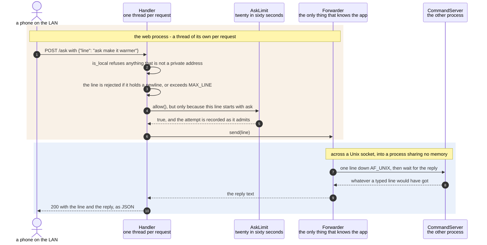

# Text typed on a phone reaches the render loop over the LAN

**Priority: `MEDIUM`** — it is the richest way into a box with no keyboard, but it is a second process the camera runs without. [What the priorities mean](../how-to-write-scenario-docs.md).

Somebody standing in front of the enclosure types `make it warmer` on their
phone and the panel[^panel] changes. The value is that the box needs no
keyboard, no monitor and no shell to be driven — the knob[^detent] turns the
schemes[^scheme] and everything else can be typed, from a page served on the
house network[^lan].

The design decision worth understanding is that **this is a separate
process**. The web server shares no memory with the camera, imports none of
it, and reaches it only down the same Unix socket[^socket] a shell would use.
So a crash in the page cannot take the picture with it, the camera runs
perfectly well with the web service stopped, and the phone gets exactly the
treatment a typed line gets, because it *is* a typed line by the time it
arrives.

Two guards sit on the way through, and they protect different things. Reach is
the security posture: the listener binds to the LAN and refuses anything that
is not a private address, because there is no authentication anywhere on this
path. Money is the other: an ask[^ask] goes to a language model and costs a
fraction of a cent, so [`AskLimit`](../../src/control/web_server.py#L167)
allows twenty in sixty seconds and refuses politely after that. A phone left
face up on a table can post the same form for hours.

| Class | What it represents, and its part in this scenario |
|---|---|
| [`Handler`](../../src/control/web_server.py#L512) | One HTTP request, on a thread of its own. Here it is the **gatekeeper**: [`do_POST`](../../src/control/web_server.py#L537) checks the peer, the shape of the payload and the length of the line before anything is forwarded |
| [`AskLimit`](../../src/control/web_server.py#L167) | A sliding window[^ratelimit] over the requests that cost money. Here it is the **budget**: [`allow`](../../src/control/web_server.py#L183) records as it admits, under a lock, because the requests it is counting arrive on different threads |
| [`Forwarder`](../../src/control/web_server.py#L117) | One line to the app's command socket and back. Here it is the **only thing in this process that knows the camera exists**, which is what keeps the page a client rather than a second copy of the app |
| [`CommandServer`](../../src/control/command_server.py#L80) | The socket and a thread per client, in the *other* process. Here it is the **doorway**, and it cannot tell this connection from a shell's |

## A phone, two processes, and one line

| Step | Message | What is going on |
|---:|---|---|
| 1 | POST /ask with {"line": "ask make it warmer"} | The page posts exactly what a shell would send. A toggle on the page adds the `ask` prefix, so what somebody types there is bare words |
| 2 | [`is_local`](../../src/control/web_server.py#L201) refuses anything that is not a private address | Loopback, private and link-local pass; everything else is refused, and an address that will not parse is refused rather than puzzled over. This is the whole of the authentication story, which is why the listener also binds narrowly rather than relying on the check alone |
| 3 | the line is rejected if it holds a newline, or exceeds [`MAX_LINE`](../../src/control/web_server.py#L89) | A newline would make one POST into two commands on the socket, so `\n`, `\r` and NUL are refused outright. 4,096 characters is the ceiling, and the message says so rather than truncating — a silently shortened command is a command nobody asked for |
| 4 | [`allow`](../../src/control/web_server.py#L183)`()`, but only because this line starts with ask | [`costs_money`](../../src/control/web_server.py#L195) looks at the first word only. `contrast 2` is free and unlimited; `ask` reaches a language model. Rate-limiting everything would throttle the settings for the sake of the one thing that costs |
| 5 | true, and the attempt is recorded as it admits | Recorded inside the same lock that checked, so two phones cannot both be told yes on the twentieth slot. Twenty in sixty seconds is generous for a person and useless to a stuck browser tab |
| 6 | [`send`](../../src/control/web_server.py#L124)`(line)` | The whole of the coupling between the two processes: one method, one socket path, one line. Everything above it is HTTP and everything below is the app's own protocol |
| 7 | one line down AF_UNIX, then wait for the reply | A fresh connection per request, with a timeout. This thread blocks here, which is exactly why there is a thread per request — one slow ask must not make the page unreachable for anybody else |
| 8 | whatever a typed line would have got | [`CommandServer`](../../src/control/command_server.py#L80) cannot tell this from a shell, and nothing tells it. That is what makes the phone a first-class route rather than a special case: the refusals, the wording and the timing are all the same |
| 9 | the reply text | Errors are answered with a status and a sentence — 503 when the app is not listening, 504 when it is too slow, 429 when the budget is spent. The page not starting because the camera happens to be restarting would make it unreachable exactly when somebody wanted to know why |
| 10 | 200 with the line and the reply, as JSON | The line is echoed back with the answer, so the page can show what was actually sent — which is not always what was typed, since the `ask` prefix may have been added for you |

The band is a **process** boundary rather than a thread boundary, and it is
crossed once. Nothing in the web process holds a reference to anything in the
camera, and the camera does not know whether a web server is running.

## Related scenarios

- [A typed command updates the render configuration](a-typed-command-updates-the-render-configuration.md)
  — what happens after the line arrives, and why the phone gets the same
  treatment a shell does.
- [A spoken phrase is answered from the shortcut table, with no model call](a-spoken-phrase-is-answered-from-the-shortcut-table-with-no-model-call.md)
  — an ask that costs nothing, and never troubles the budget this scenario
  guards.
- [A spoken phrase is turned into a config delta by the language model](a-spoken-phrase-is-turned-into-a-config-delta-by-the-language-model.md)
  — the requests `AskLimit` exists to count, and what one of them costs.
- [A render configuration change is refused](a-render-configuration-change-is-refused.md)
  — where a bad value typed on a phone is turned down, in the same words as
  anywhere else.

### Footnotes

[^panel]: The **SPI panel** is a 2.4 inch ILI9341 LCD, 240x320, wired to the
    Pi's SPI bus — a four-wire serial bus for talking to peripherals — and
    driven from userspace by [`ILI9341`](../../src/lcd/lcd.py#L47) with no
    kernel driver behind it. In the sealed enclosure it is the only display
    there is. One full frame is 153,600 bytes, sent in
    [`SPI_CHUNK`](../../src/lcd/lcd.py#L44) pieces of 4 KB because that is what
    the driver's buffer holds.

[^detent]: A **detent** is one click of the knob — the position it settles
    into, felt as a notch. Electrically it is one full cycle of the two
    switches, which is what [`QuadratureDecoder`](../../src/control/encoder.py#L88)
    counts. **Quadrature** is the arrangement: two switches a quarter-cycle
    apart, so which one changes first says which way the knob turned, and
    contact bounce that does not complete a cycle emits nothing.

[^scheme]: A **colour scheme** is one of the nine named looks in
    [`SCHEMES`](../../src/art/palettes.py#L79), and which one is live is part
    of the render configuration. `grey` is the default, and is what "greyscale
    mode" means: characters only, drawn from the luma plane and nothing else.
    `live` is the only scheme that reads the chroma planes, through
    [`colour_grid`](../../src/capture/image_processor.py#L187). The other seven
    are **tints** — green phosphor, amber CRT, e-ink on paper — which recolour
    the same greyscale picture from two fixed colours.

[^lan]: The house network, and no further. A **private address** is one of the
    ranges reserved for local networks — 10.x, 192.168.x, and the rest — which
    a router will not forward out to the internet.
    [`is_local`](../../src/control/web_server.py#L201) admits those and
    loopback and refuses everything else, and the listener binds narrowly as
    well, because there is no password anywhere on this path.

[^socket]: A **Unix domain socket** is a file-backed pipe between processes on
    one machine — the same read-and-write as a network socket, with no network.
    [`CommandServer`](../../src/control/command_server.py#L80) listens on one,
    which is how a shell, a phone or a script reaches a running camera without
    the app ever opening a port.

[^ask]: An **ask** is a request in words rather than in settings — "make it
    warmer" — as opposed to a typed command, which already names the setting.
    It arrives as [`Ask`](../../src/control/command_server.py#L55), and
    [`AskResolver`](../../src/language/resolver.py#L33) decides whether the
    shortcut table can answer it or the language model has to.

[^ratelimit]: A **sliding window** rate limit: the last sixty seconds of
    admitted requests are remembered, and the twenty-first inside that window
    is refused — [`AskLimit`](../../src/control/web_server.py#L167). It counts
    only the requests that reach the model and cost money; settings are free
    and unlimited. What it is really defending against is not an attacker but
    a phone left face up, posting the same form for hours.
