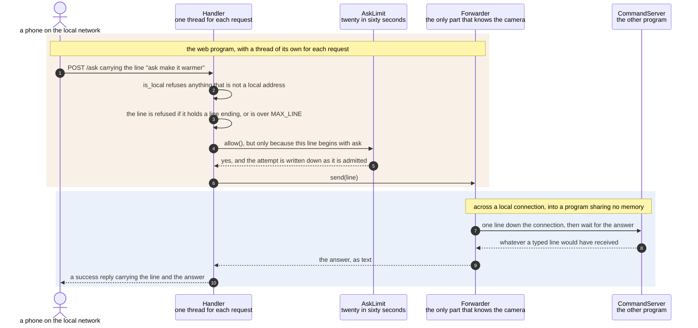

# Text typed on a phone reaches the render loop over the LAN

**Priority: `MEDIUM`** — it is the richest way into a box with no keyboard, but it is a second program that the camera runs perfectly well without. [What the priorities mean](../how-to-write-scenario-docs.md).

Somebody standing in front of the sealed box types `make it warmer` on their
phone and the small panel[^panel] changes.

The value is that the box needs no keyboard, no monitor and no command line in
order to be driven. The knob[^detent] moves through the colour schemes[^scheme],
and everything else can be typed on a page served over the local
network[^lan].

The design decision worth understanding is that **this is a separate program
altogether**. The web server shares no memory with the camera, loads none of its
code, and reaches it only down the same connection[^socket] that a command line
would use.

Three things follow from that separation. A fault in the page cannot take the
picture down with it. The camera runs quite happily with the web service
stopped. And the phone receives exactly the treatment a typed line receives,
because by the time it arrives it *is* a typed line.

Two guards sit along the way, and they protect entirely different things.

The first guard is about **reach**. The listener accepts connections only from
addresses on the local network and refuses everything else, because there is no
password anywhere along this path. Anyone already on the same network can drive
the camera, and anyone outside it cannot reach the page at all.

The second guard is about **money**. A request phrased in words[^ask] is sent to
a language model and costs a fraction of a penny each time. So
[`AskLimit`](../../src/control/web_server.py#L167) permits twenty of them in any
sixty seconds and politely refuses after that. Twenty a minute is far more than
a person could type and far less than a phone left face up on a table, which can
post the same form over and over for hours without anybody noticing.

| Class | What it represents, and its part in this scenario |
|---|---|
| [`Handler`](../../src/control/web_server.py#L512) | One request from a web browser, dealt with on a thread of its own. In this scenario it is the **gatekeeper**. [`do_POST`](../../src/control/web_server.py#L537) checks who is connecting, the shape of what they sent, and the length of the line, before anything is passed along |
| [`AskLimit`](../../src/control/web_server.py#L167) | A count of recent requests that cost money[^ratelimit]. In this scenario it is the **budget**. [`allow`](../../src/control/web_server.py#L183) writes down each request as it admits it, and does both inside a lock, because the requests being counted arrive on different threads |
| [`Forwarder`](../../src/control/web_server.py#L117) | One line sent to the camera's command connection, and the answer brought back. In this scenario it is the **only thing in this program that knows the camera exists at all**, which is what keeps the page a visitor rather than a second copy of the camera |
| [`CommandServer`](../../src/control/command_server.py#L80) | The connection and a thread for each program attached to it, living in the *other* program. In this scenario it is the **doorway**, and it cannot tell this connection apart from a command line's |

## A phone, two programs, and one line

```mermaid
sequenceDiagram
    autonumber
    actor Phone as a phone on the local network
    participant H as Handler<br/>one thread for each request
    participant Lim as AskLimit<br/>twenty in sixty seconds
    participant Fwd as Forwarder<br/>the only part that knows the camera
    participant CS as CommandServer<br/>the other program

    rect rgba(200, 140, 60, 0.12)
        note over Phone, Fwd: the web program, with a thread of its own for each request
        Phone->>H: POST /ask carrying the line "ask make it warmer"
        H->>H: is_local refuses anything that is not a local address
        H->>H: the line is refused if it holds a line ending, or is over MAX_LINE
        H->>Lim: allow(), but only because this line begins with ask
        Lim-->>H: yes, and the attempt is written down as it is admitted
        H->>Fwd: send(line)
    end
    rect rgba(80, 140, 220, 0.12)
        note over Fwd, CS: across a local connection, into a program sharing no memory
        Fwd->>CS: one line down the connection, then wait for the answer
        CS-->>Fwd: whatever a typed line would have received
        Fwd-->>H: the answer, as text
        H-->>Phone: a success reply carrying the line and the answer
    end
```

| Step | Message | What is going on |
|---:|---|---|
| 1 | POST /ask carrying the line "ask make it warmer" | The page sends exactly what somebody at a command line would send. A switch on the page adds the word `ask` at the front, so what a person actually types there is just the plain words |
| 2 | [`is_local`](../../src/control/web_server.py#L201) refuses anything that is not a local address | Addresses on the machine itself, on a home or office network, and on a directly connected link are all allowed. Everything else is refused, and an address that cannot even be understood is refused rather than puzzled over. This is the entire security story for this path, which is why the listener is also set up to accept connections only on the local network rather than relying on this check alone |
| 3 | the line is refused if it holds a line ending, or is over [`MAX_LINE`](../../src/control/web_server.py#L89) | A line ending would turn one request into two separate commands once it reached the connection, so line endings and empty characters are refused outright. The ceiling is 4,096 characters, matching the limit the command connection itself applies, and the reply says the line was too long rather than quietly shortening it. A command silently cut short is a command nobody asked for |
| 4 | [`allow`](../../src/control/web_server.py#L183)`()`, but only because this line begins with ask | [`costs_money`](../../src/control/web_server.py#L195) looks only at the first word. A line such as `contrast 2` is free and unlimited, because it goes nowhere but the camera. A line beginning with `ask` reaches a language model. Limiting everything would throttle ordinary settings for the sake of the one kind of request that actually costs something |
| 5 | yes, and the attempt is written down as it is admitted | The writing down happens inside the same lock that did the checking, so two phones cannot both be told yes for the twentieth place. Twenty within sixty seconds is generous for a person and useless to a browser tab stuck in a loop |
| 6 | [`send`](../../src/control/web_server.py#L124)`(line)` | This is the whole of the connection between the two programs: one method, one path, one line of text. Everything above it is web traffic and everything below it is the camera's own way of talking |
| 7 | one line down the connection, then wait for the answer | A fresh connection for each request, with a time limit on the wait. This thread does wait here, and that is precisely why there is a separate thread for every request: one slow request must not make the page unreachable for everybody else |
| 8 | whatever a typed line would have received | The camera's connection cannot tell this apart from a command line, and nothing tells it. That is what makes the phone a first-class way in rather than a special case bolted on. The refusals, the wording and the timing are all identical |
| 9 | the answer, as text | Failures are answered with a code and a sentence: one meaning the camera is not listening, one meaning it was too slow to answer, and one meaning the budget for the minute is spent. The page deliberately still starts and still answers when the camera is not running, because a page that failed to load whenever the camera was restarting would be unavailable at exactly the moment somebody wanted to find out why |
| 10 | a success reply carrying the line and the answer | The line is sent back along with the answer, so the page can show what was actually sent. That is not always what was typed, because the word `ask` may have been added on the sender's behalf |

The coloured band here marks a boundary between two **programs** rather than
between two threads, and it is crossed exactly once. Nothing in the web program
holds a reference to anything inside the camera, and the camera has no idea
whether a web server is running at all.

## Related scenarios

- [A typed command updates the render configuration](a-typed-command-updates-the-render-configuration.md)
  — what happens once the line arrives, and why a phone gets exactly the same
  treatment a command line does.
- [A spoken phrase is answered from the shortcut table, with no model call](a-spoken-phrase-is-answered-from-the-shortcut-table-with-no-model-call.md)
  — a request in words that costs nothing at all, and so never troubles the
  budget this scenario guards.
- [A spoken phrase is turned into a config delta by the language model](a-spoken-phrase-is-turned-into-a-config-delta-by-the-language-model.md)
  — the requests the budget exists to count, and what one of them costs.
- [A render configuration change is refused](a-render-configuration-change-is-refused.md)
  — where a bad value typed on a phone is turned down, in exactly the same
  words as anywhere else.

### Footnotes

[^panel]: The **SPI panel** is a small screen measuring 2.4 inches across the
    diagonal, 240 dots by 320, using a controller chip called the ILI9341. It is
    connected to the computer by a simple four-wire arrangement called SPI, which
    is a common way of attaching small devices. It is driven entirely by the
    program itself, through [`ILI9341`](../../src/lcd/lcd.py#L47), with no
    separate system driver involved. In the sealed box this program is built
    for, this panel is the only screen there is. One complete picture for it is
    153,600 bytes, which has to be sent in pieces of 4 kilobytes each — see
    [`SPI_CHUNK`](../../src/lcd/lcd.py#L44) — because that is as much as the
    connection will accept at a time.

[^detent]: A **detent** is one click of the knob, meaning the position the knob
    settles into and which can be felt as a notch under the fingers.
    Electrically, one click is one complete cycle of the two switches inside the
    knob, and counting those cycles is the job of
    [`QuadratureDecoder`](../../src/control/encoder.py#L88). **Quadrature** is
    the name for the arrangement of those two switches. They are positioned a
    quarter of a cycle apart, so whichever of them changes first reveals which
    way the knob was turned. A switch bouncing without completing a full cycle
    produces nothing at all, which is exactly what is wanted.

[^scheme]: A **colour scheme** is one of the nine named looks listed in
    [`SCHEMES`](../../src/art/palettes.py#L79). Which one is currently in use is
    part of the program's render configuration, and the knob, a key press or a
    typed command can all change it. The scheme called `grey` is the one the
    program starts with, and it is what the phrase "greyscale mode" refers to:
    characters only, worked out from the brightness part of the picture and
    nothing else. Only the scheme called `live` reads the colour parts, through
    [`colour_grid`](../../src/capture/image_processor.py#L187). The remaining
    seven are tints, such as green phosphor, amber CRT and e-ink on paper. A
    tint recolours the same greyscale picture using two fixed colours, so it
    never looks at the colour parts either.

[^lan]: The **local network** means the house or office network and nothing
    beyond it. A **private address** is one belonging to the ranges set aside
    for local networks, such as those beginning 10 or 192.168, which a router
    will not pass out onto the wider internet.
    [`is_local`](../../src/control/web_server.py#L201) admits those together
    with addresses on the machine itself, and refuses everything else. The
    listener is also set up narrowly, because there is no password anywhere on
    this path.

[^socket]: A **Unix domain socket** is a connection between two programs on the
    same computer, which appears in the file system as though it were a file. It
    behaves like a network connection, with one program writing and another
    reading, except that no network is involved at any point.
    [`CommandServer`](../../src/control/command_server.py#L80) listens on one of
    these, which is how a shell, a phone or another program can reach a running
    camera without the program ever opening a network port.

[^ask]: An **ask** is a request phrased in ordinary words, such as "make it
    warmer", rather than one that already names a setting and a value. It
    arrives as an [`Ask`](../../src/control/command_server.py#L55), and
    [`AskResolver`](../../src/language/resolver.py#L33) decides whether a table
    of known phrases can answer it or whether a language model has to be asked.

[^ratelimit]: A **rate limit** puts a ceiling on how often something may happen.
    This one remembers the requests admitted during the last sixty seconds and
    refuses the twenty-first inside that window, which is why it is described as
    sliding: the window moves forward continuously rather than resetting on the
    minute. It counts only requests that reach the language model and therefore
    cost money. Ordinary settings are free and unlimited. What it really guards
    against is not an attacker but a phone left face up, posting the same form
    for hours.
