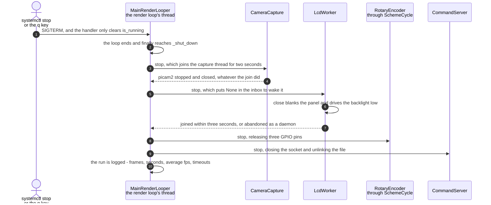

# The camera, panel, encoder and socket are released on shutdown

**Priority: `MEDIUM`** — it runs once per run and changes nothing a person can see, but getting it wrong breaks the *next* start rather than this one. [What the priorities mean](../how-to-write-scenario-docs.md).

Four things this run took are not its to keep: the camera device, the panel's
SPI bus and GPIO pins, the encoder's pins, and the socket file on disk. Each is
a **claim**, and a claim left behind does not spoil the run that made it — it
makes the next `start()` fail. In an enclosure that is restarted by systemd, a
leak on the way out becomes a machine that will not come back, which is a far
worse failure than whatever caused it to stop.

The value is therefore entirely deferred, and that is what makes it easy to get
wrong. Nothing on the glass looks different if this code is skipped; the fault
appears minutes later, on a boot, with no obvious connection to the shutdown
that caused it. It has already happened once in the other direction: without a
`SIGTERM` handler, Python's default exits without unwinding, the `finally` never
ran, and the panel was left lit showing a frozen frame with its pins still
claimed.

The order is fixed and is a statement, not an accident: camera, panel, encoder,
socket. The camera first because it is the only one with a thread that might
still be mid-capture; the socket last because a client connecting during
shutdown should find a live socket and get a refusal, rather than find a stale
file left by a process that has gone.

This is also the one place in the app where **the render loop is allowed to
block**. It spends its whole life refusing to wait on anything, and then spends
its last two seconds waiting on joins — which is correct, because there is no
longer a picture whose frame rate could suffer.

| Class | What it represents, and its part in this scenario |
|---|---|
| [`MainRenderLooper`](../../ascii_camera.py#L98) | The one object the process is hung off. Here it is the **releaser**: [`_shut_down`](../../ascii_camera.py#L764) runs from a `finally`, so it runs whether the loop ended by `q`, by signal, or by an exception nobody predicted |
| [`CameraCapture`](../../src/capture/camera.py#L61) | The camera and the thread that reads it. Here it is **the one with a thread still running**: [`stop`](../../src/capture/camera.py#L182) clears the flag, joins for two seconds, then closes `picamera2` in a `finally` of its own |
| [`LcdWorker`](../../src/lcd/lcd_worker.py#L61) | The panel's thread. Here it is **the one that must be woken**: [`stop`](../../src/lcd/lcd_worker.py#L450) puts `None` in the inbox, because the thread may be sitting in a timed `get` and joining a sleeping thread only waits out its timeout |
| [`RotaryEncoder`](../../src/control/encoder.py#L123) | The knob on three GPIO pins, reached through [`SchemeCycle`](../../src/control/scheme_cycle.py#L37). Here it is **the quietest claim**: nothing visible depends on it, and its pins are exactly as unusable to the next run as the panel's would be |
| [`CommandServer`](../../src/control/command_server.py#L80) | The Unix socket and a thread per client. Here it is **the one that leaves a file behind**: [`stop`](../../src/control/command_server.py#L273) closes the socket, joins, and unlinks the path |

## Four claims, given back in order

| Step | Message | What is going on |
|---:|---|---|
| 1 | SIGTERM, and the handler only clears is_running | The handler does the least it possibly can. Releasing hardware inside a signal handler would run it on whichever thread took the signal, at whatever point it interrupted — so it sets a flag and returns, and the ordinary path does the work. `SIGINT` is handled the same way, and installing them can fail off the main thread, which is caught and logged rather than raised |
| 2 | the loop ends and finally reaches [`_shut_down`](../../ascii_camera.py#L764) | A `finally`, not the end of [`run`](../../ascii_camera.py#L785), so an exception nobody predicted still gives the hardware back. This is exactly what Python's default `SIGTERM` handling skips — it exits without unwinding, and that is how the panel was once left lit with its pins claimed |
| 3 | [`stop`](../../src/capture/camera.py#L182), which joins the capture thread for two seconds | First, because it is the only claim with a thread that may be mid-capture. The join is bounded: a capture wedged inside libcamera must not be able to hold the shutdown open, and the thread is a daemon precisely so that abandoning it is survivable |
| 4 | picam2 stopped and closed, whatever the join did | `close()` sits in a `finally` after `stop()`, so a camera that fails to stop is still closed. Half-releasing a device is worse than not trying: the next run inherits a handle nobody owns |
| 5 | [`stop`](../../src/lcd/lcd_worker.py#L450), which puts None in the inbox to wake it | The sentinel is the point. The worker spends its idle time in a timed `get`, so joining it without waking it would simply wait out the timeout first. `None` is a value the run loop recognises as "leave", distinct from every frame |
| 6 | [`close`](../../src/lcd/lcd_display.py#L415) blanks the panel and drives the backlight low | The backlight pin is deliberately **not** handed back. Releasing it makes it an input, the module's own pull-up relights it, and the panel sits uniformly lit after every clean shutdown — the exact opposite of what blanking is for. Left as an output driving low it stays dark, and stays dark after the process exits |
| 7 | joined within three seconds, or abandoned as a daemon | Three seconds where the camera got two, because this thread may be mid-frame and a frame is 33 ms of SPI. Abandoning it is safe for the same reason as before: it is a daemon, and the interpreter will not wait for it |
| 8 | [`stop`](../../src/control/scheme_cycle.py#L104), releasing three GPIO pins | Through `SchemeCycle`, which owns the encoder if there is one and does nothing if there is not — so the shutdown path does not need to know whether `--encoder` was given. The quietest of the four claims and the easiest to forget, which is why it is in the same list as the rest |
| 9 | [`stop`](../../src/control/command_server.py#L273), closing the socket and unlinking the file | Last, so a client connecting during shutdown meets a live socket and gets an answer rather than a stale path left by a process that is gone. The `unlink` is what stops the *next* run finding a socket file it must decide whether to trust — it logs "removing stale command socket" when it does |
| 10 | the run is logged - frames, seconds, average fps, timeouts | The only output of the whole scenario, and the one thing that survives it. `dropped` here counts camera timeouts, so a run that ended after a stall says so in its own last line |

No thread bands, and their absence is the point: every message above happens on
the render loop's own thread. The other threads are not being *talked to*, they
are being **ended** — which is why this is the one scenario where that thread
blocks, and why every bound on those joins is a small number.

What is not here is any attempt to recover. Each `stop` catches what it can and
moves on, because a shutdown that abandons the remaining three claims after the
first failure is precisely the shutdown that breaks the next boot.

## Related scenarios

- [A capture thread hands the render loop its newest frame through a one-slot queue](a-capture-thread-hands-the-render-loop-its-newest-frame-through-a-one-slot-queue.md)
  — where the capture thread being joined here was started, and why it is a
  daemon.
- [A frame reaches the SPI panel without stalling the render loop](a-frame-reaches-the-spi-panel-without-stalling-the-render-loop.md)
  — the worker being woken here, and the timed `get` that makes the sentinel
  necessary.
- [A camera that stopped delivering frames is detected and announced](a-camera-that-stopped-delivering-frames-is-detected-and-announced.md)
  — the other lifecycle scenario, and the one whose last log line this one
  writes.
- **A rotary encoder detent changes the colour scheme** — what claimed the three
  GPIO pins released here.

*(The unlinked entries above are documents not written yet.)*
