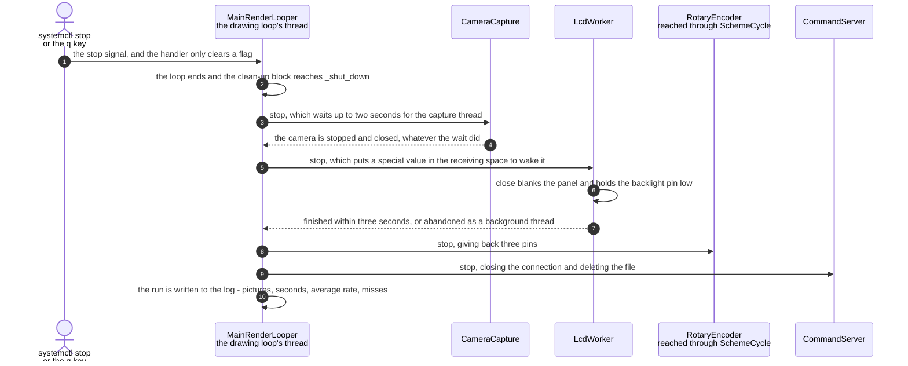

# The camera, panel, encoder and socket are released on shutdown

**Priority: `MEDIUM`** — it runs once per run and changes nothing anybody can see, but getting it wrong breaks the *next* start rather than this one. [What the priorities mean](../how-to-write-scenario-docs.md).

Four things this run took hold of are not its to keep: the camera device, the
small panel[^panel]'s wire and its pins[^gpio], the knob's three pins, and the
connection file[^socket] sitting on disk.

Each of those is a **claim**. Once a program claims one, nothing else can use it
until it is handed back. A claim left behind does not spoil the run that made
it, because that run is over. It makes the *next* attempt to start fail. Inside
a sealed box that is restarted automatically by the system's service
manager[^systemd], a claim leaked on the way out becomes a machine that will not
come back at all, which is a considerably worse outcome than whatever made it
stop in the first place.

The value of this scenario is therefore entirely deferred, and that is exactly
what makes it easy to get wrong. Nothing on the glass looks any different if
this code is skipped. The fault appears minutes later, on a restart, with no
obvious connection to the shutdown that caused it.

It has already happened once, in the other direction. Without a handler for the
signal[^signals] the system sends to ask a program to stop, Python's own
behaviour is to exit immediately without running any clean-up code at all. The
clean-up therefore never ran, and the panel was left lit, showing a frozen
picture, with its pins still claimed.

The order is fixed, and it is a statement rather than an accident: camera, then
panel, then knob, then connection.

The camera goes first because it is the only one of the four with a thread that
might still be in the middle of taking a picture. The connection goes last
because a program connecting during shutdown ought to find a working connection
and receive a refusal, rather than find a stale file left behind by a process
that has already gone.

This is also the one place in the entire program where **the drawing loop is
allowed to wait**. It spends its whole life refusing to wait for anything, and
then spends its final two or three seconds waiting for threads to finish[^join].
That is correct rather than inconsistent, because there is no longer a picture
whose rate could suffer.

| Class | What it represents, and its part in this scenario |
|---|---|
| [`MainRenderLooper`](../../ascii_camera.py#L99) | The single object the whole running program hangs from. In this scenario it is the **releaser**. [`_shut_down`](../../ascii_camera.py#L765) runs from a clean-up block, so it runs whether the loop ended because somebody pressed `q`, because the system asked it to stop, or because of an error nobody anticipated |
| [`CameraCapture`](../../src/capture/camera.py#L61) | The camera and the thread that reads it. In this scenario it is **the one with a thread still running**. [`stop`](../../src/capture/camera.py#L182) clears the flag that keeps the thread going, waits up to two seconds for it, and then closes the camera library[^picamera2] in a clean-up block of its own |
| [`LcdWorker`](../../src/lcd/lcd_worker.py#L61) | The small panel's thread. In this scenario it is **the one that has to be woken up**. [`stop`](../../src/lcd/lcd_worker.py#L450) places a special value in its receiving space, because the thread may be asleep waiting with a time limit, and waiting for a sleeping thread would simply mean sitting through that limit first |
| [`RotaryEncoder`](../../src/control/encoder.py#L123) | The knob[^detent] on three of the computer's pins, reached through [`SchemeCycle`](../../src/control/scheme_cycle.py#L37). In this scenario it is **the quietest claim**. Nothing visible depends on it, and its pins are exactly as unusable to the next run as the panel's would be |
| [`CommandServer`](../../src/control/command_server.py#L80) | The connection and a thread for each program attached to it. In this scenario it is **the one that leaves a file behind**. [`stop`](../../src/control/command_server.py#L273) closes the connection, waits for its threads, and deletes the file |

## Four claims, given back in order

```mermaid
sequenceDiagram
    autonumber
    actor Sig as systemctl stop<br/>or the q key
    participant App as MainRenderLooper<br/>the drawing loop's thread
    participant Cam as CameraCapture
    participant W as LcdWorker
    participant Enc as RotaryEncoder<br/>reached through SchemeCycle
    participant CS as CommandServer

    Sig->>App: the stop signal, and the handler only clears a flag
    App->>App: the loop ends and the clean-up block reaches _shut_down
    App->>Cam: stop, which waits up to two seconds for the capture thread
    Cam-->>App: the camera is stopped and closed, whatever the wait did
    App->>W: stop, which puts a special value in the receiving space to wake it
    W->>W: close blanks the panel and holds the backlight pin low
    W-->>App: finished within three seconds, or abandoned as a background thread
    App->>Enc: stop, giving back three pins
    App->>CS: stop, closing the connection and deleting the file
    App->>App: the run is written to the log - pictures, seconds, average rate, misses
```

| Step | Message | What is going on |
|---:|---|---|
| 1 | the stop signal, and the handler only clears a flag | The handler does the very least it possibly can. Releasing hardware inside a signal handler would run that code on whichever thread happened to receive the signal, at whatever point it interrupted. So the handler sets a flag and returns, and the ordinary path does the actual work. The signal sent by pressing ctrl-c is handled in exactly the same way. Installing these handlers can fail if the program is not on its main thread, which is caught and written to the log rather than allowed to stop anything |
| 2 | the loop ends and the clean-up block reaches [`_shut_down`](../../ascii_camera.py#L765) | This is a clean-up block rather than simply the end of [`run`](../../ascii_camera.py#L844), so an error nobody anticipated still gives the hardware back. That is precisely what Python's default handling of the stop signal skips: it exits without running clean-up at all, which is how the panel was once left lit with its pins still claimed |
| 3 | [`stop`](../../src/capture/camera.py#L182), which waits up to two seconds for the capture thread | First, because it is the only claim with a thread that may be halfway through taking a picture. The wait has a limit: a capture stuck inside the camera framework must not be able to hold the whole shutdown open. Two seconds is far longer than a picture takes at fifteen a second, so a healthy thread always finishes well inside it. The thread is a background one[^daemon] precisely so that abandoning it is survivable |
| 4 | the camera is stopped and closed, whatever the wait did | Closing sits in a clean-up block after stopping, so a camera that fails to stop is still closed. Half-releasing a device is worse than not trying at all, because the next run then inherits a handle that nobody owns |
| 5 | [`stop`](../../src/lcd/lcd_worker.py#L450), which puts a special value in the receiving space to wake it | The special value[^sentinel] is the whole point of this step. The panel's thread spends its idle time waiting with a time limit, so simply waiting for it without waking it would mean sitting through that limit first. The special value is one the thread recognises as an instruction to leave, and it can never be confused with a picture |
| 6 | [`close`](../../src/lcd/lcd_display.py#L415) blanks the panel and holds the backlight pin low | The backlight pin is deliberately **not** handed back. Releasing it turns it into an input, the panel module's own pull-up then relights it, and the panel would sit uniformly lit after every clean shutdown, which is the exact opposite of what blanking is for. Left as an output holding low it stays dark, and stays dark after the process has gone |
| 7 | finished within three seconds, or abandoned as a background thread | Three seconds here where the camera got two, because this thread may be in the middle of sending a picture, and one send takes about 33 milliseconds. Abandoning it is safe for the same reason as before: it is a background thread, and the program will not wait for it |
| 8 | [`stop`](../../src/control/scheme_cycle.py#L104), giving back three pins | Reached through the scheme-walking code, which owns the knob if there is one and does nothing at all if there is not. So the shutdown path never has to know whether the knob was switched on at start-up. This is the quietest of the four claims and the easiest to forget, which is exactly why it appears in the same list as the rest |
| 9 | [`stop`](../../src/control/command_server.py#L273), closing the connection and deleting the file | Last, so that a program connecting during shutdown meets a working connection and receives an answer, rather than a stale path left by a process that has gone. Deleting the file is what stops the *next* run finding a connection file it has to decide whether to trust. When it does find one it writes "removing stale command socket" to the log |
| 10 | the run is written to the log - pictures, seconds, average rate, misses | The only output of the whole scenario, and the one thing that outlives it. The count of misses here is camera timeouts, so a run that ended after the camera stalled says so in its very last line |

There are no coloured thread bands, and their absence is the point. Every
message above happens on the drawing loop's own thread. The other threads are
not being *spoken to*, they are being **ended**. That is why this is the one
scenario in which that thread waits, and why every one of those waits has a
small number attached to it.

One claim is deliberately absent from the list, and its absence is worth
explaining. The power LED on GPIO 4 is lit at start-up and stays lit until the
machine actually powers down, which happens long after this code has run. It
appears nowhere here because it holds no claim to give back: the code that
lights it hands the pin straight back and the pin keeps its level anyway. There
is nothing owned, so there is nothing to release.

What is also not here is any attempt to recover from a failure. Each step
catches what it can and moves on, because a shutdown that abandons the remaining
three claims after the first one fails is precisely the shutdown that breaks the
next start.

## Related scenarios

- [A capture thread hands the render loop its newest frame through a one-slot queue](a-capture-thread-hands-the-render-loop-its-newest-frame-through-a-one-slot-queue.md)
  — where the capture thread being waited for here was started, and why it is a
  background thread.
- [A frame reaches the SPI panel without stalling the render loop](a-frame-reaches-the-spi-panel-without-stalling-the-render-loop.md)
  — the panel thread being woken here, and the timed wait that makes the special
  value necessary.
- [A camera that stopped delivering frames is detected and announced](a-camera-that-stopped-delivering-frames-is-detected-and-announced.md)
  — the other scenario about the program's lifetime, and the one whose final log
  line this scenario writes.
- [A rotary encoder detent changes the colour scheme](a-rotary-encoder-detent-changes-the-colour-scheme.md)
  — what claimed the three pins that are given back here.

### Footnotes

[^panel]: The **SPI panel** is a small screen measuring 2.4 inches across the
    diagonal, 240 dots by 320, using a controller chip called the ILI9341. It is
    connected to the computer by a simple four-wire arrangement called SPI, which
    is a common way of attaching small devices. It is driven entirely by the
    program itself, through [`ILI9341`](../../src/lcd/lcd.py#L47), with no
    separate system driver involved. In the sealed box this program is built
    for, this panel is the only screen there is. One complete picture for it is
    153,600 bytes, which has to be sent in pieces of 4 kilobytes each — see
    [`SPI_CHUNK`](../../src/lcd/lcd.py#L44) — because that is as much as the
    connection will accept at a time.

[^gpio]: The computer's **general-purpose pins** are the row of electrical
    connections along the edge of the board, which a program can set high or low
    or read the state of. A pin is claimed by whichever program is using it, and
    it remains unusable by anything else until it is given back. That is why a
    pin left unreleased causes a fault in the *next* run of a program rather
    than in the one that failed to release it.

[^socket]: A **Unix domain socket** is a connection between two programs on the
    same computer, which appears in the file system as though it were a file. It
    behaves like a network connection, with one program writing and another
    reading, except that no network is involved at any point.
    [`CommandServer`](../../src/control/command_server.py#L80) listens on one of
    these, which is how a shell, a phone or another program can reach a running
    camera without the program ever opening a network port.

[^systemd]: **systemd** is the part of Linux that starts and supervises
    long-running programs. It is what launches this program when the computer
    boots, using the options `--lcd --encoder --no-terminal`, and it is what
    starts the program again if it stops unexpectedly. That automatic restart is
    the reason an untidy exit matters here: the next start is only seconds away
    and nobody has to ask for it.

[^signals]: A **signal** is a short message the operating system delivers to a
    running program. `SIGTERM` is the one that politely asks a program to stop,
    and it is what `systemctl stop` sends. `SIGINT` is the one sent by pressing
    ctrl-c at a keyboard. Python's own behaviour when `SIGTERM` arrives is to
    exit immediately without tidying up, which means no clean-up code runs at
    all. That is exactly why this program installs a handler of its own. The
    handler does nothing except set a flag, leaving the ordinary path to do the
    releasing of the hardware in its usual order.

[^join]: To **join** a thread is to wait for it to finish before carrying on.
    Every wait in this scenario has a limit of a small number of seconds,
    because a thread stuck inside a driver must not be able to hold the shutdown
    open indefinitely. Because these are background threads, abandoning one that
    will not finish is survivable.

[^picamera2]: **picamera2** is the Python library for the Raspberry Pi's camera,
    built on top of a lower-level piece of software called libcamera. It is the
    replacement for an older library that was simply called picamera. It owns
    the camera sensor, the settings given to the camera hardware, and the memory
    that this loop reads its pictures from.

[^detent]: A **detent** is one click of the knob, meaning the position the knob
    settles into and which can be felt as a notch under the fingers.
    Electrically, one click is one complete cycle of the two switches inside the
    knob, and counting those cycles is the job of
    [`QuadratureDecoder`](../../src/control/encoder.py#L88). **Quadrature** is
    the name for the arrangement of those two switches. They are positioned a
    quarter of a cycle apart, so whichever of them changes first reveals which
    way the knob was turned. A switch bouncing without completing a full cycle
    produces nothing at all, which is exactly what is wanted.

[^daemon]: A **daemon thread** is a Python setting on a thread, and it has
    nothing to do with the background programs that the word daemon describes
    elsewhere in computing. It means the program will not wait for that thread
    to finish before shutting down. Without this setting, a camera thread that
    became stuck waiting for a picture would keep the whole program alive after
    everything else had already stopped.

[^sentinel]: A **sentinel** is a value placed among ordinary data to mean
    something other than data. Here it is a nothing-value put into the panel's
    receiving space, meaning "stop and leave". It matters because the panel's
    thread is asleep waiting with a time limit. Simply setting a flag would not
    be noticed until that limit expired, whereas something arriving in the
    receiving space wakes the thread immediately.
