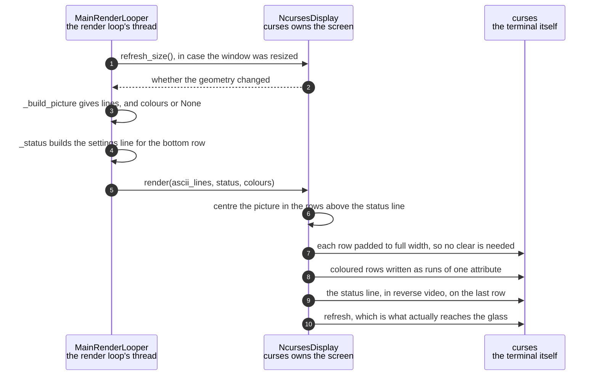

# The character grid is drawn on the HDMI terminal

**Priority: `MEDIUM`** — it runs on every frame, but only in a configuration the appliance never boots into: the enclosure starts with `--no-terminal`[^headless]. [What the priorities mean](../how-to-write-scenario-docs.md).

A grid[^grid] of characters becomes a picture on a monitor. The value is a
live view you can sit in front of with a keyboard, which is what the
app is on a desk rather than in a box — and the reason it is only `MEDIUM` is
that the deployed service passes `--no-terminal` and this code never runs
there.

Two things make it more than a print loop. The picture is **centred** in a
window that rarely fits it exactly, and every row is padded out to the full
width so the previous frame's characters are overwritten without a `clear()`.
Clearing and redrawing would flash; padding is the same number of writes and
does not.

The other is colour. A row of 267 characters written one at a time would be
267 calls into curses[^ncurses]; instead a coloured row is drawn as **runs**
of equal colour, and a greyscale[^scheme] row as a single string, because
greyscale passes `None` rather than a uniform array. That `None` is not an
absent value — it is the cheapest instruction available, meaning "use the
terminal's own foreground".

The constraint that shapes everything around this class is that **curses owns
the terminal**. Anything written to standard output or standard error while it
holds the screen corrupts the picture until the next full repaint, which is why
the app redirects both to a log file before it starts.

*The window is almost never the grid's shape, and what the class does about it
is all here: centre, pad, and reserve the last row. The amber line is the part
worth seeing — every row is written out to the full width, so the previous
frame is overwritten rather than cleared, which costs the same number of writes
and does not flash.*

Kept by hand: edit [`terminal-layout.svg`](../images/terminal-layout.svg)
directly, since nothing regenerates it.

| Class | What it represents, and its part in this scenario |
|---|---|
| [`MainRenderLooper`](../../ascii_camera.py#L98) | The one object the process is hung off. Here it is the **supplier**: it builds the lines and the colours, decides the status line[^statusline], and hands all three over — it never positions anything on the screen itself |
| [`NcursesDisplay`](../../src/hdmi/ncurses_display.py#L34) | The HDMI terminal, and the owner of the screen while curses holds it. Here it is the **compositor**: [`render`](../../src/hdmi/ncurses_display.py#L185) centres the picture, pads every row, and writes colour as runs rather than per character |

## One frame onto the terminal

| Step | Message | What is going on |
|---:|---|---|
| 1 | [`refresh_size`](../../src/hdmi/ncurses_display.py#L167)`()`, in case the window was resized | Asked every frame rather than waited for as an event, because a resize arrives as a keypress and the two would race. A `RESIZE` key also arrives and clears the cached grid, so the two paths agree |
| 2 | whether the geometry changed | True invalidates the cached grid, and the picture is refitted on the next pass. The panel[^panel]'s grid is untouched by any of this, which is what lets the window be dragged about without the panel changing |
| 3 | [`_build_picture`](../../ascii_camera.py#L737) gives lines, and colours or None | `None` for greyscale is the cheap path, not a missing value. In `--no-terminal` this step builds nothing at all, and the saving is the entire point of that flag |
| 4 | [`_status`](../../ascii_camera.py#L570) builds the settings line for the bottom row | Every live setting and the key that changes it, trimmed to what fits. It is a function of its arguments, so it can be tested without a terminal |
| 5 | [`render`](../../src/hdmi/ncurses_display.py#L185)`(ascii_lines, status, colours)` | Everything the display needs, in one call. The looper never addresses a cell: where the picture sits is the display's business, which is what lets the headless stand-in accept the identical call and do nothing |
| 6 | centre the picture in the rows above the status line | The window is almost never exactly the grid's shape, so the remainder is split above and below. The status line is reserved first, which is why the canvas is one row short |
| 7 | each row padded to full width, so no clear is needed | The alternative is `clear()` then redraw, which flashes. Padding costs the same writes and leaves nothing of the previous frame behind. `fill`[^fill] is the exception that forces a real clear, because letterboxing leaves cells the picture stops writing to |
| 8 | coloured rows written as runs of one attribute | Adjacent cells of equal colour are written together. Per character, a 267-column row would be 267 calls into curses every frame |
| 9 | the status line, in reverse video, on the last row | Written inside a `try` that swallows the error curses raises on the final cell of a row — the character lands regardless, and the alternative is a crash on a full-width write |
| 10 | refresh, which is what actually reaches the glass | Everything before this only edits an in-memory window. One refresh per frame is what makes the picture appear at once rather than in pieces |

No thread bands: all of it is the render loop's own thread, and that is not
incidental. curses is not safe to drive from two threads, and the app's answer
is to have only one that ever touches it — which is also why anything slow
lives on some other thread entirely.

## Related scenarios

- [Pixel brightness is mapped to ramp characters](pixel-brightness-is-mapped-to-ramp-characters.md)
  — where the lines handed to `render` come from.
- [A colour scheme is compiled into a per-cell lookup table](a-colour-scheme-is-compiled-into-a-per-cell-lookup-table.md)
  — where the palette indices come from, and why the terminal can only take
  indices.
- [A frame reaches the SPI panel without stalling the render loop](a-frame-reaches-the-spi-panel-without-stalling-the-render-loop.md)
  — the other display, drawn on its own thread from the same frame.
- [A keypress updates the render configuration](a-keypress-updates-the-render-configuration.md)
  — the keyboard this display reads, and where those keys go.

### Footnotes

[^headless]: `--no-terminal` runs the app with no terminal picture at all — a
    stand-in object with the same methods as the display, which does nothing.
    The enclosure boots that way, because there is no monitor attached, so the
    terminal's cost is not wasted so much as never paid.

[^grid]: The **character grid** is the picture as this app holds it: `rows` by
    `cols` character **cells** rather than pixels, each cell one character
    chosen from the brightness of the patch of camera frame it covers.
    [`to_grid`](../../src/capture/image_processor.py#L172) is what resizes a
    plane to it. How big it is depends on where the picture is going — 64 by 24
    on the SPI panel at the default font size, and whatever the window holds on
    the HDMI terminal.

[^ncurses]: **curses** is the library for drawing at particular positions in a
    terminal rather than printing lines, and **ncurses** is the implementation
    Linux ships. [`NcursesDisplay`](../../src/hdmi/ncurses_display.py#L34)
    wraps it here. It is what makes a terminal addressable enough to hold a
    picture that changes fifteen times a second.

[^scheme]: A **colour scheme** is one of the nine named looks in
    [`SCHEMES`](../../src/art/palettes.py#L79), and which one is live is part
    of the render configuration. `grey` is the default, and is what "greyscale
    mode" means: characters only, drawn from the luma plane and nothing else.
    `live` is the only scheme that reads the chroma planes, through
    [`colour_grid`](../../src/capture/image_processor.py#L187). The other seven
    are **tints** — green phosphor, amber CRT, e-ink on paper — which recolour
    the same greyscale picture from two fixed colours.

[^statusline]: The **status line** is the single line of readouts under the
    picture — scheme, ramp, frame rate, grid size — built by
    [`status_line`](../../src/hdmi/status_line.py#L76). It is also where a
    refusal or a notice is shown on the terminal, since there is nowhere else
    to put one.

[^panel]: The **SPI panel** is a 2.4 inch ILI9341 LCD, 240x320, wired to the
    Pi's SPI bus — a four-wire serial bus for talking to peripherals — and
    driven from userspace by [`ILI9341`](../../src/lcd/lcd.py#L47) with no
    kernel driver behind it. In the sealed enclosure it is the only display
    there is. One full frame is 153,600 bytes, sent in
    [`SPI_CHUNK`](../../src/lcd/lcd.py#L44) pieces of 4 KB because that is what
    the driver's buffer holds.

[^fill]: **fill** and **fit** are the two ways a 4:3 frame can be put into a
    window that is not its shape. `fit` keeps the whole frame and shrinks the
    grid to match it, so the window is left with blank cells around the
    picture. `fill` makes the grid the whole window and crops the frame to
    suit, so no cell is wasted and the frame's edges are lost. It is one of the
    two settings that change the grid's shape rather than its appearance.
